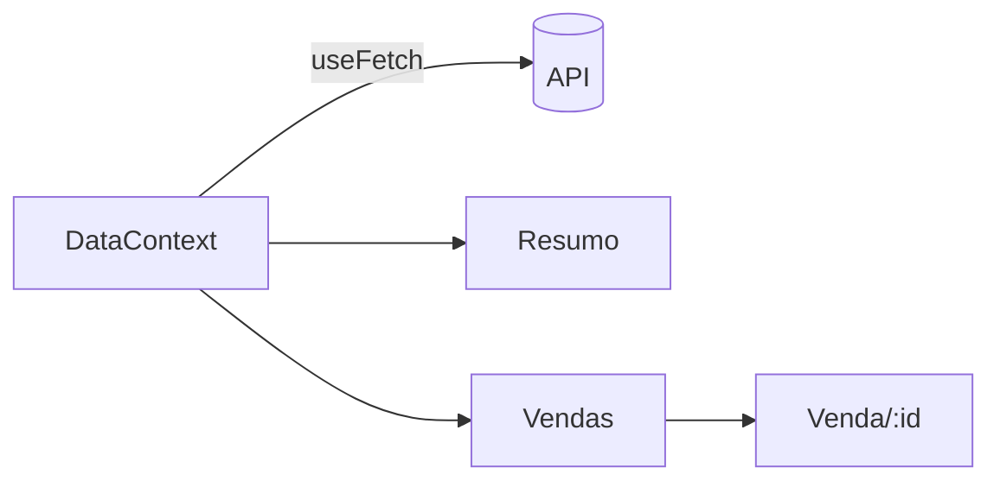

# Guia: como fazer um README impressionante

Playbook reutilizável para qualquer repositório. Escrito a partir de boas práticas atuais
(2026) e do que funcionou na prática ao montar o README deste projeto — incluindo as armadilhas
que só aparecem quando você tenta automatizar as imagens.

Revisado depois de aplicá-lo a um repositório **sem interface gráfica**: daí vieram a seção 3.5
(o terminal como captura), a correção da armadilha do `pkill` e os scripts de verificação da
seção 2.

---

## 1. O princípio

Um README não é documentação. É uma **landing page**. O leitor chega com três perguntas e dá a
você cerca de 30 segundos:

1. **O que é isso?**
2. **Isso parece bom / funciona mesmo?**
3. **Como eu rodo?**

As três precisam ser respondidas **antes do primeiro scroll**. Tudo o mais — arquitetura,
contribuição, licença, roadmap — vem depois e pode ser longo. A regra prática que aparece em
praticamente toda análise de READMEs de sucesso: _imagem herói acima da dobra, quick-start nas
primeiras 200 palavras, badges que linkam para dados vivos_.

> **Importante:**
> A diferença entre um README "bom" e um "impressionante" quase nunca é o texto. É a **imagem**.
> Um projeto com screenshot real parece pronto; o mesmo projeto sem screenshot parece abandonado.
> Se você tem tempo para uma coisa só, faça a imagem.

---

## 2. Estrutura canônica

Nesta ordem. Corte o que não se aplica, mas não reordene.

```
┌─ Banner / logo                    ← identidade visual, largura total
├─ Uma linha do que o projeto faz   ← literal, sem marketing
├─ Badges (3 a 5, funcionais)       ← demo, build, versão, licença
├─ Link para a demo ao vivo         ← se existir, em destaque
├─ Screenshot herói                 ← a tela principal, acima da dobra
│
├─ Sobre / motivação                ← 2 parágrafos, no máximo
├─ Telas (ou terminal, seção 3.5)   ← screenshots das rotas principais
├─ Funcionalidades                  ← tabela ou lista com ícones
├─ Stack                            ← tabela com links
├─ Rodando localmente               ← copiar e colar tem que funcionar
├─ Scripts                          ← tabela comando → efeito
├─ Estrutura de pastas              ← árvore comentada
├─ Deploy / arquitetura             ← o que não é óbvio no código
└─ Créditos / licença
```

### O checklist de 60 segundos

Antes de commitar, abra o README renderizado e confira:

- [ ] Dá para saber o que o projeto faz **sem rolar a página**?
- [ ] Tem pelo menos **uma imagem** na primeira tela?
- [ ] Os badges **linkam** para algo (não são decoração morta) e **respondem 200**?
- [ ] O bloco de instalação funciona **copiando e colando**, do zero, em máquina limpa?
- [ ] Todos os links e imagens resolvem? (script abaixo)
- [ ] Todo **número afirmado** foi medido nesta sessão (testes, módulos, tempo)?
- [ ] As **tabelas de status** batem com o disco, não com o que estava escrito antes?
- [ ] Legível **no celular**? (tabelas largas quebram — prefira 2 colunas)
- [ ] Legível no **dark mode**? (banner com fundo claro fixo some em tema escuro)

Os dois primeiros itens automatizáveis, em duas linhas:

```bash
# 1. todo link/imagem relativo do README existe no disco?
grep -oE '\((\./[^)]+)\)|src="(\./[^"]+)"' README.md \
  | sed -E 's/^\(|\)$|^src="|"$//g' | sed 's/#.*//' | sort -u \
  | while read -r l; do [ -e "$l" ] || echo "FALTA $l"; done

# 2. toda badge responde? (shields.io devolve 404 em parâmetro inválido)
grep -oE 'https://img\.shields\.io/[^)]+' README.md \
  | while read -r u; do printf '%s ' "$(curl -s -o /dev/null -w '%{http_code}' "$u")"; echo "$u"; done
```

> **Atenção:**
> O item mais esquecido é o das **tabelas de status**. Um README que diz "módulo
> 14 ⬜ pendente" quando `docs/14-*.md` já existe destrói a confiança no resto do
> arquivo — e é o tipo de erro que só aparece se você reconferir contra o disco,
> nunca relendo o texto. Ao atualizar um README, **rederive do sistema de
> arquivos tudo que duplica estado**.

---

## 3. Imagens — a parte que importa

### Hierarquia de impacto

Da melhor para a pior:

| Tipo                                | Impacto    | Custo                 | Quando usar                   |
| ----------------------------------- | ---------- | --------------------- | ----------------------------- |
| **GIF / vídeo curto** do fluxo real | ⭐⭐⭐⭐⭐ | alto                  | app interativo, CLI           |
| **Screenshot real** do app rodando  | ⭐⭐⭐⭐   | médio (automatizável) | qualquer UI                   |
| **Terminal gerado** da saída real   | ⭐⭐⭐⭐   | médio (automatizável) | backend, CLI, lib (seção 3.5) |
| **Banner SVG** desenhado à mão      | ⭐⭐⭐     | médio                 | identidade, topo              |
| **Diagrama** (Mermaid)              | ⭐⭐⭐     | baixo                 | arquitetura, fluxo            |
| Mockup genérico de estoque          | ⭐         | baixo                 | evite                         |

> **Dica:**
> **Screenshot real > mockup desenhado.** Um mockup bonito de uma tela que não existe é
> desonesto e o leitor percebe. Automatize a captura da tela de verdade — leva 20 minutos e
> você pode regerar a qualquer momento.

### 3.1 Pipeline de screenshot automatizado

O melhor investimento. Um script que sobe o app, captura as telas e salva em `docs/screenshots/`.
Funciona em qualquer projeto web, sem instalar Puppeteer/Playwright — só o Chrome que você já tem.

```bash
#!/usr/bin/env bash
# docs/shot.sh — captura screenshots reais do app para o README
set -euo pipefail

BASE="${1:-http://127.0.0.1:4173}"     # URL do preview já rodando
OUT="docs/screenshots"
mkdir -p "$OUT"

shoot () {  # nome  caminho  largura  altura
  google-chrome --headless --no-sandbox --disable-gpu --hide-scrollbars \
    --disable-dev-shm-usage --force-device-scale-factor=2 \
    --window-size="$3,$4" --virtual-time-budget=20000 \
    --screenshot="$OUT/$1.png" "$BASE$2" 2>/dev/null
  echo "✓ $1"
}

shoot home          "/"          1440 940
shoot lista         "/vendas"    1440 940
shoot mobile-home   "/"           500 1000   # 500 é o MÍNIMO — veja armadilha nº1
```

Rode com o preview de produção no ar (`npm run preview` / `vite preview`), não o dev server —
você quer capturar o que o usuário vê.

#### As armadilhas (todas custam tempo)

> **Atenção — 0. Pode não existir Chrome nenhum.**
> Em devcontainer, Codespace ou CI limpo, `google-chrome` simplesmente não está lá, e o
> pipeline inteiro da seção 3.1 morre na primeira linha. Instale o binário que o Playwright
> baixa (`npx playwright install chrome`, ~120 MB) ou aceite que **naquele ambiente não há
> captura de tela** e caia para a seção 3.5. Descubra isso _antes_ de escrever o README em
> volta de imagens que você não vai conseguir gerar.

> **Atenção — 1. O Chrome tem largura mínima de janela de 500px CSS.**
> Se você passar `--window-size=390,844` para simular um iPhone, o Chrome faz o layout a
> **500px** mas recorta a imagem em 390px — o lado direito some silenciosamente e você só
> percebe olhando com atenção. Use **500 ou mais** para capturas mobile. Para conferir, capture
> uma página que imprime `window.innerWidth` e compare com a largura do PNG.

> **Atenção — 2. Animações de entrada congelam no meio.**
> `--virtual-time-budget` adianta os timers, mas animações CSS de entrada (`opacity: 0` →
> `1`) e animações JS de bibliotecas de gráfico frequentemente aparecem **pela metade**: cards
> invisíveis, linhas do gráfico ausentes. A solução é gerar um **build descartável** com as
> animações desligadas:
>
> ```bash
> cp src/Style.css /tmp/bkp.css
> echo '*,*::before,*::after{animation:none!important;transition:none!important}' >> src/Style.css
> # nas libs de gráfico: isAnimationActive={false}
> npx vite build --outDir dist-shot
> # …captura…
> cp /tmp/bkp.css src/Style.css && rm -rf dist-shot   # SEMPRE restaure
> ```
>
> Faça isso num diretório de saída separado e **restaure o código-fonte** antes de commitar.

> **Atenção — 3. `--force-device-scale-factor=2` é obrigatório.**
> Sem ele o PNG sai em 1x e fica borrado em telas retina, que é onde a maioria vai ler. Com ele,
> `--window-size=1440,940` produz um PNG de 2880×1880. Exiba com `width="100%"` no HTML.

> **Atenção — 4. `pkill -f` mata o próprio shell, e a classe de caractere não basta.**
> O padrão casa com a linha de comando do wrapper que está executando o `pkill`. A receita
> conhecida é `pkill -f 'meu-scrip[t]'`, para o padrão não casar consigo mesmo — **mas ela só
> resolve metade do problema.** Se o mesmo comando do shell também _sobe_ o processo
> (`node servidor.ts & … ; pkill -f servidor.ts`), a linha de comando do wrapper contém
> `servidor.ts` de verdade, não só o padrão: o `pkill` mata o shell inteiro e você recebe um
> `exit 144` sem explicação, com o servidor possivelmente ainda no ar.
>
> ```bash
> # ❌ mata o shell junto — a linha de comando dele contém "servidor.ts"
> node servidor.ts > log.txt 2>&1 &
> curl -s localhost:5064/livros
> pkill -f 'servidor.t[s]'
>
> # ✅ guarde o PID: mata exatamente um processo, o que você subiu
> node servidor.ts > log.txt 2>&1 &
> PID=$!
> curl -s localhost:5064/livros
> kill "$PID"
> ```
>
> **Nunca identifique um processo por padrão de texto quando você tem o PID.** Vale para
> qualquer script de captura, não só para screenshot.

> **Atenção — 5. Automação de browser costuma bloquear `file://`.**
> Playwright/Puppeteer sob MCP ou sandbox recusam o protocolo `file:`, e ferramentas de
> captura frequentemente só escrevem dentro da raiz do projeto. Sirva a pasta e capture por
> HTTP — uma linha, sem dependência:
>
> ```bash
> (cd pasta-do-preview && python3 -m http.server 8899 &)
> # …capture http://localhost:8899/preview.html…
> ```
>
> Monte uma `preview.html` com **todas** as imagens numa página só: você revisa o conjunto de
> uma vez e vê os problemas de alinhamento entre elas, não uma por uma.

#### Recortando e otimizando

```bash
# altura sob medida: meça o conteúdo antes de capturar, ou capture generoso e recorte
convert shot.png -trim +repage shot.png            # ImageMagick
pngquant --quality=70-90 --ext .png --force docs/screenshots/*.png   # ~60% menor
```

> **Nota:**
> PNGs de 2x pesam. Mantenha cada um abaixo de ~400 KB. Um README com 5 MB de imagens demora
> visivelmente para abrir e o GitHub serve tudo via proxy sem lazy-load agressivo.
> `convert` e `pngquant` também podem não estar instalados no ambiente — confira antes de
> depender deles, pela mesma razão da armadilha nº 0.

### 3.2 Banner SVG

**Use SVG, não PNG**, para o banner: escala perfeitamente, pesa poucos KB e você edita o texto
depois sem refazer nada. O GitHub renderiza SVG do próprio repositório normalmente.

Receita que funciona:

```
1200 × 380, cantos arredondados (rx=24)
├─ fundo: gradiente sutil entre duas cores da paleta DO PROJETO
├─ 1 ou 2 círculos brancos translúcidos (profundidade, opacity .35–.45)
├─ logo/wordmark à esquerda (cole o path do seu SVG real)
├─ título 27px semibold + subtítulo 18px com a stack
├─ 2–3 "pills" com os estados/conceitos do domínio
└─ à direita: um card branco com sombra mostrando um gráfico/UI estilizada
```

O card da direita é onde o banner deixa de ser genérico. Ele tem que mostrar **a coisa que o
projeto faz**: um gráfico, se for um dashboard; o caminho de uma requisição pelas camadas
(`helmet → zod → controller → repository → 200 OK`), se for um backend; a linha de comando
com a saída, se for um CLI. Banner com "card decorativo" é mockup genérico com outro nome.

Duas regras: **puxe as cores dos design tokens do projeto** (`--color-1`, `--pago`…) para o
banner parecer parte do produto; e **inline tudo** (sem fonte externa — use
`font-family="system-ui,-apple-system,'Segoe UI',Roboto,sans-serif"`, que o GitHub renderiza).

```xml
<defs>
  <linearGradient id="bg" x1="0" y1="0" x2="1" y2="1">
    <stop offset="0%"   stop-color="#f7f8f5"/>
    <stop offset="100%" stop-color="#eceadd"/>
  </linearGradient>
  <filter id="card" x="-20%" y="-20%" width="140%" height="140%">
    <feDropShadow dx="0" dy="6" stdDeviation="14" flood-color="#463220" flood-opacity=".10"/>
  </filter>
</defs>
<rect width="1200" height="380" rx="24" fill="url(#bg)"/>
```

### 3.3 GIFs e demos

Para **app web**: grave a tela e converta com [Gifski](https://github.com/sindresorhus/Gifski)
(cores muito melhores) ou [ScreenToGif](https://github.com/NickeManarin/ScreenToGif).
Mantenha **abaixo de 10 s e 5 MB**, sem áudio, começando já no meio da ação.

Para **CLI/TUI**: use [VHS](https://github.com/charmbracelet/vhs). Você escreve um arquivo
`.tape` declarativo e ele renderiza o GIF — reproduzível, versionável e regerável em CI com
`charmbracelet/vhs-action`:

```tape
Output demo.gif
Set FontSize 20
Set Width 1200
Set Height 600
Type "npm run build"
Enter
Sleep 3s
```

Isso é muito superior a gravar a tela: quando o CLI muda, você regera o GIF no CI em vez de
regravar à mão.

### 3.4 Device frames / mockups

Só depois de ter o screenshot real. Coloque a captura dentro de uma moldura de browser ou
celular quando quiser reforçar "isso é um produto":

- [Screenhance](https://screenhance.com/mockup-generator) — 113 molduras, exporta PNG/GIF
- [mockup-factory](https://github.com/poyrazavsever/mockup-factory) — client-side, sem backend
- [deviceframe](https://github.com/c0bra/deviceframe) — CLI, automatizável
- [SnapMock](https://github.com/marketplace/actions/snapmock-screenshot-generator) — Action que
  captura o site publicado dentro de molduras e commita sozinho

### 3.5 Projeto sem interface: o terminal é a captura

Tudo acima assume que existe uma tela. **Backend, CLI, biblioteca e repositório de estudo não
têm tela** — e é justamente onde a maioria dos READMEs desiste da imagem e vira muro de texto.

Não desista: o "app rodando" de um backend é a **saída do comando**. Um cartão de terminal com
o `429` que o rate limit devolveu prova o produto tão bem quanto um screenshot de dashboard.

> **Princípio:** a imagem do README é **gerada, não desenhada**. Você escreve um script que
> transforma saída real em imagem; a saída é copiada de uma execução, nunca inventada. Se o
> comportamento mudar, roda de novo — e a mentira não sobrevive a um commit.

**Por que SVG e não screenshot do seu terminal:**

|             | Print do terminal (PNG)     | SVG gerado                               |
| ----------- | --------------------------- | ---------------------------------------- |
| Peso        | ~300 KB em 2x               | **~4 KB**                                |
| Nitidez     | precisa de `scale-factor=2` | vetor, perfeito em qualquer zoom         |
| Diff no git | binário opaco               | **texto — dá para revisar**              |
| Regerar     | recapturar à mão            | `node gerar.mjs`                         |
| Custo       | zero                        | ~140 linhas de script, uma vez           |
| Some junto  | —                           | tema/fonte do _seu_ terminal não aparece |

O gerador é simples: cada linha vira um `<text>`, cada trecho colorido vira um `<tspan>`.
Se você capturar com cor (`command | tee saida.txt`), basta traduzir os códigos ANSI:

```js
// \x1b[32m → verde, \x1b[0m → reset. Sem isto o SVG mostra o lixo "[32m" no meio do texto.
const RE = /\x1b\[([0-9;]*)m/;
```

Os quatro detalhes que fazem o cartão parecer real (e que só aparecem depois de renderizar):

| Detalhe              | Valor                    | Por quê                                                                                     |
| -------------------- | ------------------------ | ------------------------------------------------------------------------------------------- |
| Largura do caractere | `0.6 × font-size`        | métrica de fonte monoespaçada; é o que dimensiona o cartão                                  |
| Espaços à esquerda   | `xml:space="preserve"`   | sem isso a indentação do log some                                                           |
| Zona das bolinhas    | reserve ~80px à esquerda | título centralizado na imagem **passa por cima** dos botões do "mac"                        |
| Fonte de emoji       | some no stack            | `'Noto Color Emoji','Apple Color Emoji','Segoe UI Emoji'` — senão vira quadradinho em Linux |

> **Atenção:**
> Emoji na saída capturada é risco: Linux sem fonte de emoji instalada mostra tofu (`□`). Se o
> emoji **é** a saída real, mantenha e ponha as fontes no stack; se for enfeite seu, tire.

**O que capturar num backend** — três cartões bastam, e cada um responde uma pergunta:

| Cartão                                                                                 | Pergunta que responde |
| -------------------------------------------------------------------------------------- | --------------------- |
| `npm run dev` + um `curl` com a resposta                                               | "funciona mesmo?"     |
| O comportamento que define o domínio (`429`, log com `[REDACTED]`, migration aplicada) | "isso é sério?"       |
| A suíte de testes passando                                                             | "dá para confiar?"    |

Mesmo com o gerador, **rode o projeto do zero antes**: `npm install` de um `node_modules`
desatualizado, subir o servidor, bater com `curl`. Foi assim que descobri que o repositório
onde escrevi este guia nem começava a rodar sem um `npm install` novo — o README anterior
prometia um quick-start que ninguém tinha testado desde a última dependência adicionada.

> **Implementação de referência:** [`assets/gerar.mjs`](../assets/gerar.mjs) neste
> repositório. São ~140 linhas sem nenhuma dependência, e as quatro imagens do README somam
> 24 KB.

---

## 4. Truques de Markdown do GitHub

### Imagens que se adaptam ao tema

Banner com fundo claro fixo **desaparece** no dark mode. Resolva com `<picture>`:

```html
<picture>
  <source media="(prefers-color-scheme: dark)" srcset="docs/banner-dark.svg" />
  <source media="(prefers-color-scheme: light)" srcset="docs/banner.svg" />
  
</picture>
```

> **Nota:**
> O atalho antigo `imagem.png#gh-dark-mode-only` foi descontinuado pelo GitHub. Use `<picture>`.
> Alternativa mais simples: desenhe o banner com fundo **neutro que funcione nos dois temas**,
> ou com o fundo transparente e cores de contraste médio.

Para um banner **escuro** a alternativa costuma vencer: fundo escuro fixo funciona nos dois
temas do GitHub (é o inverso do problema — quem some é o fundo claro), e você mantém **um
arquivo em vez de dois que precisam ficar em sincronia**. Só vale o `<picture>` quando a
identidade visual do projeto é clara.

### Alertas — e quando não usá-los

Renderizam com ícone e cor. Use com parcimônia — 2 ou 3 no README inteiro:

```markdown
> [!NOTE] / [!TIP] / [!IMPORTANT] / [!WARNING] / [!CAUTION]
```

> **Atenção:**
> Isso é **extensão do GitHub, não Markdown padrão.** Fora do GitHub (e de editores que
> imitam o GitHub), o leitor vê o literal `[!WARNING]` no meio da citação. Se os `.md` do
> projeto também são lidos no editor, num gerador de site, num `npm` page ou num PDF, use o
> equivalente portátil — que comunica igual e renderiza em qualquer lugar:
>
> ```markdown
> > **Atenção:** o que dá errado e quanto custa.
> ```
>
> É a razão de este guia usar `> **Rótulo:**` em vez dos alertas que ele mesmo documenta.

### Seções recolhíveis

Ótimo para não inflar a página com FAQ, troubleshooting ou logs longos:

```html
<details>
  <summary><b>Como configurar variáveis de ambiente</b></summary>

  Conteúdo aqui dentro, incluindo blocos de código.
</details>
```

### Duas imagens lado a lado

Markdown puro não faz. Tabela HTML faz — é o padrão para mostrar mobile + desktop:

```html
<table>
  <tr>
    <td width="50%"></td>
    <td width="50%"></td>
  </tr>
  <tr>
    <td align="center">
      <sub><b>Resumo</b></sub>
    </td>
    <td align="center">
      <sub><b>Vendas</b></sub>
    </td>
  </tr>
</table>
```

### Diagramas Mermaid

Renderizam nativamente **e seguem o tema do leitor** automaticamente. Melhor que uma imagem de
arquitetura, porque é editável em texto:

````markdown

````

### Badges

**3 a 5, todas funcionais e linkando para dados vivos.** Badge decorativa que não linka para
nada é ruído. Use `style=for-the-badge` para um visual consistente e **cores da sua paleta**:

```markdown
[](https://user.github.io/repo/)
[](../../actions)
```

As que valem a pena: **demo ao vivo**, **status do CI**, **versão/release**, **licença**.
As que não valem: contador de visitas, "made with love", badges de tecnologia sem link.

### Centralização

O GitHub aceita `<div align="center">` — use no bloco do topo (banner, badges, link da demo) e
no rodapé. **Não** centralize o corpo do texto: prejudica muito a leitura.

---

## 5. Erros comuns

| Erro                                          | Por quê                                                    |
| --------------------------------------------- | ---------------------------------------------------------- |
| README sem imagem nenhuma                     | Projeto parece morto                                       |
| Screenshot desatualizado                      | Pior que nenhum — quebra a confiança                       |
| "Projeto sem UI não dá para ilustrar"         | Dá: a saída do comando é a tela (seção 3.5)                |
| Muro de badges (10+)                          | Vira ruído, ninguém lê                                     |
| Instalação que não funciona copiando          | Motivo nº1 de abandono                                     |
| Quick-start que começa em `npm install`       | Falta o `git clone`; não funciona em máquina limpa         |
| Número afirmado sem ter sido medido           | "97% de cobertura" que ninguém rodou é dívida              |
| Tabela de status desatualizada                | Diz ⬜ no que já está pronto — desmente o resto do arquivo |
| Descrição vaga ("um app moderno e robusto")   | Não diz nada; seja literal                                 |
| Imagem de 8 MB no topo                        | Página demora a carregar                                   |
| Banner claro sem versão dark                  | Some para metade dos leitores                              |
| Emoji na imagem sem fonte no stack            | Vira `□` em Linux, e parece bug                            |
| Alerta `[!NOTE]` em `.md` lido fora do GitHub | Renderiza o literal; use `> **Rótulo:**`                   |
| Documentar o óbvio do código                  | Documente o que **não** dá para inferir lendo o repo       |
| Tabelas de 6 colunas                          | Quebram no celular                                         |

---

## 6. Prompt reutilizável

Cole isto no Claude Code dentro de qualquer repositório:

```
Faça um README impressionante para este repositório, seguindo GUIA-README.md.

Antes de escrever:
1. Leia o código para entender o que o projeto realmente faz — funcionalidades,
   stack, rotas/comandos, e a paleta de cores dos design tokens.
2. RODE o projeto do zero: instale as dependências, suba, e execute o
   quick-start exatamente como está escrito. Anote o que quebrou.
3. Gere as imagens de verdade:
   - um banner SVG usando as cores do próprio projeto;
   - se o projeto TEM interface: screenshots REAIS com Chrome headless em 2x
     (desktop 1440 e mobile 500 — 500 é o mínimo do Chrome). Se as animações
     de entrada congelarem, gere um build descartável com as animações
     desligadas e restaure o código-fonte depois;
   - se NÃO tem interface (backend, CLI, lib): siga a seção 3.5 — capture a
     saída real dos comandos e gere cartões de terminal em SVG por script.
4. Salve as imagens e o gerador juntos, para dar para regerar depois.

Depois escreva o README na estrutura do guia. Antes de terminar:
- rode o checklist de 60 segundos da seção 2, incluindo os dois scripts;
- confira toda tabela de status contra o disco;
- não afirme nenhum número que você não mediu nesta sessão;
- renderize as imagens numa página só e OLHE — texto sobreposto, tofu de emoji
  e corte nas bordas só aparecem assim.
```

---

## 7. Referências

**Exemplos que valem estudar** (todos citados no [awesome-readme](https://github.com/matiassingers/awesome-readme)):

| Repo                                                                                                     | O que roubar                                               |
| -------------------------------------------------------------------------------------------------------- | ---------------------------------------------------------- |
| [ai/size-limit](https://github.com/ai/size-limit#readme)                                                 | Logo + screenshot + instalação passo a passo, muito enxuto |
| [amitmerchant1990/electron-markdownify](https://github.com/amitmerchant1990/electron-markdownify#readme) | GIF de demo perfeito logo no topo                          |
| [gofiber/fiber](https://github.com/gofiber/fiber#readme)                                                 | Badges bem escolhidas, quickstart, gráficos de benchmark   |
| [httpie/httpie](https://github.com/httpie/httpie#readme)                                                 | Screenshots de terminal, seções de instalação por SO       |
| [ryanoasis/nerd-fonts](https://github.com/ryanoasis/nerd-fonts#readme)                                   | Diagrama Sankey e ícones por sistema operacional           |

**Templates e guias:** [Best-README-Template](https://github.com/othneildrew/Best-README-Template) ·
[Make a README](https://www.makeareadme.com/) ·
[Standard Readme](https://github.com/RichardLitt/standard-readme#readme) ·
[Art of README](https://github.com/hackergrrl/art-of-readme)

**Ferramentas:** [shields.io](https://shields.io) (badges) ·
[VHS](https://github.com/charmbracelet/vhs) (demo de CLI) ·
[Gifski](https://github.com/sindresorhus/Gifski) (GIF) ·
[Screenhance](https://screenhance.com/mockup-generator) (molduras) ·
[pngquant](https://pngquant.org) (otimização)
