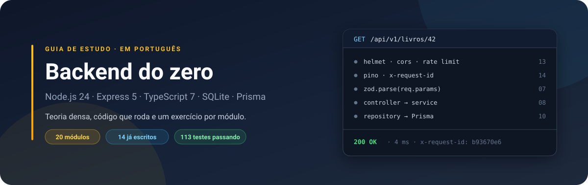
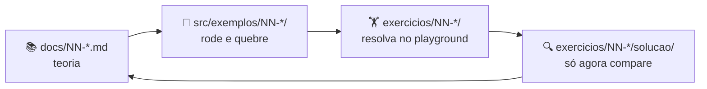

<div align="center">



**Um curso de backend em 20 módulos, em português.**<br>
Teoria explicada, código que roda de verdade e um exercício por módulo.

[](./.projeto/GUIA-IMPLEMENTACAO.md#9-roadmap-de-execução)
[](./docs/12-testes.md)
[](https://nodejs.org)
[](./tsconfig.json)
[](https://github.com/kessleru/Backend-express/commits/main)


</div>

## O que é

Um **guia de estudo**, não uma biblioteca. Nada aqui é para instalar no seu
projeto — é para você ler, rodar, quebrar e reescrever.

Cada assunto é explicado na ordem: o problema que existia, **como a coisa
funciona por dentro**, o princípio que isso mostra, o que custa e o que muda no
seu código. Você não decora que "usamos hash de senha", você entende que **a
senha nunca é armazenada** — e isso continua valendo quando o argon2 for
substituído. Todo exemplo é executado antes de entrar no repo: se está escrito
que devolve `429`, é porque devolveu.

Stack: Node.js 24 · TypeScript 7 · Express 5 · SQLite · Prisma · Zod · Vitest ·
Pino. O Node 24 roda TypeScript direto, então **não existe passo de build durante
o desenvolvimento** — e nada de `ts-node`, `nodemon` ou `dotenv`.

## Rodando

```bash
git clone https://github.com/kessleru/Backend-express.git
cd Backend-express
npm install
npm run dev          # http://localhost:5050
```

Os módulos 01–09 rodam só com isso. **A partir do módulo 10** (Prisma) são
necessários mais três passos, porque o client e o banco não vêm no git:

```bash
npm run db:generate  # gera o Prisma Client
npm run db:migrate   # cria as tabelas
npm run db:seed      # popula com dados de exemplo
```

> **Atenção:**
> Sem eles, `npm run typecheck` acusa erros no módulo 10 e o exemplo falha com
> `P2021 — table main.livros does not exist`.

## Como estudar



O passo 3 é o que fixa. Ler código pronto dá sensação de aprendizado; escrever do
zero mostra o que você realmente sabe.

> **Importante:**
> Resolva em `src/playground/`. É a única pasta que é sua — nada mais no repo
> escreve lá.

Travou numa palavra? Ela está no [**glossário**](./docs/00-glossario.md). Se não
estiver, é falha do material, não sua.

Os `.md` são Markdown puro: `Ctrl+K V` abre o preview no VS Code e os diagramas
mermaid já renderizam, sem instalar extensão nenhuma. No GitHub, idem.

## Currículo

✅ pronto para estudar · ⬜ ainda não escrito

| #   | Módulo                                                        | O que você aprende                               | Status |
| --- | ------------------------------------------------------------- | ------------------------------------------------ | ------ |
| 00  | [Glossário](./docs/00-glossario.md)                           | Toda palavra técnica do curso, em uma frase      | ✅     |
|     | **Parte I — Fundamentos**                                     |                                                  |        |
| 01  | [Fundamentos de HTTP](./docs/01-fundamentos-http.md)          | Request/response, métodos, status codes, headers | ✅     |
| 02  | [Node, módulos e async](./docs/02-node-modulos-e-async.md)    | Event loop, ESM, npm, Promises                   | ✅     |
|     | **Parte II — Express**                                        |                                                  |        |
| 03  | [Express básico](./docs/03-express-basico.md)                 | Rotas, params, query, body, CRUD                 | ✅     |
| 04  | [Roteamento](./docs/04-roteamento.md)                         | Router, versionamento, design de URLs            | ✅     |
| 05  | [Middlewares](./docs/05-middlewares.md)                       | A fila de funções, `next()`, CORS                | ✅     |
| 06  | [Tratamento de erros](./docs/06-tratamento-de-erros.md)       | Handler central, `AppError`                      | ✅     |
| 07  | [Validação](./docs/07-validacao-zod.md)                       | Zod, schemas, nunca confiar no cliente           | ✅     |
|     | **Parte III — Arquitetura e dados**                           |                                                  |        |
| 08  | [Arquitetura em camadas](./docs/08-arquitetura-em-camadas.md) | Route → controller → service → repository        | ✅     |
| 09  | [SQLite e SQL](./docs/09-sqlite-e-sql.md)                     | SQL na mão, modelagem, índices, transações       | ✅     |
| 10  | [Prisma (ORM)](./docs/10-prisma-orm.md)                       | Schema, migrations, client tipado, N+1           | ✅     |
| 11  | [Autenticação](./docs/11-autenticacao.md)                     | Hash de senha, JWT, cookies, RBAC                | ✅     |
| 12  | [Testes](./docs/12-testes.md)                                 | Pirâmide, Vitest, Supertest, dublês, TDD         | ✅     |
|     | **Parte IV — Produção**                                       |                                                  |        |
| 13  | [Segurança](./docs/13-seguranca.md)                           | OWASP, rate limit, CORS de verdade, segredos     | ✅     |
| 14  | [Observabilidade](./docs/14-observabilidade.md)               | Logs estruturados, request ID, health check      | ✅     |
| 15  | Performance e cache                                           | Redis, paginação, load testing                   | ⬜     |
| 16  | Deploy e CI/CD                                                | Docker, GitHub Actions                           | ⬜     |
|     | **Parte V — Avançado**                                        |                                                  |        |
| 17  | Filas e jobs                                                  | BullMQ, retry, idempotência                      | ⬜     |
| 18  | Tempo real                                                    | WebSocket, SSE                                   | ⬜     |
| 19  | Uploads                                                       | Multipart, validação, streaming                  | ⬜     |
| 20  | Além do REST                                                  | OpenAPI/Swagger, GraphQL, tRPC                   | ⬜     |

Do módulo 03 em diante os exercícios param de ser soltos e viram **uma API de
biblioteca** que cresce a cada módulo: CRUD em memória, depois camadas, depois
banco, depois login, depois testes, depois blindada para produção.

## Onde fica cada coisa

| Pasta             | O que tem                        | É seu? |
| ----------------- | -------------------------------- | ------ |
| `docs/`           | Teoria, um arquivo por módulo    | ler    |
| `src/exemplos/`   | Código de referência dos módulos | rodar  |
| `exercicios/`     | Enunciados e soluções            | fazer  |
| `src/playground/` | **Seu espaço.** Nada escreve aí  | 🔒 sim |
| `.projeto/`       | Planejamento interno do repo     | ignore |

## Comandos

| Comando                  | O que faz                          |
| ------------------------ | ---------------------------------- |
| `npm run dev`            | Servidor com reload automático     |
| `npm run typecheck`      | Confere os tipos do projeto        |
| `npm run typecheck:play` | Confere os tipos do seu playground |
| `npm run typecheck:ex`   | Confere os tipos das soluções      |
| `npm run build`          | Gera `dist/`                       |
| `npm start`              | Roda o build de produção           |
| `npm run format`         | Formata tudo com Prettier          |

A partir do módulo 10 (Prisma): `db:migrate` cria e aplica migration,
`db:generate` regera o client, `db:seed` popula o banco, `db:reset` refaz tudo do
zero e `db:studio` abre o navegador de banco em `localhost:5555`.

A partir do módulo 12 (testes): `npm test` roda a suíte uma vez,
`npm run test:watch` reexecuta o que muda e `npm run test:cov` gera a cobertura
em `coverage/index.html`.

<div align="center">

Planejamento e estado do projeto: [`.projeto/GUIA-IMPLEMENTACAO.md`](./.projeto/GUIA-IMPLEMENTACAO.md)

</div>
