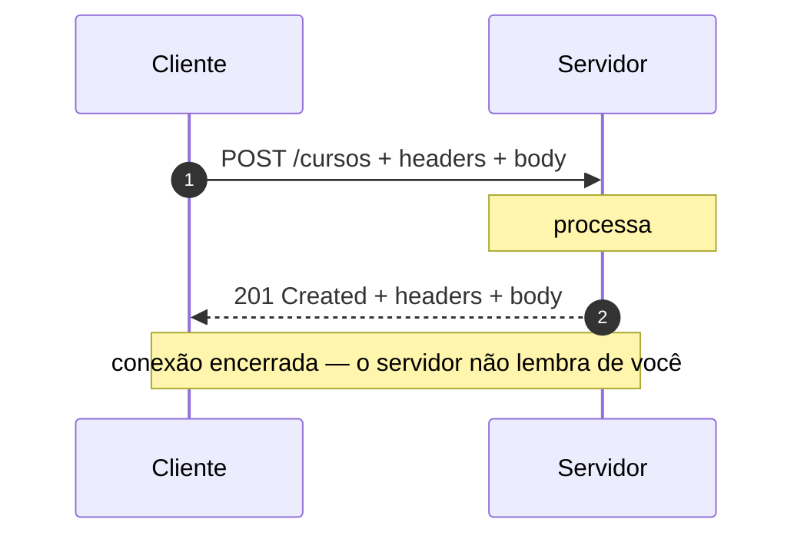
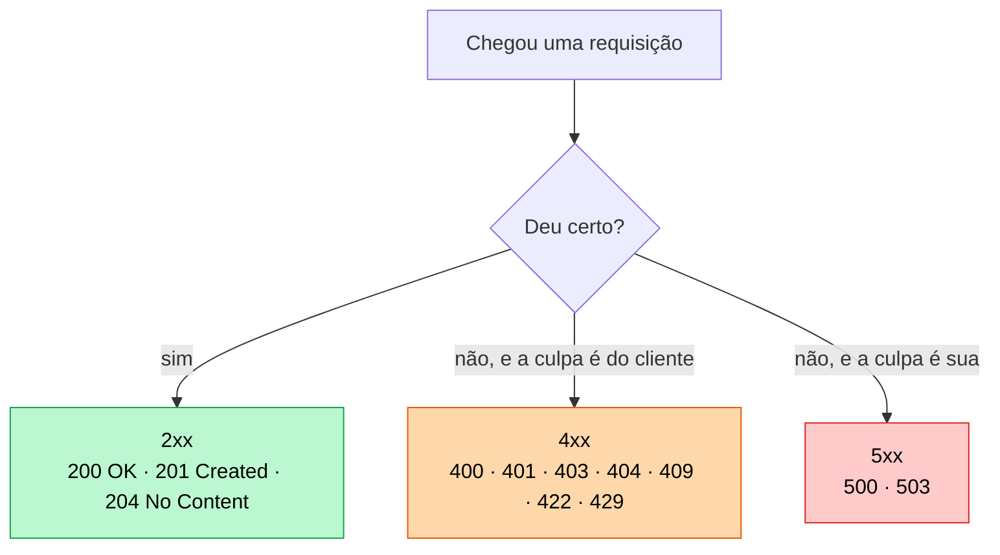

# 01 — Fundamentos de HTTP

**Em uma frase:** HTTP é o combinado de como um cliente pede algo a um servidor e
como o servidor responde.

## Por que importa

- Todo framework web — Express incluso — é uma casca fina sobre isto.
- Debugar API é, quase sempre, ler uma requisição e uma resposta.
- Escolher o método e o status certo **é** o design da sua API.

## Conceitos

### O ciclo



Uma requisição, uma resposta. Só isso.

**O princípio:** HTTP é um **protocolo de texto, sem estado e iniciado pelo
cliente**. As três palavras carregam consequências que atravessam o curso inteiro:

| Propriedade         | Consequência que você vai sentir                                                        |
| ------------------- | --------------------------------------------------------------------------------------- |
| **Texto** (legível) | Dá para depurar com `curl` e ler no fio — e por isso HTTPS não é opcional               |
| **Sem estado**      | Toda requisição carrega quem você é; daí token e cookie (módulo 11)                     |
| **Cliente inicia**  | O servidor **não** consegue te avisar de nada; daí polling, SSE e WebSocket (módulo 18) |

> **Nota:** "Uma requisição, uma resposta" é o modelo mental, não a implementação. Na
> prática a conexão TCP é reaproveitada (keep-alive) e o HTTP/2 multiplexa várias
> trocas na mesma conexão. Nada disso muda o seu código — muda o desempenho
> (módulo 15).

### Anatomia de uma requisição

```http
POST /cursos?rascunho=true HTTP/1.1     ← método, caminho, query
Host: api.exemplo.com                    ← headers: metadados
Content-Type: application/json
Authorization: Bearer abc123

{ "titulo": "Backend do zero" }          ← body: os dados
```

E da resposta:

```http
HTTP/1.1 201 Created                     ← status code
Content-Type: application/json

{ "id": 7, "titulo": "Backend do zero" }
```

### Métodos

| Método   | Para quê           | Seguro? | Idempotente? |
| -------- | ------------------ | ------- | ------------ |
| `GET`    | Buscar             | Sim     | Sim          |
| `POST`   | Criar              | Não     | **Não**      |
| `PUT`    | Substituir inteiro | Não     | Sim          |
| `PATCH`  | Alterar um pedaço  | Não     | Não          |
| `DELETE` | Remover            | Não     | Sim          |

- **Seguro** = não muda nada no servidor.
- **Idempotente** = repetir 10× dá o mesmo resultado de fazer 1×.

Por isso `POST` não é idempotente: mandar duas vezes cria dois recursos. É esse o
motivo do navegador avisar "reenviar formulário?" ao dar F5.

**Por que essas duas palavras importam de verdade:** elas não são taxonomia, são
o contrato com toda a infraestrutura entre você e o cliente.

| Quem depende          | Do quê                            | O que acontece se você mentir                                         |
| --------------------- | --------------------------------- | --------------------------------------------------------------------- |
| Navegador, CDN, proxy | `GET` ser **seguro**              | Eles fazem prefetch. Um `GET /livros/7/apagar` é executado sem clique |
| Cliente com timeout   | `PUT`/`DELETE` serem idempotentes | Ele repete sozinho. Se não for, o efeito acontece duas vezes          |
| Fila de jobs (17)     | O consumidor ser idempotente      | Todo job roda ao menos uma vez — às vezes duas                        |

> **Cuidado:** **A regra prática: se a ação muda estado, o método não pode ser `GET`.** Não
> importa quão conveniente seja o link. Já derrubaram bancos de dados inteiros
> porque um robô de indexação seguiu todos os `<a href="/apagar/1">` de um painel.

E onde a idempotência não existe (`POST`), o jeito de recuperá-la é uma **chave de
idempotência**: o cliente manda um identificador único da tentativa, o servidor
guarda o resultado e, na repetição, devolve o mesmo resultado sem refazer nada.
É como toda API de pagamento resolve isso.

### Status codes



| Família | Significa          | Os que você usa                                                                                                                                   |
| ------- | ------------------ | ------------------------------------------------------------------------------------------------------------------------------------------------- |
| 2xx     | Deu certo          | `200` OK · `201` Created · `204` No Content                                                                                                       |
| 3xx     | Redireciona        | `301` permanente · `302` temporário · `304` não mudou                                                                                             |
| 4xx     | **Cliente errou**  | `400` inválido · `401` não autenticado · `403` sem permissão · `404` não existe · `409` conflito · `422` semântica inválida · `429` rápido demais |
| 5xx     | **Servidor errou** | `500` erro interno · `503` indisponível                                                                                                           |

> **Importante:** A distinção 4xx vs 5xx é a mais importante: **de quem é a culpa?** Bug seu nunca
> deve virar 400, e entrada ruim do cliente nunca deve virar 500.
>
> `401` vs `403`: "não sei quem você é" vs "sei quem você é, e você não pode".

**Por que o status code é decisão de arquitetura, não enfeite:** ele é a única
parte da resposta que **máquina** entende sem ler o seu JSON. Quem age com base
nele:

| Quem          | Faz o quê                                               |
| ------------- | ------------------------------------------------------- |
| Cliente HTTP  | Repete em `5xx` e `429`; **não** repete em `4xx`        |
| Seu alerta    | Mede taxa de `5xx`. `4xx` é rotina, `5xx` acorda alguém |
| Cache/CDN     | Guarda `200`, respeita `304`, não guarda `5xx`          |
| Load balancer | Tira a instância do ar se ela só devolve `503`          |

Mandar `200 {"erro": "não encontrado"}` quebra os quatro de uma vez: o cliente não
repete o que devia, o alerta nunca dispara, o CDN cacheia um erro, e a instância
doente continua recebendo tráfego. O status code é a **interface com a
infraestrutura**; o corpo é a interface com a pessoa.

**Os dois pares que mais se confundem:**

| Par            | A diferença                                                                     |
| -------------- | ------------------------------------------------------------------------------- |
| `400` vs `422` | `400`: não deu para entender (JSON quebrado). `422`: entendi, e a regra recusou |
| `401` vs `403` | `401`: renove a credencial. `403`: insistir não adianta                         |
| `404` vs `403` | `404` também serve para **esconder** que o recurso existe (ver módulo 11)       |
| `409` vs `400` | `409`: o corpo está certo, o **estado** é que impede                            |

O par `404`/`403` é o único que é decisão de **segurança**, não de precisão.
Responder `403` em `GET /usuarios/42` é dizer a um estranho "esse usuário
existe, você é que não pode ver" — a resposta em si já vazou o fato. Quando a
existência do recurso é informação sensível, devolver `404` para o que a pessoa
não pode ver é proposital, e a imprecisão é o preço.

Vale para dados de outra pessoa, repositório privado, documento por link. Não
vale para recurso público que só exige papel de admin: ali o `403` é honesto e
poupa o cliente de caçar um bug que não existe.

### Headers que aparecem sempre

| Header          | Para quê                                     |
| --------------- | -------------------------------------------- |
| `Content-Type`  | Formato do body (`application/json`)         |
| `Authorization` | Credencial (`Bearer <token>`)                |
| `Accept`        | Formato que o cliente quer de volta          |
| `Cache-Control` | Se e por quanto tempo pode guardar           |
| `Location`      | Onde está o recurso recém-criado (com `201`) |

### Statelessness

O servidor **não lembra** de você entre requisições. Cada uma chega sozinha e
precisa carregar tudo que é necessário — inclusive quem você é (daí o
`Authorization` em toda requisição).

**O princípio:** statelessness **empurra o estado para as pontas**. Ele não some
— vai para o cliente (token, cookie) ou para um armazenamento compartilhado
(banco, Redis). O que ele nunca deve fazer é morar na memória de **uma** das suas
instâncias.


A conta que isso paga aparece em quase todo módulo seguinte:

| Se o estado estivesse na memória de uma instância | O que quebra                        |
| ------------------------------------------------- | ----------------------------------- |
| Sessão do usuário                                 | Ele deslogaria a cada 2 requisições |
| Contador de rate limit (05)                       | O limite triplicaria com 3 réplicas |
| Lista de refresh revogados (11)                   | Logout não teria efeito nas outras  |
| Cache (15)                                        | Cada instância cacheia sozinha      |

> **Nota:** O custo do modelo é repetição: reenviar o token a cada requisição, e o servidor
> reconstruir contexto toda vez. Em troca, escalar horizontalmente é ligar mais
> uma máquina. É a troca que sustenta a web inteira — e um dos poucos casos em
> que "menos eficiente por requisição" ganha de longe.

## Na prática

### curl: o cliente HTTP do terminal

`curl` monta uma requisição na mão e imprime a resposta. Sem flag nenhuma ele faz
um `GET` e mostra **só o body** — status e headers ficam escondidos.

Flag é traço + letra (`-i`) ou dois traços + a palavra inteira (`--include`): a
mesma coisa, na forma curta e na longa. Maiúscula é outra flag (`-i` inclui os
headers, `-I` manda um `HEAD`), e as curtas podem ser juntadas (`-is` = `-i -s`).

| Flag | Por extenso  | O que faz                                              |
| ---- | ------------ | ------------------------------------------------------ |
| `-i` | `--include`  | Imprime status e headers junto do body                 |
| `-X` | `--request`  | Escolhe o método: `-X DELETE`                          |
| `-H` | `--header`   | Manda um header: `-H "Content-Type: application/json"` |
| `-d` | `--data`     | Manda um body — e já troca o método para `POST`        |
| `-s` | `--silent`   | Esconde a barra de progresso, para usar com pipe       |
| `-L` | `--location` | Segue o `Location` de um `3xx`                         |

### Um servidor sem Express

Para você ver o trabalho manual:

```bash
node src/exemplos/01-http-sem-express/servidor.ts
```

Em outro terminal:

```bash
curl localhost:4001/
curl "localhost:4001/ola?nome=ana"
curl -X POST localhost:4001/eco -H "Content-Type: application/json" -d '{"a":1}'
curl -i localhost:4001/nao-existe
```

Repare no código ([`servidor.ts`](../src/exemplos/01-http-sem-express/servidor.ts))
o que é feito na mão. É exatamente o que o Express vai automatizar no módulo 03:

| Na mão aqui                                    | No Express                |
| ---------------------------------------------- | ------------------------- |
| `if (rota === 'GET /ola')`                     | `app.get('/ola', ...)`    |
| Juntar os chunks do body                       | `app.use(express.json())` |
| `res.writeHead(200, {...})` + `JSON.stringify` | `res.json(...)`           |
| 404 no fim do handler                          | Automático                |

## Erros comuns

| Erro                               | O que acontece                              | Correção                     |
| ---------------------------------- | ------------------------------------------- | ---------------------------- |
| Esquecer `res.end()`               | O cliente fica esperando até dar timeout    | Toda rota tem que responder  |
| Responder duas vezes               | `ERR_HTTP_HEADERS_SENT`                     | `return` depois de responder |
| `200` para tudo                    | Cliente não sabe distinguir sucesso de erro | Use o status certo           |
| `500` quando o cliente mandou lixo | Some com o erro real do cliente             | Validação → `400`            |
| Verbo na URL (`/getCursos`)        | O método já diz a ação                      | `GET /cursos`                |
| Achar que query param é número     | `?idade=30` chega como `"30"`               | Converta e valide            |
| `curl -d` sem `-H Content-Type`    | curl envia `x-www-form-urlencoded`          | Passe o header na mão        |

## Cheatsheet

```
GET    /cursos        lista
GET    /cursos/7      um item
POST   /cursos        cria          → 201
PUT    /cursos/7      substitui     → 200
PATCH  /cursos/7      altera parte  → 200
DELETE /cursos/7      remove        → 204

2xx ok · 3xx redireciona · 4xx culpa do cliente · 5xx culpa sua
```

## Os princípios deste módulo

| Princípio                                                             | Onde reaparece |
| --------------------------------------------------------------------- | -------------- |
| **HTTP é texto, sem estado, e sempre iniciado pelo cliente.**         | 11, 15, 18     |
| **Statelessness empurra o estado para as pontas** — ele não some.     | 05, 11, 15     |
| **O status code é a interface com a máquina; o corpo, com a pessoa.** | 06, 14         |
| **Se a ação muda estado, o método não pode ser `GET`.**               | 03, 13         |
| **Idempotência é o que torna repetir seguro.**                        | 03, 15, 17     |

## Para ir além

A especificação é surpreendentemente legível — e é a autoridade quando alguém discute qual status usar.

- **[RFC 9110 — HTTP Semantics](https://www.rfc-editor.org/rfc/rfc9110.html)**
  A norma atual (STD 97, 2022), que substituiu as antigas RFC 7230-7235. As seções 9 (métodos) e 15 (status) respondem quase toda dúvida de design de API. Confirma o que este módulo diz: idempotência é sobre **estado do servidor**, não sobre a resposta.
- **[MDN — HTTP](https://developer.mozilla.org/pt-BR/docs/Web/HTTP)**
  A mesma informação em português e com exemplos. É onde consultar no dia a dia; a RFC é para quando a MDN não basta.
- **[MDN — Referência de status HTTP](https://developer.mozilla.org/pt-BR/docs/Web/HTTP/Reference/Status)**
  Um verbete por código, com o significado exato e quando usar. É a página para deixar aberta enquanto desenha uma API.
- **[OWASP — _REST Security Cheat Sheet_](https://cheatsheetseries.owasp.org/cheatsheets/REST_Security_Cheat_Sheet.html)**
  O que fazer e o que evitar numa API HTTP, do ponto de vista de segurança. Curto, e antecipa o módulo 13.

## Pratique

👉 [`exercicios/01-fundamentos-http/`](../exercicios/01-fundamentos-http/)
