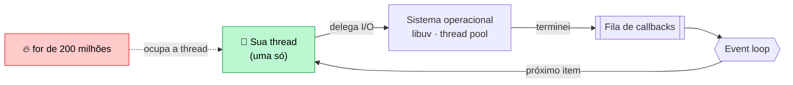
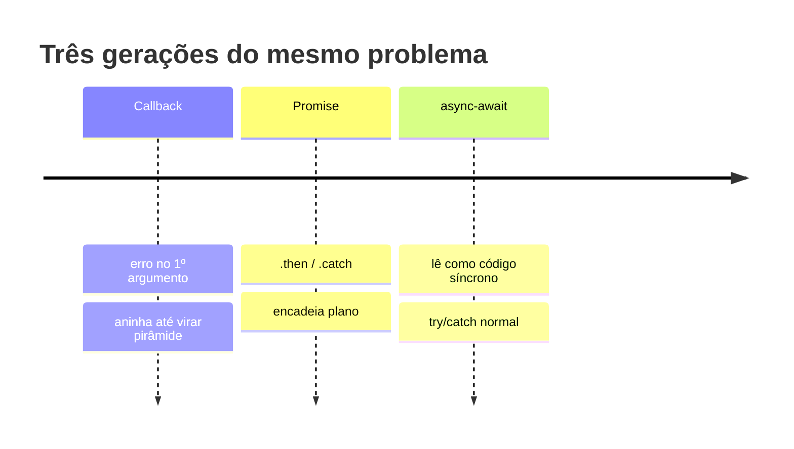

# 02 — Node.js, módulos e assincronia

**Em uma frase:** o Node roda JavaScript fora do navegador com **uma thread só**,
e é a assincronia que faz isso bastar para atender milhares de clientes.

## Por que importa

- Entender o event loop é o que separa "funciona" de "aguenta carga".
- 90% dos bugs de backend Node são `await` esquecido ou erro não capturado.
- `package.json` e semver decidem o que quebra no `npm install` do mês que vem.

## Conceitos

### O que o Node é

| Peça      | Papel                                                             |
| --------- | ----------------------------------------------------------------- |
| **V8**    | Motor que executa o JavaScript (o mesmo do Chrome).               |
| **libuv** | Faz o I/O (arquivo, rede) e mantém o event loop.                  |
| **APIs**  | `node:http`, `node:fs`, `node:sqlite`… o que o navegador não tem. |

### Event loop, sem mistificação

Existe **uma** fila de trabalho e **uma** thread rodando seu código.



- **I/O não bloqueia:** ler um arquivo é delegado ao sistema operacional. O Node
  registra "me avise quando terminar" e vai atender outra requisição.
- **CPU bloqueia:** um `for` de 200 milhões de voltas é o _seu_ código. Enquanto
  ele roda, nenhum timer dispara e nenhum cliente é atendido.

**O princípio:** o Node não é rápido porque é paralelo — ele é **eficiente porque
não desperdiça thread esperando**.

Compare com o modelo clássico (uma thread por requisição, como o PHP tradicional
ou o Java servlet antigo):

| Modelo                    | 10 mil conexões esperando o banco                          |
| ------------------------- | ---------------------------------------------------------- |
| Uma thread por requisição | 10 mil threads, ~1 MB de pilha cada = ~10 GB de RAM parada |
| Event loop (Node)         | 1 thread, 10 mil callbacks registrados = alguns MB         |

> **Dica:** **Espera é grátis, cálculo é caro.** Backend passa a vida esperando banco e
> rede — daí o modelo funcionar tão bem.

E é por isso que a fraqueza é exatamente a imagem espelhada: qualquer trabalho de
**CPU** trava tudo, porque não há outra thread para atender ninguém.

#### Quem espera, se a sua thread não espera

"Delega ao sistema operacional" esconde uma distinção que muda decisão de projeto:
nem todo I/O é delegado do mesmo jeito.

| O trabalho é…                        | Quem faz de fato                            | Sua thread… |
| ------------------------------------ | ------------------------------------------- | ----------- |
| Rede (socket, HTTP, banco)           | O **kernel**, avisando via `epoll`/`kqueue` | segue livre |
| Arquivo, DNS, `zlib`, `crypto`       | O **thread pool** da libuv (4 threads)      | segue livre |
| `for`, `JSON.parse`, laço de cálculo | A **sua** thread, a única que roda JS       | **travada** |

Rede escala aos milhares porque o kernel avisa sozinho — é o caso da tabela
acima. Já leitura de arquivo não tem versão assíncrona de verdade em todo sistema,
então a libuv usa um pool de **4 threads** (`UV_THREADPOOL_SIZE`). Consequência
prática: 10 mil conexões esperando é barato, mas **a quinta leitura de arquivo
simultânea espera a primeira terminar**.

#### O número que separa os dois casos

Dois handlers que levam ~1,5s cada — um esperando, outro calculando. A pergunta
que importa não é quanto cada um demora, e sim **quanto um segundo cliente espera
para ser atendido**:

```text
/io    1530ms  →  outro cliente esperou    13ms
/cpu   1364ms  →  outro cliente esperou  1364ms   ← esperou o trabalho INTEIRO
```

Mesma duração, impacto oposto no resto do sistema. E o efeito colateral que
costuma passar batido: enquanto `/cpu` calcula, o `/health` também não responde —
o orquestrador conclui que a aplicação morreu e reinicia o processo, derrubando
junto todas as requisições que estavam em andamento.

| Sintoma em produção                         | Causa quase certa                                     |
| ------------------------------------------- | ----------------------------------------------------- |
| Latência de **todas** as rotas sobe junto   | Alguém bloqueou o loop                                |
| Health check começa a dar timeout sob carga | O loop não chega a responder                          |
| CPU em 100% com uma requisição só           | Laço pesado, regex catastrófica, `JSON.parse` gigante |

As saídas, em ordem de preferência: não fazer o trabalho no request (fila, módulo
17), quebrá-lo em pedaços que devolvem o loop, ou mandá-lo para outra thread
(`worker_threads`). "Otimizar o laço" quase nunca é a resposta.

### Ordem de execução

```ts
console.log('1');
setTimeout(() => console.log('4'), 0); // macrotask: vai pro fim da fila
void Promise.resolve().then(() => console.log('3')); // microtask: fura a fila
console.log('2');
```


Microtasks (`.then`, `await`) rodam antes de qualquer macrotask (`setTimeout`,
I/O). Isso importa quando você tenta "dar uma folga" ao loop com `setTimeout(0)`
e nada melhora.

### CommonJS vs ESM

|                 | CommonJS              | ESM (este repo)            |
| --------------- | --------------------- | -------------------------- |
| Importar        | `require('x')`        | `import x from 'x'`        |
| Exportar        | `module.exports = x`  | `export default x`         |
| Quando resolve  | Em runtime, síncrono  | Antes de rodar, estático   |
| `await` no topo | Não                   | **Sim** (top-level await)  |
| Ativado por     | padrão antigo, `.cjs` | `"type": "module"`, `.mjs` |

ESM é o padrão do ecossistema hoje, permite `await` no topo do arquivo e é
exigido pelo `verbatimModuleSyntax` do nosso `tsconfig.json`. CommonJS você ainda
vai encontrar em todo tutorial de 2019 — reconheça e traduza.

> **Nota:** **Detalhe deste repo:** import relativo leva a extensão real (`./foo.ts`),
> porque o Node exige extensão em ESM. O `rewriteRelativeImportExtensions` troca
> por `.js` no `npm run build`.

### `package.json` campo a campo

| Campo             | Para quê                                                  |
| ----------------- | --------------------------------------------------------- |
| `name`, `version` | Identidade do pacote.                                     |
| `type`            | `module` = ESM. O campo mais importante do arquivo.       |
| `main`            | Ponto de entrada quando alguém importa seu pacote.        |
| `scripts`         | Atalhos: `npm run dev`. Onde mora a automação do projeto. |
| `dependencies`    | Precisa **em produção** (`express`).                      |
| `devDependencies` | Só para desenvolver (`typescript`, `prettier`, `vitest`). |

> **Atenção:** Errar a coluna `dependencies`/`devDependencies` não dá erro local — dá erro no
> deploy, onde `npm ci --omit=dev` não instala o que você pôs no lugar errado.

### Semver

```
     5   .   2   .   1
   major  minor  patch
   quebra  nova   correção
           feature
```

| Faixa    | Aceita          | Uso                           |
| -------- | --------------- | ----------------------------- |
| `^5.2.1` | `>=5.2.1 <6`    | Padrão do npm. Minor e patch. |
| `~5.2.1` | `>=5.2.1 <5.3`  | Só patch. Mais conservador.   |
| `5.2.1`  | exatamente essa | Trava total.                  |

O que garante build reproduzível não é a faixa, é o **`package-lock.json`** — ele
grava a versão exata que foi instalada. Commite sempre. E `npm ci` (em vez de
`npm install`) instala exatamente o lockfile, sem atualizar nada.

### Callbacks → Promises → async/await



```ts
// 1. Callback: erro é o primeiro argumento, por convenção.
fs.readFile('a.txt', (erro, dados) => {
  if (erro) return console.error(erro);
});

// 2. Promise: encadeia plano, com .catch no fim.
readFile('a.txt').then(usar).catch(tratar);

// 3. async/await: lê como código síncrono. É o que usamos daqui pra frente.
try {
  const dados = await readFile('a.txt');
} catch (erro) {
  /* ... */
}
```

`async/await` **é** Promise por baixo — açúcar sintático, não outro mecanismo.
Toda função `async` devolve uma Promise, mesmo que você retorne um número.

**O princípio:** uma Promise é um **valor que ainda não chegou**, e `await` é
"pause esta função até chegar". A palavra que engana é "pause": a função pausa, a
**thread não**. Ela sai para atender outra requisição e volta depois.

Daí uma regra prática que economiza latência de graça:

```ts
// ❌ SÉRIE — 600ms. Cada await espera o anterior sem precisar.
const autor = await buscarAutor(1);
const livros = await buscarLivros(1);
const generos = await buscarGeneros(1);

// ✅ PARALELO — 200ms. Dispara os três e espera o conjunto.
const [autor, livros, generos] = await Promise.all([
  buscarAutor(1),
  buscarLivros(1),
  buscarGeneros(1),
]);
```

Só serialize quando o segundo passo **precisa** do resultado do primeiro. É a
mesma ideia que reaparece no [módulo 10](./10-prisma-orm.md) como problema N+1 —
lá o laço serializa 100 consultas que caberiam em uma.

> **Atenção:** `Promise.all` é **tudo ou nada**: a primeira rejeição descarta o resto (que
> continua rodando, sem ninguém escutando). Quando você quer o resultado parcial,
> é `Promise.allSettled`.

### O `try/catch` que não pega nada

```ts
// ERRADO: sem await, o try já terminou quando a Promise rejeita.
try {
  buscarUsuario(-1); // ← faltou await
} catch {
  /* nunca roda */
}

// CERTO:
try {
  await buscarUsuario(-1);
} catch (erro) {
  /* aqui sim */
}
```

> **Cuidado:** Sem o `await`, a rejeição vira **unhandled rejection** e o Node derruba o
> processo. Este é o bug número um de backend Node.

**A raiz do problema:** `try/catch` captura por **pilha de chamadas**, e uma
Promise sem `await` sai da pilha imediatamente. Quando ela rejeita, o `try` já
terminou há muito tempo — não existe mais para onde o erro subir.

É a mesma razão pela qual `.forEach(async ...)` não espera nada: o `forEach`
recebe uma função que devolve Promise, ignora o retorno e segue.

```ts
// ❌ Termina "na hora" e as gravações continuam soltas no ar.
livros.forEach(async (l) => await salvar(l));

// ✅ Em série, quando a ordem importa:
for (const l of livros) await salvar(l);

// ✅ Em paralelo, quando não importa:
await Promise.all(livros.map((l) => salvar(l)));
```

> **Dica:** A regra que evita a família inteira desses bugs: **toda função que devolve
> Promise ou é `await`ada, ou tem `.catch`, ou leva `void` na frente** para dizer
> "eu sei, é intencional". Se você não consegue escolher qual dos três, o código
> tem um dono de erro indefinido.

## Na prática

```bash
node src/exemplos/02-node-async/event-loop.ts   # I/O não bloqueia, CPU bloqueia
node src/exemplos/02-node-async/promises.ts     # as 3 gerações + armadilhas
```

O primeiro mede: três esperas de 1s em paralelo levam ~1s; um `setTimeout(0)`
atrás de um loop pesado só dispara **depois** do loop. O segundo mostra série
(600ms) vs `Promise.all` (200ms) para o mesmo trabalho.

## Erros comuns

| Erro                         | O que acontece                        | Correção                      |
| ---------------------------- | ------------------------------------- | ----------------------------- |
| `await` esquecido            | Recebe `Promise {}` no lugar do valor | Sempre `await` no retorno     |
| `await` dentro de `for`      | Serializa o que podia ser paralelo    | `Promise.all(itens.map(...))` |
| `try/catch` sem `await`      | Não captura nada; processo cai        | `await` dentro do `try`       |
| `.forEach(async ...)`        | Não espera nada; segue em frente      | `for...of` ou `Promise.all`   |
| Loop pesado no handler       | Todos os clientes travam junto        | Fila/worker (módulo 17)       |
| `require` em arquivo ESM     | `require is not defined`              | `import`                      |
| Import relativo sem extensão | `ERR_MODULE_NOT_FOUND`                | `./foo.ts`                    |
| `catch (e) { e.message }`    | TS reclama: `e` é `unknown`           | `e instanceof Error ? ...`    |

## Cheatsheet

```ts
Promise.all([a, b])        // tudo ou nada; falha se uma falhar
Promise.allSettled([a, b]) // sempre resolve; cada item tem status
Promise.race([a, b])       // a primeira que terminar (útil p/ timeout)
Promise.any([a, b])        // a primeira que der SUCESSO

node arquivo.ts            # roda TypeScript direto (Node 24)
node --watch arquivo.ts    # reinicia ao salvar
node --env-file=.env x.ts  # carrega .env sem dotenv

npm install        # resolve as faixas e atualiza o lockfile
npm ci             # instala o lockfile exato (use no CI/deploy)
npm i -D pacote    # entra em devDependencies
npm ls pacote      # mostra a versão realmente instalada
```

## Os princípios deste módulo

| Princípio                                                                          | Onde reaparece |
| ---------------------------------------------------------------------------------- | -------------- |
| **O Node não é paralelo; ele é eficiente por não desperdiçar thread esperando.**   | 15, 17         |
| **Espera é grátis, cálculo é caro** — trabalho de CPU no request trava todo mundo. | 15, 17         |
| **Serialize só o que depende do anterior.**                                        | 10 (N+1), 15   |
| **Toda Promise precisa de um dono do erro:** `await`, `.catch` ou `void`.          | 06             |
| **O lockfile é o que garante build reproduzível**, não a faixa de versão.          | 16 (CI/CD)     |

## Para ir além

O guia oficial abaixo é curto e vale mais que qualquer vídeo sobre event loop.

- **[Node.js — _Don't Block the Event Loop (or the Worker Pool)_](https://nodejs.org/learn/asynchronous-work/dont-block-the-event-loop)**
  Fonte oficial do que este módulo mede: quais APIs usam o **worker pool** da libuv (arquivo, DNS, `crypto`, `zlib`) e quais usam o kernel. Confirma o pool de 4 threads (máximo 128) e mostra por que ele é fácil de esgotar.
- **[Node.js — _The Node.js Event Loop_](https://nodejs.org/learn/asynchronous-work/event-loop-timers-and-nexttick)**
  As fases do loop em ordem, com `process.nextTick` e `setImmediate` explicados lado a lado.
- **[Casciaro & Mammino — _Node.js Design Patterns_, 4ª ed. (2025)](https://nodejsdesignpatterns.com/)**
  O livro de referência de Node. Os capítulos de callbacks, streams e padrões assíncronos vão muito além do que cabe aqui.
- **[Bevacqua — _Practical Modern JavaScript_](https://github.com/mjavascript/practical-modern-javascript)**
  Gratuito e online. Para firmar ESM, iteradores e o JavaScript moderno que este repo usa.

## Pratique

👉 [`exercicios/02-node-async/`](../exercicios/02-node-async/)
