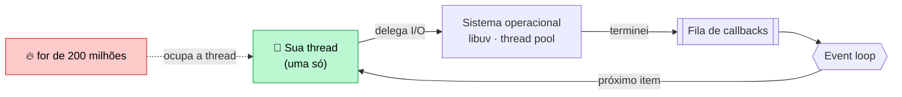

# 02 — Node.js, módulos e assincronia

**Em uma frase:** o Node roda JavaScript fora do navegador com **uma thread só**,
e é a assincronia que faz isso bastar para atender milhares de clientes.

<!-- sumario:inicio -->

**Sumário**

- [Por que importa](#por-que-importa)
- [Conceitos](#conceitos)
  - [O que é uma thread, e por que "uma só" é a notícia](#o-que-é-uma-thread-e-por-que-uma-só-é-a-notícia)
  - [As três peças](#as-três-peças)
  - [Event loop: como uma thread atende mil clientes](#event-loop-como-uma-thread-atende-mil-clientes)
  - [Ordem de execução: nem toda fila é a mesma fila](#ordem-de-execução-nem-toda-fila-é-a-mesma-fila)
  - [CommonJS vs ESM](#commonjs-vs-esm)
  - [package.json campo a campo](#packagejson-campo-a-campo)
  - [Semver](#semver)
  - [Callbacks, Promises e async/await](#callbacks-promises-e-asyncawait)
  - [O try/catch que não pega nada](#o-trycatch-que-não-pega-nada)
- [Na prática](#na-prática)
- [Erros comuns](#erros-comuns)
- [Cheatsheet](#cheatsheet)
- [Os princípios deste módulo](#os-princípios-deste-módulo)
- [Se quiser ir mais fundo](#se-quiser-ir-mais-fundo)
- [Para ir além](#para-ir-além)
- [Pratique](#pratique)

<!-- sumario:fim -->

## Por que importa

- Entender o event loop é o que separa "funciona" de "aguenta carga".
- 90% dos bugs de backend Node são `await` esquecido ou erro não capturado.
- `package.json` e semver decidem o que quebra no `npm install` do mês que vem.

## Conceitos

### O que é uma thread, e por que "uma só" é a notícia

Este módulo inteiro gira em torno da palavra **thread**, então vale gastar um
parágrafo nela.

Uma thread é uma **linha de execução**: um lugar onde instruções são executadas,
uma depois da outra. Um programa com uma thread faz uma coisa por vez. Um
programa com quatro threads faz quatro coisas ao mesmo tempo — de verdade, em
núcleos diferentes do processador.

O seu código JavaScript roda em **uma thread só**. Isso significa, literalmente,
que duas linhas suas nunca executam ao mesmo tempo. Enquanto uma função sua está
rodando, nenhuma outra está.

À primeira vista isso parece uma limitação séria para um servidor. Se o
atendimento de um cliente ocupa a única linha de execução, como o segundo cliente
é atendido? A resposta é o assunto da próxima seção, e ela depende de uma
observação: **um servidor passa a maior parte do tempo não fazendo nada** — está
esperando o banco responder, esperando o disco, esperando a rede. Esperar não
ocupa processador.

### As três peças

| Peça      | Papel                                                                                                                   |
| --------- | ----------------------------------------------------------------------------------------------------------------------- |
| **V8**    | O motor que executa o JavaScript (o mesmo do Chrome). É ele que roda a sua única thread.                                |
| **libuv** | Uma biblioteca escrita em C. É ela que conversa com o sistema operacional para fazer I/O e que mantém o event loop.     |
| **APIs**  | `node:http`, `node:fs`, `node:sqlite`… o que o navegador não tem, porque no navegador você não abre arquivo nem socket. |

Duas palavras dessa tabela, se forem novas:

- **I/O** é _input/output_: tudo que envolve sair do processo para buscar ou
  mandar dados — ler arquivo, consultar banco, chamar outra API. É o oposto de
  "calcular", que acontece dentro do processador.
- **Event loop** é o laço que veremos agora.

### Event loop: como uma thread atende mil clientes

O truque é que a thread **não espera junto**. Quando o seu código pede uma
leitura de banco, o Node não fica parado: ele entrega o pedido para quem sabe
esperar, anota "quando terminar, me chame de volta", e **devolve a thread** para
atender outra requisição.

Quando o resultado chega, a resposta entra numa fila. O **event loop** é o laço
que fica dando a volta pegando o próximo item pronto dessa fila e executando o
código que estava esperando por ele.



O diagrama tem duas rotas, e a diferença entre elas é a coisa mais importante
deste módulo:

- **I/O não bloqueia.** Ler um arquivo é delegado para fora. O Node registra "me
  avise quando terminar" e sai para atender outra requisição. A caixa verde fica
  livre.
- **CPU bloqueia.** Um `for` de 200 milhões de voltas é o _seu_ código, e código
  seu só roda na sua thread. Enquanto ele gira, nenhum timer dispara, nenhuma
  resposta é enviada e nenhum cliente é atendido. É a seta vermelha.

Vale ver o que isso economiza. O modelo clássico — usado pelo PHP tradicional e
pelo Java servlet antigo — é dar **uma thread para cada requisição**. Ela fica
com a thread desde que chega até responder, incluindo o tempo em que está
parada esperando o banco:

| Modelo                    | 10 mil clientes esperando o banco ao mesmo tempo                                |
| ------------------------- | ------------------------------------------------------------------------------- |
| Uma thread por requisição | 10 mil threads. Cada uma reserva ~1 MB de pilha: **~10 GB de RAM parada**       |
| Event loop (Node)         | 1 thread e 10 mil anotações de "me avise quando terminar": **alguns megabytes** |

**O que isso mostra:** o Node não atende mais gente por ser mais rápido, nem por
fazer várias coisas ao mesmo tempo — ele não faz. Ele atende mais gente porque
**não deixa uma linha de execução parada esperando**. É economia de espera, não
de cálculo.

E é por isso que a fraqueza é a imagem espelhada exata da força. Se o ganho vem
de nunca ficar parado, então qualquer coisa que **prenda** a thread derruba tudo
— e trabalho de CPU prende, porque não existe uma segunda thread para atender
ninguém enquanto isso.

> **Dica:**
> Uma frase para levar: **espera é de graça, cálculo é caro.** Backend passa a
> vida esperando banco e rede, e é por isso que o modelo funciona tão bem para
> esse trabalho — e tão mal para processar imagem ou vídeo.

#### Quem espera, se a sua thread não espera

Eu disse "delega para fora" como se fosse uma coisa só. Não é, e a diferença muda
decisão de projeto.

Existem **dois lugares diferentes** para onde o trabalho pode ir, e um deles é
bem menor do que parece:

| O trabalho é…                        | Quem faz de fato                       | Sua thread… |
| ------------------------------------ | -------------------------------------- | ----------- |
| Rede (socket, HTTP, banco)           | O **kernel**                           | segue livre |
| Arquivo, DNS, `zlib`, `crypto`       | O **thread pool** da libuv — 4 threads | segue livre |
| `for`, `JSON.parse`, laço de cálculo | A **sua** thread, a única que roda JS  | **travada** |

O **kernel** é o núcleo do sistema operacional — a parte que fala com o hardware
e com a rede. Ele já sabe vigiar milhares de conexões de uma vez e avisar quais
tiveram novidade; é para isso que existem mecanismos como o `epoll` (no Linux) e
o `kqueue` (no macOS). Você nunca chama esses nomes, mas eles são a razão de a
primeira linha da tabela escalar aos milhares sem custo.

A segunda linha é a que surpreende. Leitura de arquivo **não tem versão
assíncrona de verdade** em todo sistema operacional. Então a libuv mantém um
**thread pool** — um grupinho de threads reservadas, **4 por padrão** — e manda
esse trabalho para lá.

Quatro é pouco, e a consequência é concreta: dez mil conexões de rede esperando é
barato, mas **a quinta leitura de arquivo simultânea fica na fila até uma das
quatro primeiras terminar**. O mesmo vale para `crypto` — e é por isso que fazer
hash de senha (módulo 11) é mais caro do que parece.

> **Dica:**
> Dá para aumentar o pool com a variável de ambiente `UV_THREADPOOL_SIZE` (máximo
> 1024). Só que threads a mais competem pelos mesmos núcleos, então isso ajuda
> quando elas ficam **esperando** disco, e não quando estão calculando. Meça
> antes de mexer.

#### O número que separa os dois casos

Até aqui é argumento. Dá para medir.

A medida que interessa não é quanto um trabalho demora — é **quanto ele atrasa
todo o resto**. Isso tem nome: _event loop delay_, o tempo que o loop leva para
voltar a atender quando deveria. Um `setInterval` de 10 em 10ms que chega
atrasado está te contando exatamente isso.

O exemplo do módulo mede os dois casos:

```bash
node src/exemplos/02-node-async/medindo-tempo.ts
```

```text
5. só I/O    → atraso máx  10.1ms
6. com CPU   → atraso máx 370.4ms
```

Nos dois casos há trabalho acontecendo. A diferença é que no primeiro a thread
estava livre — o atraso de 10ms é só o intervalo natural do timer. No segundo,
todo mundo ficou na fila atrás do cálculo.

O valor exato varia com a sua máquina; a ordem de grandeza, não. E o efeito
colateral que costuma passar batido é este: enquanto o cálculo roda, o
`/health` **também** não responde. O orquestrador conclui que a aplicação morreu,
reinicia o processo, e derruba junto todas as requisições que estavam em
andamento — inclusive as que estavam saudáveis.

| Sintoma em produção                         | Causa quase certa                                     |
| ------------------------------------------- | ----------------------------------------------------- |
| Latência de **todas** as rotas sobe junto   | Alguém bloqueou o loop                                |
| Health check começa a dar timeout sob carga | O loop não chega a responder                          |
| CPU em 100% com uma requisição só           | Laço pesado, regex catastrófica, `JSON.parse` gigante |

As saídas, em ordem de preferência: não fazer o trabalho no request (fila, módulo
17), quebrá-lo em pedaços que devolvem o loop, ou mandá-lo para outra thread
(`worker_threads`). "Otimizar o laço" quase nunca é a resposta.

### Ordem de execução: nem toda fila é a mesma fila

Antes de ler a explicação, aposte. Em que ordem estes quatro números aparecem?

```ts
console.log('a');
setTimeout(() => console.log('b'), 0);
void Promise.resolve().then(() => console.log('c'));
console.log('d');
```

O `setTimeout` é de **zero** milissegundos, então é tentador responder
`a, b, c, d`. A saída real é:

```text
a
d
c
b
```

Duas coisas surpreendem aí. A primeira é que `b` sai por último, apesar do zero —
"zero" não significa "agora", significa "na primeira oportunidade **depois** que
o código atual terminar". A segunda é que `c` fura a frente de `b`, mesmo tendo
sido agendado depois.

O motivo é que existem **duas filas**, não uma, e elas têm prioridades
diferentes:


1. **Primeiro roda todo o código síncrono**, sem interrupção, até a última linha.
   Daí `a` e `d` saírem juntos e na ordem em que estão escritos.
2. **Depois esvazia a fila de prioridade**, onde ficam as continuações de Promise
   (`.then`, e o que vem depois de um `await`). É `c`.
3. **Só então pega um item da fila normal**, onde ficam `setTimeout`, `setInterval`
   e as respostas de I/O. É `b`.

Os nomes oficiais dessas duas filas são **microtask** (a de prioridade) e
**macrotask** (a normal). Você vai encontrá-los em toda discussão sobre event
loop; o que eles significam é só isso.

Onde isso te morde na prática: quando um laço pesado está travando o servidor e
alguém sugere "dá uma folga pro loop com `setTimeout(0)`". Se você quebrar o
trabalho usando Promises, ele continua na fila de prioridade — que é esvaziada
**inteira** antes de qualquer I/O ser atendido. O servidor continua travado.

### CommonJS vs ESM

|                 | CommonJS              | ESM (este repo)            |
| --------------- | --------------------- | -------------------------- |
| Importar        | `require('x')`        | `import x from 'x'`        |
| Exportar        | `module.exports = x`  | `export default x`         |
| Quando resolve  | Em runtime, síncrono  | Antes de rodar, estático   |
| `await` no topo | Não                   | **Sim** (top-level await)  |
| Ativado por     | padrão antigo, `.cjs` | `"type": "module"`, `.mjs` |

ESM é o padrão do ecossistema hoje, permite `await` no topo do arquivo e é
exigido pelo `verbatimModuleSyntax` do nosso `tsconfig.json`. CommonJS você ainda
vai encontrar em todo tutorial de 2019 — reconheça e traduza.

> **Nota:** **Detalhe deste repo:** import relativo leva a extensão real (`./foo.ts`),
> porque o Node exige extensão em ESM. O `rewriteRelativeImportExtensions` troca
> por `.js` no `npm run build`.

### `package.json` campo a campo

| Campo             | Para quê                                                  |
| ----------------- | --------------------------------------------------------- |
| `name`, `version` | Identidade do pacote.                                     |
| `type`            | `module` = ESM. O campo mais importante do arquivo.       |
| `main`            | Ponto de entrada quando alguém importa seu pacote.        |
| `scripts`         | Atalhos: `npm run dev`. Onde mora a automação do projeto. |
| `dependencies`    | Precisa **em produção** (`express`).                      |
| `devDependencies` | Só para desenvolver (`typescript`, `prettier`, `vitest`). |

> **Atenção:** Errar a coluna `dependencies`/`devDependencies` não dá erro local — dá erro no
> deploy, onde `npm ci --omit=dev` não instala o que você pôs no lugar errado.

### Semver

```
     5   .   2   .   1
   major  minor  patch
   quebra  nova   correção
           feature
```

| Faixa    | Aceita          | Uso                           |
| -------- | --------------- | ----------------------------- |
| `^5.2.1` | `>=5.2.1 <6`    | Padrão do npm. Minor e patch. |
| `~5.2.1` | `>=5.2.1 <5.3`  | Só patch. Mais conservador.   |
| `5.2.1`  | exatamente essa | Trava total.                  |

O que garante build reproduzível não é a faixa, é o **`package-lock.json`** — ele
grava a versão exata que foi instalada. Commite sempre. E `npm ci` (em vez de
`npm install`) instala exatamente o lockfile, sem atualizar nada.

### Callbacks, Promises e async/await

Voltemos ao "me avise quando terminar". Como é que você escreve isso em código?

A resposta mais antiga é passar uma função junto com o pedido: _"leia este
arquivo e, quando acabar, chame esta função aqui"_. Essa função que fica
guardada para ser chamada depois é um **callback** — literalmente, uma chamada
de volta.

Funciona, e por anos foi o único jeito. O problema aparece quando um callback
precisa de outro:

```ts
// 1. CALLBACK. Repare que o erro chega no PRIMEIRO argumento — é a convenção
//    do Node, e existe porque não há como um callback "lançar" um erro para
//    quem o registrou: aquele código já terminou.
fs.readFile('a.txt', (erro, dados) => {
  if (erro) return console.error(erro);
  fs.readFile(dados.proximo, (erro2, dados2) => {
    // e cada passo novo empurra o código mais uma casa para a direita
  });
});
```

A segunda geração inverte quem guarda a função. Em vez de você entregar o
callback junto com o pedido, o pedido devolve **um objeto** que representa o
resultado que ainda não chegou. Esse objeto é a **Promise**, e você pendura nele
o que fazer depois:

```ts
// 2. PROMISE. Encadeia para baixo em vez de aninhar para a direita, e o
//    .catch no fim pega o erro de qualquer passo da corrente.
readFile('a.txt').then(usar).catch(tratar);
```

A terceira geração é açúcar sobre a segunda — ou seja, uma escrita mais
confortável para exatamente a mesma coisa, sem nenhum mecanismo novo por baixo:

```ts
// 3. ASYNC/AWAIT. É o que usamos daqui para a frente.
try {
  const dados = await readFile('a.txt');
} catch (erro) {
  /* ... */
}
```

Vale insistir neste ponto porque ele evita confusão mais tarde: `async/await`
**é** Promise. Toda função marcada `async` devolve uma Promise, mesmo que o
`return` dela seja um número. O `await` não é um mecanismo paralelo ao `.then()`;
é outra forma de escrevê-lo.

**E o que "await" realmente faz:** ele pausa **a sua função** até o valor chegar.
A palavra que engana é "pausa" — a função pausa, a **thread não**. Ela é
devolvida ao event loop, atende outras requisições, e volta a esta função quando
o resultado estiver pronto. Se a thread também parasse, estaríamos de volta ao
modelo de 10 GB de RAM parada.

Daí sai uma regra prática que economiza latência de graça:

```ts
// ❌ SÉRIE — 600ms. Cada await espera o anterior sem precisar.
const autor = await buscarAutor(1);
const livros = await buscarLivros(1);
const generos = await buscarGeneros(1);

// ✅ PARALELO — 200ms. Dispara os três e espera o conjunto.
const [autor, livros, generos] = await Promise.all([
  buscarAutor(1),
  buscarLivros(1),
  buscarGeneros(1),
]);
```

Só serialize quando o segundo passo **precisa** do resultado do primeiro. É a
mesma ideia que reaparece no [módulo 10](./10-prisma-orm.md) como problema N+1 —
lá o laço serializa 100 consultas que caberiam em uma.

> **Atenção:** `Promise.all` é **tudo ou nada**: a primeira rejeição descarta o resto (que
> continua rodando, sem ninguém escutando). Quando você quer o resultado parcial,
> é `Promise.allSettled`.

### O `try/catch` que não pega nada

```ts
// ERRADO: sem await, o try já terminou quando a Promise rejeita.
try {
  buscarUsuario(-1); // ← faltou await
} catch {
  /* nunca roda */
}

// CERTO:
try {
  await buscarUsuario(-1);
} catch (erro) {
  /* aqui sim */
}
```

> **Cuidado:** Sem o `await`, a rejeição vira **unhandled rejection** e o Node derruba o
> processo. Este é o bug número um de backend Node.

**A raiz do problema:** `try/catch` captura por **pilha de chamadas**, e uma
Promise sem `await` sai da pilha imediatamente. Quando ela rejeita, o `try` já
terminou há muito tempo — não existe mais para onde o erro subir.

É a mesma razão pela qual `.forEach(async ...)` não espera nada: o `forEach`
recebe uma função que devolve Promise, ignora o retorno e segue.

```ts
// ❌ Termina "na hora" e as gravações continuam soltas no ar.
livros.forEach(async (l) => await salvar(l));

// ✅ Em série, quando a ordem importa:
for (const l of livros) await salvar(l);

// ✅ Em paralelo, quando não importa:
await Promise.all(livros.map((l) => salvar(l)));
```

> **Dica:** A regra que evita a família inteira desses bugs: **toda função que devolve
> Promise ou é `await`ada, ou tem `.catch`, ou leva `void` na frente** para dizer
> "eu sei, é intencional". Se você não consegue escolher qual dos três, o código
> tem um dono de erro indefinido.

## Na prática

```bash
node src/exemplos/02-node-async/event-loop.ts    # I/O não bloqueia, CPU bloqueia
node src/exemplos/02-node-async/promises.ts      # as 3 gerações + as armadilhas
node src/exemplos/02-node-async/medindo-tempo.ts # o atraso que o loop sofre
```

O que cada um prova, com os números que eles imprimem de verdade:

| Comando            | O que você vê                                                                                                                                                          |
| ------------------ | ---------------------------------------------------------------------------------------------------------------------------------------------------------------------- |
| `event-loop.ts`    | Três esperas de 1s **em paralelo** levam ~1001ms, não 3000ms. E um `setTimeout(0)` atrás de um laço pesado só dispara depois dele — 632ms depois, na medição de agora. |
| `promises.ts`      | O mesmo trabalho em série leva ~601ms e com `Promise.all` leva ~200ms. E o item 5 mostra o `try/catch` que **não** pega a rejeição.                                    |
| `medindo-tempo.ts` | O atraso do loop: ~10ms com só I/O, ~370ms com cálculo no meio.                                                                                                        |

Os tempos variam com a máquina. O que não varia é a razão entre eles — e é ela
que o módulo está ensinando.

## Erros comuns

| Erro                         | O que acontece                        | Correção                      |
| ---------------------------- | ------------------------------------- | ----------------------------- |
| `await` esquecido            | Recebe `Promise {}` no lugar do valor | Sempre `await` no retorno     |
| `await` dentro de `for`      | Serializa o que podia ser paralelo    | `Promise.all(itens.map(...))` |
| `try/catch` sem `await`      | Não captura nada; processo cai        | `await` dentro do `try`       |
| `.forEach(async ...)`        | Não espera nada; segue em frente      | `for...of` ou `Promise.all`   |
| Loop pesado no handler       | Todos os clientes travam junto        | Fila/worker (módulo 17)       |
| `require` em arquivo ESM     | `require is not defined`              | `import`                      |
| Import relativo sem extensão | `ERR_MODULE_NOT_FOUND`                | `./foo.ts`                    |
| `catch (e) { e.message }`    | TS reclama: `e` é `unknown`           | `e instanceof Error ? ...`    |

## Cheatsheet

```ts
Promise.all([a, b])        // tudo ou nada; falha se uma falhar
Promise.allSettled([a, b]) // sempre resolve; cada item tem status
Promise.race([a, b])       // a primeira que terminar (útil p/ timeout)
Promise.any([a, b])        // a primeira que der SUCESSO

node arquivo.ts            # roda TypeScript direto (Node 24)
node --watch arquivo.ts    # reinicia ao salvar
node --env-file=.env x.ts  # carrega .env sem dotenv

npm install        # resolve as faixas e atualiza o lockfile
npm ci             # instala o lockfile exato (use no CI/deploy)
npm i -D pacote    # entra em devDependencies
npm ls pacote      # mostra a versão realmente instalada
```

## Os princípios deste módulo

Recapitulando — cada linha é uma conclusão que o módulo mostrou acontecer:

| A ideia                                                                                                                   | Onde volta   |
| ------------------------------------------------------------------------------------------------------------------------- | ------------ |
| O Node não faz várias coisas ao mesmo tempo. Ele atende mais gente por nunca deixar a thread parada esperando.            | 15, 17       |
| Esperar não custa nada; calcular custa a thread inteira. Trabalho de CPU dentro do handler trava todos os clientes.       | 15, 17       |
| Faça um depois do outro só quando o segundo precisa do resultado do primeiro. Nos outros casos, dispare junto.            | 10 (N+1), 15 |
| Toda Promise precisa de alguém responsável pelo erro dela: um `await`, um `.catch` ou um `void` dizendo "é de propósito". | 06           |
| Quem garante que o build de amanhã é igual ao de hoje é o `package-lock.json`, não a faixa `^` que você escreveu.         | 16 (CI/CD)   |

## Se quiser ir mais fundo

### As fases do event loop

Eu falei em "fila normal" como se fosse uma só. Na verdade cada volta do event
loop passa por fases, e cada fase tem a sua fila:

| Fase     | O que ela processa                                             |
| -------- | -------------------------------------------------------------- |
| _timers_ | Callbacks de `setTimeout` e `setInterval` cujo prazo já venceu |
| _poll_   | I/O que terminou — é onde o loop passa a maior parte do tempo  |
| _check_  | Callbacks de `setImmediate`                                    |
| _close_  | Eventos de fechamento, como `socket.on('close')`               |

Isso explica um comportamento que confunde: `setImmediate` roda **depois** do
I/O da volta atual, enquanto `setTimeout(fn, 0)` roda na volta seguinte. Se você
quer "rodar assim que o I/O atual terminar", `setImmediate` é o certo.

Existe ainda o `process.nextTick`, que é mais prioritário que qualquer microtask
— e é justamente por isso que é fácil travar o loop com ele: um `nextTick` que
agenda outro `nextTick` nunca deixa o loop avançar.

### Por que `JSON.parse` aparece na lista de vilões

Ele parece I/O, mas não é: o texto já está na memória, e transformá-lo em objeto
é cálculo puro, na sua thread. Um corpo de 50 MB trava o servidor por segundos —
e é exatamente por isso que o `express.json()` tem um limite de tamanho por
padrão (módulo 03), e por que o módulo 13 trata isso como assunto de segurança.

## Para ir além

O guia oficial abaixo é curto e vale mais que qualquer vídeo sobre event loop.

- **[Node.js — _Don't Block the Event Loop (or the Worker Pool)_](https://nodejs.org/learn/asynchronous-work/dont-block-the-event-loop)**
  Fonte oficial do que este módulo mede: quais APIs usam o **worker pool** da libuv (arquivo, DNS, `crypto`, `zlib`) e quais usam o kernel. Confirma o pool de 4 threads (máximo 128) e mostra por que ele é fácil de esgotar.
- **[Node.js — _The Node.js Event Loop_](https://nodejs.org/learn/asynchronous-work/event-loop-timers-and-nexttick)**
  As fases do loop em ordem, com `process.nextTick` e `setImmediate` explicados lado a lado.
- **[Casciaro & Mammino — _Node.js Design Patterns_, 4ª ed. (2025)](https://nodejsdesignpatterns.com/)**
  O livro de referência de Node. Os capítulos de callbacks, streams e padrões assíncronos vão muito além do que cabe aqui.
- **[Bevacqua — _Practical Modern JavaScript_](https://github.com/mjavascript/practical-modern-javascript)**
  Gratuito e online. Para firmar ESM, iteradores e o JavaScript moderno que este repo usa.

## Pratique

👉 [`exercicios/02-node-async/`](../exercicios/02-node-async/)
