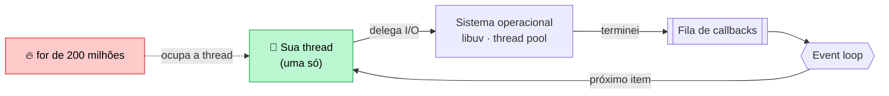
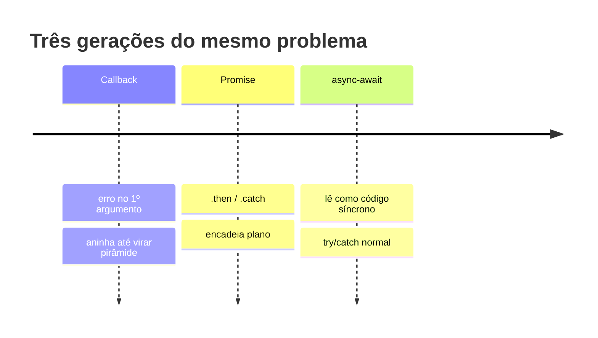

# 02 — Node.js, módulos e assincronia

**Em uma frase:** o Node roda JavaScript fora do navegador com **uma thread só**,
e é a assincronia que faz isso bastar para atender milhares de clientes.

<!-- @import "[TOC]" {cmd="toc" depthFrom=2 depthTo=3 orderedList=false} -->

## Por que importa

- Entender o event loop é o que separa "funciona" de "aguenta carga".
- 90% dos bugs de backend Node são `await` esquecido ou erro não capturado.
- `package.json` e semver decidem o que quebra no `npm install` do mês que vem.

## Conceitos

### O que o Node é

| Peça      | Papel                                                             |
| --------- | ----------------------------------------------------------------- |
| **V8**    | Motor que executa o JavaScript (o mesmo do Chrome).               |
| **libuv** | Faz o I/O (arquivo, rede) e mantém o event loop.                  |
| **APIs**  | `node:http`, `node:fs`, `node:sqlite`… o que o navegador não tem. |

### Event loop, sem mistificação

Existe **uma** fila de trabalho e **uma** thread rodando seu código.



- **I/O não bloqueia:** ler um arquivo é delegado ao sistema operacional. O Node
  registra "me avise quando terminar" e vai atender outra requisição.
- **CPU bloqueia:** um `for` de 200 milhões de voltas é o _seu_ código. Enquanto
  ele roda, nenhum timer dispara e nenhum cliente é atendido.

> [!TIP]
> Espera é grátis, cálculo é caro. Backend passa a vida esperando banco e rede —
> daí o modelo funcionar tão bem.

### Ordem de execução

```ts
console.log('1');
setTimeout(() => console.log('4'), 0); // macrotask: vai pro fim da fila
void Promise.resolve().then(() => console.log('3')); // microtask: fura a fila
console.log('2');
```


Microtasks (`.then`, `await`) rodam antes de qualquer macrotask (`setTimeout`,
I/O). Isso importa quando você tenta "dar uma folga" ao loop com `setTimeout(0)`
e nada melhora.

### CommonJS vs ESM

|                 | CommonJS              | ESM (este repo)            |
| --------------- | --------------------- | -------------------------- |
| Importar        | `require('x')`        | `import x from 'x'`        |
| Exportar        | `module.exports = x`  | `export default x`         |
| Quando resolve  | Em runtime, síncrono  | Antes de rodar, estático   |
| `await` no topo | Não                   | **Sim** (top-level await)  |
| Ativado por     | padrão antigo, `.cjs` | `"type": "module"`, `.mjs` |

ESM é o padrão do ecossistema hoje, permite `await` no topo do arquivo e é
exigido pelo `verbatimModuleSyntax` do nosso `tsconfig.json`. CommonJS você ainda
vai encontrar em todo tutorial de 2019 — reconheça e traduza.

> [!NOTE]
> **Detalhe deste repo:** import relativo leva a extensão real (`./foo.ts`),
> porque o Node exige extensão em ESM. O `rewriteRelativeImportExtensions` troca
> por `.js` no `npm run build`.

### `package.json` campo a campo

| Campo             | Para quê                                                  |
| ----------------- | --------------------------------------------------------- |
| `name`, `version` | Identidade do pacote.                                     |
| `type`            | `module` = ESM. O campo mais importante do arquivo.       |
| `main`            | Ponto de entrada quando alguém importa seu pacote.        |
| `scripts`         | Atalhos: `npm run dev`. Onde mora a automação do projeto. |
| `dependencies`    | Precisa **em produção** (`express`).                      |
| `devDependencies` | Só para desenvolver (`typescript`, `prettier`, `vitest`). |

> [!WARNING]
> Errar a coluna `dependencies`/`devDependencies` não dá erro local — dá erro no
> deploy, onde `npm ci --omit=dev` não instala o que você pôs no lugar errado.

### Semver

```
     5   .   2   .   1
   major  minor  patch
   quebra  nova   correção
           feature
```

| Faixa    | Aceita          | Uso                           |
| -------- | --------------- | ----------------------------- |
| `^5.2.1` | `>=5.2.1 <6`    | Padrão do npm. Minor e patch. |
| `~5.2.1` | `>=5.2.1 <5.3`  | Só patch. Mais conservador.   |
| `5.2.1`  | exatamente essa | Trava total.                  |

O que garante build reproduzível não é a faixa, é o **`package-lock.json`** — ele
grava a versão exata que foi instalada. Commite sempre. E `npm ci` (em vez de
`npm install`) instala exatamente o lockfile, sem atualizar nada.

### Callbacks → Promises → async/await



```ts
// 1. Callback: erro é o primeiro argumento, por convenção.
fs.readFile('a.txt', (erro, dados) => {
  if (erro) return console.error(erro);
});

// 2. Promise: encadeia plano, com .catch no fim.
readFile('a.txt').then(usar).catch(tratar);

// 3. async/await: lê como código síncrono. É o que usamos daqui pra frente.
try {
  const dados = await readFile('a.txt');
} catch (erro) {
  /* ... */
}
```

`async/await` **é** Promise por baixo — açúcar sintático, não outro mecanismo.
Toda função `async` devolve uma Promise, mesmo que você retorne um número.

### O `try/catch` que não pega nada

```ts
// ERRADO: sem await, o try já terminou quando a Promise rejeita.
try {
  buscarUsuario(-1); // ← faltou await
} catch {
  /* nunca roda */
}

// CERTO:
try {
  await buscarUsuario(-1);
} catch (erro) {
  /* aqui sim */
}
```

> [!CAUTION]
> Sem o `await`, a rejeição vira **unhandled rejection** e o Node derruba o
> processo. Este é o bug número um de backend Node.

## Na prática

```bash {cmd=true}
node src/exemplos/02-node-async/event-loop.ts   # I/O não bloqueia, CPU bloqueia
node src/exemplos/02-node-async/promises.ts     # as 3 gerações + armadilhas
```

O primeiro mede: três esperas de 1s em paralelo levam ~1s; um `setTimeout(0)`
atrás de um loop pesado só dispara **depois** do loop. O segundo mostra série
(600ms) vs `Promise.all` (200ms) para o mesmo trabalho.

## Erros comuns

| Erro                         | O que acontece                        | Correção                      |
| ---------------------------- | ------------------------------------- | ----------------------------- |
| `await` esquecido            | Recebe `Promise {}` no lugar do valor | Sempre `await` no retorno     |
| `await` dentro de `for`      | Serializa o que podia ser paralelo    | `Promise.all(itens.map(...))` |
| `try/catch` sem `await`      | Não captura nada; processo cai        | `await` dentro do `try`       |
| `.forEach(async ...)`        | Não espera nada; segue em frente      | `for...of` ou `Promise.all`   |
| Loop pesado no handler       | Todos os clientes travam junto        | Fila/worker (módulo 17)       |
| `require` em arquivo ESM     | `require is not defined`              | `import`                      |
| Import relativo sem extensão | `ERR_MODULE_NOT_FOUND`                | `./foo.ts`                    |
| `catch (e) { e.message }`    | TS reclama: `e` é `unknown`           | `e instanceof Error ? ...`    |

## Cheatsheet

```ts
Promise.all([a, b])        // tudo ou nada; falha se uma falhar
Promise.allSettled([a, b]) // sempre resolve; cada item tem status
Promise.race([a, b])       // a primeira que terminar (útil p/ timeout)
Promise.any([a, b])        // a primeira que der SUCESSO

node arquivo.ts            # roda TypeScript direto (Node 24)
node --watch arquivo.ts    # reinicia ao salvar
node --env-file=.env x.ts  # carrega .env sem dotenv

npm install        # resolve as faixas e atualiza o lockfile
npm ci             # instala o lockfile exato (use no CI/deploy)
npm i -D pacote    # entra em devDependencies
npm ls pacote      # mostra a versão realmente instalada
```

## Pratique

👉 [`exercicios/02-node-async/`](../exercicios/02-node-async/)
