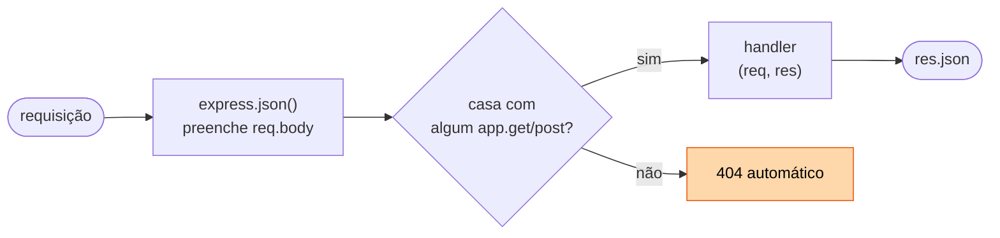
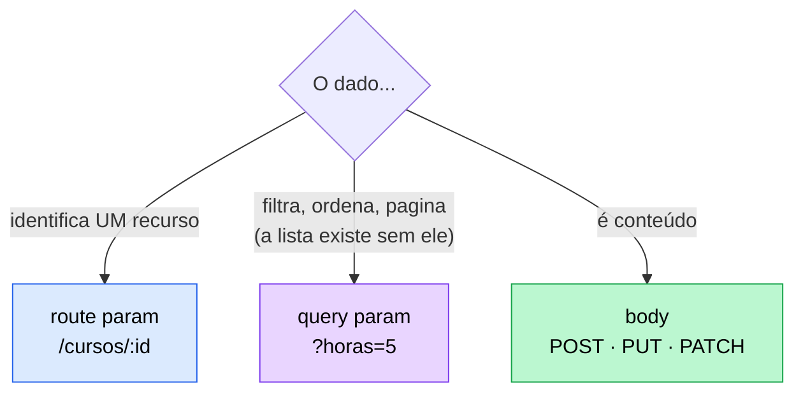

# 03 — Express básico

**Em uma frase:** o Express é uma camada fina sobre o `node:http` que resolve
roteamento, leitura de body e escrita de resposta — o trabalho manual do
[módulo 01](./01-fundamentos-http.md).

<!-- @import "[TOC]" {cmd="toc" depthFrom=2 depthTo=3 orderedList=false} -->

## Por que importa

- É o framework mais usado do ecossistema Node; entender ele é entender os outros.
- Escolher entre route param, query param e body **é** desenhar a API.
- 90% do código de rota que você vai escrever na vida cabe nas 6 rotas deste módulo.

## Conceitos

### O que o framework resolve

| No `node:http` (módulo 01)                 | No Express                     |
| ------------------------------------------ | ------------------------------ |
| `if (metodo === 'GET' && caminho === ...)` | `app.get('/cursos', ...)`      |
| Quebrar `/cursos/7` na mão pra pegar o id  | `'/cursos/:id'` + `req.params` |
| Parsear a query string                     | `req.query`                    |
| Juntar os chunks do body + `JSON.parse`    | `app.use(express.json())`      |
| `writeHead` + `JSON.stringify` + `end`     | `res.json(...)`                |
| 404 escrito à mão no fim                   | automático                     |

> [!NOTE]
> O Express **não** substitui o HTTP. `req` e `res` continuam sendo os objetos do
> `node:http`, só com métodos a mais. `res.json(x)` termina em `res.end(...)`.

**O princípio:** um framework web não inventa capacidade nova — ele **remove
trabalho repetitivo e padroniza a decisão**. Toda linha da coluna da esquerda
você conseguiria escrever; o problema é que cada pessoa escreveria diferente, e a
sexta rota já não pareceria com a primeira.

E o que ele cobra em troca, para você saber que existe escolha:

| Custo                              | O que significa na prática                                          |
| ---------------------------------- | ------------------------------------------------------------------- |
| Uma abstração para aprender        | Middleware, `next()`, ordem de registro — coisas que o HTTP não tem |
| Comportamento implícito            | `express.json()` decide pelo `Content-Type` sem você ver            |
| Dependência                        | Versão nova quebra coisa (Express 5 mudou `req.query` e `req.body`) |
| Perde-se contato com o baixo nível | Fica mais difícil saber por que algo é lento ou não fecha a conexão |

O acordo compensa na esmagadora maioria dos casos — mas ele **é** um acordo. É
por isso que o módulo 01 veio primeiro: sem escrever o servidor cru uma vez, o
Express parece mágica em vez de conveniência.

### As três peças

```ts
import express from 'express';

const app = express(); // 1. a aplicação
app.use(express.json()); // 2. middlewares (módulo 05)
app.get('/rota', (req, res) => res.json({})); // 3. rotas
app.listen(5051);
```



### Os três tipos de parâmetro — a decisão central

| Tipo            | Onde vem          | Acessa por   | Obrigatório? | Para quê                     |
| --------------- | ----------------- | ------------ | ------------ | ---------------------------- |
| **Route param** | `/cursos/:id`     | `req.params` | Sim          | Identificar **um** recurso   |
| **Query param** | `/cursos?horas=5` | `req.query`  | Não          | Filtro, ordenação, paginação |
| **Body**        | corpo JSON        | `req.body`   | Sim (criar)  | Dados de criação/edição      |



**O princípio que decide os três:** cada posição carrega um tipo diferente de
informação, e a posição é parte do contrato.

| Posição         | Responde a pergunta  | Some da URL e...                          |
| --------------- | -------------------- | ----------------------------------------- |
| **Route param** | _qual_ recurso?      | a URL deixa de apontar para algo          |
| **Query param** | _como_ eu quero ver? | a URL continua válida, com a visão padrão |
| **Body**        | _com que conteúdo_?  | não há o que criar ou alterar             |

O teste prático: **tire o parâmetro e veja se a URL ainda faz sentido.**
`/livros` sem `?ano=1937` continua sendo uma lista; `/livros/` sem o `:id` não é
nada. Por isso filtro nunca vira segmento de caminho (`/livros/ano/1937` é o erro
clássico) e identificador nunca vira query (`/livro?id=7`).

Duas consequências que não são estéticas:

- **Cacheabilidade.** Proxies e navegadores usam a URL inteira como chave.
  Identificador no corpo torna a resposta incachável.
- **Log e métrica.** `/livros/:id` agrupa 10 mil requisições numa linha de
  métrica; `?id=7` explode em 10 mil rótulos distintos.

> [!IMPORTANT]
> Tudo que vem da URL é **string**. `?horas=5` chega como `"5"`, e `?horas=5&horas=9`
> chega como `["5","9"]` — um array onde seu código espera texto. Converter e
> validar é sua responsabilidade, sempre. É a primeira aparição da regra que o
> [módulo 07](./07-validacao-zod.md) transforma em disciplina: **nunca confie na
> forma do que chega de fora.**

### `express.json()`

```ts
app.use(express.json()); // sem isto, req.body é undefined em TODA rota
```

> [!WARNING]
> Ele só age quando o cliente manda `Content-Type: application/json`. Sem esse
> header, o Express 5 deixa `req.body` como **`undefined`** (o Express 4 deixava
> `{}`) — daí `const { x } = req.body` explodir com `TypeError` e virar um 500
> num erro que era do cliente.

### Escrevendo a resposta

```ts
res.json(objeto); // serializa + Content-Type: application/json + encerra
res.status(201).json(x); // encadeia: status primeiro, corpo depois
res.status(204).send(); // sem corpo
res.status(201).location('/cursos/4').json(x); // header extra
res.send('texto'); // Content-Type deduzido (text/html aqui)
```

> [!CAUTION]
> Cada requisição recebe **uma** resposta. Responder duas vezes dá
> `ERR_HTTP_HEADERS_SENT` — daí o `return` antes de todo `res.status(4xx)`.

**Por que é assim:** headers vão na frente do corpo, no fio. Depois que o
primeiro byte do corpo saiu, mudar o status é fisicamente impossível — o cliente
já leu `200`. `res.headersSent` é o jeito de perguntar se ainda dá tempo, e é a
razão de o tratador de erro do [módulo 06](./06-tratamento-de-erros.md) precisar
checá-lo.

### PUT vs PATCH na prática

```ts
// PUT substitui o recurso inteiro: campo que não vier é campo PERDIDO.
// Por isso PUT exige o objeto completo.
app.put('/cursos/:id', ...);

// PATCH altera só o que veio. `undefined` significa "não mandou".
if (titulo !== undefined) curso.titulo = titulo;
```

A diferença não é de gosto — ela vem de uma propriedade do método:

| Método    | Idempotente?       | Significa                                                          |
| --------- | ------------------ | ------------------------------------------------------------------ |
| **PUT**   | **sim**            | mandar 3× é igual a mandar 1× — o estado final é o que você enviou |
| **PATCH** | **não** (em geral) | depende do estado atual; `{"horas": +1}` acumula                   |
| **POST**  | não                | 3× cria 3 recursos                                                 |

Isso importa em produção: cliente com timeout **repete** a requisição. Se o
método é idempotente, repetir é seguro; se não é, você precisa de chave de
idempotência para não criar o pedido duas vezes.

> [!WARNING]
> O erro clássico do PATCH é aplicar um objeto com `undefined` dentro:
> `{ ...atual, ...enviado }` **apaga** o campo salvo quando `enviado.titulo` é
> `undefined`. É o mesmo bug que reaparece no
> [módulo 08](./08-arquitetura-em-camadas.md) com `exactOptionalPropertyTypes` e
> no [módulo 07](./07-validacao-zod.md) com `.partial()`. Copiar campo a campo,
> checando `!== undefined`, é o que resolve.

## Na prática

```bash
node src/exemplos/03-express-basico/crud-cursos.ts
```

```bash {cmd=true}
B=localhost:5051
curl $B/cursos                          # lista
curl "$B/cursos?titulo=http&maxHoras=5" # query params combinados
curl $B/cursos/2                        # route param
curl -i $B/cursos/99                    # 404

curl -i -X POST $B/cursos -H 'Content-Type: application/json' \
  -d '{"titulo":"Prisma","horas":5}'    # 201 + header Location

curl -X POST $B/cursos -H 'Content-Type: application/json' -d '{"horas":5}'
                                        # 400: titulo obrigatório
curl -i -X POST $B/cursos -d 'titulo=x' # 400: faltou o Content-Type

curl -X PATCH $B/cursos/1 -H 'Content-Type: application/json' -d '{"horas":3}'
curl -i -X DELETE $B/cursos/1           # 204, sem corpo
```

Repare em [`crud-cursos.ts`](../src/exemplos/03-express-basico/crud-cursos.ts)
como a validação está **espalhada dentro de cada rota**. Funciona, mas repete e
cresce mal — é a dor que o [módulo 07](./07-validacao-zod.md) resolve com Zod.
Do mesmo jeito, o arquivo único vira vários no [módulo 04](./04-roteamento.md).

## Erros comuns

| Erro                              | O que acontece                      | Correção                      |
| --------------------------------- | ----------------------------------- | ----------------------------- |
| Esquecer `express.json()`         | `req.body` é `undefined`            | `app.use(express.json())`     |
| Cliente sem `Content-Type`        | Body ignorado → `TypeError` → 500   | Exigir o header; usar `?? {}` |
| `req.params.id === 1`             | Nunca é true: `"1" !== 1`           | `Number(req.params.id)`       |
| Sem `return` antes do 404         | Responde duas vezes                 | `return res.status(404)...`   |
| Usar body em `GET`                | Vários clientes e proxies descartam | Query param                   |
| `res.json()` em `204`             | Contradiz o próprio status          | `res.status(204).send()`      |
| Verbo na URL (`POST /criarCurso`) | O método já é o verbo               | `POST /cursos`                |
| Confiar no `req.body`             | É `any`: aceita qualquer coisa      | Validar (módulo 07)           |

## Cheatsheet

```ts
app.get(caminho, handler);    app.post(...);   app.put(...);
app.patch(...);               app.delete(...); app.all(...);

req.params.id     // '/cursos/:id'  → sempre string
req.query.pagina  // '?pagina=2'    → string | string[] | undefined
req.body          // precisa de express.json()
req.headers.authorization  // minúsculo, sempre
req.method        // 'GET'
req.path          // '/cursos/7'

res.json(x)            res.status(n)         res.send(x)
res.location(url)      res.set('X-Foo','1')  res.sendStatus(204)
```

| Operação         | Rota                 | Sucesso          |
| ---------------- | -------------------- | ---------------- |
| Listar           | `GET /cursos`        | `200` + array    |
| Buscar um        | `GET /cursos/:id`    | `200` / `404`    |
| Criar            | `POST /cursos`       | `201` + Location |
| Substituir       | `PUT /cursos/:id`    | `200`            |
| Alterar em parte | `PATCH /cursos/:id`  | `200`            |
| Remover          | `DELETE /cursos/:id` | `204`            |

## Os princípios deste módulo

| Princípio                                                                                                       | Onde reaparece               |
| --------------------------------------------------------------------------------------------------------------- | ---------------------------- |
| **Framework não dá capacidade nova; ele padroniza a decisão.**                                                  | 05 (middlewares), 10 (ORM)   |
| **A posição do dado é parte do contrato** — caminho identifica, query modifica a visão, corpo carrega conteúdo. | 04 (design de URL)           |
| **Nunca confie na forma do que chega de fora.**                                                                 | 07 (Zod), 09 (SQL injection) |
| **Idempotência decide se repetir é seguro.**                                                                    | 17 (jobs), 15 (retry)        |
| **`undefined` não é "apague isto".**                                                                            | 07, 08, 10                   |

## Pratique

👉 [`exercicios/03-express-basico/`](../exercicios/03-express-basico/) — aqui
começa a **API de biblioteca**, o projeto que cresce até o módulo 20.
