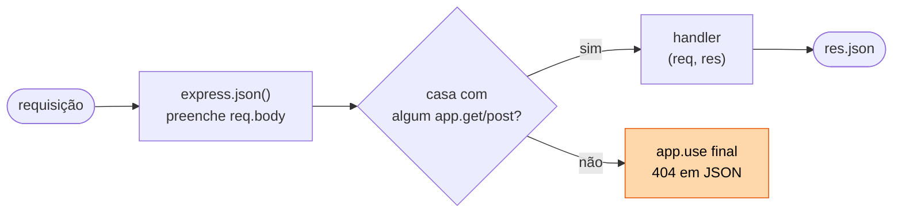
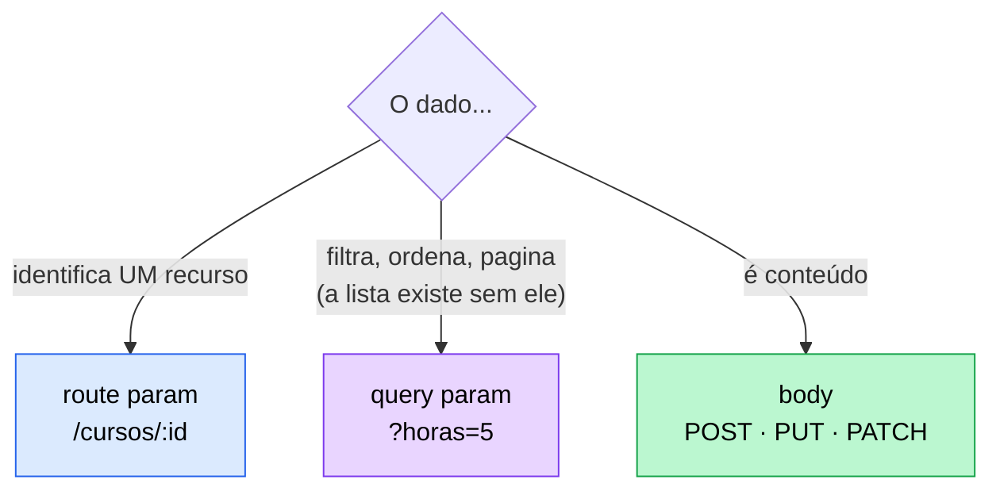

# 03 — Express básico

**Em uma frase:** o Express é uma camada fina sobre o `node:http` que resolve
roteamento, leitura de body e escrita de resposta — o trabalho manual do
[módulo 01](./01-fundamentos-http.md).

<!-- sumario:inicio -->

**Sumário**

- [Por que importa](#por-que-importa)
- [Conceitos](#conceitos)
  - [O menor servidor Express que existe](#o-menor-servidor-express-que-existe)
  - [O que o Express te poupou](#o-que-o-express-te-poupou)
  - [Os dois 404](#os-dois-404)
  - [Os três tipos de parâmetro — a decisão central](#os-três-tipos-de-parâmetro-a-decisão-central)
  - [400 ou 409? O erro do cliente tem dois sabores](#400-ou-409-o-erro-do-cliente-tem-dois-sabores)
  - [express.json()](#expressjson)
  - [Escrevendo a resposta](#escrevendo-a-resposta)
  - [PUT vs PATCH na prática](#put-vs-patch-na-prática)
- [Na prática](#na-prática)
- [Erros comuns](#erros-comuns)
- [Cheatsheet](#cheatsheet)
- [Os princípios deste módulo](#os-princípios-deste-módulo)
- [Para ir além](#para-ir-além)
- [Pratique](#pratique)

<!-- sumario:fim -->

## Por que importa

- É o framework mais usado do ecossistema Node; entender ele é entender os outros.
- Escolher entre route param, query param e body **é** desenhar a API.
- 90% do código de rota que você vai escrever na vida cabe nas 6 rotas deste módulo.

## Conceitos

### O menor servidor Express que existe

Comece por aqui. São quatro linhas, e elas rodam:

```ts
import express from 'express';

const app = express();
app.get('/cursos', (req, res) => res.json([{ id: 1, titulo: 'HTTP do zero' }]));
app.listen(5051);
```

Salve como `teste.ts`, rode `node teste.ts`, abra `localhost:5051/cursos` e você
tem uma API respondendo JSON.

Três coisas aconteceram aí, e vale nomear cada uma:

1. **`express()` cria a aplicação.** É um objeto que vai guardando o que você
   registra nele. Nada foi para a rede ainda.
2. **`app.get(caminho, função)` registra uma rota.** Ele está dizendo "quando
   chegar um `GET` em `/cursos`, chame esta função". A função também não rodou
   ainda — ficou guardada, esperando.
3. **`app.listen(porta)` abre a porta.** Só agora o servidor existe de verdade e
   passa a aceitar conexões.

Essa função que você registrou é o **handler**: quem de fato responde àquela
rota. Ela recebe dois objetos, `req` (o que chegou) e `res` (como responder), e
eles são os mesmos objetos do módulo 01 — o Express só pendurou métodos a mais
neles. `res.json(x)` termina chamando o `res.end(...)` que você escreveu na mão
lá atrás.

Agora dá para acrescentar a segunda peça, a que faz o corpo da requisição chegar
até você:

```ts
app.use(express.json()); // vem ANTES das rotas
```

Sem essa linha, `req.body` é `undefined` em toda rota. O que ela faz por dentro
— e por que a posição importa tanto — é o assunto do
[módulo 05](./05-middlewares.md); por ora, basta saber que ela precisa ser
registrada antes das rotas que leem o corpo.



### O que o Express te poupou

Volte ao [módulo 01](./01-fundamentos-http.md) e compare com o servidor cru. É a
mesma funcionalidade, linha por linha:

| No `node:http` (módulo 01)                 | No Express                     |
| ------------------------------------------ | ------------------------------ |
| `if (metodo === 'GET' && caminho === ...)` | `app.get('/cursos', ...)`      |
| Quebrar `/cursos/7` na mão pra pegar o id  | `'/cursos/:id'` + `req.params` |
| Parsear a query string                     | `req.query`                    |
| Juntar os chunks do body + `JSON.parse`    | `app.use(express.json())`      |
| `writeHead` + `JSON.stringify` + `end`     | `res.json(...)`                |
| 404 escrito à mão no fim                   | automático — **mas em HTML**   |

Repare no que **não** está nessa tabela: nenhuma capacidade nova. Tudo na coluna
da esquerda você já conseguia fazer, e fez, no módulo 01. O Express não te deu
poder que você não tinha.

O que ele te deu foi outra coisa: **um jeito único de escrever cada uma dessas
linhas.** Você conseguiria escrever seu próprio roteador — o problema é que cada
pessoa escreveria o dela diferente, e na sexta rota o seu código já não pareceria
com o da primeira. O framework padroniza a decisão para que ela pare de ser uma
decisão.

E isso tem preço. Vale saber qual, porque é o que te permite escolher não usar:

| Custo                    | O que significa na prática                                                        |
| ------------------------ | --------------------------------------------------------------------------------- |
| Uma abstração a aprender | Middleware, `next()`, ordem de registro — conceitos que o HTTP não tem            |
| Comportamento implícito  | `express.json()` decide pelo `Content-Type` sozinho, e você não vê isso acontecer |
| Dependência de terceiro  | Versão nova quebra coisa: o Express 5 mudou `req.query` e `req.body`              |
| Distância do baixo nível | Fica mais difícil descobrir por que algo é lento ou por que a conexão não fecha   |

O acordo compensa na esmagadora maioria dos casos — mas ele **é** um acordo, e é
por isso que o módulo 01 veio primeiro. Sem ter escrito o servidor cru uma vez, o
Express parece mágica em vez de conveniência.

### Os dois 404

Eles têm o mesmo número e causas diferentes — confundir os dois é o que faz uma
API responder HTML no meio de um cliente que só sabe ler JSON.

| Requisição         | O que falhou                       | Quem responde        |
| ------------------ | ---------------------------------- | -------------------- |
| `GET /cursos/99`   | a rota existe, o **recurso** não   | seu handler          |
| `GET /disciplinas` | nenhuma **rota** casou             | o `app.use` do final |
| `POST /cursos/1`   | o caminho existe, o **método** não | o `app.use` do final |

```ts
// SEMPRE por último: middleware sem caminho roda para toda requisição, então
// só é "404" porque nada acima já respondeu. No topo, derrubaria a API inteira.
app.use((req, res) => {
  res.status(404).json({ erro: `Rota ${req.method} ${req.originalUrl} não existe` });
});
```

Repare no que acontece se você **não** escrever esse handler: o Express tem um
404 próprio, e ele responde em **HTML**. O cliente do outro lado, que chamou
`await res.json()` porque a sua API é uma API JSON, estoura num erro de parse — e
a mensagem que ele mostra é "unexpected token `<`", não "rota não existe".

O erro de verdade sumiu, substituído por um erro de formato. Daí a regra: **uma
API responde no formato que prometeu, inclusive quando dá errado.**

> **Atenção:** O terceiro caso mereceria `405 Method Not Allowed` — o recurso existe, o verbo
> é que não. O Express não faz essa distinção sozinho, e o catch-all cobre os
> dois como 404. Resolver de verdade exige `app.all()` por rota, ou o
> `router` do [módulo 04](./04-roteamento.md).

### Os três tipos de parâmetro — a decisão central

| Tipo            | Onde vem          | Acessa por   | Obrigatório? | Para quê                     |
| --------------- | ----------------- | ------------ | ------------ | ---------------------------- |
| **Route param** | `/cursos/:id`     | `req.params` | Sim          | Identificar **um** recurso   |
| **Query param** | `/cursos?horas=5` | `req.query`  | Não          | Filtro, ordenação, paginação |
| **Body**        | corpo JSON        | `req.body`   | Sim (criar)  | Dados de criação/edição      |



Na hora de decidir onde um dado vai, existe um teste que resolve quase todos os
casos: **tire o parâmetro e veja se a URL ainda faz sentido.**

- `/livros` sem o `?ano=1937` continua sendo uma lista de livros. O filtro sumiu,
  a lista existe. Então `ano` é query param.
- `/livros/` sem o `:id` não é nada — não aponta para livro nenhum. Então o id é
  route param.

Fazendo esse teste em cada posição, dá para escrever o que cada uma significa:

| Posição         | Responde a pergunta  | Se você tirar da URL...                   |
| --------------- | -------------------- | ----------------------------------------- |
| **Route param** | _qual_ recurso?      | a URL deixa de apontar para algo          |
| **Query param** | _como_ eu quero ver? | a URL continua válida, com a visão padrão |
| **Body**        | _com que conteúdo_?  | não há o que criar ou alterar             |

**A ideia por trás disso:** a posição onde o dado viaja não é arrumação — ela
**diz o que o dado é**. Quem lê a URL entende o papel de cada pedaço sem
documentação nenhuma. É por isso que filtro nunca vira segmento de caminho
(`/livros/ano/1937` é o erro clássico) e identificador nunca vira query
(`/livro?id=7`).

E as consequências não são estéticas:

- **Cacheabilidade.** Proxies e navegadores usam a URL inteira como chave.
  Identificador no corpo torna a resposta incachável.
- **Log e métrica.** `/livros/:id` agrupa 10 mil requisições numa linha de
  métrica; `?id=7` explode em 10 mil rótulos distintos.
- **Segredo nunca vai na URL.** A query entra no log de acesso, no histórico do
  navegador e no header `Referer` enviado a terceiros. Senha e token vão no corpo
  ou no header `Authorization` — que não é logado. Volta no
  [módulo 14](./14-observabilidade.md).

> **Importante:** Tudo que vem da URL é **string**. `?horas=5` chega como `"5"`, e `?horas=5&horas=9`
> chega como `["5","9"]` — um array onde seu código espera texto. Converter e
> validar é sua responsabilidade, sempre. É a primeira aparição da regra que o
> [módulo 07](./07-validacao-zod.md) transforma em disciplina: **nunca confie na
> forma do que chega de fora.**

E `Number()` **não** é validador — ele é bem mais permissivo do que parece:

| Entrada          | `Number(x)` | Consequência se você confiar             |
| ---------------- | ----------- | ---------------------------------------- |
| `'abc'`          | `NaN`       | ok, dá pra detectar                      |
| `''` (`?horas=`) | **`0`**     | filtra por `<= 0` e devolve lista vazia  |
| `' 10 '`         | `10`        | espaço em branco passa despercebido      |
| `'1e3'`          | `1000`      | notação científica aceita                |
| `'Infinity'`     | `Infinity`  | passa em `!isNaN`, quebra a conta depois |
| `['5','9']`      | `NaN`       | query repetida vira array                |

Por isso o exemplo usa `Number.isFinite` (barra `NaN` **e** `Infinity`) depois de
checar que a string não está vazia. `isNaN` sozinho deixa `Infinity` entrar.

**Ausente e inválido são coisas diferentes.** Query param é opcional: não veio =
sem filtro. Mas veio errado é **erro do cliente** — ignorar em silêncio devolve
200 com a lista inteira, e quem pediu o filtro acha que ele funcionou. O bug pior
não é o que estoura; é o que parece resposta legítima.

### 400 ou 409? O erro do cliente tem dois sabores

O exemplo recusa curso com título repetido. A escolha do status não é detalhe: é
o que diz ao cliente **se vale a pena tentar de novo**.

| Status              | Significa                                               | Reenviar igual resolve?            |
| ------------------- | ------------------------------------------------------- | ---------------------------------- |
| **400** Bad Request | o pedido está malformado (falta campo, tipo errado)     | Não — o pedido é que está errado   |
| **409** Conflict    | o pedido está correto, mas **briga com o estado atual** | Sim, se o estado mudar             |
| **404** Not Found   | o alvo não existe                                       | Sim, se o recurso passar a existir |

Pense do lado de quem recebe. Se você devolve `400` num conflito, está dizendo
"o seu pedido está malformado" — e a pessoa vai reler o JSON dela caçando um erro
de digitação que não existe. O corpo estava perfeito; o problema era que já
existia um curso com aquele título.

É por isso que **o status descreve o que aconteceu, e não o que seria mais
gentil dizer**. Ele é a instrução que diz ao cliente qual é o próximo passo dele.

```ts
// o pedido está errado → 400
if (typeof titulo !== 'string') return res.status(400).json({ erro: '...' });

// o pedido está certo, o mundo é que atrapalha → 409
if (cursos.some((c) => c.titulo === titulo)) return res.status(409).json({ erro: '...' });
```

### `express.json()`

```ts
app.use(express.json()); // sem isto, req.body é undefined em TODA rota
```

> **Atenção:** Ele só age quando o cliente manda `Content-Type: application/json`. Sem esse
> header, o Express 5 deixa `req.body` como **`undefined`** (o Express 4 deixava
> `{}`) — daí `const { x } = req.body` explodir com `TypeError` e virar um 500
> num erro que era do cliente.

### Escrevendo a resposta

```ts
res.json(objeto); // serializa + Content-Type: application/json + encerra
res.status(201).json(x); // encadeia: status primeiro, corpo depois
res.status(204).send(); // sem corpo
res.status(201).location('/cursos/4').json(x); // header extra
res.send('texto'); // Content-Type deduzido (text/html aqui)
```

> **Cuidado:** Cada requisição recebe **uma** resposta. Responder duas vezes dá
> `ERR_HTTP_HEADERS_SENT` — daí o `return` antes de todo `res.status(4xx)`.

**Por que é assim:** headers vão na frente do corpo, no fio. Depois que o
primeiro byte do corpo saiu, mudar o status é fisicamente impossível — o cliente
já leu `200`. `res.headersSent` é o jeito de perguntar se ainda dá tempo, e é a
razão de o tratador de erro do [módulo 06](./06-tratamento-de-erros.md) precisar
checá-lo.

### PUT vs PATCH na prática

```ts
// PUT substitui o recurso inteiro: campo que não vier é campo PERDIDO.
// Por isso PUT exige o objeto completo.
app.put('/cursos/:id', ...);

// PATCH altera só o que veio. `undefined` significa "não mandou".
if (titulo !== undefined) curso.titulo = titulo;
```

A diferença não é de gosto — ela vem de uma propriedade do método:

| Método    | Idempotente?       | Significa                                                          |
| --------- | ------------------ | ------------------------------------------------------------------ |
| **PUT**   | **sim**            | mandar 3× é igual a mandar 1× — o estado final é o que você enviou |
| **PATCH** | **não** (em geral) | depende do estado atual; `{"horas": +1}` acumula                   |
| **POST**  | não                | 3× cria 3 recursos                                                 |

Isso importa em produção: cliente com timeout **repete** a requisição. Se o
método é idempotente, repetir é seguro; se não é, você precisa de chave de
idempotência para não criar o pedido duas vezes.

> **Atenção:** O erro clássico do PATCH é aplicar um objeto com `undefined` dentro:
> `{ ...atual, ...enviado }` **apaga** o campo salvo quando `enviado.titulo` é
> `undefined`. É o mesmo bug que reaparece no
> [módulo 08](./08-arquitetura-em-camadas.md) com `exactOptionalPropertyTypes` e
> no [módulo 07](./07-validacao-zod.md) com `.partial()`. Copiar campo a campo,
> checando `!== undefined`, é o que resolve.

## Na prática

```bash
node src/exemplos/03-express-basico/crud-cursos.ts
```

```bash
B=localhost:5051
curl $B/cursos                          # lista
curl "$B/cursos?titulo=http&maxHoras=5" # query params combinados
curl $B/cursos/2                        # route param
curl -i $B/cursos/99                    # 404

curl -i -X POST $B/cursos -H 'Content-Type: application/json' \
  -d '{"titulo":"Prisma","horas":5}'    # 201 + header Location

curl -X POST $B/cursos -H 'Content-Type: application/json' -d '{"horas":5}'
                                        # 400: titulo obrigatório
curl -i -X POST $B/cursos -d 'titulo=x' # 400: faltou o Content-Type

curl -i -X POST $B/cursos -H 'Content-Type: application/json' \
  -d '{"titulo":"Prisma","horas":9}'    # 409: título repetido (rode 2x)

curl -X PATCH $B/cursos/1 -H 'Content-Type: application/json' -d '{"horas":3}'
curl -i -X DELETE $B/cursos/1           # 204, sem corpo
```

Os casos que separam uma API honesta de uma que mente:

```bash
curl -i "$B/cursos?maxHoras=abc"  # 400 — e não a lista inteira em silêncio
curl -i "$B/cursos?maxHoras="     # 400 — Number('') é 0, viraria lista vazia
curl -i "$B/cursos?maxHoras=0"    # 200 [] — zero é filtro legítimo, não erro
curl -i $B/disciplinas            # 404 em JSON (rota não existe)
curl -i -X POST $B/cursos/1       # 404 em JSON (método sem handler)
```

Repare em [`crud-cursos.ts`](../src/exemplos/03-express-basico/crud-cursos.ts)
como a validação está **espalhada dentro de cada rota**. Funciona, mas repete e
cresce mal — é a dor que o [módulo 07](./07-validacao-zod.md) resolve com Zod.
Do mesmo jeito, o arquivo único vira vários no [módulo 04](./04-roteamento.md).

## Erros comuns

| Erro                              | O que acontece                         | Correção                       |
| --------------------------------- | -------------------------------------- | ------------------------------ |
| Esquecer `express.json()`         | `req.body` é `undefined`               | `app.use(express.json())`      |
| Cliente sem `Content-Type`        | Body ignorado → `TypeError` → 500      | Exigir o header; usar `?? {}`  |
| `req.params.id === 1`             | Nunca é true: `"1" !== 1`              | `Number(req.params.id)`        |
| Sem `return` antes do 404         | Responde duas vezes                    | `return res.status(404)...`    |
| Usar body em `GET`                | Vários clientes e proxies descartam    | Query param                    |
| `res.json()` em `204`             | Contradiz o próprio status             | `res.status(204).send()`       |
| Verbo na URL (`POST /criarCurso`) | O método já é o verbo                  | `POST /cursos`                 |
| Confiar no `req.body`             | É `any`: aceita qualquer coisa         | Validar (módulo 07)            |
| Query inválida ignorada           | 200 com a lista toda; filtro "sumiu"   | `400` quando veio e é inválido |
| `Number('')` achando que dá `NaN` | É `0` → filtra por `<= 0`, lista vazia | Checar string vazia antes      |
| `isNaN` como validação            | `Infinity` passa                       | `Number.isFinite`              |
| Conflito devolvendo `400`         | Cliente procura erro que não existe    | `409` (estado, não sintaxe)    |
| Sem `app.use` 404 no fim          | Express responde 404 em **HTML**       | Catch-all JSON por último      |
| Catch-all 404 antes das rotas     | **Toda** requisição vira 404           | Registrar por último           |

## Cheatsheet

```ts
app.get(caminho, handler);    app.post(...);   app.put(...);
app.patch(...);               app.delete(...); app.all(...);

req.params.id     // '/cursos/:id'  → sempre string
req.query.pagina  // '?pagina=2'    → string | string[] | undefined
req.body          // precisa de express.json()
req.headers.authorization  // minúsculo, sempre
req.method        // 'GET'
req.path          // '/cursos/7'

res.json(x)            res.status(n)         res.send(x)
res.location(url)      res.set('X-Foo','1')  res.sendStatus(204)
```

| Operação         | Rota                 | Sucesso                               |
| ---------------- | -------------------- | ------------------------------------- |
| Listar           | `GET /cursos`        | `200` + array                         |
| Buscar um        | `GET /cursos/:id`    | `200` / `404`                         |
| Criar            | `POST /cursos`       | `201` + Location · `409` se duplicado |
| Substituir       | `PUT /cursos/:id`    | `200`                                 |
| Alterar em parte | `PATCH /cursos/:id`  | `200`                                 |
| Remover          | `DELETE /cursos/:id` | `204`                                 |

## Os princípios deste módulo

Recapitulando — cada linha é uma conclusão que o módulo mostrou acontecer:

| A ideia                                                                                                                             | Onde volta                   |
| ----------------------------------------------------------------------------------------------------------------------------------- | ---------------------------- |
| O framework não te dá poder novo; ele te dá um jeito único de escrever o que você já conseguia fazer.                               | 05 (middlewares), 10 (ORM)   |
| Onde o dado viaja diz o que ele é: caminho identifica, query modifica a visão, corpo carrega conteúdo.                              | 04 (design de URL)           |
| O que chega de fora pode ter qualquer forma. `?horas=5` vem como texto, e `?horas=5&horas=9` vem como lista.                        | 07 (Zod), 09 (SQL injection) |
| Se a API promete JSON, ela responde JSON também quando dá errado — senão o cliente estoura no `res.json()` e o erro real some.      | 06 (tratador global)         |
| O status conta o que aconteceu, não o que seria mais simpático: `400` é sintaxe, `409` é estado, `404` é ausência.                  | 06, 11 (401 × 403)           |
| "Não veio" e "veio errado" são coisas diferentes. Ignorar o segundo devolve 200 com a lista inteira e o filtro parece funcionar.    | 07 (`.optional()`)           |
| Se repetir a operação é seguro, o cliente pode tentar de novo sozinho depois de um timeout. Se não é, alguém vai cobrar duas vezes. | 17 (jobs), 15 (retry)        |
| `undefined` num objeto de atualização não quer dizer "apague este campo" — mas é assim que o spread trata.                          | 07, 08, 10                   |

## Para ir além

A documentação do Express é enxuta — leia a de rotas inteira, dá 15 minutos.

- **[Express — _Routing_ e _API Reference_](https://expressjs.com/en/guide/routing.html)**
  A referência de `req`/`res` responde o que este módulo resume. Confira sempre a versão **5**: `req.query` virou getter e `req.body` fica `undefined` sem `Content-Type`.
- **[Express — _Migrating to Express 5_](https://expressjs.com/en/guide/migrating-5.html)**
  A lista oficial do que mudou. Vale porque quase todo tutorial na internet ainda é Express 4 — este guia é o tradutor.
- **[Fielding — _Architectural Styles_, cap. 5 (REST)](https://ics.uci.edu/~fielding/pubs/dissertation/rest_arch_style.htm)**
  A tese que definiu REST. Leitura densa, mas o capítulo 5 mostra que REST é bem mais do que "URL bonita com JSON".

## Pratique

👉 [`exercicios/03-express-basico/`](../exercicios/03-express-basico/) — aqui
começa a **API de biblioteca**, o projeto que cresce até o módulo 20.
