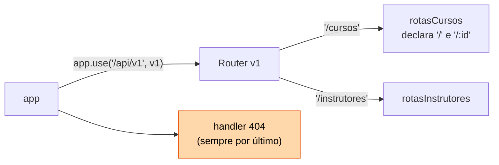
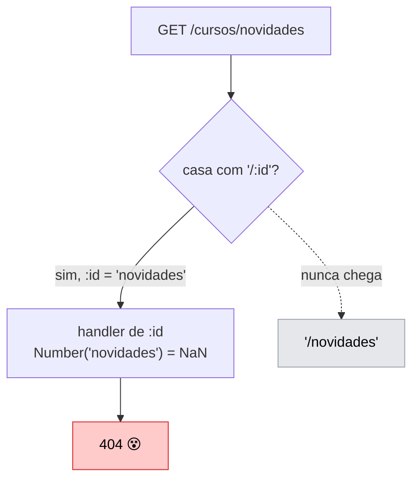

# 04 — Roteamento e organização de rotas

**Em uma frase:** `express.Router()` transforma um servidor de 500 linhas em
arquivos pequenos, cada um responsável por um recurso.

## Por que importa

- Um arquivo por recurso é a diferença entre achar e caçar código.
- Ordem de rota é fonte de bug silencioso: a rota existe e devolve 404.
- URL bem desenhada dispensa documentação; URL ruim precisa de manual.

## Conceitos

### A dor: um arquivo que só cresce

No [módulo 03](./03-express-basico.md) tudo morava num arquivo. Com 6 rotas isso
é confortável. Agora imagine a mesma API com cursos, instrutores, aulas,
matrículas e certificados — umas 30 rotas:

```ts
// servidor.ts, 500 linhas
app.get('/cursos', ...);
app.get('/cursos/:id', ...);
app.post('/cursos', ...);
// ...mais 27, e para achar uma rota você usa Ctrl+F
```

Nada aí está errado. O problema é que o arquivo virou o lugar onde tudo mora, e
achar código passou a ser caçar código.

### `Router()`: um app pequeno dentro do app

A saída do Express é deixar você criar **outra** aplicação, menor, e encaixá-la
na principal. Chama-se `Router`:

```ts
// rotas/cursos.ts
export const rotasCursos = Router();

rotasCursos.get('/', listar);
rotasCursos.get('/:id', buscar);
```

Olhe bem para esses dois caminhos. Eles são `'/'` e `'/:id'` — **não**
`'/cursos'` e `'/cursos/:id'`. O arquivo que trata de cursos não escreve a
palavra "cursos" em lugar nenhum.

Quem escreve é o outro lado, na hora de encaixar:

```ts
// servidor.ts
app.use('/api/v1/cursos', rotasCursos); // ← o prefixo mora AQUI
```

O Express junta os dois: prefixo do `app.use` + caminho de dentro do router. Daí
`'/api/v1/cursos'` + `'/:id'` virar `GET /api/v1/cursos/7`.

Um `Router` tem `.get`, `.post`, `.use`, `.param` — tudo que o `app` tem, menos o
`listen`. Ele não abre porta nenhuma; quem abre é o app principal.

**E o que essa separação te dá:** como o router não sabe onde está montado, ele
pode ser montado em qualquer lugar. Isso não é elegância abstrata — são quatro
coisas concretas:

| O que dá para fazer           | Porque o router não conhece o próprio endereço                     |
| ----------------------------- | ------------------------------------------------------------------ |
| Mudar o prefixo               | `/api/v2/cursos` sem editar uma linha do arquivo de cursos         |
| Montar o mesmo router 2×      | a mesma rota em `/api` e em `/interno`, com middlewares diferentes |
| Testar isolado                | montar só aquele router num app mínimo (módulo 12)                 |
| Ler a API inteira num arquivo | o `servidor.ts` vira o mapa; nenhum recurso fica escondido         |

E o sintoma de ter estragado isso é fácil de reconhecer: um router que escreve o
caminho completo (`rotasCursos.get('/cursos/:id')`). Ele volta a só funcionar num
lugar, e o prefixo passa a estar repetido em N arquivos — que é exatamente o que
você estava tentando evitar.

Essa ideia — **a peça declara o que faz, e outro lugar decide onde ela vive** —
volta no [módulo 08](./08-arquitetura-em-camadas.md), quando o service receber o
repositório de fora em vez de criá-lo, e no [módulo 12](./12-testes.md), quando o
app inteiro virar uma função para poder ser montado dentro de um teste.

### Como isso fica montado



Cada seta é um `app.use(prefixo, router)`. O caminho final de uma rota é a soma
do que está escrito nas setas até chegar nela.

### Ordem importa (o bug clássico)

```ts
router.get('/:id', ...);         // ← casa com QUALQUER coisa, inclusive 'novidades'
router.get('/novidades', ...);   // ← nunca alcançada
```

O Express testa de cima para baixo e **para na primeira que casa**.



> **Importante:**
> **Caminho literal antes de caminho com parâmetro.** O sintoma é cruel: você
> recebe 404 numa rota que existe e está certa.

Uma pergunta justa aqui é: por que o Express não conserta isso sozinho? Ele
teria como — bastaria testar as rotas mais específicas primeiro, ordenando por
conta própria. Outros frameworks fazem exatamente isso.

A escolha do Express foi a oposta, e ela é deliberada: **a ordem em que você
escreve é a ordem em que ele testa**, sem nenhuma reorganização por baixo. O que
está no arquivo é o que acontece.

Isso te custa este bug, e te dá em troca a capacidade de ler o arquivo e simular
na cabeça o que vai acontecer. Num sistema que reordena, quando duas rotas
conflitam, você precisa conhecer a regra de desempate para saber qual ganhou —
e o arquivo deixa de contar a verdade. (Se quiser a comparação com quem faz
diferente, está em [Se quiser ir mais fundo](#se-quiser-ir-mais-fundo).)

> **Dica:**
> A regra vale para `app.use` também, e lá machuca mais: `app.use('/livros', x)`
> casa por **prefixo**, então ele intercepta `/livros/1`, `/livros/qualquer-coisa`
> e tudo abaixo. Sub-router montado antes das rotas irmãs come todas elas.

### Padrões de caminho — Express 5 mudou

| Quero              | Express 5          | Express 4 (não funciona mais) |
| ------------------ | ------------------ | ----------------------------- |
| Parâmetro          | `/cursos/:id`      | igual                         |
| Parâmetro opcional | `/rel{/:formato}`  | `/rel/:formato?`              |
| Pegar o resto      | `/arq/*resto`      | `/arq/*` + `req.params[0]`    |
| Regex              | use `pathToRegexp` | `/:id(\\d+)`                  |

> **Atenção:**
> Duas pegadinhas do 5: `*` **precisa** de nome, e `req.params.resto` vem como
> **array** de segmentos (`['a','b','c.pdf']`), não string.

### `router.param` — o 404 escrito uma vez

Em vez de repetir "busca ou 404" em cinco handlers:

```ts
router.param('id', (req, res, next, valor) => {
  const curso = cursos.find((c) => c.id === Number(valor));
  if (!curso) return res.status(404).json({ erro: 'não encontrado' });
  res.locals.curso = curso; // passa adiante nesta requisição
  next(); // sem isto a requisição congela
});

router.get('/:id', (_req, res) => res.json(res.locals.curso));
```

`res.locals` é o lugar oficial para carregar dados entre middlewares da mesma
requisição. Ele morre quando a resposta é enviada — o assunto de verdade é o
[módulo 05](./05-middlewares.md).

### Routers aninhados, e a armadilha do `:id` que some

Um router pode ser montado dentro de outro. É como você escreve
`/cursos/3/aulas` sem repetir "cursos" no arquivo de aulas:

```ts
const rotasAulas = Router();
rotasCursos.use('/:id/aulas', rotasAulas);
```

Aqui vem a pegadinha. Dentro de `rotasAulas`, quanto vale `req.params.id`?

A resposta natural seria `'3'` — afinal o `:id` está ali no caminho de montagem.
Mas o valor é **`undefined`**, e o motivo é que cada `Router` nasce com o próprio
`req.params`, isolado. Ele enxerga só os parâmetros que ele mesmo declarou, e
`rotasAulas` declarou `'/'` — nenhum parâmetro.

Isso é padrão de propósito: um router é montável em qualquer lugar, então ele não
pode assumir nada sobre quem o montou. Quando você **quer** herdar, pede:

```ts
const rotasAulas = Router({ mergeParams: true }); // ← agora req.params.id chega
rotasCursos.use('/:id/aulas', rotasAulas);
```

> **Nota:**
> Falta um detalhe de TypeScript. O tipo de `req.params` é deduzido do caminho
> que o router declara — e `'/'` não tem parâmetro nenhum, então o TS insiste que
> `req.params.id` não existe, mesmo com o `mergeParams` ligado em runtime. Você
> informa o tipo na mão:
>
> ```ts
> rotasAulas.get<{ id: string }>('/', (req, res) => {
>   req.params.id; // agora o TS sabe
> });
> ```

**Aninhe quando a relação é de dependência real** — uma aula não existe fora de
um curso. Para "os cursos do instrutor 2", tanto `/instrutores/2/cursos` quanto
`/cursos?instrutorId=2` são defensáveis; o filtro ganha quando você quer combinar
vários critérios.

Aninhamento de três níveis (`/a/1/b/2/c/3`) é sinal de que você está modelando o
banco na URL. Pare no segundo.

### 404 no fim

```ts
app.use((req, res) => {
  res.status(404).json({ erro: `Rota não encontrada: ${req.method} ${req.path}` });
});
```

> **Cuidado:**
> `app.use` sem caminho casa com tudo. **No topo do arquivo, tudo virava 404.**

---

Até aqui era mecânica: como o Express encontra a rota, e como você organiza os
arquivos. O que vem agora é **decisão de design** — nada disso é necessário para
fazer o roteamento funcionar, e tudo isso decide se a sua API é agradável de
usar daqui a um ano.

### Design de URL: nomeie coisas, não ações

Comece pelo erro mais comum, que é escrever a ação no caminho:

```text
GET  /getCursos          POST /cursos/criar        GET /apagarCurso/7
```

O problema é que a ação já está dita. `GET` **é** "buscar"; `POST` **é** "criar".
Escrever de novo no caminho é repetir a mesma informação em dois lugares — e dois
lugares podem discordar. `POST /cursos/deletar` é uma frase que se contradiz.

A alternativa é a URL nomear **coisas**, e o método dizer o que fazer com elas:

| Faça                    | Não faça                      | Por quê                            |
| ----------------------- | ----------------------------- | ---------------------------------- |
| `GET /cursos`           | `GET /getCursos`              | O método HTTP já é o verbo         |
| `POST /cursos`          | `POST /cursos/criar`          | idem                               |
| `/cursos` (plural)      | `/curso`                      | Coleção é plural; seja consistente |
| `/cursos/7`             | `/cursos?id=7`                | Query é filtro, não identidade     |
| `/instrutores/2/cursos` | `/cursosDoInstrutor/2`        | Hierarquia com barra               |
| `?ordenar=ano&pagina=2` | `/cursosOrdenadosPorAno`      | Variação vai na query              |
| `/cursos-online`        | `/cursosOnline`, `/cursos_on` | kebab-case por convenção           |

O ganho não é estético, é **previsibilidade**. Quem aprendeu
`GET/POST/PATCH/DELETE /livros` já sabe usar `/autores` sem abrir documentação
nenhuma — são as mesmas quatro operações sobre outro substantivo.

Uma API de verbos não tem essa propriedade. `/getCursos`, `/listarCursosAtivos` e
`/buscarCursoPorId` são três nomes que você precisa descobrir um por um. E repare
no que acontece quando ela cresce: em vez de ganhar um parâmetro, ela ganha um
endpoint novo. `/listarCursosAtivosPorInstrutor` é o próximo.

> **Importante:**
> **A exceção honesta.** Nem toda operação é criar, ler, atualizar ou apagar.
> Emprestar um livro não é "substituir o livro". Para esses casos a convenção
> prática é um sub-recurso com `POST`: `POST /livros/7/emprestar`.
>
> Sim, tem um verbo no caminho. Ainda assim é melhor do que a alternativa, que
> seria o cliente mandar `PATCH { disponivel: false }` — porque aí **a regra de
> negócio mudou de lado**: quem passa a decidir o que "emprestar" significa é o
> cliente. Quando a regra ganhar "registrar quem pegou e quando devolve"
> (módulo 11), todo cliente vai precisar mudar junto.
>
> A pergunta que resolve o caso: **a ação tem regra própria?** Se tem, merece um
> endpoint. Se é só escrever um campo, é `PATCH`.

### Versionamento

```ts
const v1 = Router();
v1.use('/cursos', rotasCursos);
app.use('/api/v1', v1);
```

Versão no caminho é a opção simples: aparece no log, dá para testar no navegador,
qualquer um entende. A alternativa considerada "mais correta" é pedir a versão
por header (`Accept: application/vnd.api.v2+json`) — e é bem mais chata de
depurar, porque a URL sozinha deixa de dizer o que você está chamando.

Antes de criar uma v2, vale perguntar por que ela existiria. **Versionar é
assumir que você não controla quem consome a sua API.** Se controlasse — front e
back no mesmo deploy — bastava mudar os dois juntos, e versão nenhuma seria
necessária. A v2 existe porque alguém do outro lado atualiza no ritmo dele.

E aí vem a conta que costuma ser subestimada: **cada versão viva é uma versão
para manter.** Duas versões dobram o trabalho de todo bug corrigido e de todo
teste escrito, para sempre, ou até você conseguir desligar a antiga.

Por isso vale esgotar as opções baratas primeiro:

| Estratégia                   | Custo                                     |
| ---------------------------- | ----------------------------------------- |
| Adicionar campo **opcional** | zero — clientes antigos ignoram           |
| Adicionar endpoint novo      | zero                                      |
| Depreciar com aviso e prazo  | baixo — header `Deprecation`, log, e-mail |
| Criar `/v2`                  | **alto** — duas bases para manter         |

Só suba a versão quando a mudança for **incompatível**. E vale saber o que conta
como incompatível, porque nem tudo é óbvio: remover ou renomear um campo, mudar
o tipo dele (`"7"` virar `7`), mudar o status code de uma resposta, tornar
obrigatório um campo que era opcional — e mudar a **ordem** de uma lista que
alguém do outro lado assumia estável.

## Na prática

```bash
node src/exemplos/04-roteamento/servidor.ts
```

```bash
B=localhost:5052
curl $B/api/v1                        # índice de recursos
curl $B/api/v1/cursos
curl $B/api/v1/cursos/novidades       # literal antes de :id — funciona
curl $B/api/v1/cursos/1/aulas         # router aninhado com mergeParams
curl $B/api/v1/instrutores/1/cursos
curl $B/relatorio ; curl $B/relatorio/csv   # parâmetro opcional
curl $B/arquivos/a/b/c.pdf            # wildcard → array de segmentos
curl -i $B/nada                       # o 404 do fim
```

São as mesmas rotas do [módulo 03](./03-express-basico.md) — mas o
[`servidor.ts`](../src/exemplos/04-roteamento/servidor.ts) não sabe mais o que é
um curso. Ele só decide onde cada grupo mora.

## Erros comuns

| Erro                              | O que acontece                   | Correção                        |
| --------------------------------- | -------------------------------- | ------------------------------- |
| `/:id` antes de `/novidades`      | 404 numa rota que existe         | Literal antes de parâmetro      |
| 404 genérico no topo              | Toda requisição vira 404         | Sempre por último               |
| `/cursos/:id` dentro do router    | Vira `/cursos/cursos/:id`        | Caminho relativo: `/:id`        |
| Aninhar sem `mergeParams`         | `req.params` do pai vem vazio    | `Router({ mergeParams: true })` |
| `/:formato?` no Express 5         | Erro ao iniciar o servidor       | `{/:formato}`                   |
| `*` sem nome no Express 5         | Erro ao iniciar                  | `*resto`                        |
| Tratar `params.resto` como string | `.split()` falha: é array        | `.join('/')`                    |
| Esquecer `next()` no `param`      | Requisição congela até timeout   | Sempre `next()` ou responder    |
| Uma v2 por campo novo             | Duas APIs para manter sem motivo | Só em mudança incompatível      |

## Cheatsheet

```ts
const r = Router(); // mini-app
const r = Router({ mergeParams: true }); // herda params do pai
app.use('/prefixo', r); // monta
r.param('id', handler); // roda antes de toda rota com :id
r.route('/:id').get(a).put(b); // agrupa métodos do mesmo caminho

('/cursos/:id'); // parâmetro
('/rel{/:formato}'); // opcional (Express 5)
('/arq/*resto'); // resto → array
app.use(handler404); // por último, sem caminho
```

```
Ordem de declaração = ordem de teste. Literal antes de parâmetro. 404 no fim.
```

## Os princípios deste módulo

Recapitulando — cada linha é uma conclusão que o módulo mostrou acontecer:

| A ideia                                                                                                                     | Onde volta   |
| --------------------------------------------------------------------------------------------------------------------------- | ------------ |
| A peça declara o que faz; quem decide onde ela vive é outro lugar. O router não escreve o próprio prefixo.                  | 08, 12       |
| A ordem em que você escreve as rotas é a ordem em que o Express testa. Não existe reordenação por baixo dos panos.          | 05, 11       |
| A URL nomeia as coisas; o método diz o que fazer com elas. Escrever a ação nos dois lugares deixa os dois discordarem.      | 20 (OpenAPI) |
| Se a ação tem regra própria, ela merece um endpoint. Se é só escrever um campo, é `PATCH` — senão a regra vaza pro cliente. | 08, 11       |
| Criar uma v2 é assumir a conta de manter duas APIs para sempre. Só vale quando a mudança realmente quebra quem já usa.      | 16           |

## Se quiser ir mais fundo

### Frameworks que reordenam as rotas por você

O Express testa as rotas na ordem em que você escreveu. Outros frameworks fazem
o contrário: olham todas as rotas e testam as mais específicas primeiro. É o caso
do roteamento por arquivo do Next.js, do SvelteKit e do Remix, onde
`cursos/novidades` sempre ganha de `cursos/[id]`, esteja onde estiver.

| Modelo                              | Ganha                                       | Perde                                                             |
| ----------------------------------- | ------------------------------------------- | ----------------------------------------------------------------- |
| Ordem declarada (Express)           | previsível; dá para ler o arquivo e simular | pega quem não conhece a regra                                     |
| Especificidade automática (Next.js) | "funciona" sem você pensar na ordem         | quando duas rotas conflitam, é preciso saber a regra de desempate |

Vale reparar que a escolha do Express não é só teimosia. Middleware **depende de
ordem de qualquer jeito** — autenticar tem que rodar antes do handler, não
adianta ser mais específico. Um sistema que reordenasse rotas mas não middlewares
teria duas regras diferentes convivendo, o que é pior que qualquer uma das duas
sozinha.

## Para ir além

- **[Express — _Router_](https://expressjs.com/en/5x/api.html#router)**
  A API completa de `Router`, incluindo `router.param()` e roteadores aninhados.
- **[Zalando — _RESTful API Guidelines_](https://opensource.zalando.com/restful-api-guidelines/)**
  Guia de estilo de API usado em produção por uma empresa grande. Boa régua para nomear recurso, versionar e paginar sem inventar padrão próprio.
- **[Microsoft — _API Design Best Practices_](https://learn.microsoft.com/en-us/azure/architecture/best-practices/api-design)**
  Cobre versionamento e evolução de API com exemplos de trade-off.

## Pratique

👉 [`exercicios/04-roteamento/`](../exercicios/04-roteamento/)
