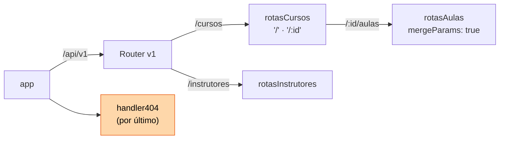
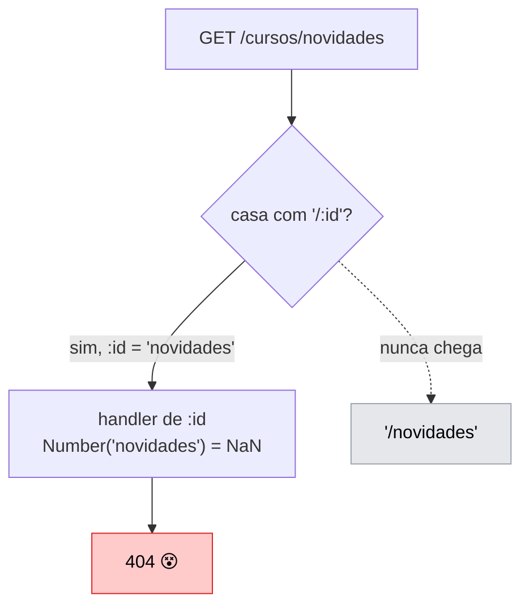

# 04 — Roteamento e organização de rotas

**Em uma frase:** `express.Router()` transforma um servidor de 500 linhas em
arquivos pequenos, cada um responsável por um recurso.

## Por que importa

- Um arquivo por recurso é a diferença entre achar e caçar código.
- Ordem de rota é fonte de bug silencioso: a rota existe e devolve 404.
- URL bem desenhada dispensa documentação; URL ruim precisa de manual.

## Conceitos

### Router é um mini-app

```ts
// rotas/cursos.ts
export const rotasCursos = Router();
rotasCursos.get('/', listar); //  ← caminho relativo, sem '/cursos'
rotasCursos.get('/:id', buscar);

// servidor.ts
app.use('/api/v1/cursos', rotasCursos); // ← o prefixo mora aqui
```



> **Dica:**
> O router não conhece o próprio prefixo. Isso é de propósito: dá para remontar o
> mesmo router em `/api/v2/cursos` sem editar uma linha dele.

Um Router tem `.get`, `.post`, `.use`, `.param` — tudo que o `app` tem, menos
`listen`.

**O princípio:** **quem é montado não decide onde é montado.** É a mesma ideia da
injeção de dependência do [módulo 08](./08-arquitetura-em-camadas.md) e da
extração do `criarApp()` no [módulo 12](./12-testes.md): o componente declara o
que faz; **outro** lugar decide onde ele vive.

O que isso compra, na ordem em que você vai precisar:

| Ganho                         | Como aparece                                                       |
| ----------------------------- | ------------------------------------------------------------------ |
| Remontar em outro prefixo     | `/api/v2/cursos` sem tocar no router                               |
| Montar duas vezes             | a mesma rota em `/api` e em `/interno`, com middlewares diferentes |
| Testar isolado                | montar só aquele router num app mínimo (módulo 12)                 |
| Ler a API inteira num arquivo | `servidor.ts` vira o mapa; nenhum recurso se esconde               |

O sintoma de ter violado isso é o router que escreve o próprio caminho completo
(`rotasCursos.get('/cursos/:id')`): ele passa a só funcionar num lugar, e o
prefixo fica repetido em N arquivos.

### Ordem importa (o bug clássico)

```ts
router.get('/:id', ...);         // ← casa com QUALQUER coisa, inclusive 'novidades'
router.get('/novidades', ...);   // ← nunca alcançada
```

O Express testa de cima para baixo e **para na primeira que casa**.



> **Importante:**
> **Caminho literal antes de caminho com parâmetro.** O sintoma é cruel: você
> recebe 404 numa rota que existe e está certa.

**Por que o Express não resolve isso sozinho:** ele poderia ordenar as rotas da
mais específica para a mais genérica — alguns frameworks fazem (o roteamento por
arquivo do Next.js, por exemplo). O Express escolheu o contrário: **a ordem do
seu arquivo É a ordem de avaliação**, sem reordenação escondida.

| Modelo                    | Ganha                                       | Perde                                             |
| ------------------------- | ------------------------------------------- | ------------------------------------------------- |
| Ordem declarada (Express) | previsível; dá para ler e simular na cabeça | pega quem não sabe da regra                       |
| Especificidade automática | "funciona" sem pensar                       | difícil prever qual rota casou quando há conflito |

A troca vale porque **middleware depende de ordem de qualquer jeito** (módulo
05): autenticar tem que rodar antes do handler. Um sistema que reordena rotas mas
não middlewares seria pior que qualquer um dos dois puros.

> **Dica:**
> A regra vale para `app.use` também, e lá machuca mais: `app.use('/livros', x)`
> casa por **prefixo**, então ele intercepta `/livros/1`, `/livros/qualquer-coisa`
> e tudo abaixo. Sub-router montado antes das rotas irmãs come todas elas.

### Padrões de caminho — Express 5 mudou

| Quero              | Express 5          | Express 4 (não funciona mais) |
| ------------------ | ------------------ | ----------------------------- |
| Parâmetro          | `/cursos/:id`      | igual                         |
| Parâmetro opcional | `/rel{/:formato}`  | `/rel/:formato?`              |
| Pegar o resto      | `/arq/*resto`      | `/arq/*` + `req.params[0]`    |
| Regex              | use `pathToRegexp` | `/:id(\\d+)`                  |

> **Atenção:**
> Duas pegadinhas do 5: `*` **precisa** de nome, e `req.params.resto` vem como
> **array** de segmentos (`['a','b','c.pdf']`), não string.

### `router.param` — o 404 escrito uma vez

Em vez de repetir "busca ou 404" em cinco handlers:

```ts
router.param('id', (req, res, next, valor) => {
  const curso = cursos.find((c) => c.id === Number(valor));
  if (!curso) return res.status(404).json({ erro: 'não encontrado' });
  res.locals.curso = curso; // passa adiante nesta requisição
  next(); // sem isto a requisição congela
});

router.get('/:id', (_req, res) => res.json(res.locals.curso));
```

`res.locals` é o lugar oficial para carregar dados entre middlewares da mesma
requisição. Ele morre quando a resposta é enviada — o assunto de verdade é o
[módulo 05](./05-middlewares.md).

### Routers aninhados

```ts
const rotasAulas = Router({ mergeParams: true }); // ← sem isto, req.params vem vazio
rotasCursos.use('/:id/aulas', rotasAulas);
```

> **Nota:**
> `mergeParams: true` é o que faz o `:id` do pai chegar no filho. E como o
> TypeScript deduz `req.params` do caminho (`'/'`, sem parâmetro), o tipo precisa
> de ajuda: `rotasAulas.get<{ id: string }>('/', ...)`.

**Aninhe quando a relação é de dependência real** — uma aula não existe fora de
um curso. Para "os cursos do instrutor 2", tanto `/instrutores/2/cursos` quanto
`/cursos?instrutorId=2` são defensáveis; o filtro ganha quando você quer combinar
vários critérios.

Aninhamento de três níveis (`/a/1/b/2/c/3`) é sinal de que você está modelando o
banco na URL. Pare no segundo.

### Design de URL REST

| Faça                    | Não faça                      | Por quê                            |
| ----------------------- | ----------------------------- | ---------------------------------- |
| `GET /cursos`           | `GET /getCursos`              | O método HTTP já é o verbo         |
| `POST /cursos`          | `POST /cursos/criar`          | idem                               |
| `/cursos` (plural)      | `/curso`                      | Coleção é plural; seja consistente |
| `/cursos/7`             | `/cursos?id=7`                | Query é filtro, não identidade     |
| `/instrutores/2/cursos` | `/cursosDoInstrutor/2`        | Hierarquia com barra               |
| `?ordenar=ano&pagina=2` | `/cursosOrdenadosPorAno`      | Variação vai na query              |
| `/cursos-online`        | `/cursosOnline`, `/cursos_on` | kebab-case por convenção           |

**O princípio por trás da tabela inteira:** a URL nomeia **coisas** (substantivos)
e o método diz o que fazer com elas. Repetir a ação no caminho é dizer a mesma
coisa duas vezes — e as duas podem discordar (`POST /cursos/deletar`).

A consequência prática não é estética. Uma API de substantivos é **previsível**:
quem aprendeu `GET/POST/PATCH/DELETE /livros` já sabe usar `/autores` sem abrir
documentação. Uma API de verbos (`/getCursos`, `/listarCursosAtivos`,
`/buscarCursoPorId`) precisa de manual para cada endpoint, e cresce em número de
endpoints em vez de crescer em parâmetros.

> **Importante:**
> **Exceção honesta:** existem operações que não são CRUD. Emprestar um livro não
> é "substituir o livro". A convenção prática é um sub-recurso em POST:
> `POST /livros/7/emprestar`.
>
> Melhor uma URL com verbo do que forçar o cliente a mandar
> `PATCH { disponivel: false }` — isso moveria a **regra de negócio para o
> cliente**, que passaria a decidir o que "emprestar" significa. Amanhã a regra
> ganha "registrar quem pegou" (módulo 11) e todo cliente precisa mudar.
>
> A pergunta que resolve o caso: **a ação tem regra própria?** Se sim, ela merece
> um endpoint; se é só escrever um campo, é `PATCH`.

### Versionamento

```ts
const v1 = Router();
v1.use('/cursos', rotasCursos);
app.use('/api/v1', v1);
```

Versão no caminho é a opção simples: visível no log, testável no navegador.
Alternativa "mais correta": header `Accept: application/vnd.api.v2+json` — e bem
mais chata de debugar.

Só suba a versão em mudança **incompatível** (campo removido, formato alterado).
Adicionar um campo opcional não quebra ninguém e não merece uma v2.

**O princípio:** versionar é assumir que **você não controla os clientes**. Se
controlasse (front e API no mesmo deploy), bastava mudar os dois juntos — e aí
versão nenhuma é necessária. Versionamento é o preço de ter consumidor que
atualiza no ritmo dele.

Por isso a conta é sempre a mesma: **cada versão viva é uma versão para manter.**
Duas versões dobram o esforço de todo bug fix e de todo teste. O caminho barato,
em ordem:

| Estratégia                   | Custo                                     |
| ---------------------------- | ----------------------------------------- |
| Adicionar campo **opcional** | zero — clientes antigos ignoram           |
| Adicionar endpoint novo      | zero                                      |
| Depreciar com aviso e prazo  | baixo — header `Deprecation`, log, e-mail |
| Criar `/v2`                  | **alto** — duas bases para manter         |

O que quebra cliente e nem sempre parece: remover ou renomear campo, mudar tipo
(`"7"` → `7`), mudar status code, tornar obrigatório um campo que era opcional, e
mudar a **ordem** de uma lista que alguém assumia estável.

### 404 no fim

```ts
app.use((req, res) => {
  res.status(404).json({ erro: `Rota não encontrada: ${req.method} ${req.path}` });
});
```

> **Cuidado:**
> `app.use` sem caminho casa com tudo. **No topo do arquivo, tudo virava 404.**

## Na prática

```bash
node src/exemplos/04-roteamento/servidor.ts
```

```bash
B=localhost:5052
curl $B/api/v1                        # índice de recursos
curl $B/api/v1/cursos
curl $B/api/v1/cursos/novidades       # literal antes de :id — funciona
curl $B/api/v1/cursos/1/aulas         # router aninhado com mergeParams
curl $B/api/v1/instrutores/1/cursos
curl $B/relatorio ; curl $B/relatorio/csv   # parâmetro opcional
curl $B/arquivos/a/b/c.pdf            # wildcard → array de segmentos
curl -i $B/nada                       # o 404 do fim
```

São as mesmas rotas do [módulo 03](./03-express-basico.md) — mas o
[`servidor.ts`](../src/exemplos/04-roteamento/servidor.ts) não sabe mais o que é
um curso. Ele só decide onde cada grupo mora.

## Erros comuns

| Erro                              | O que acontece                   | Correção                        |
| --------------------------------- | -------------------------------- | ------------------------------- |
| `/:id` antes de `/novidades`      | 404 numa rota que existe         | Literal antes de parâmetro      |
| 404 genérico no topo              | Toda requisição vira 404         | Sempre por último               |
| `/cursos/:id` dentro do router    | Vira `/cursos/cursos/:id`        | Caminho relativo: `/:id`        |
| Aninhar sem `mergeParams`         | `req.params` do pai vem vazio    | `Router({ mergeParams: true })` |
| `/:formato?` no Express 5         | Erro ao iniciar o servidor       | `{/:formato}`                   |
| `*` sem nome no Express 5         | Erro ao iniciar                  | `*resto`                        |
| Tratar `params.resto` como string | `.split()` falha: é array        | `.join('/')`                    |
| Esquecer `next()` no `param`      | Requisição congela até timeout   | Sempre `next()` ou responder    |
| Uma v2 por campo novo             | Duas APIs para manter sem motivo | Só em mudança incompatível      |

## Cheatsheet

```ts
const r = Router(); // mini-app
const r = Router({ mergeParams: true }); // herda params do pai
app.use('/prefixo', r); // monta
r.param('id', handler); // roda antes de toda rota com :id
r.route('/:id').get(a).put(b); // agrupa métodos do mesmo caminho

('/cursos/:id'); // parâmetro
('/rel{/:formato}'); // opcional (Express 5)
('/arq/*resto'); // resto → array
app.use(handler404); // por último, sem caminho
```

```
Ordem de declaração = ordem de teste. Literal antes de parâmetro. 404 no fim.
```

## Os princípios deste módulo

| Princípio                                                                                  | Onde reaparece |
| ------------------------------------------------------------------------------------------ | -------------- |
| **Quem é montado não decide onde é montado.**                                              | 08, 12         |
| **A ordem que você escreve é a ordem que roda** — sem reordenação escondida.               | 05, 11         |
| **A URL nomeia coisas; o método diz a ação.**                                              | 20 (OpenAPI)   |
| **A ação com regra própria merece endpoint; escrever um campo é `PATCH`.**                 | 08, 11         |
| **Versionar é o preço de não controlar os clientes** — cada versão viva é uma para manter. | 16             |

## Pratique

👉 [`exercicios/04-roteamento/`](../exercicios/04-roteamento/)
