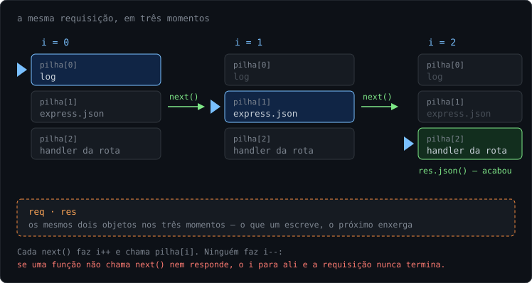
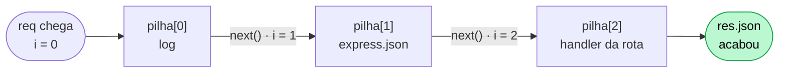
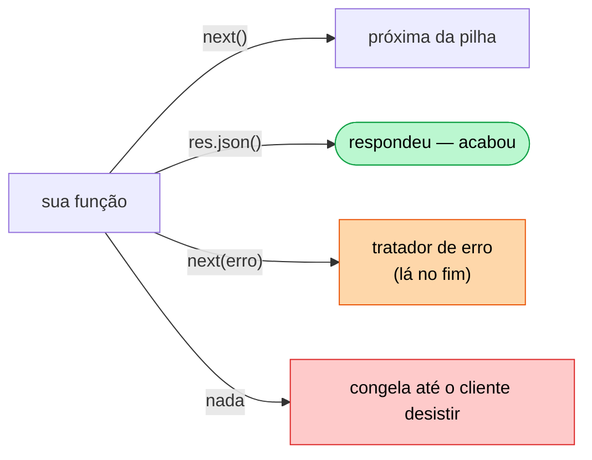
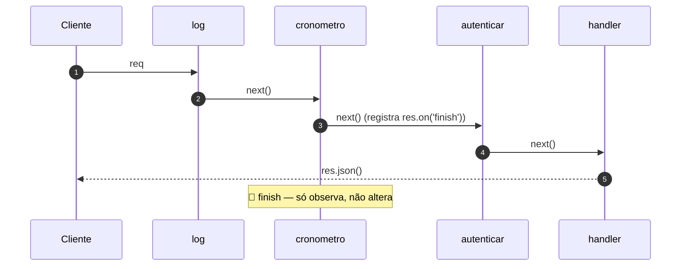
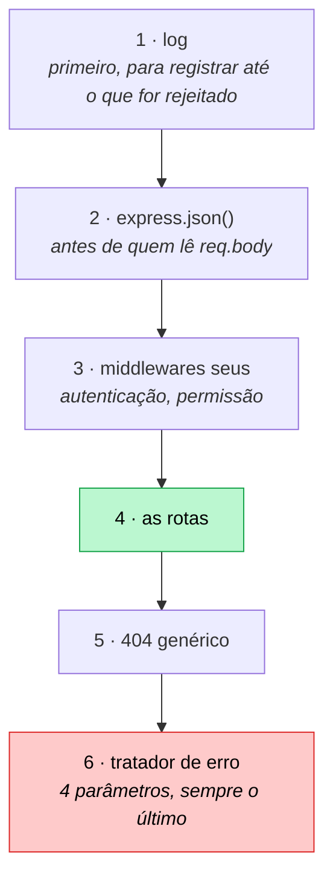

# 05 — Middlewares

**Em uma frase:** middleware é uma função `(req, res, next)` guardada numa lista;
o Express percorre essa lista uma posição por vez, e cada função pode olhar,
modificar, passar adiante ou encerrar a requisição.

## Por que importa

- É **o** conceito central do Express. Sua rota é só o último item da lista.
- Tudo que vale para todas as rotas (log, auth, CORS, erro) mora aqui, uma vez.
- O bug mais silencioso do Express é ordem errada ou `next()` esquecido.

## Conceitos

### O que o Express guarda quando você chama `app.use`

Você já escreveu `app.use(express.json())` sem pensar no que aquilo faz. Vamos
abrir.

Quando o servidor sobe, nenhuma requisição existe ainda. Então `app.use(fn)` não
pode estar executando `fn` — não há requisição, não há `req`, não há o que
executar. Ele só **guarda** `fn` numa lista, na ordem em que você chamou:

```ts
app.use(a); //  a lista agora é  [a]
app.use(b); //  a lista agora é  [a, b]
app.get('/x', c); //  a lista agora é  [a, b, c]
```

Repare que `app.get` entra na **mesma lista**. Sua rota não é uma categoria
especial de coisa: ela é o item `[2]`, com a condição extra de só rodar quando o
método for `GET` e o caminho for `/x`.

Essa lista tem nome: é a **pilha** de middlewares.

Agora chega uma requisição. O Express precisa percorrer a pilha — mas não com um
`for`, e o motivo importa: uma dessas funções pode demorar (ela vai ler o banco,
por exemplo), e o Node não pode ficar parado esperando (é o [módulo
02](./02-node-modulos-e-async.md) inteiro).

Então ele faz diferente: **passa o controle**. Cria um contador em zero, chama
`pilha[0]` e entrega junto uma função chamada `next`. E a única coisa que `next`
faz é isto:

```ts
let i = 0; // o índice: onde esta requisição está na pilha

function next() {
  i++; // anda uma casa
  pilha[i](req, res, next); // e chama a próxima, entregando o next de novo
}
```

É esse `i` o **índice**. Ele é o marcador de em que altura da pilha aquela
requisição está agora. E repare em quem faz ele andar: **você**, chamando
`next()`. O Express não anda sozinho.

Daí sai o bug mais silencioso do Express. Se a sua função não chama `next()` e
também não responde, o `i` fica parado onde está. Ninguém dá erro, ninguém
avisa, nada aparece no log: a requisição simplesmente **nunca termina**, e o
cliente fica esperando até desistir sozinho.

Uma última peça: os objetos `req` e `res` são **os mesmos** em todas as funções
da pilha. Não há cópia entre uma e outra. Então o que a função `a` escreve em
`req`, a função `b` enxerga — é assim que um middleware de autenticação consegue
deixar o usuário logado disponível para a rota lá na frente.

E é só isso. Não existe registro, prioridade, peso ou configuração escondida:
**uma lista de funções, um índice que anda, e dois objetos que todas
compartilham.**



Repare no que **não** muda entre os três momentos: a pilha. Ela é montada uma vez
quando o servidor sobe e continua idêntica. O que anda é o `i`.

### O caminho de uma requisição

Com as três peças na mão, o fluxo inteiro cabe num diagrama:



Cada seta é um `next()`, e cada `next()` é o `i` andando uma casa. O handler da
rota não tem nada de especial: ele é só o último item da pilha, e responde em vez
de chamar `next()`.

### As três saídas de um middleware

Toda função da pilha recebe os mesmos três argumentos e tem exatamente três
saídas possíveis — mais uma quarta, que é o bug:

```ts
function meuMiddleware(req: Request, res: Response, next: NextFunction) {
  // pode ler e modificar req e res à vontade. E então, obrigatoriamente:
  //
  //   next()          → anda o índice: a próxima da pilha assume
  //   res.json(...)   → responde e ENCERRA aqui; o resto da pilha não roda
  //   next(erro)      → pula direto para o tratador de erro, no fim
  //
  // e se não fizer nenhuma das três, a requisição congela.
}
```



> **Nota:**
> `express.json()` é uma função exatamente como essa. O mesmo vale para o `cors`,
> para o `morgan` e para a sua rota. **Não existe categoria especial** — o que
> muda entre elas é só o que fazem e em que posição da pilha estão.

### Para que serve: a coisa que precisa acontecer em toda rota

Agora que a mecânica está clara, a pergunta seguinte é por que alguém iria querer
isso.

Imagine que toda rota da sua API precisa registrar quem chamou. Sem middleware,
o jeito é escrever as mesmas linhas no começo de cada handler:

```ts
app.get('/livros', (req, res) => {
  console.log(`${req.method} ${req.path}`); // ← esta linha
  // ...
});

app.get('/autores', (req, res) => {
  console.log(`${req.method} ${req.path}`); // ← e de novo
  // ...
});
```

Com 40 rotas, são 40 cópias. E o problema não é a digitação — é o dia em que
alguém acrescenta a rota 41 e esquece. Nada quebra, nada avisa: aquela rota
simplesmente não aparece no log, e você só descobre quando precisa investigar
algo e o registro não está lá.

Com middleware, isso vira uma linha, num lugar só:

```ts
app.use((req, _res, next) => {
  console.log(`${req.method} ${req.path}`);
  next();
});
```

Log é o exemplo mais fácil, mas a família é maior: autenticação, CORS, medir
tempo, marcar um identificador na requisição. Todas têm em comum o fato de
**precisarem acontecer em quase toda requisição sem pertencer a nenhuma rota
específica**. O nome disso na literatura é _preocupação transversal_ — atravessa
o sistema em vez de morar num lugar dele.

| Sem middleware                          | Com middleware                   |
| --------------------------------------- | -------------------------------- |
| Repetir a checagem em 40 handlers       | Declarar uma vez, no lugar certo |
| Esquecer em um deles = falha silenciosa | Se está montado, vale para todos |
| Ordem implícita, espalhada              | Ordem explícita, num arquivo     |

> **Atenção:**
> E o custo vem junto, porque ele é o mesmo ganho visto de outro ângulo: **o
> comportamento deixou de estar visível no handler.**
>
> Quem abre o arquivo da rota e lê o handler não vê que existe autenticação
> acontecendo antes dele. Para descobrir, precisa saber que a pilha existe e ir
> procurar em outro arquivo.
>
> É por isso que, a partir do [módulo 08](./08-arquitetura-em-camadas.md), a
> autorização fica declarada **na própria rota** e não num `app.use` distante —
> perto o suficiente de quem lê para ser auditável.

### A ordem é a ordem do arquivo

```ts
app.use(a); // roda 1º
app.use(b); // roda 2º
app.get('/x', c); // roda 3º, e só em GET /x
```

Não há prioridade, peso ou config. É a ordem em que você escreveu, e nada mais.

**Consequências práticas:**

| Se você põe...                           | Acontece                           |
| ---------------------------------------- | ---------------------------------- |
| `express.json()` depois das rotas        | `req.body` é `undefined` nas rotas |
| 404 genérico no topo                     | Tudo vira 404                      |
| Middleware de erro no meio               | Erros das rotas abaixo não chegam  |
| Middleware que põe header após responder | `ERR_HTTP_HEADERS_SENT`            |

### Descida e subida

Middleware roda na **descida** (antes do handler). Para agir _depois_ da
resposta, escute o evento `finish`:



```ts
function cronometro(_req, res, next) {
  const inicio = performance.now(); // descida
  res.on('finish', () => {
    // subida: a resposta já foi
    console.log(`${res.statusCode} em ${performance.now() - inicio}ms`);
  });
  next();
}
```

Naquele momento o status já está definido e você **não pode mais** mexer na
resposta — só observar.

**Por que a pilha só anda para frente:** volte ao `next()` da primeira seção. Ele
faz `i++` e chama a próxima função. Não existe nada que faça `i--`, nem nada que
devolva o controle para quem chamou depois de a resposta sair. Quando o handler
chama `res.json()`, os bytes vão embora pela rede — e não há caminho de volta
subindo a pilha.

A consequência prática que mais dói: **não dá para acrescentar um header depois
que o handler respondeu.** Se um header depende do resultado do handler, ele tem
que ser posto pelo próprio handler, ou por um middleware que embrulhe o
`res.json` antes de ele ser chamado — que é como o `compression` funciona.

Nem todo framework é assim, e a comparação está em
[Se quiser ir mais fundo](#se-quiser-ir-mais-fundo).

### Três escopos

```ts
app.use(logger); // global: toda requisição
app.use('/api', autenticar); // por prefixo: só quem começa com /api
app.get('/admin', exigirAdmin, handler); // por rota: só aqui
```

### Middleware com argumento: fábrica

Middleware tem assinatura fixa. Para configurar, devolva um middleware:

```ts
function exigirPapel(papel: string) {
  return (req, res, next) => {
    if (req.header('X-Papel') !== papel) {
      return res.status(403).json({ erro: `Precisa de "${papel}"` });
    }
    next();
  };
}

app.delete('/tudo', exigirPapel('admin'), handler); // note o () — chamada, não referência
```

> **Cuidado:**
> Esquecer o `()` passa a fábrica como se fosse o middleware. Ela roda, devolve
> uma função que ninguém chama, e a requisição trava.

### Passando dados entre middlewares

```ts
res.locals.usuario = usuario; // vive só nesta requisição
```

`res.locals` é o lugar oficial. Inventar `req.usuario` compila só depois de
estender os tipos do Express (`declare global { namespace Express { ... } }`), e
`namespace` está proibido neste repo pelo `erasableSyntaxOnly`.

### Middleware de erro: 4 argumentos

```ts
app.use((erro: unknown, _req: Request, res: Response, _next: NextFunction) => {
  res.status(500).json({ erro: 'Erro interno' });
});
```

Repare que essa função tem **quatro** parâmetros, não três. E é exatamente isso
que o Express usa para reconhecê-la: ele conta quantos parâmetros a função
declara. Três parâmetros, é um middleware comum; quatro, é um tratador de erro.

> **Importante:**
> O nome dessa contagem é **aridade** — o número de parâmetros que uma função
> declara (não quantos você passa na chamada). Está no
> [glossário](./00-glossario.md).
>
> A armadilha: apagar o `_next` porque "não está sendo usado" transforma o
> tratador num middleware normal, que nunca vai receber erro nenhum. O código
> continua compilando e a função continua na pilha — ela só para de ser chamada
> quando dá erro. O [módulo 06](./06-tratamento-de-erros.md) é sobre isso.

### Os dois de terceiros deste módulo

| Lib        | Resolve                                                                 | Custo / nota                                                                                                |
| ---------- | ----------------------------------------------------------------------- | ----------------------------------------------------------------------------------------------------------- |
| **cors**   | Manda os headers que o navegador exige para outra origem chamar sua API | CORS é regra **do navegador**, não proteção do servidor: `curl` ignora. Detalhes no [13](./13-seguranca.md) |
| **morgan** | Log de requisição HTTP pronto (`GET /x 200 3ms`)                        | Bom para humano no terminal, ruim para máquina filtrar. Trocado por Pino no [14](./14-observabilidade.md)   |

> **Cuidado:**
> **CORS não é segurança do servidor, e confundir isso é caro.**
>
> O que acontece de verdade: o navegador faz a requisição, sua API responde, e
> **então** o navegador decide se entrega o resultado ao JavaScript da página. Se
> os headers não permitirem, ele esconde a resposta — que já chegou, e cujo efeito
> colateral (aquele `DELETE`) já aconteceu.
>
> Ou seja: `cors()` liberal não "abre" sua API; sua API já estava aberta para
> `curl`, para Postman e para qualquer script. Quem protege é autenticação
> (módulo 11), não CORS.

Isso sugere uma pergunta que vale fazer antes de instalar **qualquer** lib de
middleware: **de quem é a regra que ela implementa?**

| A lib...             | Implementa regra de quem | Protege o servidor? |
| -------------------- | ------------------------ | ------------------- |
| `cors`               | do navegador             | não                 |
| `helmet`             | do navegador             | não                 |
| `express-rate-limit` | **sua**                  | sim                 |

As duas primeiras mandam instruções para o navegador obedecer. Se o cliente não
for um navegador — e `curl` não é — não há quem obedeça. Só a terceira categoria
recusa trabalho no seu servidor, e por isso só ela protege alguma coisa.

## Na prática

```bash
node src/exemplos/05-middlewares/pilha.ts
```

Cada requisição imprime a cadeia. O log é o material didático:

```
  → 1 marcarInicio
  → 2 cronometro (registra listener)
  → 3 identificarServidor
  → 4 exigirApiKey
  → HANDLER /privado
GET /privado 200 38 - 0.352 ms        ← morgan
  ← 2 cronometro: 200 em 0.7ms        ← a subida, no evento finish
```

```bash
B=localhost:5053
curl $B/publico                                  # passa por 3 middlewares
curl -i $B/publico | grep -i x-servidor          # header posto por middleware
curl -i $B/privado                               # 401: cadeia encerrada no 4
curl -H 'X-Api-Key: segredo-123' $B/privado      # 200
curl -H 'X-Api-Key: x' $B/privado                # 403: chave errada
curl -X DELETE -H 'X-Api-Key: segredo-123' $B/admin/tudo             # 403
curl -X DELETE -H 'X-Api-Key: segredo-123' -H 'X-Papel: admin' $B/admin/tudo
curl $B/quebra                                   # 500 pelo middleware de erro
curl -m 2 $B/travado                             # trava: faltou next()
```

> **Dica:**
> A rota `/travado` é o experimento mais útil do módulo — rode e veja o `curl`
> estourar sem nenhum erro no servidor.

## Erros comuns

| Erro                                  | O que acontece                     | Correção                   |
| ------------------------------------- | ---------------------------------- | -------------------------- |
| Esquecer `next()`                     | Requisição trava, **sem erro**     | `next()` ou responder      |
| `next()` depois de responder          | `ERR_HTTP_HEADERS_SENT`            | `return res.json(...)`     |
| `next()` e responder no mesmo caminho | Mesma coisa, mais difícil de ver   | Um ou outro, nunca os dois |
| `express.json()` depois das rotas     | `req.body` é `undefined`           | Antes de tudo              |
| Erro handler com 3 argumentos         | Nunca recebe erro                  | 4 parâmetros, sempre       |
| `exigirPapel` sem `()`                | A fábrica vira o middleware; trava | `exigirPapel('admin')`     |
| `next(erro)` num middleware de 4 args | Loop no próprio tratador           | Só o Express chama esse    |
| Achar que `cors` protege a API        | Falsa sensação de segurança        | É regra do navegador (13)  |

## Cheatsheet

```ts
app.use(fn); // global
app.use('/api', fn); // por prefixo
app.get('/x', fn1, fn2, handler); // por rota, em ordem
app.use((e, req, res, next) => {}); // erro: 4 args, por último

next(); // adiante
next(erro); // pula para o tratador de erro
res.json(x); // responde e encerra (não chame next depois)
res.locals.x; // dados desta requisição
res.on('finish', fn); // depois da resposta ir
req.header('X-Api-Key');
```

A ordem em que você monta a pilha decide o comportamento, então vale ter uma
ordem padrão na cabeça. Com o que você viu **neste módulo**, ela é esta:



Cada posição tem um motivo, e nenhum deles é convenção arbitrária:

| Posição | Por que ali                                                                         |
| ------- | ----------------------------------------------------------------------------------- |
| Log 1º  | Para registrar **inclusive** as requisições que vão ser rejeitadas mais adiante     |
| Body 2º | Autenticação e rotas precisam de `req.body` já preenchido                           |
| Auth 3º | Depois do body, porque pode precisar ler a credencial dele; antes das rotas         |
| Rotas   | O trabalho de verdade                                                               |
| 404 5º  | Só é 404 depois que **nenhuma** rota casou — por isso não pode estar antes delas    |
| Erro 6º | Recebe o `next(erro)` de qualquer um dos anteriores, então tem que vir depois deles |

> **Nota:**
> Essa pilha vai crescer. O `cors` e o `helmet` entram entre o log e o body
> (o `OPTIONS` de preflight precisa ser respondido antes de qualquer
> autenticação), e o rate limit entra junto com os seus. Isso é assunto do
> [módulo 13](./13-seguranca.md) — a versão completa está lá, e não faria
> sentido você decorar agora as posições de coisas que ainda não usou.

## Os princípios deste módulo

Recapitulando — cada linha é uma conclusão que o módulo mostrou acontecer:

| A ideia                                                                                                                         | Onde volta     |
| ------------------------------------------------------------------------------------------------------------------------------- | -------------- |
| Middleware serve para o que precisa acontecer em quase toda rota sem pertencer a nenhuma delas.                                 | 06, 07, 11, 13 |
| O preço disso é que o handler deixa de mostrar o que roda antes dele. Quem lê a rota não vê a autenticação.                     | 08, 11         |
| A pilha só anda para frente. Depois que a resposta saiu, dá para observar, não para interferir.                                 | 14, 15         |
| Antes de instalar uma lib de middleware, pergunte de quem é a regra que ela implementa: do navegador ou sua.                    | 13             |
| No middleware ficam as decisões que não dependem dos dados. O que depende do conteúdo é regra de negócio e mora na camada dela. | 08, 11         |

## Se quiser ir mais fundo

### Frameworks em que a pilha volta

No Express a pilha só desce. Em Koa e em ASP.NET o middleware dá `await next()`,
e o código escrito **depois** dessa linha roda na volta, antes de a resposta sair:

```ts
// Koa — aqui o "depois" existe de verdade
app.use(async (ctx, next) => {
  const inicio = Date.now();
  await next(); // desce a pilha inteira e espera ela terminar...
  ctx.set('X-Tempo', `${Date.now() - inicio}`); // ...e volta AQUI, antes de responder
});
```

Isso resolve exatamente o problema do header que depende do resultado. Em troca,
cada middleware passa a segurar memória enquanto espera a volta, e um `await
next()` esquecido quebra a cadeia de um jeito bem menos óbvio que um `next()`
esquecido.

Vale conhecer porque, quando você ler que "no Koa dá para fazer X depois do
handler", a diferença é essa — não é que o Express seja limitado por descuido, é
outro desenho.

### Os nomes acadêmicos disso

O que o Express faz tem nome fora do Express, e você vai encontrar esses nomes em
discussões e em outras linguagens:

| Nome                        | Onde aparece                                                    |
| --------------------------- | --------------------------------------------------------------- |
| _chain of responsibility_   | Padrão de projeto clássico: cada elo decide se trata ou repassa |
| _pipeline_                  | Como o ASP.NET chama a mesma coisa                              |
| _interceptor_               | Como o Angular, o NestJS e o gRPC chamam                        |
| _filter_ / _servlet filter_ | Como o mundo Java chama                                         |

Saber os nomes não te ajuda a escrever middleware. Ajuda a reconhecer que você já
entende o assunto quando ele aparecer com outro rótulo.

## Para ir além

- **[Express — _Using middleware_ e _Writing middleware_](https://expressjs.com/en/guide/using-middleware.html)**
  A ordem de execução e os cinco tipos de middleware, direto da fonte.
- **[MDN — CORS](https://developer.mozilla.org/pt-BR/docs/Web/HTTP/CORS)**
  O que o navegador realmente faz no preflight. Leia antes de "resolver" CORS com `origin: *`.

## Pratique

👉 [`exercicios/05-middlewares/`](../exercicios/05-middlewares/)
