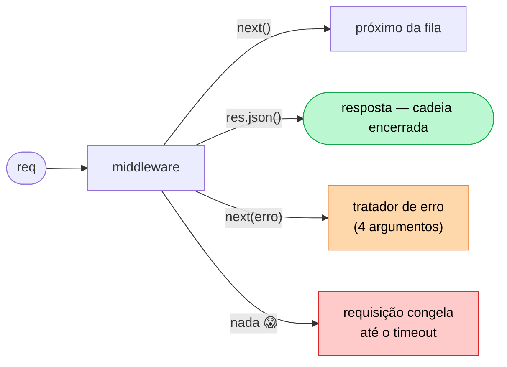
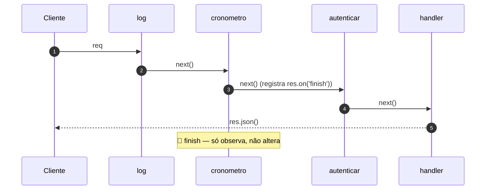
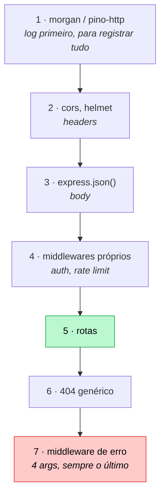

# 05 — Middlewares

**Em uma frase:** um middleware é uma função `(req, res, next)` numa fila; cada
uma pode inspecionar, modificar, passar adiante ou encerrar a requisição.

<!-- @import "[TOC]" {cmd="toc" depthFrom=2 depthTo=3 orderedList=false} -->

## Por que importa

- É **o** conceito central do Express. Rota é só o último middleware da fila.
- Tudo que vale para todas as rotas (log, auth, CORS, erro) mora aqui, uma vez.
- O bug mais silencioso do Express é ordem errada ou `next()` esquecido.

## Conceitos

### A assinatura e as três saídas

```ts
function meuMiddleware(req: Request, res: Response, next: NextFunction) {
  // 1. lê ou modifica req/res
  // 2. next()               → passa a bola adiante
  // 3. res.json(...)        → responde e ENCERRA a cadeia
  // 4. next(erro)           → pula para o middleware de erro
}
```



> [!NOTE]
> `express.json()` sempre foi isso. Não existe categoria especial: o parser de
> body, o `cors`, sua rota — tudo é middleware.

**O princípio:** middleware é **composição de funções sobre um valor mutável**. O
Express não tem nada além disso — a "mágica" do framework é uma lista de funções
e um índice que anda.

O padrão tem nome fora do Express (chain of responsibility, pipeline, interceptor)
e a mesma forma no `.NET`, no Rails e em qualquer proxy HTTP. O que ele resolve:

**preocupação transversal** — algo que precisa acontecer em quase toda requisição
(log, autenticação, CORS, medição, request id) e não pertence a nenhuma rota
específica. Sem middleware, o jeito é chamar as mesmas 5 linhas no topo de cada
handler — e o dia em que alguém esquecer uma, o buraco é silencioso.

| Sem middleware                          | Com middleware                   |
| --------------------------------------- | -------------------------------- |
| Repetir a checagem em 40 handlers       | Declarar uma vez, no lugar certo |
| Esquecer em um deles = falha silenciosa | Se está montado, vale para todos |
| Ordem implícita, espalhada              | Ordem explícita, num arquivo     |

> [!WARNING]
> O custo vem junto: **o comportamento deixa de estar visível no handler.** Quem
> abre a rota não vê que existe autenticação. É por isso que, a partir do
> [módulo 08](./08-arquitetura-em-camadas.md), a autorização fica declarada **na
> rota** e não num `app.use` distante — perto o suficiente para ser auditável.

### A ordem é a ordem do arquivo

```ts
app.use(a); // roda 1º
app.use(b); // roda 2º
app.get('/x', c); // roda 3º, e só em GET /x
```

Não há prioridade, peso ou config. É a ordem em que você escreveu, e nada mais.

**Consequências práticas:**

| Se você põe...                           | Acontece                           |
| ---------------------------------------- | ---------------------------------- |
| `express.json()` depois das rotas        | `req.body` é `undefined` nas rotas |
| 404 genérico no topo                     | Tudo vira 404                      |
| Middleware de erro no meio               | Erros das rotas abaixo não chegam  |
| Middleware que põe header após responder | `ERR_HTTP_HEADERS_SENT`            |

### Descida e subida

Middleware roda na **descida** (antes do handler). Para agir _depois_ da
resposta, escute o evento `finish`:



```ts
function cronometro(_req, res, next) {
  const inicio = performance.now(); // descida
  res.on('finish', () => {
    // subida: a resposta já foi
    console.log(`${res.statusCode} em ${performance.now() - inicio}ms`);
  });
  next();
}
```

Naquele momento o status já está definido e você **não pode mais** mexer na
resposta — só observar.

**Por que existe essa assimetria:** o `next()` empurra a requisição para frente,
mas nada a traz de volta. Quando o handler chama `res.json()`, os bytes saem — não
há "caminho de volta" pela pilha de middlewares.

É a diferença entre este modelo e o de outros frameworks (Koa, ASP.NET), onde o
middleware faz `await next()` e o código **depois** dessa linha roda na volta:

```ts
// Koa — o "depois" existe de verdade
app.use(async (ctx, next) => {
  const inicio = Date.now();
  await next(); // desce toda a cadeia...
  ctx.set('X-Tempo', `${Date.now() - inicio}`); // ...e volta aqui, ANTES de responder
});
```

No Express, `res.on('finish')` é só observação: a resposta já foi. Consequência
prática: **não dá para adicionar header depois do handler.** Se um header depende
do resultado, ele tem que ser posto pelo próprio handler ou por um middleware que
envolva `res.json` (o que o `compression` faz).

### Três escopos

```ts
app.use(logger); // global: toda requisição
app.use('/api', autenticar); // por prefixo: só quem começa com /api
app.get('/admin', exigirAdmin, handler); // por rota: só aqui
```

### Middleware com argumento: fábrica

Middleware tem assinatura fixa. Para configurar, devolva um middleware:

```ts
function exigirPapel(papel: string) {
  return (req, res, next) => {
    if (req.header('X-Papel') !== papel) {
      return res.status(403).json({ erro: `Precisa de "${papel}"` });
    }
    next();
  };
}

app.delete('/tudo', exigirPapel('admin'), handler); // note o () — chamada, não referência
```

> [!CAUTION]
> Esquecer o `()` passa a fábrica como se fosse o middleware. Ela roda, devolve
> uma função que ninguém chama, e a requisição trava.

### Passando dados entre middlewares

```ts
res.locals.usuario = usuario; // vive só nesta requisição
```

`res.locals` é o lugar oficial. Inventar `req.usuario` compila só depois de
estender os tipos do Express (`declare global { namespace Express { ... } }`), e
`namespace` está proibido neste repo pelo `erasableSyntaxOnly`.

### Middleware de erro: 4 argumentos

```ts
app.use((erro: unknown, _req: Request, res: Response, _next: NextFunction) => {
  res.status(500).json({ erro: 'Erro interno' });
});
```

> [!IMPORTANT]
> O que faz o Express reconhecer isto é a **aridade**: exatamente 4 parâmetros.
> Remover o `_next` — mesmo sem usar — transforma o tratador num middleware
> normal que nunca recebe erro. É o [módulo 06](./06-tratamento-de-erros.md)
> inteiro.

### Os dois de terceiros deste módulo

| Lib        | Resolve                                                                 | Custo / nota                                                                                                |
| ---------- | ----------------------------------------------------------------------- | ----------------------------------------------------------------------------------------------------------- |
| **cors**   | Manda os headers que o navegador exige para outra origem chamar sua API | CORS é regra **do navegador**, não proteção do servidor: `curl` ignora. Detalhes no [13](./13-seguranca.md) |
| **morgan** | Log de requisição HTTP pronto (`GET /x 200 3ms`)                        | Bom para humano no terminal, ruim para máquina filtrar. Trocado por Pino no [14](./14-observabilidade.md)   |

> [!CAUTION]
> **CORS não é segurança do servidor, e confundir isso é caro.**
>
> O que acontece de verdade: o navegador faz a requisição, sua API responde, e
> **então** o navegador decide se entrega o resultado ao JavaScript da página. Se
> os headers não permitirem, ele esconde a resposta — que já chegou, e cujo efeito
> colateral (aquele `DELETE`) já aconteceu.
>
> Ou seja: `cors()` liberal não "abre" sua API; sua API já estava aberta para
> `curl`, para Postman e para qualquer script. Quem protege é autenticação
> (módulo 11), não CORS.

**O princípio geral, que vale para toda lib de middleware:** antes de instalar,
pergunte **de quem é a regra que ela implementa**. `cors` implementa uma regra do
navegador; `helmet` manda instruções para o navegador; `express-rate-limit`
implementa uma regra sua. Só a terceira categoria protege o servidor.

## Na prática

```bash
node src/exemplos/05-middlewares/pilha.ts
```

Cada requisição imprime a cadeia. O log é o material didático:

```
  → 1 marcarInicio
  → 2 cronometro (registra listener)
  → 3 identificarServidor
  → 4 exigirApiKey
  → HANDLER /privado
GET /privado 200 38 - 0.352 ms        ← morgan
  ← 2 cronometro: 200 em 0.7ms        ← a subida, no evento finish
```

```bash {cmd=true}
B=localhost:5053
curl $B/publico                                  # passa por 3 middlewares
curl -i $B/publico | grep -i x-servidor          # header posto por middleware
curl -i $B/privado                               # 401: cadeia encerrada no 4
curl -H 'X-Api-Key: segredo-123' $B/privado      # 200
curl -H 'X-Api-Key: x' $B/privado                # 403: chave errada
curl -X DELETE -H 'X-Api-Key: segredo-123' $B/admin/tudo             # 403
curl -X DELETE -H 'X-Api-Key: segredo-123' -H 'X-Papel: admin' $B/admin/tudo
curl $B/quebra                                   # 500 pelo middleware de erro
curl -m 2 $B/travado                             # trava: faltou next()
```

> [!TIP]
> A rota `/travado` é o experimento mais útil do módulo — rode e veja o `curl`
> estourar sem nenhum erro no servidor.

## Erros comuns

| Erro                                  | O que acontece                     | Correção                   |
| ------------------------------------- | ---------------------------------- | -------------------------- |
| Esquecer `next()`                     | Requisição trava, **sem erro**     | `next()` ou responder      |
| `next()` depois de responder          | `ERR_HTTP_HEADERS_SENT`            | `return res.json(...)`     |
| `next()` e responder no mesmo caminho | Mesma coisa, mais difícil de ver   | Um ou outro, nunca os dois |
| `express.json()` depois das rotas     | `req.body` é `undefined`           | Antes de tudo              |
| Erro handler com 3 argumentos         | Nunca recebe erro                  | 4 parâmetros, sempre       |
| `exigirPapel` sem `()`                | A fábrica vira o middleware; trava | `exigirPapel('admin')`     |
| `next(erro)` num middleware de 4 args | Loop no próprio tratador           | Só o Express chama esse    |
| Achar que `cors` protege a API        | Falsa sensação de segurança        | É regra do navegador (13)  |

## Cheatsheet

```ts
app.use(fn); // global
app.use('/api', fn); // por prefixo
app.get('/x', fn1, fn2, handler); // por rota, em ordem
app.use((e, req, res, next) => {}); // erro: 4 args, por último

next(); // adiante
next(erro); // pula para o tratador de erro
res.json(x); // responde e encerra (não chame next depois)
res.locals.x; // dados desta requisição
res.on('finish', fn); // depois da resposta ir
req.header('X-Api-Key');
```



A ordem acima não é convenção arbitrária — cada posição tem um porquê:

| Posição | Por que ali                                                                    |
| ------- | ------------------------------------------------------------------------------ |
| Log 1º  | Para registrar **inclusive** o que vai ser rejeitado depois                    |
| CORS 2º | O `OPTIONS` de preflight precisa ser respondido antes de qualquer autenticação |
| Body 3º | Autenticação e rotas leem `req.body`                                           |
| Auth 4º | Depois do body (pode ler credencial dele), antes das rotas                     |
| 404 6º  | Só é 404 depois que **nenhuma** rota casou                                     |
| Erro 7º | Recebe o que qualquer um dos anteriores jogou                                  |

## Os princípios deste módulo

| Princípio                                                                         | Onde reaparece |
| --------------------------------------------------------------------------------- | -------------- |
| **Middleware resolve preocupação transversal** — o que vale para quase toda rota. | 06, 07, 11, 13 |
| **O custo é invisibilidade:** o handler não mostra o que roda antes dele.         | 08, 11         |
| **A cadeia só desce.** O "depois" é observação, não interferência.                | 14, 15         |
| **Antes de instalar, pergunte de quem é a regra** que a lib implementa.           | 13             |
| **Decida no middleware o que não depende dos dados; o resto é regra de negócio.** | 08, 11         |

## Pratique

👉 [`exercicios/05-middlewares/`](../exercicios/05-middlewares/)
