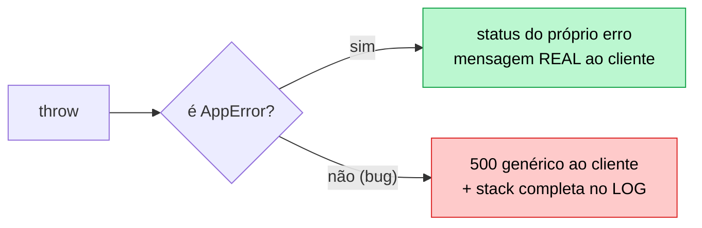
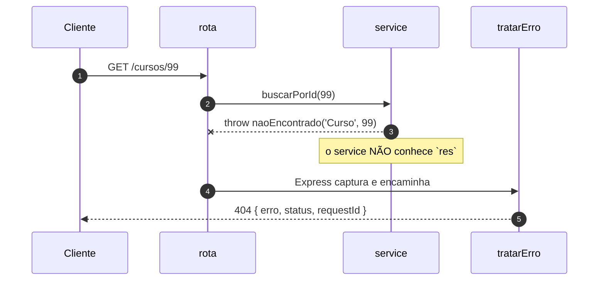

# 06 — Tratamento de erros

**Em uma frase:** as rotas dizem **o que** deu errado; um tratador central decide
**como** isso vira resposta HTTP.

<!-- @import "[TOC]" {cmd="toc" depthFrom=2 depthTo=3 orderedList=false} -->

## Por que importa

- Sem um lugar central, cada rota inventa seu formato de erro e o cliente precisa
  de um `if` por endpoint.
- Vazar mensagem de bug entrega seu schema e sua infraestrutura de graça.
- Erro do cliente virando 500 faz você caçar um bug que não existe.

## Conceitos

### Erro esperado vs bug

|                     | Erro esperado                     | Bug                           |
| ------------------- | --------------------------------- | ----------------------------- |
| Exemplo             | `titulo` faltando, id inexistente | `undefined.valor`, banco fora |
| Você previu?        | Sim, criou de propósito           | Não                           |
| Status              | 4xx                               | 500                           |
| Mensagem ao cliente | A real, útil                      | Genérica                      |
| Log                 | Não precisa (é rotina)            | Completo, com stack           |

> [!IMPORTANT]
> **Mensagem de erro que você escreveu pode ir ao cliente; mensagem que o runtime
> escreveu, não.** `connect ECONNREFUSED 10.0.0.5:5432` é um mapa da sua rede.



### `AppError`

```ts
export class AppError extends Error {
  readonly status: number;
  readonly esperado = true; // ← "eu criei isto de propósito"
  constructor(mensagem: string, status = 400, detalhes?: unknown) { ... }
}

export const naoEncontrado = (recurso: string, id: string | number) =>
  new AppError(`${recurso} ${id} não encontrado`, 404);
```

As fábricas nomeadas (`naoEncontrado`, `conflito`, `semPermissao`) não são para
digitar menos: são para o status code de cada situação ficar definido **em um
lugar**. Sem elas, metade do código usa 404 e a outra 400 para a mesma coisa.

### Por que `throw` em vez de `res.status(404)`

```ts
function acharCurso(id: string): Curso {
  const curso = cursos.find(...);
  if (!curso) throw naoEncontrado('Curso', id); // não conhece `res`
  return curso;
}
```

A função não precisa saber que existe HTTP. Isso é o que permite reusá-la num
service ([módulo 08](./08-arquitetura-em-camadas.md)) e num worker de fila
([17](./17-jobs-e-filas.md)), onde não há requisição nenhuma.

### O que mudou no Express 5

```ts
app.get('/x', async (req, res) => {
  throw new Error('boom');
});
```

|                    | Express 4                               | Express 5        |
| ------------------ | --------------------------------------- | ---------------- |
| `throw` síncrono   | vai pro tratador                        | vai pro tratador |
| `throw` em `async` | **`unhandledRejection` → processo cai** | vai pro tratador |

> [!NOTE]
> No Express 4, um id inexistente numa rota async derrubava a API inteira. Era
> por isso que existia `express-async-errors` e aquele `asyncHandler(fn)` que
> você vai encontrar em todo tutorial. **No Express 5, nada disso é necessário.**

### O tratador central

```ts
export function tratarErro(
  erro: unknown,
  _req: Request,
  res: Response,
  _next: NextFunction,
) {
  if (erro instanceof AppError) {
    return res.status(erro.status).json({ erro: erro.message, status: erro.status });
  }
  if (erro instanceof SyntaxError && 'body' in erro) {
    return res.status(400).json({ erro: 'JSON inválido', status: 400 }); // body quebrado
  }
  console.error(`[${res.locals.requestId}] ERRO NÃO TRATADO:`, erro); // log completo
  res.status(500).json({ erro: 'Erro interno do servidor', status: 500 }); // resposta genérica
}
```

Três detalhes que importam:

1. **4 parâmetros.** É a aridade que faz o Express reconhecer o tratador. Remover
   o `_next`, mesmo sem usar, transforma num middleware comum que nunca recebe
   erro — e você cai no handler padrão do Express, que devolve **HTML com a stack
   trace inteira**.
2. **O caso do `SyntaxError`.** `express.json()` joga isso quando o body é JSON
   malformado. Sem tratar, o cliente recebe 500 por ter mandado lixo.
3. **`requestId` na resposta.** O cliente cita o id no suporte, você acha todas as
   linhas de log daquela requisição. Vem do
   [módulo 05](./05-middlewares.md#passando-dados-entre-middlewares).

### A ordem, de novo

```ts
app.use('/api/v1', rotas);
app.use(rotaNaoEncontrada); // 404: joga AppError, não responde direto
app.use(tratarErro); // sempre o último
```



> [!TIP]
> O 404 genérico jogar um `AppError` (em vez de responder) faz ele sair no
> **mesmo formato** dos outros erros. Detalhe pequeno, cliente agradecido.

### `next(erro)` — quando `throw` não serve

```ts
app.get('/callback', (_req, _res, next) => {
  setTimeout(() => {
    next(new AppError('erro num callback', 502)); // throw aqui escaparia
  }, 5);
});
```

Dentro de callback de biblioteca antiga (que não devolve Promise) o `throw` sai
do handler e ninguém captura. Aí `next(erro)` é a única saída.

### A rede de segurança do processo

```ts
process.on('unhandledRejection', (m) => {
  console.error(m);
  process.exit(1);
});
process.on('uncaughtException', (e) => {
  console.error(e);
  process.exit(1);
});
```

O tratador do Express só pega o que passou por uma requisição. Erro em timer ou
callback solto não passa.

> [!WARNING]
> A recomendação oficial do Node é **logar e sair**: um processo que continua
> depois de uma exceção não capturada está em estado desconhecido e pode
> corromper dados silenciosamente.

Quem reinicia é o orquestrador (Docker, systemd, PM2) —
[módulo 16](./16-deploy-docker-ci.md). Encerrar sem cortar requisições em
andamento é _graceful shutdown_, no [15](./15-performance-e-cache.md).

## Na prática

```bash
node src/exemplos/06-erros/servidor.ts
```

```bash {cmd=true}
B=localhost:5054
curl -i $B/cursos/99            # 404 com requestId
curl -i $B/cursos/2/detalhes    # 409 lançado de rota ASYNC (Express 4 caía aqui)
curl -X POST $B/cursos -H 'Content-Type: application/json' -d '{}'      # 400 + detalhes
curl -X POST $B/cursos -H 'Content-Type: application/json' -d '{quebrado'  # 400, não 500
curl -i $B/bug                  # 500 genérico — veja a stack no TERMINAL
curl -i $B/bug-async            # idem, e o processo continua vivo
curl -i $B/callback             # 502 via next(erro)
curl -i $B/nada                 # 404 no mesmo formato
curl $B/cursos/1                # ainda de pé depois de dois bugs
```

Compare as duas saídas do `/bug`: o cliente recebe
`{"erro":"Erro interno do servidor","status":500,"requestId":"0e464f75"}`; o
terminal recebe `[0e464f75] ERRO NÃO TRATADO: TypeError: Cannot read properties
of undefined`. Mesmo id, informação diferente. É esse o desenho.

## Erros comuns

| Erro                                         | O que acontece                        | Correção             |
| -------------------------------------------- | ------------------------------------- | -------------------- |
| Tratador com 3 argumentos                    | Nunca recebe erro; stack vaza em HTML | 4 parâmetros         |
| Tratador antes das rotas                     | Erros das rotas não chegam nele       | Sempre o último      |
| `res.json({ erro: erro.message })` para tudo | Vaza schema e infra                   | Genérico em 5xx      |
| `catch (e) { console.log(e) }` e segue       | Erro engolido; resposta nunca vem     | `next(e)` ou `throw` |
| `throw` dentro de callback                   | Ninguém captura                       | `next(erro)`         |
| Entrada inválida → 500                       | Você caça bug que não existe          | Validar → 400        |
| Estado impossível → 400                      | Cliente corrige body à toa            | 409 Conflict         |
| Sem `unhandledRejection` handler             | Processo morre sem log nenhum         | Registrar e sair     |
| `asyncHandler(fn)` no Express 5              | Código morto                          | O router já dá await |

## Cheatsheet

```ts
throw new AppError(msg, status); // erro esperado
throw naoEncontrado('Curso', id); // 404
throw conflito('já emprestado'); // 409
next(erro); // dentro de callback

app.use(rotaNaoEncontrada); // penúltimo
app.use(tratarErro); // ÚLTIMO, 4 argumentos
```

| Situação                             | Status        |
| ------------------------------------ | ------------- |
| Campo faltando ou formato errado     | `400`         |
| Sem credencial / credencial ilegível | `401`         |
| Credencial ok, permissão não         | `403`         |
| Recurso não existe                   | `404`         |
| Método não permitido nessa rota      | `405`         |
| Estado atual impede a operação       | `409`         |
| Formato ok, semântica inválida       | `422`         |
| Rate limit                           | `429`         |
| Bug seu                              | `500`         |
| Dependência externa falhou           | `502` / `503` |

## Pratique

👉 [`exercicios/06-erros/`](../exercicios/06-erros/)
