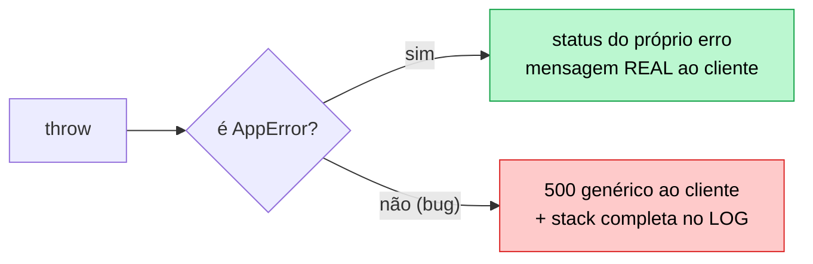
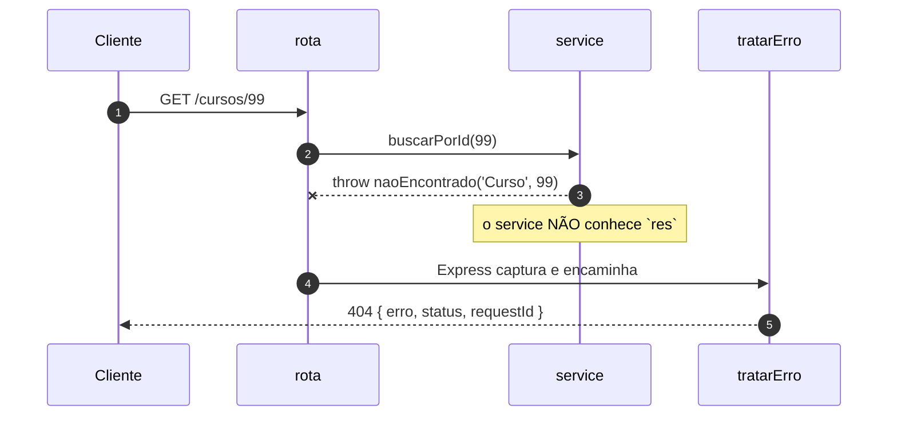

# 06 — Tratamento de erros

**Em uma frase:** as rotas dizem **o que** deu errado; um tratador central decide
**como** isso vira resposta HTTP.

## Por que importa

- Sem um lugar central, cada rota inventa seu formato de erro e o cliente precisa
  de um `if` por endpoint.
- Vazar mensagem de bug entrega seu schema e sua infraestrutura de graça.
- Erro do cliente virando 500 faz você caçar um bug que não existe.

## Conceitos

### Erro esperado vs bug

|                     | Erro esperado                     | Bug                           |
| ------------------- | --------------------------------- | ----------------------------- |
| Exemplo             | `titulo` faltando, id inexistente | `undefined.valor`, banco fora |
| Você previu?        | Sim, criou de propósito           | Não                           |
| Status              | 4xx                               | 500                           |
| Mensagem ao cliente | A real, útil                      | Genérica                      |
| Log                 | Não precisa (é rotina)            | Completo, com stack           |

> **Importante:**
> **Mensagem de erro que você escreveu pode ir ao cliente; mensagem que o runtime
> escreveu, não.** `connect ECONNREFUSED 10.0.0.5:5432` é um mapa da sua rede.

**O princípio:** a distinção não é sobre gravidade — é sobre **quem consegue
resolver**.

| Quem resolve | Status | O que a resposta precisa ter                | Quem é acordado |
| ------------ | ------ | ------------------------------------------- | --------------- |
| O cliente    | 4xx    | o que corrigir, com precisão                | ninguém         |
| Você         | 5xx    | uma referência para o suporte (`requestId`) | você            |

Errar essa classificação custa nas duas direções, e as duas doem em produção:

- **Bug virando 4xx** — some do alerta. Sua taxa de erro fica linda enquanto os
  usuários não conseguem usar o sistema. É o pior dos dois.
- **Erro do cliente virando 5xx** — polui o alerta com ruído, e a equipe aprende a
  ignorar a métrica que deveria acordá-la. Você caça um bug que não existe.

> **Dica:**
> O teste para classificar: **"o cliente consegue fazer alguma coisa diferente
> para isso funcionar?"** Se sim, 4xx. Se ele já fez tudo certo, 5xx.



### `AppError`

```ts
export class AppError extends Error {
  readonly status: number;
  readonly esperado = true; // ← "eu criei isto de propósito"
  constructor(mensagem: string, status = 400, detalhes?: unknown) { ... }
}

export const naoEncontrado = (recurso: string, id: string | number) =>
  new AppError(`${recurso} ${id} não encontrado`, 404);
```

As fábricas nomeadas (`naoEncontrado`, `conflito`, `semPermissao`) não são para
digitar menos: são para o status code de cada situação ficar definido **em um
lugar**. Sem elas, metade do código usa 404 e a outra 400 para a mesma coisa.

### Por que `throw` em vez de `res.status(404)`

```ts
function acharCurso(id: string): Curso {
  const curso = cursos.find(...);
  if (!curso) throw naoEncontrado('Curso', id); // não conhece `res`
  return curso;
}
```

A função não precisa saber que existe HTTP. Isso é o que permite reusá-la num
service ([módulo 08](./08-arquitetura-em-camadas.md)) e num worker de fila
([17](./17-jobs-e-filas.md)), onde não há requisição nenhuma.

**O princípio:** **quem detecta o problema raramente é quem sabe como comunicá-lo.**
`throw` separa as duas responsabilidades:

| Quem       | Sabe                                     | Não sabe                          |
| ---------- | ---------------------------------------- | --------------------------------- |
| O service  | que o curso não existe, e que isso é 404 | se a resposta é JSON, HTML ou log |
| O tratador | o formato da resposta, o `requestId`     | por que o erro aconteceu          |

E há um ganho estrutural que não é óbvio: `throw` **interrompe**. Um
`res.status(404).json(...)` no meio de uma função exige que quem chamou saiba
parar — e o `return` esquecido vira `ERR_HTTP_HEADERS_SENT` ou, pior, a execução
continua com um dado inválido.

```ts
// ❌ Continua rodando depois de "responder".
function achar(id) {
  const c = cursos.find(...);
  if (!c) res.status(404).json({});   // faltou return
  return c;                            // devolve undefined mundo afora
}

// ✅ Interrompe de verdade. Quem chamou não precisa lembrar de nada.
function achar(id) {
  const c = cursos.find(...);
  if (!c) throw naoEncontrado('Curso', id);
  return c;                            // aqui, `c` é garantidamente um Curso
}
```

O segundo tem um bônus de tipo: depois do `throw`, o TypeScript **sabe** que `c`
não é `undefined`. O primeiro obriga um `!` ou um `if` a mais em cada chamador.

### O que mudou no Express 5

```ts
app.get('/x', async (req, res) => {
  throw new Error('boom');
});
```

|                    | Express 4                               | Express 5        |
| ------------------ | --------------------------------------- | ---------------- |
| `throw` síncrono   | vai pro tratador                        | vai pro tratador |
| `throw` em `async` | **`unhandledRejection` → processo cai** | vai pro tratador |

> **Nota:**
> No Express 4, um id inexistente numa rota async derrubava a API inteira. Era
> por isso que existia `express-async-errors` e aquele `asyncHandler(fn)` que
> você vai encontrar em todo tutorial. **No Express 5, nada disso é necessário.**

### O tratador central

```ts
export function tratarErro(
  erro: unknown,
  _req: Request,
  res: Response,
  _next: NextFunction,
) {
  if (erro instanceof AppError) {
    return res.status(erro.status).json({ erro: erro.message, status: erro.status });
  }
  if (erro instanceof SyntaxError && 'body' in erro) {
    return res.status(400).json({ erro: 'JSON inválido', status: 400 }); // body quebrado
  }
  console.error(`[${res.locals.requestId}] ERRO NÃO TRATADO:`, erro); // log completo
  res.status(500).json({ erro: 'Erro interno do servidor', status: 500 }); // resposta genérica
}
```

Três detalhes que importam:

1. **4 parâmetros.** É a aridade que faz o Express reconhecer o tratador. Remover
   o `_next`, mesmo sem usar, transforma num middleware comum que nunca recebe
   erro — e você cai no handler padrão do Express, que devolve **HTML com a stack
   trace inteira**.
2. **O caso do `SyntaxError`.** `express.json()` joga isso quando o body é JSON
   malformado. Sem tratar, o cliente recebe 500 por ter mandado lixo.
3. **`requestId` na resposta.** O cliente cita o id no suporte, você acha todas as
   linhas de log daquela requisição. Vem do
   [módulo 05](./05-middlewares.md#passando-dados-entre-middlewares).

**O princípio do lugar único:** o formato da resposta de erro é **contrato
público**. Um cliente escreve UM tratamento de erro; se cada rota inventar o seu
(`{erro}`, `{message}`, `{error:{msg}}`), ele precisa de um `if` por endpoint — e
o `if` que faltar vira uma tela em branco.

Centralizar dá três coisas que rota-a-rota não dá:

| Ganho                         | Por quê                                                    |
| ----------------------------- | ---------------------------------------------------------- |
| Formato consistente           | Um lugar decide, e não há como divergir                    |
| Nada vaza por omissão         | O caminho do bug é sempre o genérico, mesmo para erro novo |
| Dá para **testar de uma vez** | Um teste cobre o formato de toda a API (módulo 12)         |

> **Cuidado:**
> O terceiro é o que sustenta os outros dois ao longo do tempo. A decisão "a stack
> nunca sai na resposta" não se defende sozinha: basta alguém adicionar
> `erro.message` durante uma investigação e esquecer de tirar. **Nada quebra** —
> a API continua respondendo 500. É por isso que o [módulo 12](./12-testes.md)
> tem um teste dedicado a isso.

### A ordem, de novo

```ts
app.use('/api/v1', rotas);
app.use(rotaNaoEncontrada); // 404: joga AppError, não responde direto
app.use(tratarErro); // sempre o último
```



> **Dica:**
> O 404 genérico jogar um `AppError` (em vez de responder) faz ele sair no
> **mesmo formato** dos outros erros. Detalhe pequeno, cliente agradecido.

### `next(erro)` — quando `throw` não serve

```ts
app.get('/callback', (_req, _res, next) => {
  setTimeout(() => {
    next(new AppError('erro num callback', 502)); // throw aqui escaparia
  }, 5);
});
```

Dentro de callback de biblioteca antiga (que não devolve Promise) o `throw` sai
do handler e ninguém captura. Aí `next(erro)` é a única saída.

### A rede de segurança do processo

```ts
process.on('unhandledRejection', (m) => {
  console.error(m);
  process.exit(1);
});
process.on('uncaughtException', (e) => {
  console.error(e);
  process.exit(1);
});
```

O tratador do Express só pega o que passou por uma requisição. Erro em timer ou
callback solto não passa.

> **Atenção:**
> A recomendação oficial do Node é **logar e sair**: um processo que continua
> depois de uma exceção não capturada está em estado desconhecido e pode
> corromper dados silenciosamente.

**O princípio: falhe rápido e alto, em vez de continuar quebrado.** Ele
contraria o instinto — parece que manter o servidor de pé é sempre melhor —, mas
a conta é esta:

| Continuar rodando                             | Reiniciar                         |
| --------------------------------------------- | --------------------------------- |
| Estado interno possivelmente corrompido       | Estado limpo, conhecido           |
| Erros novos e estranhos, longe da causa       | Uma falha, no ponto certo, no log |
| Conexão de banco pendurada, memória vazando   | Tudo devolvido ao sistema         |
| Downtime **invisível** (responde, mas errado) | Downtime de 2 segundos, visível   |

A mesma ideia já apareceu no [módulo 11](./11-autenticacao.md): o processo morre
sem `JWT_SECRET` em vez de usar um segredo de exemplo. E é o oposto do
`try/catch` vazio, que é a forma mais eficiente de esconder um problema de si
mesmo.

> **Dica:**
> "Falhar rápido" vale para **inicialização e estado**, não para requisição. Um
> `400` não derruba nada — quem falha alto é o processo, não a resposta.

Quem reinicia é o orquestrador (Docker, systemd, PM2) —
[módulo 16](./16-deploy-docker-ci.md). Encerrar sem cortar requisições em
andamento é _graceful shutdown_, no [15](./15-performance-e-cache.md).

## Na prática

```bash
node src/exemplos/06-erros/servidor.ts
```

```bash
B=localhost:5054
curl -i $B/cursos/99            # 404 com requestId
curl -i $B/cursos/2/detalhes    # 409 lançado de rota ASYNC (Express 4 caía aqui)
curl -X POST $B/cursos -H 'Content-Type: application/json' -d '{}'      # 400 + detalhes
curl -X POST $B/cursos -H 'Content-Type: application/json' -d '{quebrado'  # 400, não 500
curl -i $B/bug                  # 500 genérico — veja a stack no TERMINAL
curl -i $B/bug-async            # idem, e o processo continua vivo
curl -i $B/callback             # 502 via next(erro)
curl -i $B/nada                 # 404 no mesmo formato
curl $B/cursos/1                # ainda de pé depois de dois bugs
```

Compare as duas saídas do `/bug`: o cliente recebe
`{"erro":"Erro interno do servidor","status":500,"requestId":"0e464f75"}`; o
terminal recebe `[0e464f75] ERRO NÃO TRATADO: TypeError: Cannot read properties
of undefined`. Mesmo id, informação diferente. É esse o desenho.

## Erros comuns

| Erro                                         | O que acontece                        | Correção             |
| -------------------------------------------- | ------------------------------------- | -------------------- |
| Tratador com 3 argumentos                    | Nunca recebe erro; stack vaza em HTML | 4 parâmetros         |
| Tratador antes das rotas                     | Erros das rotas não chegam nele       | Sempre o último      |
| `res.json({ erro: erro.message })` para tudo | Vaza schema e infra                   | Genérico em 5xx      |
| `catch (e) { console.log(e) }` e segue       | Erro engolido; resposta nunca vem     | `next(e)` ou `throw` |
| `throw` dentro de callback                   | Ninguém captura                       | `next(erro)`         |
| Entrada inválida → 500                       | Você caça bug que não existe          | Validar → 400        |
| Estado impossível → 400                      | Cliente corrige body à toa            | 409 Conflict         |
| Sem `unhandledRejection` handler             | Processo morre sem log nenhum         | Registrar e sair     |
| `asyncHandler(fn)` no Express 5              | Código morto                          | O router já dá await |

## Cheatsheet

```ts
throw new AppError(msg, status); // erro esperado
throw naoEncontrado('Curso', id); // 404
throw conflito('já emprestado'); // 409
next(erro); // dentro de callback

app.use(rotaNaoEncontrada); // penúltimo
app.use(tratarErro); // ÚLTIMO, 4 argumentos
```

| Situação                             | Status        |
| ------------------------------------ | ------------- |
| Campo faltando ou formato errado     | `400`         |
| Sem credencial / credencial ilegível | `401`         |
| Credencial ok, permissão não         | `403`         |
| Recurso não existe                   | `404`         |
| Método não permitido nessa rota      | `405`         |
| Estado atual impede a operação       | `409`         |
| Formato ok, semântica inválida       | `422`         |
| Rate limit                           | `429`         |
| Bug seu                              | `500`         |
| Dependência externa falhou           | `502` / `503` |

## Os princípios deste módulo

| Princípio                                                                             | Onde reaparece |
| ------------------------------------------------------------------------------------- | -------------- |
| **A classificação do erro é sobre quem consegue resolver**, não sobre gravidade.      | 12, 13, 14     |
| **Quem detecta o problema não é quem sabe comunicá-lo** — daí `throw`.                | 08, 17         |
| **Formato de erro é contrato público:** um lugar decide, e dá para testar de uma vez. | 07, 12         |
| **Mensagem que você escreveu pode sair; mensagem do runtime, não.**                   | 11, 13         |
| **Falhe rápido e alto em vez de continuar quebrado.**                                 | 11, 16         |

## Pratique

👉 [`exercicios/06-erros/`](../exercicios/06-erros/)
