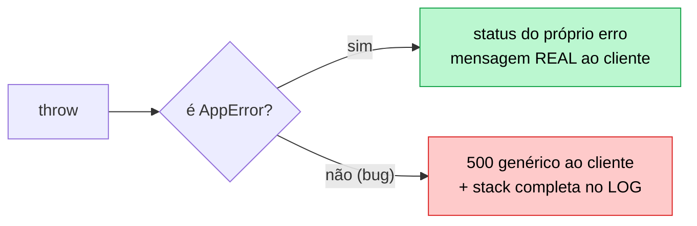
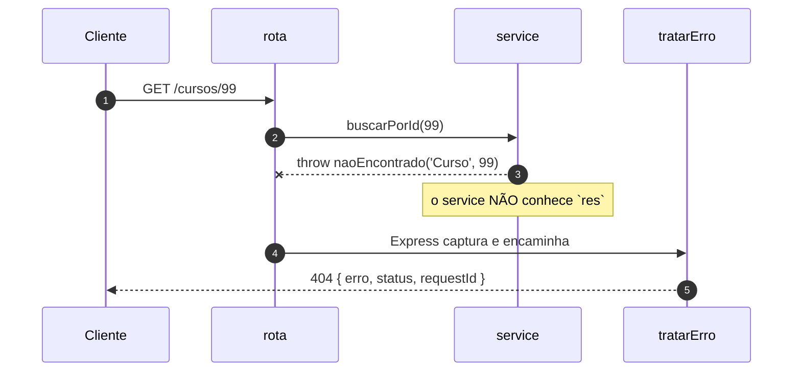

# 06 — Tratamento de erros

**Em uma frase:** as rotas dizem **o que** deu errado; um tratador central decide
**como** isso vira resposta HTTP.

<!-- sumario:inicio -->

**Sumário**

- [Por que importa](#por-que-importa)
- [Conceitos](#conceitos)
  - [Duas coisas muito diferentes com o mesmo nome](#duas-coisas-muito-diferentes-com-o-mesmo-nome)
  - [AppError](#apperror)
  - [Por que throw em vez de res.status(404)](#por-que-throw-em-vez-de-resstatus404)
  - [O que mudou no Express 5](#o-que-mudou-no-express-5)
  - [O tratador central](#o-tratador-central)
  - [A ordem, de novo](#a-ordem-de-novo)
  - [next(erro) — quando throw não serve](#nexterro-quando-throw-não-serve)
  - [A rede de segurança do processo](#a-rede-de-segurança-do-processo)
- [Na prática](#na-prática)
- [Erros comuns](#erros-comuns)
- [Cheatsheet](#cheatsheet)
- [Os princípios deste módulo](#os-princípios-deste-módulo)
- [Para ir além](#para-ir-além)
- [Pratique](#pratique)

<!-- sumario:fim -->

## Por que importa

- Sem um lugar central, cada rota inventa seu formato de erro e o cliente precisa
  de um `if` por endpoint.
- Vazar mensagem de bug entrega seu schema e sua infraestrutura de graça.
- Erro do cliente virando 500 faz você caçar um bug que não existe.

## Conceitos

### Duas coisas muito diferentes com o mesmo nome

Chamamos de "erro" duas situações que não têm quase nada em comum. Compare:

```ts
// Situação A: alguém mandou POST /cursos sem o campo `titulo`.
// Situação B: o banco de dados caiu e a conexão foi recusada.
```

Nas duas o pedido não foi atendido. Mas repare em tudo o que difere entre elas:
na **A**, quem errou foi quem chamou, e ele consegue consertar mandando o campo.
Na **B**, quem chamou fez tudo certo — não há nada que ele possa fazer diferente,
e quem precisa agir é você.

Essa diferença muda **todas** as decisões seguintes:

|                     | Situação A — erro esperado        | Situação B — bug              |
| ------------------- | --------------------------------- | ----------------------------- |
| Exemplo             | `titulo` faltando, id inexistente | `undefined.valor`, banco fora |
| Você previu?        | Sim, criou de propósito           | Não                           |
| Status              | 4xx                               | 500                           |
| Mensagem ao cliente | A real, útil                      | Genérica                      |
| Log                 | Não precisa (é rotina)            | Completo, com stack           |

Duas linhas dessa tabela merecem atenção, porque a razão delas não é óbvia.

**Por que a mensagem do bug é genérica.** Não é para esconder o problema de você
— é que a mensagem foi escrita por outra pessoa. `connect ECONNREFUSED
10.0.0.5:5432` conta a quem estiver do outro lado o IP e a porta do seu banco.
`column "senha_hash" does not exist` entrega o nome das suas colunas. A regra
prática: **mensagem que você escreveu pode ir ao cliente; mensagem que o runtime
escreveu, não.**

**Por que o erro esperado não precisa de log.** Um `404` não é um acontecimento;
é o funcionamento normal de uma API. Registrar todos eles enche o log de coisa
que ninguém vai ler — e afoga a linha que importa.

Repare que o critério que separou as duas situações **não foi a gravidade**. Foi
outra coisa: **quem consegue resolver**.

| Quem resolve | Status | O que a resposta precisa ter                | Quem é acordado |
| ------------ | ------ | ------------------------------------------- | --------------- |
| O cliente    | 4xx    | o que corrigir, com precisão                | ninguém         |
| Você         | 5xx    | uma referência para o suporte (`requestId`) | você            |

Errar essa classificação custa nas duas direções, e as duas doem em produção:

- **Bug virando 4xx** — some do alerta. Sua taxa de erro fica linda enquanto os
  usuários não conseguem usar o sistema. É o pior dos dois.
- **Erro do cliente virando 5xx** — polui o alerta com ruído, e a equipe aprende a
  ignorar a métrica que deveria acordá-la. Você caça um bug que não existe.

> **Dica:**
> O teste para classificar: **"o cliente consegue fazer alguma coisa diferente
> para isso funcionar?"** Se sim, 4xx. Se ele já fez tudo certo, 5xx.



### `AppError`

```ts
export class AppError extends Error {
  readonly status: number;
  readonly esperado = true; // ← "eu criei isto de propósito"
  constructor(mensagem: string, status = 400, detalhes?: unknown) { ... }
}

export const naoEncontrado = (recurso: string, id: string | number) =>
  new AppError(`${recurso} ${id} não encontrado`, 404);
```

As fábricas nomeadas (`naoEncontrado`, `conflito`, `semPermissao`) não são para
digitar menos: são para o status code de cada situação ficar definido **em um
lugar**. Sem elas, metade do código usa 404 e a outra 400 para a mesma coisa.

### Por que `throw` em vez de `res.status(404)`

```ts
function acharCurso(id: string): Curso {
  const curso = cursos.find(...);
  if (!curso) throw naoEncontrado('Curso', id); // não conhece `res`
  return curso;
}
```

A função não precisa saber que existe HTTP. Isso é o que permite reusá-la num
service ([módulo 08](./08-arquitetura-em-camadas.md)) e num worker de fila
(módulo 17, ainda não escrito), onde não há requisição nenhuma.

Repare no que acabou de acontecer: a função que **descobriu** o problema não é a
que **conta** o problema. Ela sabe que o curso não existe e que isso vale um 404;
não sabe — e não precisa saber — se a resposta vai sair em JSON, em HTML ou numa
linha de log. O `throw` é o que separa essas duas responsabilidades:

| Quem       | Sabe                                     | Não sabe                          |
| ---------- | ---------------------------------------- | --------------------------------- |
| O service  | que o curso não existe, e que isso é 404 | se a resposta é JSON, HTML ou log |
| O tratador | o formato da resposta, o `requestId`     | por que o erro aconteceu          |

E há um ganho estrutural que não é óbvio: `throw` **interrompe**. Um
`res.status(404).json(...)` no meio de uma função exige que quem chamou saiba
parar — e o `return` esquecido vira `ERR_HTTP_HEADERS_SENT` ou, pior, a execução
continua com um dado inválido.

```ts
// ❌ Continua rodando depois de "responder".
function achar(id) {
  const c = cursos.find(...);
  if (!c) res.status(404).json({});   // faltou return
  return c;                            // devolve undefined mundo afora
}

// ✅ Interrompe de verdade. Quem chamou não precisa lembrar de nada.
function achar(id) {
  const c = cursos.find(...);
  if (!c) throw naoEncontrado('Curso', id);
  return c;                            // aqui, `c` é garantidamente um Curso
}
```

O segundo tem um bônus de tipo: depois do `throw`, o TypeScript **sabe** que `c`
não é `undefined`. O primeiro obriga um `!` ou um `if` a mais em cada chamador.

### O que mudou no Express 5

```ts
app.get('/x', async (req, res) => {
  throw new Error('boom');
});
```

|                    | Express 4                               | Express 5        |
| ------------------ | --------------------------------------- | ---------------- |
| `throw` síncrono   | vai pro tratador                        | vai pro tratador |
| `throw` em `async` | **`unhandledRejection` → processo cai** | vai pro tratador |

> **Nota:**
> No Express 4, um id inexistente numa rota async derrubava a API inteira. Era
> por isso que existia `express-async-errors` e aquele `asyncHandler(fn)` que
> você vai encontrar em todo tutorial. **No Express 5, nada disso é necessário.**

### O tratador central

```ts
export function tratarErro(
  erro: unknown,
  _req: Request,
  res: Response,
  _next: NextFunction,
) {
  if (erro instanceof AppError) {
    return res.status(erro.status).json({ erro: erro.message, status: erro.status });
  }
  if (erro instanceof SyntaxError && 'body' in erro) {
    return res.status(400).json({ erro: 'JSON inválido', status: 400 }); // body quebrado
  }
  console.error(`[${res.locals.requestId}] ERRO NÃO TRATADO:`, erro); // log completo
  res.status(500).json({ erro: 'Erro interno do servidor', status: 500 }); // resposta genérica
}
```

Três detalhes que importam:

1. **4 parâmetros.** É contando os parâmetros declarados — a
   [aridade](./00-glossario.md) — que o Express reconhece um tratador de erro.
   Apagar o `_next` porque "não está sendo usado" transforma a função num
   middleware comum, que nunca recebe erro nenhum. E aí você cai no tratador
   padrão do Express, que responde **HTML com a stack trace inteira dentro** —
   para qualquer um que provocar um erro na sua API.
2. **O caso do `SyntaxError`.** `express.json()` joga isso quando o body é JSON
   malformado. Sem tratar, o cliente recebe 500 por ter mandado lixo.
3. **`requestId` na resposta.** O cliente cita o id no suporte, você acha todas as
   linhas de log daquela requisição. Vem do
   [módulo 05](./05-middlewares.md#passando-dados-entre-middlewares).

Vale insistir num ponto que parece detalhe e não é: **o formato do corpo de erro
é tão contrato quanto o formato do sucesso.**

Do outro lado, alguém escreve um tratamento de erro só. Se cada rota da sua API
inventar o seu — uma devolve `{erro}`, outra `{message}`, outra
`{error: {msg}}` — essa pessoa precisa de um `if` por endpoint. E o `if` que
faltar não estoura: ele simplesmente não encontra a mensagem, e o usuário vê uma
tela em branco sem explicação nenhuma.

Centralizar num lugar dá três coisas que rota a rota não dá:

| Ganho                         | Por quê                                                    |
| ----------------------------- | ---------------------------------------------------------- |
| Formato consistente           | Um lugar decide, e não há como divergir                    |
| Nada vaza por omissão         | O caminho do bug é sempre o genérico, mesmo para erro novo |
| Dá para **testar de uma vez** | Um teste cobre o formato de toda a API (módulo 12)         |

> **Cuidado:**
> O terceiro é o que sustenta os outros dois ao longo do tempo. A decisão "a stack
> nunca sai na resposta" não se defende sozinha: basta alguém adicionar
> `erro.message` durante uma investigação e esquecer de tirar. **Nada quebra** —
> a API continua respondendo 500. É por isso que o [módulo 12](./12-testes.md)
> tem um teste dedicado a isso.

### A ordem, de novo

```ts
app.use('/api/v1', rotas);
app.use(rotaNaoEncontrada); // 404: joga AppError, não responde direto
app.use(tratarErro); // sempre o último
```



> **Dica:**
> O 404 genérico jogar um `AppError` (em vez de responder) faz ele sair no
> **mesmo formato** dos outros erros. Detalhe pequeno, cliente agradecido.

### `next(erro)` — quando `throw` não serve

```ts
app.get('/callback', (_req, _res, next) => {
  setTimeout(() => {
    next(new AppError('erro num callback', 502)); // throw aqui escaparia
  }, 5);
});
```

Dentro de callback de biblioteca antiga (que não devolve Promise) o `throw` sai
do handler e ninguém captura. Aí `next(erro)` é a única saída.

### A rede de segurança do processo

```ts
process.on('unhandledRejection', (m) => {
  console.error(m);
  process.exit(1);
});
process.on('uncaughtException', (e) => {
  console.error(e);
  process.exit(1);
});
```

O tratador do Express só pega o que passou por uma requisição. Erro em timer ou
callback solto não passa.

> **Atenção:**
> A recomendação oficial do Node é **logar e sair**: um processo que continua
> depois de uma exceção não capturada está em estado desconhecido e pode
> corromper dados silenciosamente.

Essa recomendação contraria o instinto. Derrubar o processo de propósito parece a
última coisa que se quer fazer em produção — manter o servidor de pé não deveria
ser sempre melhor?

Não, e a conta é esta:

| Continuar rodando                             | Reiniciar                         |
| --------------------------------------------- | --------------------------------- |
| Estado interno possivelmente corrompido       | Estado limpo, conhecido           |
| Erros novos e estranhos, longe da causa       | Uma falha, no ponto certo, no log |
| Conexão de banco pendurada, memória vazando   | Tudo devolvido ao sistema         |
| Downtime **invisível** (responde, mas errado) | Downtime de 2 segundos, visível   |

A mesma ideia já apareceu no [módulo 11](./11-autenticacao.md): o processo morre
sem `JWT_SECRET` em vez de usar um segredo de exemplo. E é o oposto do
`try/catch` vazio, que é a forma mais eficiente de esconder um problema de si
mesmo.

> **Dica:**
> "Falhar rápido" vale para **inicialização e estado**, não para requisição. Um
> `400` não derruba nada — quem falha alto é o processo, não a resposta.

Quem reinicia é o orquestrador (Docker, systemd, PM2) —
módulo 16 (ainda não escrito). Encerrar sem cortar requisições em
andamento é _graceful shutdown_, no módulo 15 (ainda não escrito).

## Na prática

```bash
node src/exemplos/06-erros/servidor.ts
```

```bash
B=localhost:5054
curl -i $B/cursos/99            # 404 com requestId
curl -i $B/cursos/2/detalhes    # 409 lançado de rota ASYNC (Express 4 caía aqui)
curl -X POST $B/cursos -H 'Content-Type: application/json' -d '{}'      # 400 + detalhes
curl -X POST $B/cursos -H 'Content-Type: application/json' -d '{quebrado'  # 400, não 500
curl -i $B/bug                  # 500 genérico — veja a stack no TERMINAL
curl -i $B/bug-async            # idem, e o processo continua vivo
curl -i $B/callback             # 502 via next(erro)
curl -i $B/nada                 # 404 no mesmo formato
curl $B/cursos/1                # ainda de pé depois de dois bugs
```

Compare as duas saídas do `/bug`: o cliente recebe
`{"erro":"Erro interno do servidor","status":500,"requestId":"0e464f75"}`; o
terminal recebe `[0e464f75] ERRO NÃO TRATADO: TypeError: Cannot read properties
of undefined`. Mesmo id, informação diferente. É esse o desenho.

## Erros comuns

| Erro                                         | O que acontece                        | Correção             |
| -------------------------------------------- | ------------------------------------- | -------------------- |
| Tratador com 3 argumentos                    | Nunca recebe erro; stack vaza em HTML | 4 parâmetros         |
| Tratador antes das rotas                     | Erros das rotas não chegam nele       | Sempre o último      |
| `res.json({ erro: erro.message })` para tudo | Vaza schema e infra                   | Genérico em 5xx      |
| `catch (e) { console.log(e) }` e segue       | Erro engolido; resposta nunca vem     | `next(e)` ou `throw` |
| `throw` dentro de callback                   | Ninguém captura                       | `next(erro)`         |
| Entrada inválida → 500                       | Você caça bug que não existe          | Validar → 400        |
| Estado impossível → 400                      | Cliente corrige body à toa            | 409 Conflict         |
| Sem `unhandledRejection` handler             | Processo morre sem log nenhum         | Registrar e sair     |
| `asyncHandler(fn)` no Express 5              | Código morto                          | O router já dá await |

## Cheatsheet

```ts
throw new AppError(msg, status); // erro esperado
throw naoEncontrado('Curso', id); // 404
throw conflito('já emprestado'); // 409
next(erro); // dentro de callback

app.use(rotaNaoEncontrada); // penúltimo
app.use(tratarErro); // ÚLTIMO, 4 argumentos
```

| Situação                             | Status        |
| ------------------------------------ | ------------- |
| Campo faltando ou formato errado     | `400`         |
| Sem credencial / credencial ilegível | `401`         |
| Credencial ok, permissão não         | `403`         |
| Recurso não existe                   | `404`         |
| Método não permitido nessa rota      | `405`         |
| Estado atual impede a operação       | `409`         |
| Formato ok, semântica inválida       | `422`         |
| Rate limit                           | `429`         |
| Bug seu                              | `500`         |
| Dependência externa falhou           | `502` / `503` |

## Os princípios deste módulo

Recapitulando — cada linha é uma conclusão que o módulo mostrou acontecer:

| A ideia                                                                                                                        | Onde volta |
| ------------------------------------------------------------------------------------------------------------------------------ | ---------- |
| O que separa erro de bug não é a gravidade: é se quem chamou consegue fazer alguma coisa diferente para funcionar.             | 12, 13, 14 |
| Quem descobre o problema não é quem sabe como contá-lo. O `throw` deixa cada lado cuidar do que sabe.                          | 08, 17     |
| O formato do corpo de erro é contrato, igual ao do sucesso. Um lugar decide, e um teste só cobre a API inteira.                | 07, 12     |
| Mensagem que você escreveu pode ir ao cliente; mensagem escrita pelo runtime entrega o IP do seu banco e o nome das colunas.   | 11, 13     |
| Depois de um erro que ninguém previu, o processo está num estado desconhecido. Reiniciar limpo é mais barato que seguir torto. | 11, 16     |

## Para ir além

- **[Express — _Error Handling_](https://expressjs.com/en/guide/error-handling.html)**
  Inclui a mudança do Express 5: erro de rota `async` agora chega ao handler sozinho.
- **[Node.js — _Error API_](https://nodejs.org/api/errors.html)**
  A anatomia de um `Error` no Node, `cause` e os códigos padrão (`ERR_*`).
- **[RFC 9457 — _Problem Details for HTTP APIs_](https://www.rfc-editor.org/rfc/rfc9457.html)**
  Um formato **padrão** de corpo de erro (`application/problem+json`). Se você vai inventar um formato próprio, vale conhecer antes o que já existe.

## Pratique

👉 [`exercicios/06-erros/`](../exercicios/06-erros/)
