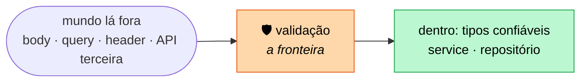
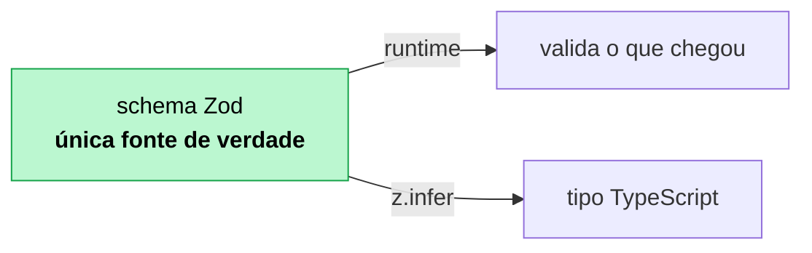
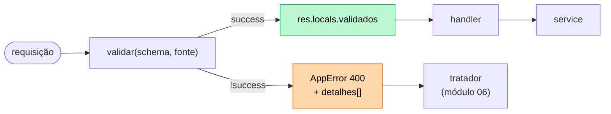

# 07 — Validação e contratos de entrada

**Em uma frase:** um schema Zod descreve o que a entrada pode ser — e o
TypeScript deriva o tipo daquele mesmo schema, sem você escrever duas vezes.

## Por que importa

- **Nunca confie no cliente.** `req.body` é `any`: um objeto que chegou pela rede.
- Validação manual e `type` são duas verdades que divergem no primeiro campo novo.
- Erro de validação bem formatado é a diferença entre o front marcar o campo certo
  e mostrar "algo deu errado".

## Conceitos

### A regra de ouro

> **Importante:**
> Todo dado que vem de fora é suspeito: body, query, params, headers, arquivo,
> resposta de API de terceiro. Não porque o usuário é malicioso — mas porque ele
> é **um cliente que você não controla**, e um dia vai mandar `horas: "8"`.

Valide quatro coisas: **tipo**, **formato**, **obrigatoriedade** e **limites**.

**O princípio: a validação é a fronteira do sistema.** Dentro dela, o código pode
confiar nos dados; fora, não. Sem uma fronteira nítida, a desconfiança se espalha
— cada função passa a fazer sua própria checagem defensiva, e ninguém sabe mais
quem já validou o quê.



Por que **antes** de tudo, e não "quando precisar":

| Validar na fronteira            | Validar espalhado                               |
| ------------------------------- | ----------------------------------------------- |
| Um lugar, fácil de auditar      | Checagem repetida, e a que falta é invisível    |
| Erro chega junto e completo     | Uma mensagem por vez, o usuário corrige em loop |
| O tipo depois dela é verdadeiro | `any` viajando três camadas adiante             |

> **Importante:**
> **`limites` é o item que mais se esquece, e o que mais custa.** `?porPagina=999999`
> não é dado inválido — é um pedido perfeitamente formado que derruba o servidor.
> Todo campo aberto (string, array, número, upload) precisa de um teto: é
> validação **e** é defesa contra negação de serviço (módulo 13).

### A dor sem Zod

```ts
// Módulo 03: 15 linhas por rota, e o tipo é uma segunda verdade
if (typeof titulo !== 'string' || titulo.trim() === '') return res.status(400)...
if (typeof horas !== 'number' || horas <= 0) return res.status(400)...
type Curso = { titulo: string; horas: number }; // ← precisa acompanhar na mão
```

### O ganho: uma fonte de verdade

```ts
export const criarCursoSchema = z
  .object({
    titulo: z.string().trim().min(3, '`titulo` precisa de 3+ caracteres').max(120),
    horas: z.number().int().positive().max(500),
    publicado: z.boolean().default(false),
    nivel: z.enum(['iniciante', 'intermediario', 'avancado']).default('iniciante'),
    contato: z.email().optional(), // no Zod 4; `z.string().email()` está deprecado
  })
  .strict(); // ← rejeita campo desconhecido

export type CriarCurso = z.infer<typeof criarCursoSchema>; // o tipo vem do schema
```



Mudar a regra muda o tipo, e o TypeScript aponta todo lugar que precisa
acompanhar. É o oposto de manter `type` e `validar()` sincronizados na mão.

**O princípio: duas fontes de verdade sempre divergem — a questão é quando.**

O `type` escrito à mão e o `if` de validação descrevem a mesma regra em dois
lugares. Nada obriga os dois a concordarem, e nada avisa quando param de
concordar: você adiciona um campo no `type`, esquece o `if`, e o TypeScript
continua feliz porque `req.body` é `any`.

Derivar um do outro (`z.infer`) elimina a categoria inteira de bug. É a mesma
ideia que aparece em:

| Onde                             | O derivado                       |
| -------------------------------- | -------------------------------- |
| Zod (07)                         | o tipo vem do schema             |
| `ReturnType<typeof criarX>` (08) | o tipo do service vem da fábrica |
| Prisma (10)                      | o client tipado vem do schema    |
| OpenAPI (20)                     | a documentação vem do schema Zod |

> **Dica:**
> **O custo:** o tipo passa a depender da biblioteca de validação. É aceitável no
> contrato HTTP, e é justamente por isso que o [módulo 08](./08-arquitetura-em-camadas.md)
> escreve os tipos de **domínio** à mão: o negócio não deve depender do Zod. O
> schema descreve o que a API aceita; o domínio, o que o negócio é. Eles se
> parecem hoje e podem divergir amanhã.

### `z.input` vs `z.output`

Um schema com `.default()` gera **dois** tipos:

```ts
type Entrada = z.input<typeof criarCursoSchema>; // publicado?: boolean
type Saida = z.output<typeof criarCursoSchema>; // publicado: boolean (garantido)
```

`z.infer` é apelido de `z.output` — é o que você quer 90% das vezes.

### `.strict()` — rejeite o que você não conhece

> **Atenção:**
> Sem ele, o Zod **descarta em silêncio** campo desconhecido. O cliente que
> digitou `hora` em vez de `horas` recebe "campo obrigatório" sem entender por
> quê. Com `.strict()`, ele recebe `Unrecognized key: "hora"`.

Segurança também: sem `.strict()`, `{ ...req.body }` num `Object.assign` pode
escrever campos que você nunca quis expor (`admin: true`).

### Query param: tudo é string

```ts
maxHoras: z.coerce.number().int().positive().optional(), // "5" → 5
```

> **Cuidado:**
> **Nunca `z.coerce.boolean()` em query:** `Boolean("false") === true`, então
> `?publicado=false` filtraria os publicados.

Mapeie explicitamente:

```ts
publicado: z.enum(['true', 'false']).transform((v) => v === 'true').optional(),
```

### A armadilha do `.partial()` para PATCH

```ts
const atualizar = criarCursoSchema.partial(); // ❌ parece certo, não é
```

> **Cuidado:**
> `.partial()` torna o campo opcional, **mas o `.default()` continua valendo**.
> Um `PATCH { "horas": 6 }` sai da validação com `publicado: false` e
> `nivel: 'iniciante'` — e sobrescreve o que estava salvo. PATCH que apaga campo
> em silêncio é dos bugs mais difíceis de perceber.

Correto: monte o schema de atualização a partir dos campos **sem** default.

```ts
const campos = { titulo: z.string()..., publicado: z.boolean() }; // sem default
export const criarSchema = z.object({ ...campos, publicado: campos.publicado.default(false) });
export const atualizarSchema = z.object(campos).partial().strict();
```

### O middleware `validar(schema, fonte)`

```ts
export function validar(schema: ZodType, fonte: 'body' | 'query' | 'params' = 'body') {
  return (req, res, next) => {
    const resultado = schema.safeParse(req[fonte]);
    if (!resultado.success) {
      throw new AppError('Dados inválidos', 400, formatarErros(resultado.error));
    }
    res.locals.validados = { ...res.locals.validados, [fonte]: resultado.data };
    next();
  };
}
```

Dois detalhes fáceis de errar:

**`req.body ?? {}`.** Sem `Content-Type: application/json`, o Express 5 deixa
`req.body` como `undefined` ([módulo 03](./03-express-basico.md)). Passar
`undefined` a um `z.object()` produz `expected object, received undefined` — e o
cliente não descobre qual campo falta. Com `{}`, ele recebe a lista de campos
obrigatórios.

> **Cuidado:**
> **Não faça `req[fonte] = resultado.data`** — e é o que quase todo tutorial faz.
> No Express 5 isso explode para query:
>
> ```
> TypeError: Cannot set property query of #<IncomingMessage> which has only a getter
> ```

O Express 5 transformou `req.query` em getter com parse lazy. `req.body` ainda é
gravável, `req.query` não. Guardar em `res.locals` funciona para as três fontes e
preserva o dado original (útil em log de auditoria).

Para ler com tipo, sem `as`:

```ts
export function validados<T>(res: Response, _schema: ZodType<T>, fonte = 'body'): T {
  // o schema é passado de novo só para o TS inferir o retorno
}

const { id } = validados(res, idSchema, 'params'); // id: number
```

### `parse` vs `safeParse`

|                | Comportamento                               | Quando usar                                   |
| -------------- | ------------------------------------------- | --------------------------------------------- |
| `parse(x)`     | Lança `ZodError`                            | Script, seed, código que já está em try/catch |
| `safeParse(x)` | `{ success, data }` \| `{ success, error }` | Middleware — você quer traduzir o erro        |

### Formato do erro

```json
{
  "erro": "Dados inválidos",
  "status": 400,
  "detalhes": [
    {
      "campo": "titulo",
      "mensagem": "`titulo` precisa de 3+ caracteres",
      "codigo": "too_small"
    },
    { "campo": "horas", "mensagem": "`horas` deve ser positivo", "codigo": "too_small" }
  ]
}
```

O Zod devolve **todos** os problemas de uma vez, não só o primeiro — o usuário
corrige o formulário inteiro numa passada. E `campo` é o que permite ao front
marcar o input certo.

### Validação vs regra de negócio

|                    | Validação             | Regra de negócio                       |
| ------------------ | --------------------- | -------------------------------------- |
| Pergunta           | "Está bem formado?"   | "É permitido agora?"                   |
| Precisa dos dados? | Não                   | Sim                                    |
| Exemplo            | `titulo` tem 3+ chars | Não existe outro curso com esse título |
| Onde               | Schema, no middleware | Service / handler                      |
| Status             | `400`                 | `409`, `403`, `422`                    |

**O princípio que separa as duas: validação é uma função pura da entrada; regra
de negócio depende do estado do mundo.**

A consequência é bem concreta, e não é sobre organização de pastas:

| Propriedade                      | Validação                    | Regra de negócio                   |
| -------------------------------- | ---------------------------- | ---------------------------------- |
| Mesma entrada → mesmo resultado? | **sempre**                   | não: hoje passa, amanhã é conflito |
| Precisa de I/O?                  | não                          | sim                                |
| Dá para rodar no **cliente**?    | sim (o front reusa o schema) | não                                |
| Pode ser cacheada?               | sim                          | não                                |

Por isso a validação pode acontecer no navegador **e** no servidor com o mesmo
schema — e por isso a regra de negócio só pode acontecer no servidor. O front que
checa "e-mail já existe" está fazendo uma sugestão de UX; a verdade é a checagem
do servidor, sempre, porque entre a pergunta e a gravação alguém pode ter
cadastrado.

> **Atenção:**
> O Zod não tem como saber que o título já existe. Não tente forçá-lo com
> `.refine()` assíncrono acessando o banco: isso mistura camadas, torna o schema
> impossível de reusar em teste e no front, e **ainda não resolve** — entre o
> `.refine()` e o `INSERT` existe uma janela de corrida. Quem garante unicidade
> de verdade é a constraint `UNIQUE` no banco ([módulo 09](./09-sqlite-e-sql.md)).

`.refine()` serve para regra entre **campos da mesma entrada**:

```ts
z.object({ inicio: z.coerce.date(), fim: z.coerce.date() }).refine(
  (d) => d.fim > d.inicio,
  { message: '`fim` deve ser depois', path: ['fim'] },
);
```

O `path` é o que faz o erro apontar para um campo — sem ele o front não sabe onde
marcar.

## Na prática

```bash
node src/exemplos/07-validacao/servidor.ts
```

```bash
B=localhost:5055
curl "$B/cursos?maxHoras=5"          # coerce: "5" → 5
curl "$B/cursos?publicado=false"     # o boolean feito à mão
curl "$B/cursos?maxHoras=abc"        # 400 com campo e código
curl $B/cursos/abc                   # 400: id não é número

curl -X POST $B/cursos -H 'Content-Type: application/json' \
  -d '{"titulo":"  Zod na prática  ","horas":3,"ano":2026}'   # trim + defaults

curl -X POST $B/cursos -H 'Content-Type: application/json' \
  -d '{"titulo":"ab","horas":-1,"ano":1200}'    # TRÊS erros de uma vez

curl -X POST $B/cursos -H 'Content-Type: application/json' \
  -d '{"titulo":"Teste ok","hora":3,"ano":2026}' # strict: Unrecognized key "hora"

curl -X PATCH $B/cursos/1 -H 'Content-Type: application/json' -d '{"horas":6}'
# ↑ confirme que `publicado` NÃO virou false

curl -X POST $B/periodos -H 'Content-Type: application/json' \
  -d '{"inicio":"2026-03-01","fim":"2026-01-01"}'  # refine
```

## Erros comuns

| Erro                                | O que acontece                        | Correção                    |
| ----------------------------------- | ------------------------------------- | --------------------------- |
| Confiar em `req.body`               | É `any`; qualquer coisa passa         | Sempre um schema            |
| Sem `.strict()`                     | Campo com typo é descartado calado    | `.strict()`                 |
| `criarSchema.partial()` no PATCH    | Defaults sobrescrevem o salvo         | Campos sem default          |
| `req.query = data` no Express 5     | `TypeError`: só tem getter            | `res.locals`                |
| `safeParse(req.body)` sem `?? {}`   | "expected object, received undefined" | `req.body ?? {}`            |
| `z.coerce.boolean()` em query       | `"false"` vira `true`                 | `enum + transform`          |
| `z.number()` em query               | Sempre falha: chega string            | `z.coerce.number()`         |
| Só o primeiro erro na resposta      | Usuário corrige um por vez            | Devolva `issues` inteiro    |
| Erro sem nome de campo              | Front não sabe onde marcar            | `path` no `.refine()`       |
| `.refine()` batendo no banco        | Schema deixa de ser testável          | Regra de negócio no service |
| Validar só na entrada, tipar na mão | Duas verdades divergem                | `z.infer`                   |

## Cheatsheet

```ts
z.string().trim().min(3).max(120).email().url().uuid().regex(/x/)
z.number().int().positive().min(0).max(100)
z.boolean()  z.date()  z.literal('x')
z.enum(['a', 'b'])                       // sem `enum` do TypeScript
z.array(z.string()).min(1).max(5)
z.object({}).strict()                    // rejeita chave extra
z.coerce.number()                        // "5" → 5   (para query/params)

.optional()   // pode faltar → undefined
.nullable()   // aceita null
.default(x)   // pode faltar → x na saída
.transform(fn) .refine(fn, { message, path })
schema.partial()  .pick({a:true})  .omit({b:true})  .extend({c:...})

schema.parse(x)      // lança ZodError
schema.safeParse(x)  // { success, data | error }
z.infer<typeof s>    // = z.output; o tipo derivado
z.input<typeof s>    // antes dos defaults
```



## Os princípios deste módulo

| Princípio                                                                         | Onde reaparece |
| --------------------------------------------------------------------------------- | -------------- |
| **A validação é a fronteira:** dentro dela dá para confiar, fora não.             | 08, 11, 13     |
| **Duas fontes de verdade sempre divergem** — derive uma da outra.                 | 08, 10, 20     |
| **Todo campo aberto precisa de um teto** — limite é validação e é defesa.         | 13, 15         |
| **Validação é função pura da entrada; regra de negócio depende do estado.**       | 08, 11         |
| **Rejeite o que você não conhece** (`.strict()`) em vez de descartar em silêncio. | 13             |

## Para ir além

- **[Zod — documentação oficial](https://zod.dev/)**
  A referência de schemas, `safeParse` e `z.infer`. Confira a v4: `z.string().email()` saiu em favor de `z.email()`.
- **[OWASP — _Input Validation Cheat Sheet_](https://cheatsheetseries.owasp.org/cheatsheets/Input_Validation_Cheat_Sheet.html)**
  Por que validar por **lista de permissão** e não por lista de bloqueio — o princípio que sustenta este módulo.
- **[JSON Schema](https://json-schema.org/)**
  O padrão independente de linguagem para descrever dados. É o que o OpenAPI usa no módulo 20.

## Pratique

👉 [`exercicios/07-validacao/`](../exercicios/07-validacao/)
