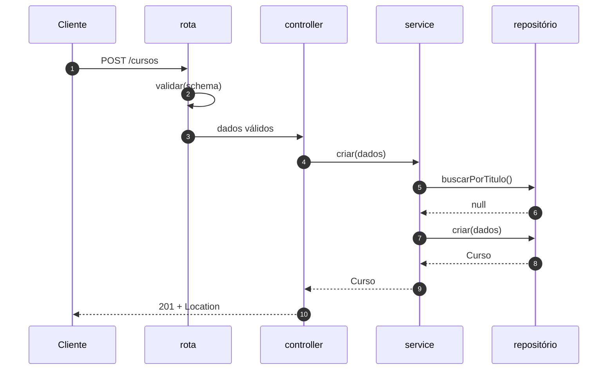
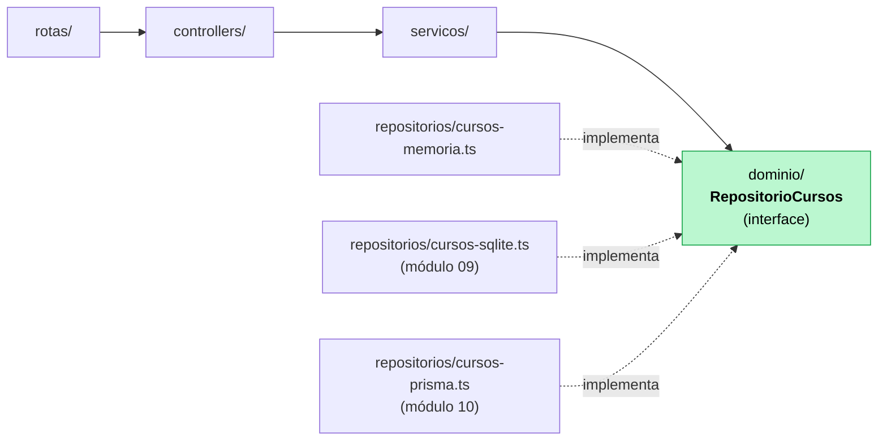

# 08 — Arquitetura em camadas

**Em uma frase:** separar "responder HTTP", "decidir a regra" e "guardar o dado"
em arquivos diferentes, com as dependências apontando sempre para dentro.

<!-- @import "[TOC]" {cmd="toc" depthFrom=2 depthTo=3 orderedList=false} -->

## Por que importa

- Rota de 200 linhas fazendo tudo é impossível de testar e de reusar.
- A regra de negócio precisa valer também no worker de fila, no seed, no CLI.
- Trocar o banco deve mexer em **um** arquivo, não em vinte.

## Conceitos

### As quatro camadas

| Camada          | Responsabilidade                   | Conhece              | **Não** conhece |
| --------------- | ---------------------------------- | -------------------- | --------------- |
| **Rota**        | Mapear caminho+método → controller | Express, controller  | regra, banco    |
| **Controller**  | Traduzir HTTP ↔ service            | `req`/`res`, status  | regra, banco    |
| **Service**     | **Regras de negócio**              | domínio, repositório | HTTP, SQL       |
| **Repositório** | Guardar e buscar                   | banco                | regra, HTTP     |

E no centro, o **domínio**: tipos e a interface do repositório. Não importa nada.



### A regra da direção das dependências



> [!IMPORTANT]
> As flechas apontam para **dentro**. O service depende da _interface_, nunca do
> arquivo concreto — e é isso que faz trocar array por SQLite (módulo 09) por
> Prisma (10) não alterar uma linha do service.

> [!TIP]
> Teste rápido do seu código: se `servicos/*.ts` importa `express`, alguma
> responsabilidade escorregou de camada.

### O contrato do repositório

```ts
// dominio/curso.ts — nenhum import
export type RepositorioCursos = {
  listar(filtro: FiltroCursos): Promise<Curso[]>;
  buscarPorId(id: number): Promise<Curso | null>;
  buscarPorTitulo(titulo: string): Promise<Curso | null>;
  criar(dados: NovoCurso): Promise<Curso>;
  atualizar(id: number, dados: AtualizacaoCurso): Promise<Curso | null>;
  remover(id: number): Promise<boolean>;
};
```

Dois detalhes deliberados:

1. **`Promise` mesmo na versão em memória**, que é síncrona. A interface tem de
   servir ao banco de verdade, que é assíncrono. Se fosse síncrona hoje, o
   módulo 09 mudaria a assinatura e o service inteiro junto.
2. **A interface fala a linguagem do domínio.** Nada de `findBySQL`, nada de
   retorno com formato de linha de banco. `Curso`, não `CursoRow`.

### Injeção de dependência sem framework

```ts
export function criarServicoCursos(repositorio: RepositorioCursos) {
  return {
    async criar(dados: NovoCurso) {
      const existente = await repositorio.buscarPorTitulo(dados.titulo);
      if (existente) throw conflito('Já existe um curso com esse título');
      return repositorio.criar(dados);
    },
  };
}
```

> [!NOTE]
> É só isso: **receber por argumento em vez de importar**. Sem NestJS, sem
> decorator, sem container. No teste você passa um repositório falso; em
> produção, o de verdade.

Se o repositório fosse importado no topo do arquivo, testar exigiria mockar
módulo — frágil, lento e acoplado ao caminho do arquivo.

O tipo sai de graça:

```ts
export type ServicoCursos = ReturnType<typeof criarServicoCursos>;
```

### Composition root

Um único arquivo conhece todas as camadas e monta de dentro para fora:

```ts
// servidor.ts
const repositorio = criarRepositorioEmMemoria(dadosIniciais); // ← trocar isto = trocar de banco
const servico = criarServicoCursos(repositorio);
const rotas = criarRotasCursos(servico);
app.use('/api/v1/cursos', rotas);
```

Essa é a resposta prática para "onde a decisão concreta é tomada?". Aqui — e só
aqui.

### O que vai em cada camada, na dúvida

| A pergunta que o código responde    | Camada      |
| ----------------------------------- | ----------- |
| "Qual URL?"                         | Rota        |
| "Qual status code? 201 ou 200?"     | Controller  |
| "Pode publicar um curso de 1 hora?" | Service     |
| "Título repetido é conflito?"       | Service     |
| "Como isso vira SQL?"               | Repositório |
| "O formato do body é válido?"       | Schema (07) |

> [!TIP]
> Um controller com mais de 10 linhas por método quase sempre está fazendo
> trabalho de service. Um repositório com `if` de negócio, idem.

### DTO

O objeto que atravessa a fronteira não precisa ser o registro do banco.

```ts
type Curso = { id; titulo; horas; publicado }; // domínio
type NovoCurso = { titulo; horas }; // entrada: sem id (é do banco), sem publicado (é regra)
```

Não expor `publicado` na criação **é** a segurança: o cliente não pode publicar
um curso pulando as pré-condições. Mesma ideia do `.strict()` do
[módulo 07](./07-validacao-zod.md).

### A pegadinha do `exactOptionalPropertyTypes`

```ts
const atualizado = { ...atual, ...dados }; // ❌ não compila, e é bom que não
```

> [!CAUTION]
> Se `dados` é `{ titulo: undefined }` — chave presente, valor ausente — o spread
> grava `undefined` sobre o título salvo e **apaga** o dado. A flag do nosso
> tsconfig recusa isso na compilação.

Copie só o que está definido:

```ts
if (dados.titulo !== undefined) atualizado.titulo = dados.titulo;
```

Pelo mesmo motivo, os tipos do domínio declaram `titulo?: string | undefined`
explicitamente: é o que o Zod produz, e sem o `| undefined` não encaixa.

### Quando **não** usar camadas

Sejamos honestos: um script de 80 linhas com três rotas não precisa de quatro
níveis. Camadas custam arquivos, indireção e navegação.

| Situação                             | Faça                             |
| ------------------------------------ | -------------------------------- |
| Protótipo, script, 3 rotas           | Handler direto. Sem camada.      |
| CRUD simples sem regra               | Rota + repositório. Sem service. |
| Tem regra de negócio                 | Service. É o ganho real.         |
| Vai trocar de banco / testar isolado | Interface de repositório.        |

A ordem de adoção que faz sentido: **service primeiro** (regra fora do handler),
**repositório depois** (quando o banco entrar), **controller por último** (quando
a rota ficar grande).

### Clean Architecture e DDD, sem hype

O que vale a pena da Clean Architecture é uma ideia só: **a regra de negócio não
depende de framework nem de banco**. Isso é o que este módulo faz.

O que costuma ser excesso em API pequena e média:

| Ideia                           | Vale?                                            |
| ------------------------------- | ------------------------------------------------ |
| Dependência apontando p/ dentro | **Sim.** É o núcleo, e é barato.                 |
| Interface de repositório        | **Sim**, se você troca de banco ou testa isolado |
| Um arquivo por use case         | Depende. Vira 60 arquivos de 8 linhas.           |
| Entidade rica, value object     | Só com domínio realmente complexo                |
| `IUsuarioRepositoryImpl`        | Não. É burocracia de nome.                       |
| Mapper entre 4 representações   | Raramente compensa                               |

DDD é ótimo para domínio complicado (seguro, logística, contabilidade), onde a
regra é o produto. Para um CRUD com autenticação, o custo não retorna.

## Na prática

```bash
node src/exemplos/08-camadas/servidor.ts
```

```bash {cmd=true}
B=localhost:5056/api/v1/cursos
curl "$B?publicado=true"
curl -X POST $B -H 'Content-Type: application/json' -d '{"titulo":"Camadas","horas":5}'
curl -X POST $B -H 'Content-Type: application/json' -d '{"titulo":"Camadas","horas":5}' # 409
curl -X POST $B/2/publicar      # regra do service
curl -X POST $B/2/publicar      # 409: já publicado
curl -X POST $B/3/publicar      # 400: menos de 2h
curl -X DELETE $B/2             # 409: publicado não se apaga
```

Abra os arquivos e confira as importações:

| Arquivo                          | Importa                    |
| -------------------------------- | -------------------------- |
| `dominio/curso.ts`               | **nada**                   |
| `servicos/cursos.ts`             | domínio + `AppError`       |
| `repositorios/cursos-memoria.ts` | domínio                    |
| `controllers/cursos.ts`          | tipos do Express + service |
| `servidor.ts`                    | todos                      |

## Erros comuns

| Erro                                      | O que acontece                 | Correção              |
| ----------------------------------------- | ------------------------------ | --------------------- |
| Regra no controller                       | Worker e CLI a ignoram         | Regra no service      |
| Service importando `express`              | Não dá para testar sem HTTP    | Só domínio            |
| Repositório com `if` de negócio           | Regra em dois lugares          | Repositório só guarda |
| Service importando o repositório concreto | Trocar banco quebra o service  | Depender da interface |
| Interface síncrona no repositório         | Banco real quebra a assinatura | `Promise` sempre      |
| Repositório devolvendo referência interna | Alteram o "banco" pelas costas | Devolva cópia         |
| Camadas num script de 3 rotas             | 12 arquivos para nada          | Handler direto        |
| `try/catch` em todo controller            | Repete o tratador central      | Deixe o erro subir    |
| `{ ...atual, ...dados }` no update        | `undefined` apaga campo        | Copiar só o definido  |

## Cheatsheet

```
rotas/       → caminho + método + validação
controllers/ → req → service → status + res
servicos/    → REGRA. lança AppError. sem HTTP, sem SQL
repositorios/→ guarda. sem regra
dominio/     → tipos + interface do repositório. importa nada
servidor.ts  → composition root: monta tudo
```

```ts
// injeção de dependência, versão completa
export function criarServicoX(repo: RepositorioX) { return { ... }; }
export type ServicoX = ReturnType<typeof criarServicoX>;

const repo = criarRepositorioSQLite(db);  // troque aqui, só aqui
const servico = criarServicoX(repo);
```

## Pratique

👉 [`exercicios/08-camadas/`](../exercicios/08-camadas/)
