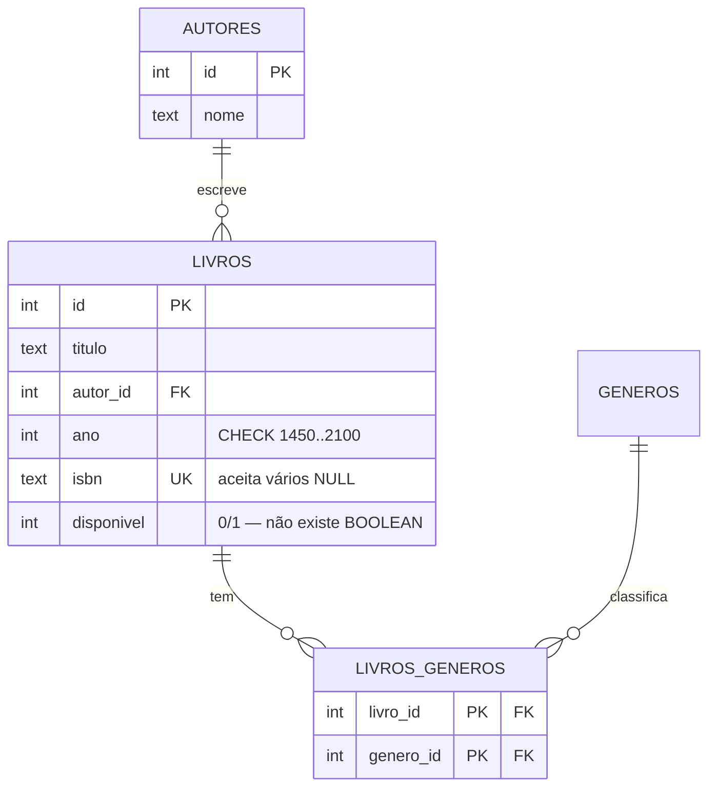
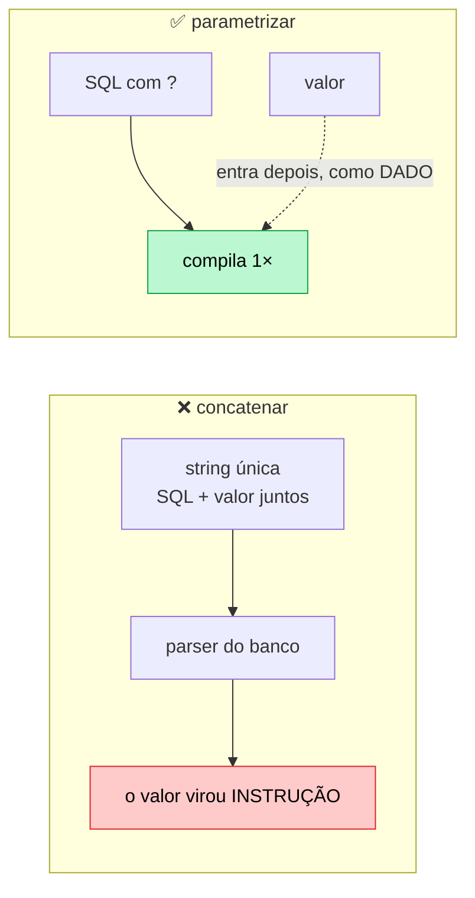
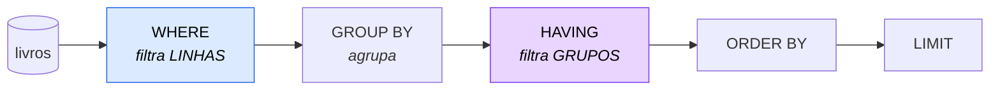
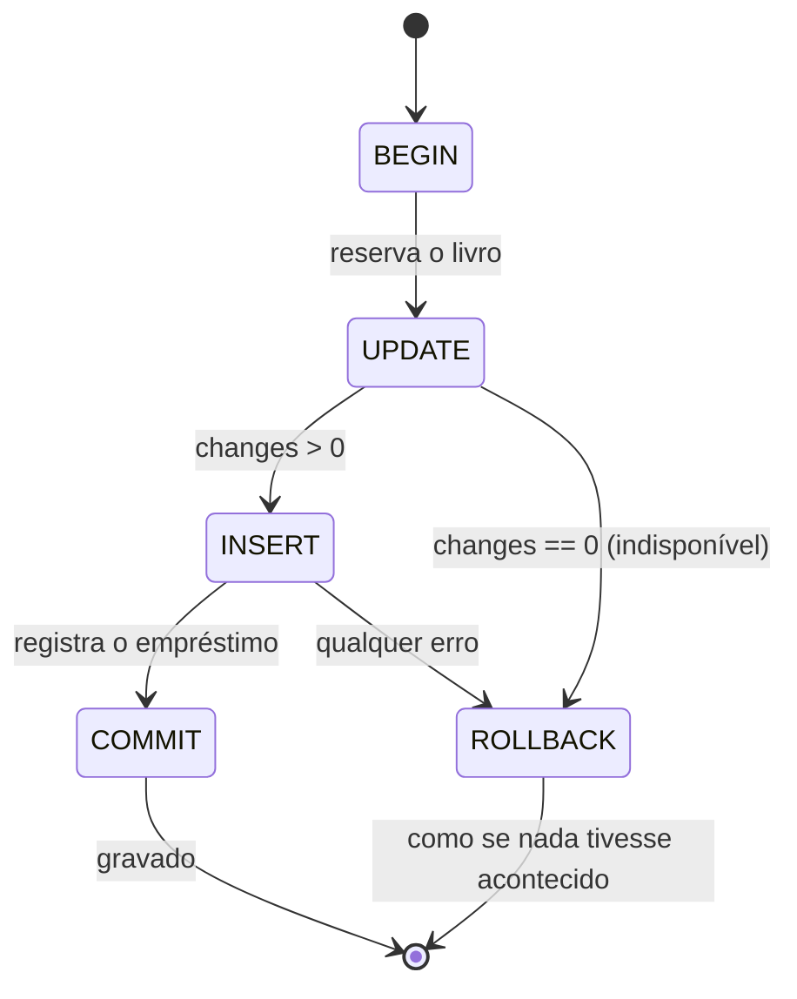

# 09 — Banco de dados e SQL com SQLite

**Em uma frase:** trocar o array em memória por um banco de verdade — e descobrir
que só a camada de repositório muda.

## Por que importa

- Array em memória some no restart. Toda API real tem um banco.
- SQL é a habilidade mais transferível de backend: vale para Postgres, MySQL, tudo.
- Quem aprende ORM antes de SQL não entende o que o ORM está fazendo.

## Conceitos

### Por que SQLite para estudar (e para produção)

|              |                                                       |
| ------------ | ----------------------------------------------------- |
| Instalação   | Zero. `node:sqlite` vem no Node 24                    |
| O banco é    | **um arquivo** — copiar é backup                      |
| SQL          | De verdade. O que você aprende transfere              |
| Concorrência | Um escritor por vez (com WAL, leitores não bloqueiam) |
| Limite real  | Escrita muito concorrente. Aí é Postgres              |

Não é banco de brinquedo: roda em bilhões de dispositivos e serve muito bem APIs
de leitura intensa.

### Modelagem

```sql
CREATE TABLE livros (
  id         INTEGER PRIMARY KEY,       -- alias de ROWID: autoincrementa
  titulo     TEXT    NOT NULL,
  autor_id   INTEGER NOT NULL,
  ano        INTEGER NOT NULL CHECK (ano BETWEEN 1450 AND 2100),
  isbn       TEXT    UNIQUE,            -- UNIQUE aceita vários NULL
  disponivel INTEGER NOT NULL DEFAULT 1, -- não existe BOOLEAN: 0/1
  FOREIGN KEY (autor_id) REFERENCES autores(id) ON DELETE RESTRICT
);
```

| Restrição     | Garante                                                   |
| ------------- | --------------------------------------------------------- |
| `PRIMARY KEY` | Identidade única; já é um índice                          |
| `NOT NULL`    | Campo obrigatório                                         |
| `UNIQUE`      | Sem duplicata (imune a corrida, ao contrário do seu `if`) |
| `CHECK`       | Faixa de valores                                          |
| `FOREIGN KEY` | A referência existe                                       |

> **Cuidado:**
> **O SQLite ignora `FOREIGN KEY` por padrão.** Sem `PRAGMA foreign_keys = ON` em
> **cada conexão**, suas chaves estrangeiras são comentário.

**Validar no código vs restringir no banco:** a validação protege da sua API; a
restrição protege de tudo — script de importação, migration, alguém no console de
produção às 3 da manhã. Faça as duas.

### Relacionamentos

| Tipo | Como se modela       | Exemplo                               |
| ---- | -------------------- | ------------------------------------- |
| 1-N  | FK no lado "muitos"  | `livros.autor_id`                     |
| N-N  | **tabela de junção** | `livros_generos(livro_id, genero_id)` |
| 1-1  | FK com `UNIQUE`      | `perfis.usuario_id UNIQUE`            |



Na tabela de junção, use **chave primária composta** — o par vira único e o mesmo
gênero não entra duas vezes no mesmo livro, sem você checar nada:

```sql
PRIMARY KEY (livro_id, genero_id)
```

**Normalização o suficiente:** cada fato num lugar só. O nome do autor mora em
`autores`, não repetido em cada livro — senão corrigir um typo exige um UPDATE em
mil linhas, e duas delas vão ficar diferentes. Desnormalize depois, com número na
mão (módulo 15, ainda não escrito), não por antecipação.

### SQL injection — e por que `?` resolve

```ts
const malicioso = "x'; DROP TABLE livros; --";

// ERRADO: o valor vira instrução
db.exec(`SELECT * FROM livros WHERE titulo = '${malicioso}'`);
// o banco lê: SELECT ... WHERE titulo = 'x'; DROP TABLE livros; --'

// CERTO: o valor é DADO
db.prepare('SELECT * FROM livros WHERE titulo = ?').get(malicioso); // 0 resultados
```

> **Importante:**
> Parametrizar **não é escapar aspas**. O valor viaja separado do SQL — o banco
> recebe a query já compilada e os dados à parte. Por isso não existe caractere
> que "escape" da parametrização.

Vale parar aqui, porque o que você acabou de ver não é sobre SQL.

Repare no que deu errado na primeira versão: o texto que o usuário mandou foi
**juntado** ao comando, virando uma string só, e essa string foi entregue a
alguém que sabe interpretar comandos. O banco não tinha como distinguir a parte
que era ordem da parte que era conteúdo — para ele chegou tudo junto.

Essa falha tem o mesmo formato em toda parte, só troca de nome:

| Contexto | A instrução | Como se faz certo                       |
| -------- | ----------- | --------------------------------------- |
| Banco    | SQL         | query parametrizada (`?`)               |
| Shell    | comando     | `spawn(cmd, [args])`, nunca `exec(str)` |
| HTML     | marcação    | escapar na saída / template que escapa  |
| Log      | formato     | log estruturado (JSON), módulo 14       |
| E-mail   | cabeçalho   | recusar `\n` no assunto                 |

| Contexto | A instrução | Como se faz certo                       |
| -------- | ----------- | --------------------------------------- |
| Banco    | SQL         | query parametrizada (`?`)               |
| Shell    | comando     | `spawn(cmd, [args])`, nunca `exec(str)` |
| HTML     | marcação    | escapar na saída / template que escapa  |
| Log      | formato     | log estruturado (JSON), módulo 14       |
| E-mail   | cabeçalho   | recusar `\n` no assunto                 |

A saída errada é tentar limpar o texto: procurar as aspas, as barras, os
caracteres perigosos, e neutralizá-los. Isso é escapar — e o problema é que você
precisa acertar a lista **inteira** de caracteres perigosos daquele
interpretador específico, para sempre, inclusive quando ele ganhar um caractere
especial novo na versão seguinte.

A saída certa é não juntar. Mandar a instrução por um canal e o dado por outro
faz a pergunta "este caractere é perigoso?" deixar de existir — o dado nunca vai
ser lido como instrução, seja ele qual for.

**A regra, que vale muito além de SQL: nunca misture instrução com dado.**

> **Cuidado:**
> Validar (módulo 07) **não** substitui parametrizar. Um título legítimo pode
> conter apóstrofo — `O'Brien` é nome de gente, não ataque. Validação decide o que
> é um valor aceitável; parametrização decide que ele **é um valor**. As duas
> coisas, sempre.



Quando você precisa montar SQL dinâmico, os **pedaços** são strings suas e só os
**valores** vão em `?`:

```ts
if (filtro.titulo) {
  condicoes.push('titulo LIKE ?');
  valores.push(`%${filtro.titulo}%`); // o % vai no VALOR
}
const where = condicoes.length ? `WHERE ${condicoes.join(' AND ')}` : '';
```

### A API do `node:sqlite`

```ts
import { DatabaseSync } from 'node:sqlite';

const db = new DatabaseSync('data/app.sqlite'); // ou ':memory:'
db.exec('PRAGMA foreign_keys = ON'); // sempre
db.exec('PRAGMA journal_mode = WAL'); // leitores não bloqueiam escritor

const stmt = db.prepare('SELECT * FROM livros WHERE ano = ?'); // compila 1×
stmt.get(1969); // primeira linha ou undefined
stmt.all(1969); // array

const r = db.prepare('INSERT INTO livros (titulo) VALUES (?)').run('X');
r.lastInsertRowid; // id gerado
r.changes; // linhas afetadas
```

`changes` é mais útil do que parece: `UPDATE ... WHERE id = ?` com
`changes === 0` significa "esse id não existe" — sem um `SELECT` extra.

É **síncrono**, e para SQLite isso é uma vantagem: sem round-trip de rede, o
overhead de Promise custaria mais que a própria query. Mesmo assim a **interface**
do repositório é `Promise` (ver [módulo 08](./08-arquitetura-em-camadas.md)),
porque Postgres é assíncrono.

### JOIN

```sql
SELECT l.titulo, a.nome AS autor
  FROM livros l
  JOIN autores a ON a.id = l.autor_id;      -- INNER: só quem tem par
```

```sql
SELECT a.nome, COUNT(l.id) AS livros
  FROM autores a
  LEFT JOIN livros l ON l.autor_id = a.id   -- mantém autor sem livro
 GROUP BY a.id;
```

> **Atenção:**
> O `LEFT` aqui é a diferença entre um relatório certo e um relatório que **omite
> silenciosamente** os autores com zero livros.

### GROUP BY, WHERE e HAVING

```sql
SELECT (ano/10)*10 AS decada, COUNT(*) AS quantos
  FROM livros
 WHERE disponivel = 1     -- filtra LINHAS, antes de agrupar
 GROUP BY decada
HAVING COUNT(*) >= 2      -- filtra GRUPOS, depois de agrupar
 ORDER BY decada;
```



Confundir `WHERE` com `HAVING` é o erro clássico de quem está aprendendo — e o
diagrama acima é a resposta: um roda antes de agrupar, o outro depois.

### Índices e `EXPLAIN QUERY PLAN`

```sql
EXPLAIN QUERY PLAN SELECT * FROM livros WHERE ano = 1969;
-- SCAN livros                                   ← lê a tabela TODA
CREATE INDEX idx_livros_ano ON livros(ano);
-- SEARCH livros USING INDEX idx_livros_ano      ← vai direto
```

> **Dica:**
> `SCAN` com 5 linhas é instantâneo; com 5 milhões é a diferença entre 1 ms e 4
> segundos. **`EXPLAIN QUERY PLAN` responde "por que minha query está lenta"** —
> use antes de otimizar por palpite.

Índice não é grátis: ocupa espaço e deixa `INSERT`/`UPDATE` mais lentos (o índice
também é atualizado). Indexe as colunas que aparecem em `WHERE`, `JOIN` e
`ORDER BY` das queries que você **realmente roda**.

### Transações e ACID

```ts
db.exec('BEGIN');
try {
  const { changes } = db
    .prepare('UPDATE livros SET disponivel = 0 WHERE id = ? AND disponivel = 1')
    .run(id);
  if (changes === 0) throw new Error('Livro indisponível');

  db.prepare('INSERT INTO emprestimos (livro_id, quem) VALUES (?, ?)').run(id, quem);
  db.exec('COMMIT');
} catch (erro) {
  db.exec('ROLLBACK'); // desfaz TUDO desde o BEGIN
  throw erro;
}
```

| Letra            | Significa                                        |
| ---------------- | ------------------------------------------------ |
| **A**tomicidade  | Tudo ou nada                                     |
| **C**onsistência | As restrições valem no fim da transação          |
| **I**solamento   | Uma transação não vê o meio de outra             |
| **D**urabilidade | Depois do `COMMIT`, sobrevive a queda de energia |



A pergunta prática é: **até onde vai uma transação?** Duas escritas? Cinco? A
requisição inteira?

O critério não é técnico, é do negócio. "Emprestar um livro" é **uma** coisa para
quem usa o sistema. Que por baixo sejam duas escritas — marcar o livro como
indisponível e registrar o empréstimo — é detalhe de implementação, e quem usa
nunca deveria conseguir observar o meio do caminho.

Existe um jeito objetivo de achar o limite: **liste os estados possíveis se o
processo morrer entre uma escrita e outra.** Se algum desses estados é
inaceitável, as duas operações pertencem à mesma transação.

| Se cair entre as duas escritas | Estado resultante                             | Aceitável?                            |
| ------------------------------ | --------------------------------------------- | ------------------------------------- |
| Sem transação                  | livro indisponível, sem empréstimo registrado | **não** — ninguém consegue devolvê-lo |
| Com transação                  | nada aconteceu                                | sim                                   |

> **Atenção:**
> Transação longa é o erro do outro lado: ela segura locks e trava as demais.
> **Nunca chame API externa, envie e-mail ou espere I/O de rede dentro de uma
> transação** — o banco fica parado esperando um serviço que você não controla.
> Isso vira job em fila (módulo 17).

> **Importante:**
> Repare no `AND disponivel = 1` dentro do `UPDATE`: é assim que se evita
> corrida. Um `SELECT` antes do `UPDATE` deixaria uma janela entre os dois em que
> outra requisição poderia emprestar o mesmo livro.
>
> **O princípio: deixe o banco decidir, não o seu `if`.** Entre o `SELECT` e o
> `UPDATE` da sua aplicação existe tempo; dentro de um `UPDATE ... WHERE`, não —
> ele é atômico. O `changes === 0` é a resposta do banco dizendo "outro chegou
> antes".
>
> A mesma ideia aparece como constraint `UNIQUE` (unicidade que o `if` do service
> não garante sob concorrência) e como `CHECK`. **Regra que o banco consegue
> garantir, garanta no banco** — ele é o único ponto por onde toda escrita passa.

### Migrations à mão

```ts
export const migrations = [
  { nome: '001_criar_cursos', sql: `CREATE TABLE cursos (...)` },
  { nome: '002_indice_publicado', sql: `CREATE INDEX ...` },
];
```

Uma tabela `_migrations` guarda o que já rodou. Duas regras:

1. **Migration é imutável.** Nunca edite uma que já rodou em produção — o banco de
   lá não vai reexecutá-la. Precisa mudar? Nova migration.
2. **DDL + registro na mesma transação.** Senão uma falha no meio deixa a tabela
   criada e a migration não registrada, e a próxima execução falha para sempre.

O Prisma ([módulo 10](./10-prisma-orm.md)) faz exatamente isso, com uma tabela
`_prisma_migrations`.

### O ganho da camada de repositório, na prática

Compare os dois servidores:

```bash
diff <(sed -n '/^const app/,$p' src/exemplos/08-camadas/servidor.ts) \
     <(sed -n '/^const app/,$p' src/exemplos/09-sqlite/servidor.ts)
```

O que mudou foi a construção do repositório. `criarServicoCursos`,
`criarRotasCursos`, os schemas e o tratador de erro são **importados dos módulos
anteriores**, sem cópia e sem alteração. Era isso que a interface prometia.

### `node:sqlite` vs `better-sqlite3`

`better-sqlite3` é maduro, mais rápido em alguns casos e tem API mais rica
(`.pluck()`, `.iterate()`, transações como função). O `node:sqlite` é embutido —
zero dependência, zero compilação nativa. Para estudar, embutido ganha. Em
produção, `better-sqlite3` ainda é a escolha mais comum.

## Na prática

```bash
node src/exemplos/09-sqlite/01-sql-na-mao.ts   # SQL do zero, banco em memória
node src/exemplos/09-sqlite/servidor.ts        # a API do módulo 08 sobre SQLite
```

O primeiro imprime nove seções, incluindo o `EXPLAIN QUERY PLAN` antes e depois do
índice, e a transação sendo desfeita.

> **Atenção:**
> Diferente de todos os módulos anteriores, **este exemplo grava em disco** — o
> banco fica em `data/exemplo-09.sqlite` e sobrevive quando você desliga o
> servidor. É a diferença entre um array em memória e um banco de verdade, e é o
> ponto do módulo.
>
> A consequência prática: os `curl` abaixo dão os status prometidos **na primeira
> vez**. Rodando de novo, o `POST` que dava `201` passa a dar `409`, porque o
> curso já está gravado. Para recomeçar do zero, apague o arquivo:
>
> ```bash
> rm -f data/exemplo-09.sqlite*
> ```

```bash
B=localhost:5057/api/v1/cursos
curl "$B?publicado=true"
curl -X POST $B -H 'Content-Type: application/json' -d '{"titulo":"SQL na mão","horas":6}'
curl -X POST $B -H 'Content-Type: application/json' -d '{"titulo":"sql NA mão","horas":6}' # 409
curl -X POST $B/2/publicar
```

> **Dica:**
> Depois **derrube o servidor com Ctrl+C e suba de novo**: os dados continuam lá.
> É a diferença que o módulo inteiro existe para mostrar.

## Erros comuns

| Erro                                   | O que acontece               | Correção                           |
| -------------------------------------- | ---------------------------- | ---------------------------------- |
| Esquecer `PRAGMA foreign_keys = ON`    | FKs ignoradas em silêncio    | Em toda conexão                    |
| Concatenar valor no SQL                | SQL injection                | Sempre `?`                         |
| `WHERE x = ${input}` "escapado"        | Ainda é injeção              | Parametrizar, não escapar          |
| `SELECT` antes de `UPDATE` para checar | Corrida entre os dois        | Condição no `UPDATE` + `changes`   |
| Sem `BEGIN`/`COMMIT` em operação dupla | Estado impossível no banco   | Transação                          |
| `INNER JOIN` num relatório de contagem | Omite quem tem zero          | `LEFT JOIN`                        |
| `HAVING` no lugar de `WHERE`           | Filtra grupo em vez de linha | `WHERE` antes de agrupar           |
| `SET x = ?` com valor `undefined`      | Grava `NULL` e apaga o campo | Montar o `SET` dinamicamente       |
| Índice em tudo                         | `INSERT` lento, disco cheio  | Só o que aparece em `WHERE`/`JOIN` |
| Editar migration já aplicada           | Bancos divergem              | Nova migration                     |
| `boolean` no SQLite                    | Não existe                   | `INTEGER` 0/1 + converter          |
| Commitar o `.sqlite`                   | Conflito binário no git      | `.gitignore`                       |

## Cheatsheet

```sql
CREATE TABLE t (id INTEGER PRIMARY KEY, x TEXT NOT NULL UNIQUE, y INTEGER CHECK (y > 0));
CREATE INDEX idx ON t(x);
CREATE UNIQUE INDEX idx2 ON t(x COLLATE NOCASE);   -- único ignorando maiúscula

SELECT * FROM t WHERE x LIKE ? ORDER BY y DESC LIMIT 10 OFFSET 20;
SELECT a.*, b.nome FROM a JOIN b ON b.id = a.b_id;
SELECT k, COUNT(*) FROM t GROUP BY k HAVING COUNT(*) > 1;
INSERT INTO t (x) VALUES (?);
UPDATE t SET x = ? WHERE id = ?;
DELETE FROM t WHERE id = ?;

EXPLAIN QUERY PLAN SELECT ...;    -- SCAN = ruim, SEARCH USING INDEX = bom
PRAGMA foreign_keys = ON;         -- OBRIGATÓRIO
PRAGMA journal_mode = WAL;
BEGIN; ... COMMIT; / ROLLBACK;
```

```ts
db.prepare(sql).get(...p); // 1 linha | undefined
db.prepare(sql).all(...p); // array
db.prepare(sql).run(...p); // { changes, lastInsertRowid }
db.exec(sql); // várias instruções, sem parâmetro
db.close();
```

## Os princípios deste módulo

Recapitulando — cada linha é uma conclusão que o módulo mostrou acontecer:

| A ideia                                                                                                                      | Onde volta |
| ---------------------------------------------------------------------------------------------------------------------------- | ---------- |
| Instrução vai por um canal, dado vai por outro. Juntar os dois numa string é a mesma falha em SQL, shell, HTML e log.        | 13, 14, 19 |
| O que o banco consegue garantir sozinho, deixe o banco garantir. Ele é o único que enxerga todas as escritas ao mesmo tempo. | 10, 11     |
| O tamanho de uma transação é decidido pelo negócio: o que é "uma coisa só" para quem usa não pode ser observado pela metade. | 10, 11, 17 |
| Entre a sua consulta e a sua escrita cabe outra requisição. Quem decide o empate é o banco, não o seu `if`.                  | 11, 15     |
| Migration já aplicada não se edita — corrigir é escrever a próxima. O banco de quem já rodou não volta atrás.                | 10, 16     |
| Índice se decide medindo (`EXPLAIN QUERY PLAN`), não por palpite. Todo índice acelera leitura e atrasa escrita.              | 15         |

## Para ir além

- **[SQLite — documentação oficial](https://www.sqlite.org/docs.html)**
  _Quirks_, _When To Use_ e _Query Planner_ explicam onde o SQLite difere do Postgres — inclusive a tipagem flexível que surpreende quem vem de outro banco.
- **[Winand — _Use The Index, Luke!_](https://use-the-index-luke.com/)**
  A melhor explicação gratuita de índice que existe, escrita para quem programa (não para DBA). É a versão web do livro _SQL Performance Explained_.
- **[Node.js — `node:sqlite`](https://nodejs.org/api/sqlite.html)**
  A API do módulo embutido usado no exemplo deste módulo.
- **[OWASP — _SQL Injection Prevention_](https://cheatsheetseries.owasp.org/cheatsheets/SQL_Injection_Prevention_Cheat_Sheet.html)**
  Por que query parametrizada resolve, e por que escapar string na mão não resolve.

## Pratique

👉 [`exercicios/09-sqlite/`](../exercicios/09-sqlite/)
