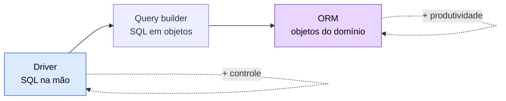
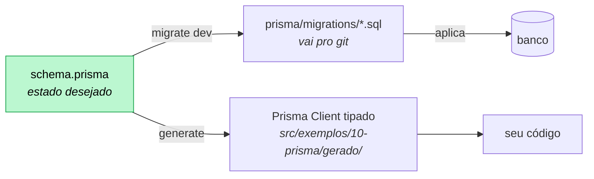
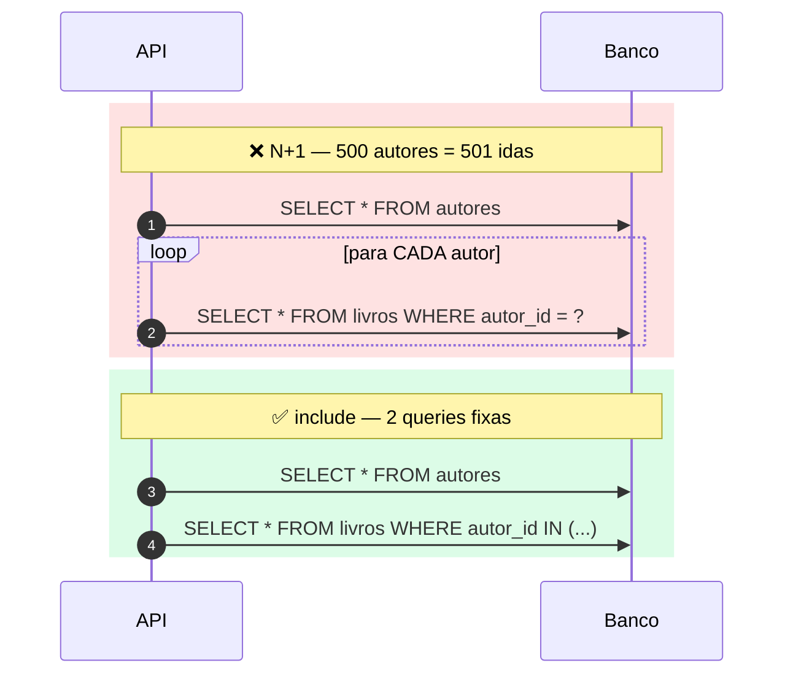

# 10 — ORM com Prisma

**Em uma frase:** o Prisma gera um client tipado a partir de um schema
declarativo — você para de escrever SQL e passa a escrever objetos.

## Por que importa

- Tipagem de ponta a ponta: `titulu` no `where` é erro de compilação, não uma
  query que devolve zero linhas.
- Migrations, seed e um visualizador de banco vêm de graça.
- O preço tem nome: **N+1**, e você precisa saber vê-lo.

## Conceitos

### Driver vs query builder vs ORM

|                   | O que você escreve  | Exemplo                                                 |
| ----------------- | ------------------- | ------------------------------------------------------- |
| **Driver**        | SQL na mão          | `node:sqlite`, `pg` ([módulo 09](./09-sqlite-e-sql.md)) |
| **Query builder** | SQL em objetos, 1:1 | Knex, Drizzle                                           |
| **ORM**           | Objetos do domínio  | Prisma, TypeORM                                         |



Quanto mais alto, menos código e menos controle. O Prisma fica entre ORM e query
builder: não tem entidade "rica" com métodos, só dados tipados.

### O que o ORM resolve — e o que cobra

| Resolve                                     | Cobra                             |
| ------------------------------------------- | --------------------------------- |
| Tipagem de query, retorno e filtro          | Uma abstração a mais para debugar |
| `snake_case` ↔ `camelCase`, `0/1` ↔ boolean | Query gerada às vezes ruim        |
| Migrations a partir do schema               | Recurso do banco não exposto      |
| Relação em uma linha (`include`)            | **N+1** fácil de escrever sem ver |

Compare os dois repositórios do mesmo contrato:
`src/exemplos/09-sqlite/repositorio-sqlite.ts` (172 linhas, com conversão manual,
`WHERE` e `SET` montados à mão) e
`src/exemplos/10-prisma/repositorio-prisma.ts` (~90, sem nenhuma delas).

**O princípio: toda abstração vaza, e você paga pelo que ela esconde quando
precisa do que ela escondeu.**

Um ORM esconde o SQL. Enquanto você faz o que ele previu, o ganho é enorme.
Quando você precisa de algo que ele não previu — uma CTE recursiva, um índice
parcial, um `EXPLAIN` — a abstração não ajuda **e** atrapalha, porque agora
existe uma camada entre você e a ferramenta.

A consequência prática não é "não use ORM". É esta:

> **Importante:**
> **Você precisa saber o que a abstração está fazendo por baixo.** Não para
> substituí-la, mas para reconhecer quando ela escolheu mal — e é exatamente por
> isso que o [módulo 09](./09-sqlite-e-sql.md) veio primeiro. Quem aprende ORM
> sem SQL não entende o N+1 quando ele aparece: vê um `for` inocente, não 501
> idas ao banco.

Vale para todo o curso: Express esconde o `node:http` (módulo 01), Zod esconde as
checagens manuais (03 → 07), Prisma esconde o SQL (09 → 10). Sempre na mesma
ordem — a dor primeiro, o remédio depois.

### O schema

```prisma
model Livro {
  id         Int     @id @default(autoincrement())
  titulo     String
  isbn       String? @unique          // ? = opcional (NULL no banco)
  disponivel Boolean @default(true)   // convertido para 0/1 no SQLite

  autorId Int   @map("autor_id")      // nome da COLUNA
  autor   Autor @relation(fields: [autorId], references: [id], onDelete: Restrict)

  @@index([autorId])
  @@map("livros")                     // nome da TABELA
}
```

`@map`/`@@map` separam o nome do **modelo** (código, PascalCase) do nome da
**tabela** (SQL, snake_case). Sem eles, sua convenção de TypeScript acaba ditando
a do banco.

> **Nota:**
> O campo `autor Autor` **não é coluna** — é o Prisma permitindo navegar. Quem
> tem a coluna é `autorId`.

### Prisma 7: a URL saiu do schema

```prisma
datasource db {
  provider = "sqlite"
  // sem `url` aqui — no Prisma 7 isso é erro P1012
}
```

```ts
// prisma.config.ts — lido pela CLI
export default defineConfig({
  schema: 'prisma/schema.prisma',
  migrations: { path: 'prisma/migrations', seed: 'node prisma/seed.ts' },
  datasource: { url: process.env.DATABASE_URL_PRISMA },
});
```

```ts
// em runtime: o client recebe um ADAPTER
import { PrismaBetterSqlite3 } from '@prisma/adapter-better-sqlite3';
export const prisma = new PrismaClient({
  adapter: new PrismaBetterSqlite3({ url }),
  log: process.env.PRISMA_LOG ? ['query'] : [], // ← ligue isso enquanto estuda
});
```

A separação faz sentido: o schema descreve a **forma** dos dados; conexão é
configuração de runtime. Antes, gerar o client exigia o `.env` presente.

> **Cuidado:**
> O export é `PrismaBetterSqlite3` — **s** minúsculo em "Sqlite", ao contrário do
> que a documentação de várias versões sugere.

E o gerador padrão passou a ser `prisma-client` (ESM, TypeScript de verdade), que
**exige** um `output`. O antigo `prisma-client-js`, que escrevia dentro de
`node_modules`, está a caminho da aposentadoria. Coloque o `output` dentro de
`src/` (fora do `rootDir`, o build reclama) e no `.gitignore`.

### Migrations

```bash
npx prisma migrate dev --name adicionar_cursos   # gera o SQL, aplica, regenera o client
npx prisma migrate deploy                        # em produção: só aplica o que existe
npx prisma migrate reset                         # apaga tudo, reaplica, roda o seed
```

Você declara o estado **desejado**; o Prisma calcula o SQL da diferença. O
resultado é um arquivo em `prisma/migrations/` que **vai para o git** — o mesmo
histórico que escrevemos à mão no [módulo 09](./09-sqlite-e-sql.md), agora gerado.



> **Importante:**
> **Depois de toda migration, rode `prisma generate`.** O `migrate dev` faz isso;
> se você aplicar de outra forma, o client fica desatualizado e o TypeScript
> reclama de um campo que já existe no banco.

### Queries

```ts
await prisma.livro.findMany({
  where: { ano: { lt: 1960 }, titulo: { contains: 'o' }, disponivel: true },
  select: { titulo: true, ano: true }, // o TIPO do retorno tem só estes campos
  orderBy: { ano: 'asc' },
  take: 10,
  skip: 20,
});

await prisma.livro.findUnique({ where: { id } }); // só campo @unique
await prisma.livro.findFirst({ where: { titulo } }); // qualquer campo
await prisma.livro.count({ where: { disponivel: true } });
```

`select` explícito não é só economia de rede: o tipo do retorno passa a ter
exatamente os campos pedidos, e acessar outro é erro de compilação.

### `include` e o problema N+1

```ts
// ❌ N+1 — o código parece limpo, e é o problema
const autores = await prisma.autor.findMany(); // 1 query
for (const autor of autores) {
  const livros = await prisma.livro.findMany({ where: { autorId: autor.id } }); // +1 cada
}

// ✅ 1 chamada
const autores = await prisma.autor.findMany({ include: { livros: true } });
```



Com 3 autores, imperceptível. Com 500, são **501 queries** e a rota leva segundos.

**O princípio: a diferença entre O(1) e O(N) idas ao banco é invisível no código
e decisiva na produção.**

O que torna o N+1 traiçoeiro é justamente não parecer um problema. O laço é
legível, o teste passa, a resposta está correta. O que muda é o **número de
viagens de rede**, e cada viagem custa latência que não aparece no seu localhost
(onde o banco está a 0,1 ms) e aparece muito no servidor (onde está a 5 ms).

| Onde               | 501 queries × latência | Percepção     |
| ------------------ | ---------------------- | ------------- |
| Localhost (0,1 ms) | ~50 ms                 | "está rápido" |
| Mesma rede (2 ms)  | ~1 s                   | "estranho"    |
| Outra zona (10 ms) | ~5 s                   | timeout       |

Generalizando: **prefira trazer um conjunto a buscar item por item.** O mesmo
raciocínio vale para chamada de API externa em laço, `readFile` em laço e
publicação em fila item a item. Sempre que você ver um `await` dentro de um `for`
que fala com fora do processo, pergunte se existe a versão em lote.

**Como detectar:**

1. `log: ['query']` e conte as linhas de **uma** requisição.
2. Número de queries crescendo com o número de itens = N+1.
3. Em produção: métrica de "queries por requisição"
   ([módulo 14](./14-observabilidade.md)).

Detalhe: por baixo, o `include` do Prisma faz **2** queries (uma por tabela) e
junta em memória — não um `JOIN`. É de propósito: evita a explosão de linhas
duplicadas de um JOIN com N-N. Duas queries fixas continuam incomparavelmente
melhores que N+1.

Para contar sem trazer as linhas:

```ts
await prisma.autor.findMany({ include: { _count: { select: { livros: true } } } });
```

### Escrita

```ts
// nested create: insere nas duas tabelas, em transação implícita
await prisma.livro.create({
  data: { titulo: 'X', ano: 1984, autorId: 2, generos: { create: [{ generoId: 1 }] } },
});

await prisma.livro.update({ where: { id }, data: { ano: 1985 } });
await prisma.livro.upsert({ where: { id }, update: {}, create: { ... } }); // idempotente
await prisma.livro.delete({ where: { id } }); // LANÇA se não existe (P2025)
```

`undefined` = "não mexe neste campo"; `null` = "grave NULL".

> **Cuidado:**
> **Atrito com `exactOptionalPropertyTypes: true`** (ligado neste repo):
> `data: { titulo: dados.titulo }` com `titulo?: string | undefined` **não
> compila**. Os tipos gerados declaram `titulo?: string` sem `| undefined`, e a
> flag recusa chave presente valendo `undefined` — que é justo o idioma do
> Prisma. A saída é o spread condicional:
> `...(v !== undefined ? { titulo: v } : {})`.

### Transações

```ts
// array: operações independentes, tudo ou nada
const [a, b] = await prisma.$transaction([prisma.livro.count(), prisma.autor.count()]);

// interativa: quando uma depende da anterior
await prisma.$transaction(async (tx) => {
  const livro = await tx.livro.findUniqueOrThrow({ where: { id } });
  await tx.livro.update({ where: { id }, data: { disponivel: false } });
});
```

> **Cuidado:**
> **Use `tx`, não `prisma`, dentro da transação interativa.** Usar `prisma` sai
> da transação, e o rollback não desfaz nada — bug silencioso e caro.

### Quando voltar para SQL cru

```ts
const r = await prisma.$queryRaw<{ decada: number; quantos: bigint }[]>`
  SELECT (ano/10)*10 AS decada, COUNT(*) AS quantos FROM livros GROUP BY decada
`;
```

O template literal transforma os `${}` em parâmetros, então continua imune a
injeção.

> **Cuidado:**
> **Nunca use `$queryRawUnsafe` com entrada do usuário.**

Vale quando: agregação/janela complexa (CTE, window function), a query gerada está
lenta e você já viu o `EXPLAIN`, ou recurso específico do banco (full-text, JSON
operators). Você perde a tipagem — o generic é uma **promessa sua**, não uma
garantia.

> **Cuidado:**
> **`COUNT`, `SUM` e `MIN` voltam como `bigint`** no SQLite via `$queryRaw`, e
> `JSON.stringify` de um bigint **lança**
> `TypeError: Do not know how to serialize a BigInt`. Funciona no `console.log` e
> dá 500 na rota. Converta com `Number()`. Pela API do Prisma (`_count`, `_min`)
> isso não acontece — já vem `number`.

### O ORM não apaga as diferenças entre bancos

Duas que aparecem no exemplo deste módulo:

- `createMany({ skipDuplicates: true })` — o Prisma **recusa** no SQLite.
- `mode: 'insensitive'` no `where` — só Postgres.

> **Atenção:**
> As duas falham em runtime ou compilação, não na documentação. É o custo real da
> abstração: a API parece uniforme e não é.

### Prisma Studio

```bash
npx prisma studio    # abre um navegador de banco em localhost:5555
```

Ótimo para conferir dados durante o estudo. Não é ferramenta de produção.

### Comparação rápida

|             | Prisma                  | Drizzle                   | Knex           |
| ----------- | ----------------------- | ------------------------- | -------------- |
| Estilo      | Schema próprio → client | SQL tipado em TS          | Query builder  |
| Tipagem     | Excelente               | Excelente                 | Fraca (`any`)  |
| Curva       | Baixa                   | Média (precisa saber SQL) | Baixa          |
| Migrations  | Geradas do schema       | Geradas do schema TS      | Escritas à mão |
| Ponto forte | Produtividade           | Fica perto do SQL         | Maturidade     |

Drizzle é a escolha de quem quer tipagem sem perder o SQL de vista. Knex é o
clássico — encontrado em muito código legado.

## Na prática

```bash
npm run db:migrate                                  # aplica as migrations
npm run db:seed                                     # dados iniciais
PRISMA_LOG=1 node src/exemplos/10-prisma/01-queries.ts   # ← com o SQL no terminal
node src/exemplos/10-prisma/servidor.ts
```

> **Dica:**
> No `01-queries.ts`, **conte as linhas `prisma:query`** na seção 3: são 3 no
> jeito errado (1 + 2 autores) contra 2 no `include`. Acrescente autores no seed
> e conte de novo — a diferença cresce sozinha.

```bash
B=localhost:5058/api/v1/cursos
curl "$B?publicado=true" ; curl "$B?titulo=express"
curl -X POST $B -H 'Content-Type: application/json' -d '{"titulo":"Prisma","horas":7}'
curl -X POST $B/2/publicar ; curl -X DELETE $B/2   # 409: publicado não se apaga
```

> **Importante:**
> **O ponto do módulo:** compare as respostas com as dos módulos 08 e 09. São as
> mesmas, porque o service é o mesmo arquivo importado. A terceira troca de banco
> não custou nada.

## Erros comuns

| Erro                                   | O que acontece              | Correção                               |
| -------------------------------------- | --------------------------- | -------------------------------------- |
| `await` num laço para buscar relação   | N+1; rota lenta em produção | `include`                              |
| Não olhar o SQL gerado                 | N+1 invisível               | `log: ['query']`                       |
| `new PrismaClient()` por requisição    | Pool esgota em minutos      | Singleton                              |
| `prisma` em vez de `tx` na transação   | Rollback não desfaz nada    | Sempre `tx`                            |
| Migration aplicada sem `generate`      | TS não vê o campo novo      | `prisma generate`                      |
| Editar migration já aplicada           | Ambientes divergem          | Nova migration                         |
| `$queryRawUnsafe` com input do usuário | SQL injection               | `$queryRaw` com template               |
| `url` no schema (Prisma 7)             | Erro P1012                  | `prisma.config.ts`                     |
| `PrismaBetterSQLite3`                  | Export não existe           | `PrismaBetterSqlite3`                  |
| Client gerado no git                   | Diff gigante, conflito      | `.gitignore`                           |
| `bigint` de `$queryRaw` no `res.json`  | `TypeError` → 500           | `Number(valor)`                        |
| Achar que ORM dispensa SQL             | Query lenta sem explicação  | `EXPLAIN` ([09](./09-sqlite-e-sql.md)) |
| `delete` esperando `null`              | Lança P2025                 | `try/catch` no repositório             |

## Cheatsheet

```bash
npm run db:migrate       # prisma migrate dev
npm run db:generate      # regera o client (SEMPRE depois de mudar o schema)
npm run db:seed
npm run db:reset         # apaga, reaplica, roda o seed
npm run db:studio
npx prisma migrate deploy  # produção: aplica sem gerar
```

```ts
findMany({ where, select, include, orderBy, take, skip })
findUnique({ where: { id } })      // só campo @unique; null se não achar
findUniqueOrThrow / findFirstOrThrow
count / aggregate / groupBy
create({ data })   createMany({ data })
update({ where, data })   updateMany   upsert({ where, update, create })
delete({ where })  deleteMany         // delete LANÇA se não existe

// operadores de where
{ campo: { lt, lte, gt, gte, not, in, notIn, contains, startsWith, endsWith } }
{ AND: [...], OR: [...], NOT: {...} }

$transaction([...])            // batch
$transaction(async (tx) => {}) // interativa — use tx!
$queryRaw`...`                 // parametrizado
$disconnect()
```

## Os princípios deste módulo

| Princípio                                                                          | Onde reaparece |
| ---------------------------------------------------------------------------------- | -------------- |
| **Toda abstração vaza** — você paga pelo que ela esconde quando precisa disso.     | 12, 15, 20     |
| **Saber o que está por baixo é o que permite reconhecer a escolha ruim.**          | 09, 15         |
| **Prefira trazer um conjunto a buscar item por item** (N+1 não é só de ORM).       | 15, 17         |
| **O schema no git é a verdade sobre o banco**, e a migration é como ele chega lá.  | 09, 16         |
| **Ganho de produtividade não dispensa medir** — `log: ['query']` antes do palpite. | 14, 15         |

## Para ir além

- **[Prisma — documentação oficial](https://www.prisma.io/docs)**
  Referência do schema, das migrations e do client. Confira a versão **7**: o `url` saiu do `datasource` e o client recebe um adapter.
- **[Fowler — _ORM Hate_](https://martinfowler.com/bliki/OrmHate.html)**
  Uma defesa equilibrada do ORM contra as críticas comuns. Bom antídoto para os dois extremos.
- **[Kleppmann & Riccomini — _Designing Data-Intensive Applications_, 2ª ed. (2026)](https://dataintensive.net/)**
  O livro sobre sistemas de dados. Os capítulos 2 e 7 (modelos de dados e transações) são o passo natural depois deste módulo.

## Pratique

👉 [`exercicios/10-prisma/`](../exercicios/10-prisma/)
