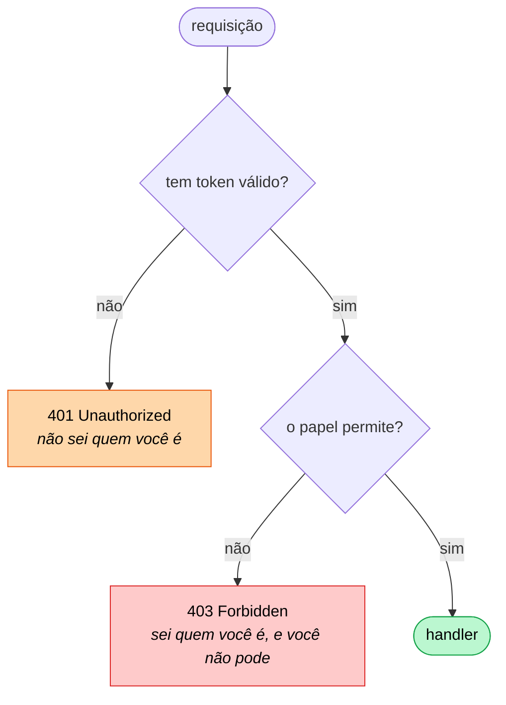
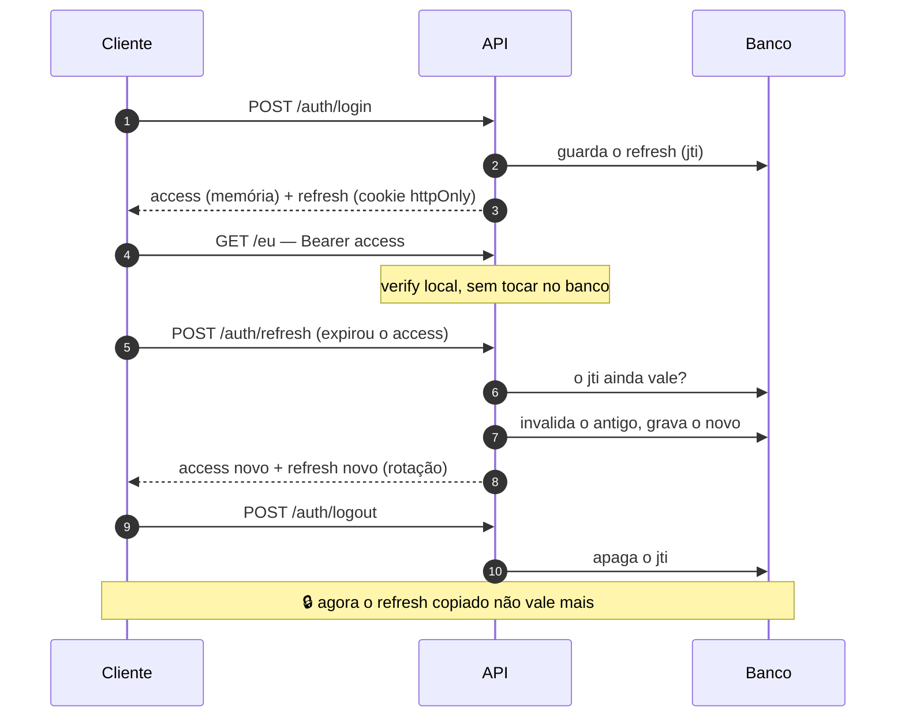
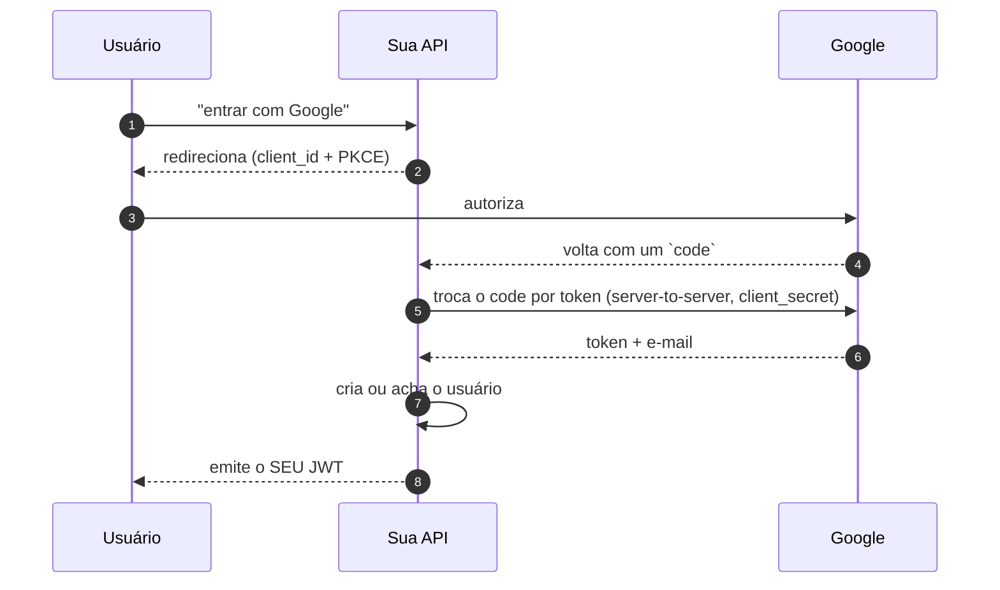

# 11 — Autenticação e autorização

**Em uma frase:** autenticação responde **quem você é** (401); autorização
responde **o que você pode** (403). São duas perguntas e dois middlewares.

<!-- sumario:inicio -->

**Sumário**

- [Por que importa](#por-que-importa)
- [Conceitos](#conceitos)
  - [As duas palavras](#as-duas-palavras)
  - [Hash de senha: por que não SHA-256](#hash-de-senha-por-que-não-sha-256)
  - [O problema que sobra: senhas iguais, hashes iguais](#o-problema-que-sobra-senhas-iguais-hashes-iguais)
  - [Comparação em tempo constante](#comparação-em-tempo-constante)
  - [Sessão com cookie vs JWT](#sessão-com-cookie-vs-jwt)
  - [Anatomia de um JWT](#anatomia-de-um-jwt)
  - [Access + refresh](#access-refresh)
  - [Onde guardar o token no cliente](#onde-guardar-o-token-no-cliente)
  - [Mensagem de erro no login](#mensagem-de-erro-no-login)
  - [Permissão por papel (RBAC)](#permissão-por-papel-rbac)
  - [OAuth2 em visão geral](#oauth2-em-visão-geral)
- [Na prática](#na-prática)
- [Erros comuns](#erros-comuns)
- [Cheatsheet](#cheatsheet)
- [Os princípios deste módulo](#os-princípios-deste-módulo)
- [Para ir além](#para-ir-além)
- [Pratique](#pratique)

<!-- sumario:fim -->

## Por que importa

- É o ponto onde um erro custa caro — vazamento de senha não tem rollback.
- 401 e 403 trocados fazem o cliente tentar consertar a coisa errada.
- Quase todo tutorial ensina JWT em localStorage, que é exatamente o que XSS rouba.

## Conceitos

### As duas palavras

|            | Autenticação        | Autorização            |
| ---------- | ------------------- | ---------------------- |
| Pergunta   | Quem é você?        | Você pode isso?        |
| Falha      | `401 Unauthorized`  | `403 Forbidden`        |
| Como       | Senha, token, OAuth | Papel, dono do recurso |
| Middleware | `autenticar`        | `exigirPapel('admin')` |



> **Nota:**
> O nome `401 Unauthorized` no padrão HTTP é infeliz: ele é sobre
> **autenticação**.

### Hash de senha: por que não SHA-256

SHA-256 foi feito para ser **rápido** — o que se quer de um hash de arquivo. Para
senha, rapidez é o defeito: uma GPU calcula bilhões por segundo, e testar um
vazamento inteiro leva horas.

Argon2 e bcrypt foram feitos para ser **lentos e consumir memória**, de propósito.
Medido neste repo:

```
SHA-256: 0.650ms
Argon2:  199.6ms   (307× mais lento — de propósito)
```

|                 | Use                                                           |
| --------------- | ------------------------------------------------------------- |
| **argon2id**    | Recomendação atual (OWASP). Resiste a GPU e a canal lateral.  |
| **bcrypt**      | Padrão anterior, ainda onipresente. Você vai achar em legado. |
| **SHA-\*, MD5** | **Nunca** para senha.                                         |

> **Cuidado:**
> `SHA-256`, `MD5` e qualquer hash rápido para senha significam que um vazamento
> do seu banco é quebrado em horas numa GPU alugada por hora.

### O problema que sobra: senhas iguais, hashes iguais

Hash lento resolve a força bruta. Falta um problema, e ele aparece quando você
pensa em **duas pessoas** em vez de uma.

Se o hash depende só da senha, então duas pessoas que escolheram `123456` têm
exatamente o mesmo hash gravado no banco. Duas consequências ruins saem daí:

1. Quem vazar o banco consegue ver, sem quebrar nada, **quais usuários têm a
   mesma senha**.
2. Pior: dá para calcular o hash das senhas mais comuns **uma vez** e sair
   comparando com o banco inteiro. Uma tabela pronta dessas — milhões de senhas
   comuns com o hash de cada uma — chama-se **rainbow table**, e um trabalho feito
   uma vez serve para atacar todos os usuários de todos os vazamentos.

A saída é fazer cada hash depender de mais uma coisa, diferente por usuário: um
valor aleatório, gerado no momento do cadastro, que entra no cálculo junto com a
senha. Esse valor é o **salt**.

Com salt, `123456` de uma pessoa e `123456` de outra produzem hashes diferentes,
e a tabela pré-calculada perde a serventia — ela teria que ser refeita para cada
salt, ou seja, para cada usuário.

Mas aí vem a pergunta óbvia: se o salt entra no cálculo, você precisa dele de
volta para conferir a senha no login. Onde ele fica guardado?

**Dentro do próprio hash.** Olhe o que o argon2 devolve:

```
$argon2id$v=19$m=19456,p=1,t=2$iVBNhaju9pEdn24M43b2kg$XvXUN5wpG2xbUsJ...
 algoritmo  versão   parâmetros        salt                  hash
```

São cinco campos separados por `$`, e o salt é um deles — em texto claro, de
propósito. Salt **não é segredo**; ele não precisa ser escondido, precisa ser
diferente por usuário.

É por isso que o `verify` não pede salt nenhum: ele lê o salt de dentro da string
que você guardou e refaz a conta.

```ts
await argon2.hash(senha, { type: argon2.argon2id, memoryCost: 19456, timeCost: 2 });
await argon2.verify(hash, senha); // ← nenhum salt aqui: ele já está no `hash`
```

E repare que os **parâmetros** também estão gravados ali (`m=19456,p=1,t=2`).
Isso é o que permite endurecer o custo no futuro sem invalidar as senhas antigas:
cada hash carrega a receita com que foi feito.

> **Nota:**
> Dos três parâmetros, `memoryCost` é o que mais importa. Uma GPU tem milhares de
> núcleos e pouca memória por núcleo — então exigir muita RAM por cálculo é o que
> tira a vantagem dela. Aumentar só o tempo (`timeCost`) atrapalha bem menos.

### Comparação em tempo constante

Para segredos que **não** são senha (API key, assinatura de webhook), não se usa
hash lento — mas `===` vaza informação pelo **tempo**: ele para no primeiro byte
diferente. Com medições suficientes, dá para descobrir a chave caractere por
caractere.

```ts
import { timingSafeEqual, createHash } from 'node:crypto';
timingSafeEqual(Buffer.from(a), Buffer.from(b)); // exige mesmo tamanho
```

Como o próprio tamanho vaza, compare o hash de cada um — hashes têm tamanho fixo.

### Sessão com cookie vs JWT

|                     | Sessão no servidor              | JWT                        |
| ------------------- | ------------------------------- | -------------------------- |
| Estado              | No servidor (banco/Redis)       | No token                   |
| Verificar           | Consulta o estado               | Só a assinatura            |
| Revogar             | Imediato: apaga a sessão        | **Impossível** até expirar |
| Escala horizontal   | Precisa de estado compartilhado | Nenhuma coordenação        |
| Tamanho por request | Um id                           | O payload inteiro          |

> **Importante:**
> **A escolha honesta:** para um monolito com um banco, **sessão é mais simples e
> mais segura**. JWT ganha quando há vários serviços que precisam validar sem
> consultar um autenticador central. "É stateless" é a vantagem real; "é moderno"
> não é argumento.

Olhando de novo, aquela tabela de cinco linhas é **uma escolha só**, vista de
cinco ângulos.

Comece por uma pergunta: onde mora a prova de que você é você?

- **No token.** Então qualquer máquina que tenha a chave consegue conferir
  sozinha, sem perguntar a ninguém. Isso escala de graça. E é exatamente por isso
  que ninguém consegue cancelar aquele token: não existe um lugar central onde
  riscar o nome dele. Ele vale até expirar.
- **No servidor.** Então cancelar é apagar uma linha, e o efeito é imediato. Mas
  agora **toda** requisição precisa ir até esse lugar perguntar — e todas as
  máquinas precisam enxergar o mesmo lugar.

Repare que as duas colunas da tabela não são duas ferramentas concorrentes: são
os dois lados de uma mesma troca. **Você troca a capacidade de cancelar pela
capacidade de não perguntar** — e não dá para ficar com as duas.

(_Revogação_, aqui, é o nome técnico de "cancelar uma credencial antes de ela
expirar sozinha" — o botão "sair de todos os dispositivos".)

O access + refresh deste módulo não é um terceiro caminho: é escolher os dois em
momentos diferentes.

| Token   | Onde está a verdade | Verificação   | Revogável? | Frequência de uso |
| ------- | ------------------- | ------------- | ---------- | ----------------- |
| Access  | no token            | só assinatura | não        | toda requisição   |
| Refresh | no servidor         | consulta      | **sim**    | a cada 15 min     |

O custo do estado é pago 1× a cada 15 minutos em vez de a cada requisição, e a
janela de estrago de um token roubado fica limitada a 15 minutos. É engenharia,
não mágica — e continua sendo verdade que **revogação instantânea exige estado
consultado sempre**.

> **Cuidado:**
> O erro de julgamento mais comum aqui: adotar JWT para "escalar" um sistema que
> tem um banco só e 200 usuários, e depois adicionar uma lista de revogação
> consultada em toda requisição para conseguir deslogar alguém. Nesse ponto você
> tem o custo da sessão **e** a complexidade do JWT. Se esse é o requisito,
> sessão era a resposta desde o começo.

### Anatomia de um JWT

```
eyJhbGciOiJIUzI1NiJ9 . eyJzdWIiOiI0MiIsInBhcGVsIjoiYWRtaW4ifQ . -5YlZAEc-wLwLhNJ
      header                        payload                        signature
```

> **Cuidado:**
> **O payload não é criptografado — é base64.** Qualquer um com o token lê tudo
> (cole em jwt.io). A assinatura garante que não foi **alterado**, não que seja
> **secreto**.

O que **não** colocar: senha, CPF, e-mail, endereço, saldo. O que colocar: `sub`
(id), `papel`, e o mínimo para autorizar sem bater no banco.

`verify` confere assinatura **e** expiração.

> **Cuidado:**
> **`decode` não verifica nada** — usar `decode` no lugar de `verify` é a falha
> mais grave que se comete com JWT: aceita qualquer token que qualquer um montou.

### Access + refresh

| Token       | Vida   | Vai onde              | Guardado no banco?          |
| ----------- | ------ | --------------------- | --------------------------- |
| **ACCESS**  | 15 min | Toda requisição       | Não — só a assinatura       |
| **REFRESH** | 7 dias | Só na rota de refresh | **Sim**, indexado por `jti` |



> **Importante:**
> O refresh estar no banco é o que **torna o logout possível**. Sem essa tabela,
> "logout" é só o front esquecer o token — e quem tivesse copiado continuaria
> dentro.

**Rotação:** cada refresh usado é invalidado e um novo emitido. Detecta roubo: se
o atacante copiou o refresh e o usuário legítimo o usa, o do atacante morre (e
vice-versa).

### Onde guardar o token no cliente

| Onde                  | XSS rouba?         | CSRF?            | Veredicto                  |
| --------------------- | ------------------ | ---------------- | -------------------------- |
| `localStorage`        | **Sim**            | Não              | ❌ o mais ensinado, o pior |
| Cookie normal         | Sim                | Sim              | ❌                         |
| Cookie `httpOnly`     | **Não**            | Sim → `SameSite` | ✅ para o refresh          |
| Memória (variável JS) | Só enquanto aberta | Não              | ✅ para o access           |

```ts
res.cookie('refreshToken', refresh, {
  httpOnly: true, // JS da página NÃO lê — a defesa contra XSS
  secure: process.env.NODE_ENV === 'production', // só HTTPS
  sameSite: 'strict', // defesa contra CSRF
  path: '/auth', // só vai nas rotas que precisam
  maxAge: 7 * 24 * 60 * 60 * 1000,
});
```

> **Atenção:**
> `secure: true` em `http://localhost` faz o cookie **não ser enviado** e você
> perde uma tarde. Daí o condicional.

`sameSite`: `strict` (nunca de outro site), `lax` (só GET de navegação — padrão
razoável), `none` (sempre; exige `secure`, para front em outro domínio).

> **Dica:**
> Para limpar, repita o `path` — sem ele o navegador não acha o cookie e ele fica
> lá.

### Mensagem de erro no login

```ts
if (!usuario || !(await conferirSenha(usuario.senhaHash, senha))) {
  throw naoAutenticado('E-mail ou senha inválidos'); // ← genérica, de propósito
}
```

"E-mail não encontrado" vs "senha incorreta" entrega quais e-mails existem, e o
atacante passa a mirar só nas contas reais.

> **Nota:**
> **Nota honesta:** como o `verify` do Argon2 leva ~200 ms e o "usuário não
> existe" responde na hora, o **tempo** ainda vaza. A defesa completa é rodar um
> hash falso quando o usuário não existe.

O mesmo dilema no registro: `409 E-mail já cadastrado` confirma que a conta
existe. A alternativa segura (responder 201 e mandar um e-mail para o dono) é mais
complexa. Escolha consciente, não por acidente.

### Permissão por papel (RBAC)

Autenticar responde "quem é você". Falta responder "o que você pode fazer".

O jeito mais simples de organizar isso é não listar permissão por pessoa, e sim
dar a cada pessoa um **papel** — `leitor`, `editor`, `admin` — e amarrar as
permissões ao papel. Promover alguém passa a ser trocar uma palavra, em vez de
copiar uma lista de trinta permissões.

Isso tem sigla, **RBAC**, de _Role-Based Access Control_: controle de acesso
baseado em papel. A sigla aparece bastante em documentação de nuvem e de banco de
dados, e é só isso que ela quer dizer.

```ts
export function exigirPapel(...papeis: Papel[]) {
  return (_req, res, next) => {
    const usuario = res.locals.usuario;
    if (!usuario) throw naoAutenticado('Rota protegida sem autenticar');
    if (!papeis.includes(usuario.papel))
      throw semPermissao(`Exige: ${papeis.join(', ')}`);
    next();
  };
}

app.get('/admin/usuarios', autenticar, exigirPapel('admin'), handler); // ORDEM importa
```

O papel vindo do token dispensa consultar o banco a cada requisição. A
contrapartida: rebaixar alguém só tem efeito quando o access dele expirar (15 min).
Se isso é inaceitável, o papel vem do banco — e você troca latência por revogação
imediata. Decisão de produto.

> **Importante:**
> Além de papel, existe autorização **por dono do recurso** ("só o autor edita
> seu post"), que precisa buscar o recurso — e portanto mora no service
> ([módulo 08](./08-arquitetura-em-camadas.md)), não num middleware.

### OAuth2 em visão geral

Serve para **entrar com Google/GitHub** sem a senha passar por você.



> **Atenção:**
> O fluxo é o **Authorization Code + PKCE**. Nunca use o "implicit flow", que
> está depreciado. A troca do code acontece no servidor porque envolve o
> `client_secret`.

O ponto que costuma passar batido: o token do Google serve para provar identidade
**uma vez**; a sessão da sua API continua sendo sua.

## Na prática

```bash
node src/exemplos/11-auth/senhas.ts   # SHA vs Argon2 medido, salt, timing-safe
node src/exemplos/11-auth/tokens.ts   # anatomia do JWT, forjar, expirar
```

```bash
node src/exemplos/11-auth/servidor.ts
```

```bash
B=localhost:5059
CT='Content-Type: application/json'

curl -X POST $B/auth/registrar -H "$CT" -d '{"email":"admin@x.com","senha":"senha12345"}'
curl -X POST $B/auth/login -H "$CT" -d '{"email":"admin@x.com","senha":"errada123"}'  # 401 genérico

# guarda o cookie httpOnly em cookies.txt e mostra o access token
curl -c cookies.txt -X POST $B/auth/login -H "$CT" \
  -d '{"email":"admin@x.com","senha":"senha12345"}'

TK='<cole o accessToken>'
curl -H "Authorization: Bearer $TK" $B/eu
curl -H "Authorization: Bearer $TK" $B/admin/usuarios

curl -b cookies.txt -c cookies.txt -X POST $B/auth/refresh   # rotaciona
curl -b cookies.txt -X POST $B/auth/logout                   # 204
curl -b cookies.txt -X POST $B/auth/refresh                  # 401 revogado
```

> **Dica:**
> Repare em `tokens.ts`: o payload é decodificado **sem o segredo**, e o token
> forjado é recusado pela assinatura. As duas coisas juntas explicam o que um JWT
> garante e o que não garante.

## Erros comuns

| Erro                           | O que acontece                  | Correção                        |
| ------------------------------ | ------------------------------- | ------------------------------- |
| SHA-256 para senha             | Vazamento quebrado em horas     | Argon2 / bcrypt                 |
| Salt fixo ou nenhum            | Rainbow table serve para todos  | O argon2 já gera por senha      |
| `decode` no lugar de `verify`  | Aceita token forjado            | Sempre `verify`                 |
| Dado sensível no payload       | É base64: qualquer um lê        | Só `sub` e `papel`              |
| Token em `localStorage`        | XSS rouba                       | Cookie `httpOnly` (refresh)     |
| JWT sem expiração              | Token vazado vale para sempre   | `expiresIn` curto               |
| Refresh não guardado           | Logout não existe               | Tabela de `jti`                 |
| "E-mail não encontrado"        | Enumeração de usuários          | Mensagem genérica               |
| 403 em token expirado          | Cliente conserta a coisa errada | 401                             |
| `exigirPapel` sem `autenticar` | Passa por omissão               | Checar `res.locals` e 401       |
| `secure: true` em localhost    | Cookie nunca é enviado          | Condicional por ambiente        |
| `clearCookie` sem o `path`     | O cookie continua lá            | Mesmas opções do original       |
| Senha em log                   | Vaza no arquivo de log          | Nunca logue o corpo do login    |
| `senhaHash` na resposta        | Vazamento direto                | Montar o objeto campo por campo |
| `JWT_SECRET` com fallback      | Deploy com o segredo de exemplo | Falhar ao subir                 |
| Segredo curto                  | Força bruta na assinatura       | 32+ bytes aleatórios            |

## Cheatsheet

```ts
// senha
await argon2.hash(senha, { type: argon2.argon2id, memoryCost: 19456 });
await argon2.verify(hash, senha);

// token
jwt.sign(payload, SEGREDO, { expiresIn: '15m', issuer, audience });
jwt.verify(token, SEGREDO, { issuer, audience }); // NUNCA jwt.decode

// cookie
res.cookie(nome, valor, { httpOnly, secure, sameSite, path, maxAge });
res.clearCookie(nome, { path }); // repita o path!
app.use(cookieParser()); // sem isto req.cookies é undefined

// middlewares, nesta ordem
app.get('/x', autenticar, exigirPapel('admin'), handler);
```

```bash
# gerar um segredo de verdade
node -e "console.log(require('node:crypto').randomBytes(32).toString('hex'))"
```

| Situação                              | Status                       |
| ------------------------------------- | ---------------------------- |
| Sem token / token inválido / expirado | `401`                        |
| Token ok, papel insuficiente          | `403`                        |
| Login com senha errada                | `401` (mensagem genérica)    |
| E-mail já cadastrado                  | `409` (com a ressalva acima) |

## Os princípios deste módulo

Recapitulando — cada linha é uma conclusão que o módulo mostrou acontecer:

| A ideia                                                                                                                       | Onde volta |
| ----------------------------------------------------------------------------------------------------------------------------- | ---------- |
| A senha nunca é armazenada, nem criptografada. O que se guarda é um hash, que não tem caminho de volta.                       | 13         |
| A defesa é fazer a conta custar caro: você paga o custo uma vez por login, quem ataca paga bilhões de vezes.                  | 13         |
| O tempo que uma resposta demora conta história igual ao conteúdo dela. Comparar segredo com `===` vaza pelo relógio.          | 13, 14     |
| Nada que diz quem é o autor de uma ação pode vir do cliente. Só do token que o seu servidor assinou.                          | 12, 13     |
| "É admin?" cabe no middleware; "é dono deste livro?" não cabe, porque depende de buscar o livro primeiro.                     | 08, 12     |
| Quando a checagem falha por erro, ela tem que fechar a porta. Checagem que libera ao dar erro é pior do que não ter checagem. | 13         |
| Operação que muda credencial (trocar senha, trocar e-mail) pede a credencial atual de novo.                                   | —          |
| Sem o segredo configurado, o processo recusa subir — em vez de usar um valor de exemplo que ninguém lembra de trocar.         | 06, 16     |

## Para ir além

Área onde errar custa caro — aqui vale seguir fonte oficial, não tutorial.

- **[OWASP — _Password Storage Cheat Sheet_](https://cheatsheetseries.owasp.org/cheatsheets/Password_Storage_Cheat_Sheet.html)**
  A fonte dos parâmetros usados neste módulo: **Argon2id com 19 MiB, 2 iterações e paralelismo 1**. Se algum dia mudar, muda aqui primeiro.
- **[OWASP — _JSON Web Token Cheat Sheet_](https://cheatsheetseries.owasp.org/cheatsheets/JSON_Web_Token_Cheat_Sheet.html)**
  Os erros clássicos de JWT, a começar pelo `alg: none` e pelo uso de `decode` no lugar de `verify`.
- **[OWASP — _Authentication_ e _Session Management_](https://cheatsheetseries.owasp.org/cheatsheets/Authentication_Cheat_Sheet.html)**
  Trata do que vem depois do login: expiração, rotação e revogação de sessão.
- **[RFC 8725 — _JWT Best Current Practices_](https://www.rfc-editor.org/rfc/rfc8725.html)**
  A norma sobre como não errar em JWT. Curta e específica.
- **[Auth0 — _Refresh Token Rotation_](https://auth0.com/docs/secure/tokens/refresh-tokens/refresh-token-rotation)**
  Explica a detecção de reuso de refresh token, o passo seguinte ao que este módulo implementa.

## Pratique

👉 [`exercicios/11-auth/`](../exercicios/11-auth/)
