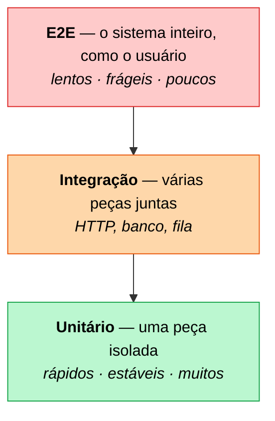

# 12 — Testes

**Em uma frase:** teste é o código que afirma o que o seu código promete — e
avisa, em segundos, quando alguém quebra a promessa sem perceber.

<!-- sumario:inicio -->

**Sumário**

- [Por que importa](#por-que-importa)
- [Conceitos](#conceitos)
  - [A pirâmide, e o que ela realmente diz](#a-pirâmide-e-o-que-ela-realmente-diz)
  - [O que testar em cada nível — o critério](#o-que-testar-em-cada-nível-o-critério)
  - [criarApp() — a mudança que Supertest exige](#criarapp-a-mudança-que-supertest-exige)
  - [O repositório injetado é o que dispensa mock](#o-repositório-injetado-é-o-que-dispensa-mock)
  - [Os dublês, do melhor para o pior](#os-dublês-do-melhor-para-o-pior)
  - [Isolamento: fábrica, não constante](#isolamento-fábrica-não-constante)
  - [SQLite :memory: — onde ele brilha](#sqlite-memory-onde-ele-brilha)
  - [Suíte de contrato: os mesmos testes nas duas implementações](#suíte-de-contrato-os-mesmos-testes-nas-duas-implementações)
  - [Teste como trava de decisão](#teste-como-trava-de-decisão)
  - [TDD: RED → GREEN → REFACTOR](#tdd-red-green-refactor)
  - [Cobertura é sintoma, não meta](#cobertura-é-sintoma-não-meta)
  - [Vitest, e por que não Jest](#vitest-e-por-que-não-jest)
- [Na prática](#na-prática)
- [Erros comuns](#erros-comuns)
- [Cheatsheet](#cheatsheet)
- [Os princípios deste módulo](#os-princípios-deste-módulo)
- [Para ir além](#para-ir-além)
- [Pratique](#pratique)

<!-- sumario:fim -->

## Por que importa

- Sem teste, "não quebrei nada" é uma sensação; com teste, é uma verificação.
- Teste é o que torna **refatoração** possível: sem rede, ninguém mexe no que
  funciona, e o código apodrece por medo.
- Ele documenta a decisão que o comentário esquece: o formato de erro, o achado
  do Express 5, a stack que não pode vazar.

> **Importante:**
> Uma ideia atravessa o módulo inteiro, e vale saber dela desde já: **quando
> escrever o teste está difícil, o problema quase nunca é o teste.**
>
> Se você precisa de uma armação complicada para conseguir testar uma função, é
> porque ela está presa a coisas que você não consegue trocar — ela **importa** o
> que usa em vez de **receber**. Testar fica difícil porque o código está
> amarrado, não porque testar é difícil.
>
> É por isso que arquitetura em camadas (módulo 08) veio antes deste módulo. Lá
> você separou as peças; aqui você colhe o resultado.

## Conceitos

### A pirâmide, e o que ela realmente diz



A pirâmide não é sobre quantidade por estética. Ela é uma conta de **custo por
bug encontrado**:

| Nível          | Roda em | Falha aponta    | Pega                             | Não pega                 |
| -------------- | ------- | --------------- | -------------------------------- | ------------------------ |
| **Unitário**   | ~1ms    | a linha exata   | regra de negócio errada          | rota não registrada, SQL |
| **Integração** | ~10ms   | a camada        | status, formato, middleware, SQL | o navegador, o CSS       |
| **E2E**        | ~5s     | "algo no fluxo" | o sistema montado de verdade     | quase nada com precisão  |

O E2E é caro em três moedas: tempo de execução, tempo de manutenção e
**confiança** — ele falha por rede lenta, por animação, por dado velho. Uma
suíte E2E que falha 1 em 20 vezes sem motivo é pior que nenhuma: a equipe aprende
a reexecutar até passar, e aí ele não detecta mais nada.

> **Dica:**
> A pergunta prática para escolher o nível: **qual é o menor teste que falharia
> se eu quebrasse isto?** Escreva esse.

### O que testar em cada nível — o critério

Nenhum nível testa "o arquivo X". Cada um testa um tipo de afirmação:

| Afirmação                                    | Nível              |
| -------------------------------------------- | ------------------ |
| "livro emprestado não pode ser removido"     | unitário           |
| "remover livro emprestado responde **409**"  | integração         |
| "o corpo do erro tem `erro` e `status`"      | integração         |
| "o `UPDATE` mexe só na coluna enviada"       | integração (banco) |
| "a stack nunca aparece na resposta"          | integração         |
| "o botão de devolver aparece só para o dono" | E2E                |

### `criarApp()` — a mudança que Supertest exige

O formato dos módulos 01–11 termina em `app.listen(porta)`. Importar esse arquivo
num teste **sobe um servidor de verdade**:

```ts
// ❌ o que todo exemplo até aqui faz — impossível de testar bem
const app = express();
app.get('/livros', ...);
app.listen(5059);   // roda no import; dois testes brigam pela porta
```

```ts
// ✅ construir e ouvir são coisas diferentes
export function criarApp(repo: RepositorioLivros) {
  const app = express();
  // ...
  return app; // nenhum listen aqui
}

// servidor.ts — o único arquivo com listen
criarApp(repoDeVerdade).listen(5060);
```

O Supertest recebe o **app**, não uma URL: ele abre um socket efêmero numa porta
livre, dispara a requisição e fecha.

| Sem `criarApp()`                       | Com `criarApp()`             |
| -------------------------------------- | ---------------------------- |
| `EADDRINUSE` entre arquivos paralelos  | porta escolhida pelo sistema |
| processo do teste não encerra          | encerra sozinho              |
| `await sleep(500)` esperando subir     | nada a esperar               |
| um app global, com estado entre testes | um app novo por teste        |

> **Nota:**
> **Princípio:** separe a construção do objeto do seu ciclo de vida. É a mesma
> ideia que permite rodar o app num serverless, num worker ou atrás de outro
> processo sem tocar em nada. Testabilidade aqui é o sintoma, não o objetivo.

### O repositório injetado é o que dispensa mock

Este é o pagamento do módulo 08 chegando:

```ts
// O service depende de um TIPO, não de um arquivo.
const servico = criarServicoLivros(repoQualquer);
```

```ts
// ❌ o que seria preciso se o service importasse o banco direto
vi.mock('node:sqlite'); // intercepta o sistema de módulos
// ...e agora você mantém um falso `prepare`/`run`/`all`/`get`,
//    que quebra quando a query muda e testa a si mesmo
```

### Os dublês, do melhor para o pior

| Dublê                          | O que é                            | Quando                             |
| ------------------------------ | ---------------------------------- | ---------------------------------- |
| **Real**                       | o objeto de verdade                | sempre que for barato              |
| **Fake**                       | implementação simples que FUNCIONA | o repositório em memória           |
| **Stub**                       | devolve resposta fixa              | cenário difícil de produzir        |
| **Spy**                        | grava as chamadas                  | quando a chamada **é** o resultado |
| **Mock de módulo** (`vi.mock`) | troca o import                     | último recurso                     |

`vi.mock` é o último da lista por um motivo específico: ele prende o teste ao
**jeito de importar**. Trocar um `export` nomeado por um `export default` quebra
o teste, mesmo com o comportamento do código intacto — o teste passou a depender
de um detalhe que não é comportamento.

E vale ler `vi.mock` frequente como sintoma. Se você precisa dele o tempo todo, é
porque as peças estão presas umas às outras pelo `import` — o remédio é fazê-las
receber o que usam (módulo 08), não ficar melhor em mockar.

> **Atenção:**
> Spy tem um custo escondido: `expect(repo.remover).toHaveBeenCalled()` testa o
> **caminho**, não o resultado. Trocar `remover` por um soft delete quebraria o
> teste com o comportamento intacto. Só use quando "não fez nada" for a própria
> afirmação — como "a regra barrou antes de escrever no banco".

### Isolamento: fábrica, não constante

```ts
// ❌ o mesmo array em todos os testes do arquivo
export const LIVROS = [{ id: 1, ... }];

// ✅ objetos novos a cada chamada
export function livrosDeTeste(): Livro[] { return [{ id: 1, ... }]; }
```

O mesmo vale para o app e o repositório: `beforeEach`, não `beforeAll`.

> **Cuidado:**
> **Teste que depende de ordem não é teste, é sorte.** O sintoma é sempre o
> mesmo: passa localmente, falha no CI (que paraleliza), volta a passar quando
> você roda só aquele arquivo. Horas perdidas por um estado compartilhado.

### SQLite `:memory:` — onde ele brilha

```ts
new DatabaseSync(':memory:'); // banco SQL de verdade, na RAM, some ao fechar
```

| Ganho                        | Por quê                                  |
| ---------------------------- | ---------------------------------------- |
| banco novo em microssegundos | sem `TRUNCATE`, sem transação-e-rollback |
| testes em paralelo           | cada um tem o próprio banco              |
| nada de container no CI      | é uma dependência do Node 24             |
| SQL **real**                 | pega erro de query, tipo e constraint    |

O custo honesto: **SQLite não é Postgres.** Se produção é Postgres, testar em
SQLite deixa passar diferença de dialeto (`ON CONFLICT`, tipos, checagem de
constraint) — e aí a integração precisa rodar contra o banco real em container.

> **Importante:**
> A migration do teste tem que ser a **mesma** de produção. Se o teste cria a
> tabela com um `CREATE TABLE` próprio, ele valida um schema que não existe em
> lugar nenhum — e passa enquanto produção quebra.

### Suíte de contrato: os mesmos testes nas duas implementações

```ts
describe.each([
  { nome: 'memória', criar: () => criarRepositorioMemoria() },
  { nome: 'sqlite', criar: () => criarRepositorioSqlite() },
])('contrato: $nome', ({ criar }) => {
  /* ...os mesmos testes... */
});
```

O diagnóstico fica automático:

| Resultado                         | Onde está o bug             |
| --------------------------------- | --------------------------- |
| passa em memória, falha no SQLite | na tradução para SQL        |
| falha nos dois                    | no entendimento do contrato |
| entra um repositório novo         | herda a suíte inteira       |

### Teste como trava de decisão

Nem todo teste verifica se algo funciona. Alguns **impedem uma regressão
silenciosa** — o caso em que nada quebra visivelmente:

```ts
it('NÃO devolve stack, mensagem interna nem nome de arquivo', async () => {
  const corpo = JSON.stringify((await request(app).get('/boom')).body);
  expect(corpo).not.toContain('at '); // linha de stack
  expect(corpo).not.toContain('.ts'); // caminho de arquivo
});
```

Ninguém reclama quando a stack passa a vazar: a API continua respondendo 500. Só
que agora com o IP do banco e o caminho dos seus arquivos dentro.

> **Nota:**
> **Princípio:** o que não pode regredir em silêncio precisa de teste, mesmo que
> já esteja certo. E para o que **não pode aparecer**, teste a ausência no corpo
> inteiro serializado — `expect(body.stack).toBeUndefined()` deixaria passar um
> `detalhes.stack` novo.

### TDD: RED → GREEN → REFACTOR

| Etapa        | O que fazer                         | Por que                                    |
| ------------ | ----------------------------------- | ------------------------------------------ |
| **RED**      | escreva o teste e **veja-o falhar** | teste que nunca falhou pode testar o vazio |
| **GREEN**    | o código mais simples que passa     | sem prever requisito que não existe        |
| **REFACTOR** | arrume, com a rede já armada        | é quando o design acontece                 |

O ganho mais citado (menos bugs) é o menos importante. Os dois reais:

1. **Projeta a API antes da implementação.** O teste é o primeiro cliente do seu
   código. Chato de chamar no teste = chato de chamar em produção, e você
   descobre em 2 minutos.
2. **Define "pronto".** Sem teste escrito antes, "pronto" é sensação.

> **Atenção:**
> TDD é ruim quando você **ainda não sabe o que quer construir**: explorar uma
> API desconhecida, prototipar, descobrir o formato de um dado externo. Nesses
> casos escreva o código, entenda o problema, e **aí** os testes. TDD dogmático
> em código exploratório só produz teste que você joga fora.

### Cobertura é sintoma, não meta

Cobertura mede **linhas executadas**, não afirmações verificadas:

```ts
// 100% de cobertura desta função. Zero verificação.
it('funciona', () => {
  expect(criarLivro(dados)).toBeDefined();
});
```

| Cobertura | O que costuma significar                                    |
| --------- | ----------------------------------------------------------- |
| < 40%     | sinal real: há área grande sem nenhum teste                 |
| 60–80%    | saudável na maioria dos projetos                            |
| = 100%    | quase sempre teste escrito para a métrica, não para o risco |

O uso certo é **diagnóstico**: abra o relatório HTML e olhe _quais_ linhas estão
vermelhas. Um `catch` inteiro sem cobertura é informação; o número agregado não é.

> **Cuidado:**
> Meta obrigatória de cobertura no CI produz o teste que sobe a métrica sem
> verificar nada — e ainda dá a sensação de estar protegido. É por isso que o
> `vitest.config.ts` deste repo **não** tem `thresholds`.

### Vitest, e por que não Jest

| Runner      | Trade-off                                                                     |
| ----------- | ----------------------------------------------------------------------------- |
| **Vitest**  | TS e ESM sem configuração, watch rápido. É o que casa com este repo.          |
| Jest        | o padrão histórico, ecossistema enorme; precisa de transformador para ESM/TS. |
| `node:test` | embutido, zero dependência; `assert` mais cru, cobertura menos pronta.        |

## Na prática

Código em [`src/exemplos/12-testes/`](../src/exemplos/12-testes/):

| Arquivo                      | O que demonstra                       |
| ---------------------------- | ------------------------------------- |
| `app.ts`                     | `criarApp(repo)` — sem `listen`       |
| `servidor.ts`                | o único `listen`, minúsculo           |
| `testes/servico.test.ts`     | unitário, dublês, o `await` esquecido |
| `testes/rotas.test.ts`       | integração HTTP com Supertest         |
| `testes/repositorio.test.ts` | suíte de contrato + SQLite `:memory:` |
| `testes/seguranca.test.ts`   | a stack que não vaza                  |
| `testes/tdd-reserva.test.ts` | o ciclo RED→GREEN→REFACTOR registrado |
| `testes/fixtures.ts`         | fábrica de dados e "object mother"    |

```bash
npm test          # roda uma vez
npm run test:watch
npm run test:cov  # relatório em coverage/index.html
```

Rodar o servidor do exemplo:

```bash
node src/exemplos/12-testes/servidor.ts
```

## Erros comuns

| Erro                                          | O que acontece                                                   | Correção                                         |
| --------------------------------------------- | ---------------------------------------------------------------- | ------------------------------------------------ |
| `expect(p).rejects.toThrow()` **sem `await`** | o teste **passa mesmo falhando** — a asserção vira promise solta | `await expect(p).rejects.toThrow()`              |
| Importar um arquivo que chama `listen`        | `EADDRINUSE`, processo do teste não encerra                      | extrair `criarApp()`                             |
| `beforeAll` no lugar de `beforeEach`          | teste 4 depende do POST do teste 3; falha só ao paralelizar      | `beforeEach`, fábrica nova                       |
| Fixture como `const` compartilhada            | mutação num teste vaza para o próximo                            | fixture é **função**                             |
| Conexão SQLite não fechada                    | `EMFILE: too many open files` no CI, sem apontar a causa         | `afterEach(() => repo.fechar())`                 |
| `toBe` em objeto                              | falha mesmo com conteúdo idêntico (compara referência)           | `toEqual` / `toMatchObject`                      |
| `toEqual` exaustivo em resposta HTTP          | quebra a cada campo novo, sem regressão nenhuma                  | `toMatchObject` no que o teste afirma            |
| Fixar o `id` gerado pelo banco (`toBe(1)`)    | quebra quando a fixture insere algo antes                        | `toBeGreaterThan(0)`                             |
| `console.error` não silenciado                | saída cheia de stack; um erro real se perde                      | `vi.spyOn(console,'error').mockImplementation()` |
| Teste criando o schema com SQL próprio        | valida um schema que não existe em produção                      | usar a migration de verdade                      |
| Meta de cobertura no CI                       | nascem testes que executam sem verificar                         | cobertura como diagnóstico                       |

## Cheatsheet

```ts
import { describe, it, expect, beforeEach, vi } from 'vitest';
import request from 'supertest';

// --- asserções ---
expect(x).toBe(1); // === (primitivo, referência)
expect(obj).toEqual({ a: 1 }); // estrutura completa
expect(obj).toMatchObject({ a: 1 }); // subconjunto  ← o padrão em resposta HTTP
expect(lista).toHaveLength(3);
expect(fn).toThrow(AppError);
await expect(promise).resolves.toMatchObject({});
await expect(promise).rejects.toThrow(); // ⚠ o await é obrigatório

// --- pegar o erro para inspecionar o status ---
const erro = (await servico.buscar(999).catch((e: unknown) => e)) as AppError;
expect(erro.status).toBe(404);

// --- HTTP, sem abrir porta ---
const r = await request(app).post('/livros').send({ titulo: 'X' });
r.status;
r.body;
r.headers.location;
await request(app).get('/x').set('Authorization', `Bearer ${token}`);

// --- dublês ---
vi.spyOn(repo, 'remover'); // observa, comportamento real
vi.fn().mockResolvedValue(null); // stub de função
vi.mocked(console.error).mock.calls; // o que foi chamado

// --- suíte de contrato ---
describe.each([
  { nome: 'a', criar },
  { nome: 'b', criar },
])('$nome', ({ criar }) => {});

// --- isolamento ---
beforeEach(() => {
  app = criarApp(criarRepositorioMemoria(livrosDeTeste()));
});
afterEach(() => repo.fechar?.());
```

```bash
npx vitest run caminho/arquivo.test.ts   # só um arquivo
npx vitest run -t "nome do teste"        # só um teste
```

## Os princípios deste módulo

Recapitulando — cada linha é uma conclusão que o módulo mostrou acontecer:

| A ideia                                                                                                                                 | Onde volta |
| --------------------------------------------------------------------------------------------------------------------------------------- | ---------- |
| O teste afirma o que o código **faz**, não como ele faz por dentro. Se reorganizar o código quebra o teste, ele testava a coisa errada. | 08         |
| Testar fácil não é técnica de teste: é resultado de as peças receberem o que usam em vez de importarem.                                 | 08, 10     |
| Arquivo que sobe servidor só de ser importado não dá para testar. Daí separar "montar o app" de "abrir a porta".                        | 16         |
| O melhor dublê é o objeto de verdade. Mock é o último recurso da lista, não o primeiro.                                                 | 08         |
| Cada teste monta o seu próprio estado. Estado que sobrevive de um teste para o outro é um bug esperando a ordem mudar.                  | 09         |
| Cobertura mede o que foi executado, não o que foi verificado. 100% com asserção fraca não protege nada.                                 | —          |
| Um teste registra por que a decisão foi tomada, e ao contrário do comentário ele avisa quando alguém a desfaz.                          | 06, 11     |
| Nunca afrouxe a produção para o teste passar. Se o rate limit atrapalha, o teste recebe a configuração dele.                            | 11, 13, 16 |

## Para ir além

- **[Vitest — documentação oficial](https://vitest.dev/)**
  API, configuração e o modo de cobertura usados neste módulo.
- **[Supertest](https://github.com/ladjs/supertest)**
  Como bater no `app` sem abrir porta — o motivo de `criarApp()` existir.
- **[Fowler — _Test Pyramid_ e _Test Double_](https://martinfowler.com/bliki/TestPyramid.html)**
  A origem da pirâmide, e o vocabulário correto de mock, stub, spy e fake.
- **[Khorikov — _Unit Testing: Principles, Practices, and Patterns_](https://www.manning.com/books/unit-testing)**
  O melhor livro sobre **o que** testar. Defende que cobertura é sintoma, não meta — a mesma ideia deste módulo, com muito mais profundidade.

## Pratique

[`exercicios/12-testes/`](../exercicios/12-testes/) — refatore a API de biblioteca
para `criarApp()` e escreva a suíte que cobre os três níveis, incluindo o fluxo de
autenticação do módulo 11.

**Desafio extra:** escreva um teste que falhe hoje, corrija o código e veja-o
passar — o ciclo completo, começando por um bug de verdade que você encontrar.
