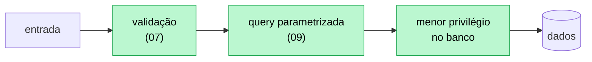
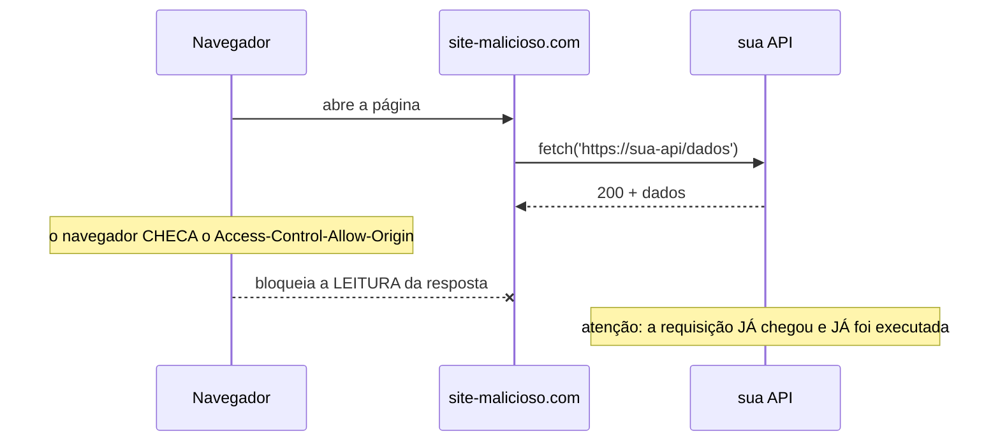

# 13 — Segurança

**Em uma frase:** segurança não é uma camada que se adiciona no fim — é um
conjunto de decisões que já foram tomadas nos módulos anteriores, e que aqui
ganham nome, prioridade e as duas ou três libs que faltavam.

<!-- sumario:inicio -->

**Sumário**

- [Por que importa](#por-que-importa)
- [Conceitos](#conceitos)
  - [O princípio que organiza o módulo inteiro](#o-princípio-que-organiza-o-módulo-inteiro)
  - [Defesa em profundidade](#defesa-em-profundidade)
  - [OWASP Top 10, filtrado para uma API Node](#owasp-top-10-filtrado-para-uma-api-node)
  - [Broken Access Control — o erro nº 1, na prática](#broken-access-control-o-erro-nº-1-na-prática)
  - [Injeção — além do SQL](#injeção-além-do-sql)
  - [XSS: por que ainda importa numa API que só devolve JSON](#xss-por-que-ainda-importa-numa-api-que-só-devolve-json)
  - [CSRF: quando você precisa se preocupar (e quando não)](#csrf-quando-você-precisa-se-preocupar-e-quando-não)
  - [CORS: o que ele faz, e o que ele definitivamente não faz](#cors-o-que-ele-faz-e-o-que-ele-definitivamente-não-faz)
  - [Rate limiting e brute force](#rate-limiting-e-brute-force)
  - [Enumeração de usuário](#enumeração-de-usuário)
  - [Helmet: os headers, e por que cada um existe](#helmet-os-headers-e-por-que-cada-um-existe)
  - [Segredos](#segredos)
  - [Dependências vulneráveis](#dependências-vulneráveis)
  - [Upload](#upload)
- [Na prática](#na-prática)
- [Erros comuns](#erros-comuns)
- [Cheatsheet](#cheatsheet)
- [Os princípios deste módulo](#os-princípios-deste-módulo)
- [Para ir além](#para-ir-além)
- [Pratique](#pratique)

<!-- sumario:fim -->

## Por que importa

- Quase tudo aqui é **barato de fazer antes** e caríssimo de corrigir depois de
  vazar.
- A maioria dos ataques não é sofisticada: é entrada não validada, senha fraca e
  dependência velha.
- Você já implementou metade disso sem chamar de segurança — validar (07), hash
  (11), query parametrizada (09).

## Conceitos

### O princípio que organiza o módulo inteiro

**Toda entrada é hostil até prova em contrário, e a prova acontece na fronteira.**

Não é pessimismo: é que o servidor não tem como distinguir um cliente legítimo de
um `curl` montado à mão. O navegador que você testou **não é** o que chega em
produção — ele é só um dos clientes possíveis, e o mais bem-comportado deles.

Disso decorre o resto:

| Se toda entrada é hostil…              | Então…                                                        |
| -------------------------------------- | ------------------------------------------------------------- |
| Validação no front é conveniência (UX) | A validação que **conta** é a do servidor (módulo 07)         |
| String do cliente pode virar comando   | Nunca concatene — parametrize (SQL, módulo 09)                |
| O cliente escolhe o que mandar         | Campo sensível (`papel`, `id`) vem do token, não do body (11) |
| O cliente pode repetir infinitamente   | Rate limit é obrigatório em rota de credencial                |

### Defesa em profundidade

**Nenhuma proteção é suficiente sozinha — some camadas que falham de formas
diferentes.**

O raciocínio é probabilístico: se uma camada falha em 1 caso de 100 e você tem
três camadas **independentes**, a falha conjunta é 1 em 1.000.000. A palavra que
carrega o peso é _independentes_: três validações do mesmo tipo, no mesmo lugar,
são uma só camada com três nomes.



Se a validação falhar, a query parametrizada segura. Se as duas falharem, o
usuário do banco sem permissão de `DROP` limita o estrago.

### OWASP Top 10, filtrado para uma API Node

A lista completa é do OWASP; abaixo está só o que muda o seu código, e onde já
foi tratado:

| Risco                         | Numa API Node é…                                        | Onde                 |
| ----------------------------- | ------------------------------------------------------- | -------------------- |
| **Broken Access Control**     | Confiar no `id` do body; esquecer de checar dono        | 11, e a seção abaixo |
| **Cryptographic Failures**    | Senha com hash rápido; segredo no git; falta de HTTPS   | 11                   |
| **Injection**                 | SQL concatenado; comando de shell montado com entrada   | 09                   |
| **Insecure Design**           | Não ter rate limit; permitir enumerar usuário           | este módulo          |
| **Security Misconfiguration** | Stack trace na resposta; CORS `*`; header revelador     | 06, este módulo      |
| **Vulnerable Components**     | Dependência com CVE conhecido                           | `npm audit`, abaixo  |
| **Auth Failures**             | Sessão que não expira; brute force livre                | 11                   |
| **SSRF**                      | Buscar URL que o cliente mandou, sem lista de permissão | este módulo          |

> **Nota:** O item nº 1 da lista é **controle de acesso**, não criptografia. A
> falha mais comum não é o atacante quebrar seu hash — é ele simplesmente pedir
> um recurso que não é dele, e a sua API entregar.

### Broken Access Control — o erro nº 1, na prática

```ts
// ❌ IDOR (Insecure Direct Object Reference): o id vem da URL e ninguém confere
// de quem é o empréstimo. Qualquer usuário logado lê o de qualquer outro.
app.get('/emprestimos/:id', autenticar, async (req, res) => {
  const emp = await repo.buscarPorId(Number(req.params.id));
  res.json(emp); // <- 'autenticar' provou QUEM é, não O QUE pode
});

// ✅ autenticado não é o mesmo que autorizado
app.get('/emprestimos/:id', autenticar, async (req, res) => {
  const emp = await repo.buscarPorId(Number(req.params.id));
  if (!emp) return res.status(404).json({ erro: 'não encontrado' });

  // Autorização por DONO precisa buscar o recurso primeiro — por isso ela mora
  // no service, e não num middleware (módulo 08 e 11).
  const dono = emp.usuarioId === req.usuario.id;
  if (!dono && req.usuario.papel !== 'admin') {
    // 404 e não 403: responder 403 confirmaria que o empréstimo 42 existe.
    return res.status(404).json({ erro: 'não encontrado' });
  }
  res.json(emp);
});
```

Repare no que o `autenticar` daquela rota realmente garante: que quem chamou tem
um token válido. Ou seja, que é **alguém** — não que é a pessoa certa.

Essa distinção é fácil de perder de vista, porque a rota "parece protegida". Ela
está: contra anônimos. Contra o usuário A lendo os dados do usuário B, não —
porque ninguém comparou o dono do recurso com quem pediu.

**Autenticar responde "quem é você". Só a autorização responde "isto é seu".**

### Injeção — além do SQL

O módulo 09 tratou SQL. A forma geral do problema é mais ampla:

**Injeção acontece sempre que dado do usuário atravessa a fronteira e vira
código de outro interpretador.** O interpretador pode ser o SQL, o shell, o
sistema de arquivos ou uma engine de template.

| Interpretador   | O ataque                               | A defesa                                         |
| --------------- | -------------------------------------- | ------------------------------------------------ |
| SQL             | `'; DROP TABLE livros; --`             | Query parametrizada (nunca concatenação)         |
| Shell           | `arquivo.txt; rm -rf /`                | `execFile` com array de argumentos, nunca `exec` |
| Sistema de arq. | `../../.env`                           | Resolver o caminho e conferir se está sob a raiz |
| Template        | `{{constructor.constructor('...')()}}` | Não renderizar template vindo do usuário         |

```ts
// ❌ path traversal: o nome do arquivo veio do cliente
res.sendFile(`/uploads/${req.params.nome}`); // ../../.env sai do diretório

// ✅ resolve e confere que continuou dentro da pasta permitida
import { resolve, sep } from 'node:path';
const RAIZ = resolve('uploads');
const alvo = resolve(RAIZ, req.params.nome);
if (!alvo.startsWith(RAIZ + sep))
  return res.status(400).json({ erro: 'caminho inválido' });
```

### XSS: por que ainda importa numa API que só devolve JSON

A resposta curta: **porque o seu JSON vira HTML na casa de outra pessoa.**

Se a API aceita `<script>` num campo `nome` e devolve isso sem tratar, o dado
está armazenado; o dano acontece quando um front o injeta na página. A API não
executa nada — ela **estoca a munição**.

| Onde tratar    | O quê                                                           |
| -------------- | --------------------------------------------------------------- |
| Na **entrada** | Validar formato (nome não precisa aceitar `<`), limitar tamanho |
| Na **saída**   | Escapar ao renderizar — responsabilidade de quem monta o HTML   |

> **Atenção:** Não tente "limpar HTML" com regex na API. Sanitizar HTML é um
> problema resolvido por bibliotecas dedicadas, e regex sempre perde para uma
> variação nova. Valide o formato do que você espera receber; deixe o escape para
> a camada que renderiza.

O ponto onde a API é diretamente responsável: **nunca devolva HTML montado com
dado do usuário** e sempre mande `Content-Type: application/json`. Sem o header
correto, o navegador pode adivinhar o tipo e executar o conteúdo — é exatamente
isso que o `X-Content-Type-Options: nosniff` do Helmet impede.

### CSRF: quando você precisa se preocupar (e quando não)

CSRF explora o fato de o navegador **enviar o cookie automaticamente** para o
domínio dono dele — inclusive numa requisição disparada por outro site.

Repare no detalhe que faz o ataque funcionar: o navegador anexa o cookie **sem
ninguém pedir**. Um site qualquer manda uma requisição para o seu domínio, e o
cookie vai junto, porque é assim que cookie funciona.

Daí sai o critério que decide se você precisa se preocupar: **o risco existe
quando a credencial viaja sozinha.** Se alguém precisa escrever a credencial na
requisição, um site de terceiro não consegue — ele não tem o token.

Isso responde a tabela inteira:

| Como o cliente autentica        | Vulnerável a CSRF? | Por quê                                        |
| ------------------------------- | ------------------ | ---------------------------------------------- |
| Cookie de sessão                | **Sim**            | O navegador anexa sozinho, venha de onde vier  |
| `Authorization: Bearer <token>` | Não                | Alguém precisa **escrever** o header           |
| Cookie `httpOnly` + `SameSite`  | Muito reduzido     | O navegador não manda em requisição cross-site |

Este repo usa `Bearer` para o access token e cookie `httpOnly` + `SameSite` só
para o refresh — daí não haver middleware de CSRF aqui. Se você migrar a
autenticação para cookie de sessão puro, ele passa a ser necessário.

```ts
// A defesa moderna começa no próprio cookie:
res.cookie('refresh', token, {
  httpOnly: true, // JavaScript não lê — mitiga XSS roubando o token
  secure: true, // só viaja em HTTPS
  sameSite: 'strict', // não vai junto em requisição vinda de outro site — é a defesa de CSRF
  maxAge: 7 * 24 * 60 * 60 * 1000,
});
```

### CORS: o que ele faz, e o que ele definitivamente não faz

Este é o mal-entendido mais caro do módulo.

**CORS não protege o seu servidor. Ele protege o usuário de um site malicioso —
e quem o aplica é o navegador, não você.**



Duas consequências que surpreendem:

1. **A requisição chega ao seu servidor mesmo bloqueada.** O navegador barra o
   JavaScript de _ler_ a resposta — o efeito colateral no banco já aconteceu.
   CORS não substitui autenticação nem autorização.
2. **`curl` e Postman ignoram CORS por completo.** Ele é uma regra do navegador,
   não do protocolo. Quem quiser atacar sua API direto não passa por ele.

| Configuração                        | O que significa                                         |
| ----------------------------------- | ------------------------------------------------------- |
| `origin: '*'`                       | Qualquer site lê as respostas. Aceitável em API pública |
| `origin: '*'` + `credentials: true` | **O navegador recusa** — combinação proibida pela spec  |
| `origin: ['https://app.exemplo']`   | O que se usa quando há cookie ou sessão envolvida       |

### Rate limiting e brute force

Sem limite, uma senha de 6 dígitos cai em minutos: são 1 milhão de combinações, e
um script faz milhares de tentativas por segundo. O Argon2 do módulo 11 torna
cada tentativa cara (~200ms), mas **rate limit é o que transforma "caro" em
"inviável"**.

```ts
import rateLimit from 'express-rate-limit';

// Balde SEPARADO por finalidade. Um balde compartilhado entre login e listagem
// faz a navegação normal consumir a cota que devia proteger a senha.
const limiteLogin = rateLimit({
  windowMs: 60_000,
  limit: 5, // 5 tentativas de senha por minuto, por IP
  standardHeaders: 'draft-8', // manda RateLimit e RateLimit-Policy
  legacyHeaders: false, // sem os antigos X-RateLimit-*
});
app.post('/auth/login', limiteLogin, controllers.login);
```

Medido com `limit: 2`, o que o cliente recebe:

```text
1ª → 200  ratelimit="2-in-1min"; r=1; t=60
2ª → 200  ratelimit="2-in-1min"; r=0; t=60
3ª → 429  ratelimit="2-in-1min"; r=0; t=60  retry-after=60
        corpo: Too many requests, please try again later.
```

O `r` é o que resta e o `t` são os segundos até a janela reabrir. Devolver
`Retry-After` importa: é o que permite a um cliente bem-comportado esperar em vez
de insistir.

> **Atenção:** O limite por IP é uma aproximação grosseira. Uma empresa inteira
> pode sair por um IP só (e ser bloqueada junto), enquanto um atacante com botnet
> tem milhares. Por isso rate limit é **uma** camada — e não a única.

**A memória do balde é do processo.** Com duas instâncias, o atacante ganha o
dobro de tentativas; um restart zera tudo. Em produção, o armazenamento vai para
o Redis (módulo 15).

### Enumeração de usuário

Um vazamento sutil que quase todo login tem:

```ts
// ❌ conta ao atacante quais e-mails existem no seu banco
if (!usuario) return res.status(404).json({ erro: 'e-mail não cadastrado' });
if (!senhaConfere) return res.status(401).json({ erro: 'senha incorreta' });

// ✅ mesma resposta para os dois casos
if (!usuario || !senhaConfere) {
  return res.status(401).json({ erro: 'credenciais inválidas' });
}
```

E o vazamento pelo **tempo**: se o usuário não existe, a rota responde na hora; se
existe, ela gasta os ~200ms do Argon2. Cronometrando, dá para descobrir quem é
cliente. A correção é verificar contra um hash descartável mesmo quando o usuário
não existe, para o custo ser o mesmo — a mesma ideia de canal lateral do módulo 11.

### Helmet: os headers, e por que cada um existe

`app.use(helmet())` liga 12 headers e remove 1. Medido nesta versão:

| Header                              | Valor padrão          | Contra o quê                                       |
| ----------------------------------- | --------------------- | -------------------------------------------------- |
| `content-security-policy`           | `default-src 'self'`… | Execução de script de outra origem (XSS)           |
| `strict-transport-security`         | `max-age=31536000`    | Downgrade para HTTP; força HTTPS por 1 ano         |
| `x-content-type-options`            | `nosniff`             | O navegador adivinhar o tipo e executar o conteúdo |
| `x-frame-options`                   | `SAMEORIGIN`          | Clickjacking (seu site dentro de um iframe alheio) |
| `referrer-policy`                   | `no-referrer`         | Vazar a URL (com query!) para o site de destino    |
| `cross-origin-opener-policy`        | `same-origin`         | Ataques de canal lateral entre abas                |
| `origin-agent-cluster`              | `?1`                  | Isolamento de processo por origem                  |
| `x-permitted-cross-domain-policies` | `none`                | Políticas legadas de Flash/PDF                     |
| `x-dns-prefetch-control`            | `off`                 | Vazamento de DNS por prefetch                      |
| `x-download-options`                | `noopen`              | IE abrir download no contexto do site              |
| `x-xss-protection`                  | **`0`**               | — veja abaixo                                      |

E o header que ele **remove**: `x-powered-by: Express`. Não fecha nenhuma porta,
mas evita entregar de graça qual stack você usa.

> **Cuidado:** `x-xss-protection: 0` **desliga** o filtro de XSS do navegador, e
> isso é proposital. O filtro antigo tinha bugs que criavam vulnerabilidades onde
> não havia; o consenso atual é desativá-lo e confiar no CSP. Se você "corrigir"
> esse header para `1; mode=block`, está piorando a segurança — é um falso amigo
> clássico.

Helmet é um bom **padrão**, não uma decisão terceirizada: numa API que só devolve
JSON, o CSP quase não importa (não há página); numa que serve HTML, ele é a
proteção principal e precisa ser ajustado à mão.

### Segredos

Vale separar duas coisas que costumam ir para o mesmo arquivo: **código** e
**segredo**.

Código é igual em todo lugar — o mesmo em desenvolvimento, em teste e em
produção. Segredo não: a chave do banco local não é a de produção, e nem deveria
ser. Ele muda por ambiente, e por isso não pertence ao lugar onde moram as coisas
que não mudam.

E há o motivo mais concreto: o git guarda **histórico**. Um segredo commitado não
sai apagando o arquivo — ele continua acessível em todo clone que alguém já fez.

| Regra                                             | Por quê                                                         |
| ------------------------------------------------- | --------------------------------------------------------------- |
| `.env` no `.gitignore`, `.env.example` versionado | O exemplo documenta **quais** variáveis existem, sem os valores |
| Falhar ao subir se faltar segredo                 | Melhor não subir do que subir inseguro (módulo 11)              |
| Segredo vazado é segredo **rotacionado**          | Apagar o commit não basta: já está no histórico e nos clones    |
| Nunca logar token, senha ou cookie                | O log costuma ser menos protegido que o banco (módulo 14)       |

```bash
git rm --cached .env      # tira do índice sem apagar o arquivo local
# e então: TROQUE o segredo. Ele continua no histórico do git.
```

### Dependências vulneráveis

Você não escreve 90% do código que sobe para produção — ele vem do
`node_modules`. Rodando neste repo, agora:

```text
$ npm audit
fast-uri  3.0.0 - 3.1.4
Severity: high
fast-uri vulnerable to host confusion via backslash authority introducer
fix available via `npm audit fix`

1 high severity vulnerability
```

Nem foi instalado de propósito: é dependência de dependência. É por isso que o
`npm audit` entra no CI (módulo 16) — a vulnerabilidade aparece sem você mexer em
nada.

| Comando                 | Quando usar                                               |
| ----------------------- | --------------------------------------------------------- |
| `npm audit`             | Ver o relatório                                           |
| `npm audit fix`         | Corrige o que cabe nas faixas de versão do `package.json` |
| `npm audit fix --force` | **Cuidado:** aceita major, podendo quebrar seu código     |
| `npm audit --omit=dev`  | Só o que vai para produção — prioriza o que importa       |

> **Nota:** Severidade não é prioridade. Um `high` numa lib usada só em teste é
> menos urgente que um `moderate` no caminho da requisição. Leia o aviso e
> pergunte: **esse código roda no meu contexto?**

### Upload

O tema completo é o módulo 19; a parte de segurança é esta:

**A extensão do arquivo é dado do usuário — ela não prova nada.** `virus.exe`
renomeado para `foto.jpg` continua sendo um executável. O que prova é o conteúdo:
os primeiros bytes (_magic bytes_) identificam o formato de verdade.

Somado a: limite de tamanho (senão o upload vira negação de serviço), nome de
arquivo gerado por você (nunca o do cliente — path traversal) e armazenamento
fora da pasta que é servida como estática.

## Na prática

```bash
node src/exemplos/13-seguranca/servidor.ts
```

```bash
B=localhost:5063

curl -i $B/publico | head -20          # veja os headers do helmet
curl -i $B/sem-helmet | head -12       # a mesma rota, sem os headers

for i in $(seq 1 6); do                # o 6º cai no rate limit
  curl -s -o /dev/null -w "%{http_code} " -X POST $B/auth/login \
    -H 'Content-Type: application/json' -d '{"email":"a@b.c","senha":"errada"}'
done; echo

curl -s "$B/arquivos/../../.env"       # path traversal barrado
curl -s "$B/busca?q=%27%3B+DROP+TABLE+livros%3B+--"   # injeção neutralizada
```

## Erros comuns

| Erro                                   | O que acontece                                       | Correção                                   |
| -------------------------------------- | ---------------------------------------------------- | ------------------------------------------ |
| Achar que CORS protege a API           | A requisição chega e executa; só a leitura é barrada | Autenticação e autorização de verdade      |
| `origin: '*'` com `credentials: true`  | O navegador recusa a resposta                        | Liste as origens explicitamente            |
| Mensagens de login diferentes          | O atacante descobre quais e-mails existem            | "credenciais inválidas" para os dois casos |
| Rate limit num balde só                | Navegar consome a cota que protegia a senha          | Um balde por finalidade                    |
| Rate limit em memória com 2 instâncias | O limite dobra; restart zera                         | Redis (módulo 15)                          |
| "Corrigir" `x-xss-protection` para `1` | Reativa um filtro com bugs conhecidos                | Deixe `0` e confie no CSP                  |
| Validar upload pela extensão           | `.exe` renomeado para `.jpg` passa                   | Conferir os magic bytes (módulo 19)        |
| `git rm .env` e achar que resolveu     | O segredo continua no histórico                      | **Rotacione** o segredo                    |
| `npm audit fix --force` sem ler        | Sobe major e quebra o build                          | Leia o diff; rode os testes                |
| `autenticar` sem checar dono           | Usuário A lê os dados do usuário B (IDOR)            | Autorização por dono, no service           |

## Cheatsheet

```ts
import helmet from 'helmet';
import rateLimit from 'express-rate-limit';

app.disable('x-powered-by'); // helmet() já faz
app.use(helmet()); // 12 headers de defesa
app.use(cors({ origin: ['https://app.exemplo.com'], credentials: true }));

const limite = rateLimit({ windowMs: 60_000, limit: 5, standardHeaders: 'draft-8' });
app.post('/auth/login', limite, login);

res.cookie('refresh', t, { httpOnly: true, secure: true, sameSite: 'strict' });
```

```bash
npm audit --omit=dev     # o que realmente vai para produção
npm audit fix            # correções dentro das faixas atuais
git rm --cached .env     # e ROTACIONE o segredo
```

| Pergunta                          | Resposta curta                            |
| --------------------------------- | ----------------------------------------- |
| CORS protege a API?               | Não. Protege o usuário, e só no navegador |
| Preciso de CSRF com `Bearer`?     | Não. Com cookie de sessão, sim            |
| Rate limit em memória serve?      | Só com uma instância. Depois, Redis       |
| Extensão do arquivo prova o tipo? | Não. Magic bytes provam                   |
| Apagar o `.env` do git resolve?   | Não. Rotacione o segredo                  |

## Os princípios deste módulo

Recapitulando — cada linha é uma conclusão que o módulo mostrou acontecer:

| A ideia                                                                                                                      | Onde volta |
| ---------------------------------------------------------------------------------------------------------------------------- | ---------- |
| Tudo que chega de fora é hostil até passar pela verificação — e a verificação que conta é a do servidor, nunca a do front.   | 07, 09, 19 |
| Várias defesas só multiplicam a proteção se elas falharem por motivos **diferentes**. Duas que caem juntas valem por uma.    | 11, 16     |
| Ter token válido não é ter direito ao recurso. Entregar o dado de outra pessoa é o erro mais comum de API.                   | 08, 11     |
| Injeção é dado que atravessa uma fronteira e é lido como comando do outro lado — em SQL, no shell, num caminho de arquivo.   | 09, 19     |
| CORS é regra que o navegador obedece, não porta que o servidor tranca. `curl` ignora e a requisição acontece do mesmo jeito. | 05, 15     |
| Segredo que vazou tem que ser trocado, não apagado. O commit some do topo e continua no histórico e em todo clone.           | 14, 16     |
| A maior parte do código que sobe com a sua API não foi você quem escreveu. Auditar dependência é rotina, não paranoia.       | 16         |
| Qualquer coisa que varie conforme a resposta conta um segredo: a mensagem, o status e também o tempo que demorou.            | 11, 14     |

## Para ir além

- **[OWASP Top 10](https://owasp.org/www-project-top-ten/)**
  A lista de referência, revisada periodicamente. Leia a descrição de cada risco — elas trazem exemplos concretos, não só o nome.
- **[OWASP — _REST Security Cheat Sheet_](https://cheatsheetseries.owasp.org/cheatsheets/REST_Security_Cheat_Sheet.html)**
  A versão específica para API. É o resumo mais próximo do que este módulo cobre.
- **[MDN — CORS](https://developer.mozilla.org/pt-BR/docs/Web/HTTP/CORS)**
  O que o navegador realmente faz no preflight, com os headers explicados um a um.
- **[Helmet — documentação](https://helmetjs.github.io/)**
  O que cada header faz e como desligar o que não serve para o seu caso.
- **[MDN — Content Security Policy](https://developer.mozilla.org/pt-BR/docs/Web/HTTP/CSP)**
  O header mais poderoso e o mais difícil de acertar. Necessário se a API também serve HTML.
- **[Node.js — Security Best Practices](https://nodejs.org/en/learn/getting-started/security-best-practices)**
  O guia oficial: ataques específicos do ecossistema Node, incluindo poluição de protótipo e typosquatting de pacote.

## Pratique

👉 [`exercicios/13-seguranca/`](../exercicios/13-seguranca/) — endurecer a API de
biblioteca: headers, rate limit por finalidade, correção do IDOR e da enumeração
de usuário.
