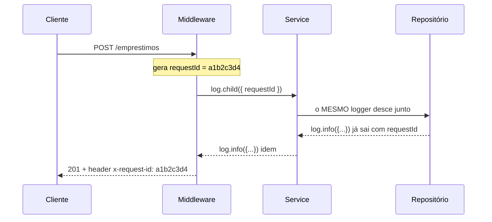

# 14 — Observabilidade

**Em uma frase:** observabilidade é a capacidade de responder "o que está
acontecendo aí dentro?" sem abrir o código nem reproduzir o problema — usando só
o que o sistema já emite.

## Por que importa

- Em produção você não tem `console.log` interativo nem depurador: só o que o
  processo escreveu **antes** de dar errado.
- Bug que não reproduz na sua máquina só é resolvido pelo rastro que ficou.
- Log mal feito custa dinheiro (armazenamento) e, se vazar dado sensível, custa
  muito mais.

## Conceitos

### O princípio que separa log de `console.log`

**Log é dado estruturado para máquina ler, não texto para humano ler.**

Essa é a virada mental do módulo. Enquanto o log é uma frase, só uma pessoa
consegue usá-lo — e uma pessoa não lê 40 mil linhas. Quando ele é um objeto com
campos, você **consulta**: "todas as requisições do usuário 42 que levaram mais
de 500ms e responderam 5xx".

```ts
// ❌ frase: legível por você, inútil para a máquina
console.log(`Usuário ${id} pegou o livro ${livroId} em ${ms}ms`);

// ✅ evento: filtrável, agregável, alertável
log.info({ usuarioId: id, livroId, ms }, 'empréstimo criado');
// {"level":30,"time":1785979415517,"usuarioId":42,"livroId":7,"ms":12,"msg":"empréstimo criado"}
```

A pergunta que decide o formato: **como eu acharia isto entre 10 milhões de
linhas?** Se a resposta envolve ler, está errado; se envolve filtrar por campo,
está certo.

### As três perguntas da observabilidade

| Sinal       | Responde                           | Custo                     | Neste módulo |
| ----------- | ---------------------------------- | ------------------------- | ------------ |
| **Log**     | O que aconteceu **neste** caso?    | Alto (por evento)         | Foco         |
| **Métrica** | Como está o sistema **no geral**?  | Baixo (números agregados) | Visão geral  |
| **Trace**   | Onde o tempo foi gasto na jornada? | Médio                     | Visão geral  |

A distinção prática: métrica te avisa que **algo** está errado; log te diz **o
quê**. Alertar por log é caro e ruidoso; investigar por métrica é impossível.

### Níveis: o filtro que você configura sem reescrever código

```text
trace 10 · debug 20 · info 30 · warn 40 · error 50 · fatal 60
```

O nível não é decoração — é o que permite **deixar o log detalhado no código** e
ligá-lo só quando precisar, via variável de ambiente.

| Nível   | Use para                                                   |
| ------- | ---------------------------------------------------------- |
| `debug` | Detalhe de desenvolvimento; desligado em produção          |
| `info`  | Fato de negócio: "empréstimo criado", "usuário registrado" |
| `warn`  | Anormal, mas tratado: retry, cota quase estourada          |
| `error` | Falhou e alguém precisa olhar; **sempre** com o erro junto |
| `fatal` | O processo não continua                                    |

**E o custo de um log descartado é praticamente zero.** Medido com 50 mil
chamadas de `info()` num logger configurado como `warn`:

```text
50.000 chamadas de info() com level=warn → 1ms
```

Isso é o que torna viável instrumentar generosamente: o `if` do nível acontece
antes de qualquer serialização. Por isso **passe o objeto, não uma string
interpolada** — a interpolação acontece mesmo quando o log é descartado:

```ts
log.debug(`estado: ${JSON.stringify(objetoGrande)}`); // ❌ serializa SEMPRE
log.debug({ estado: objetoGrande }, 'estado'); // ✅ só serializa se for emitir
```

### Pino: o que ele realmente compra

Vale ser honesto, porque o marketing fala em velocidade. Medido aqui, 50 mil
linhas, os dois escrevendo em arquivo:

```text
pino:                220ms   (4,4µs por linha)
JSON.stringify na mão: 156ms
```

**O Pino não é mais rápido que serializar você mesmo.** O que ele entrega é
outra coisa — e é isso que justifica a dependência:

| O que o Pino dá         | O que custaria fazer na mão                               |
| ----------------------- | --------------------------------------------------------- |
| Níveis com custo ~zero  | Um `if` por chamada, em todo lugar                        |
| **Redação de segredo**  | Lembrar de nunca logar senha — em cada `log` que escrever |
| **Child logger**        | Passar o `requestId` por 5 camadas de função              |
| Serialização de `Error` | `Error` vira `{}` em `JSON.stringify`; a stack se perde   |
| Escrita assíncrona      | Buffer e backpressure na mão                              |

O último item da tabela é sutil e importante:

```ts
JSON.stringify({ err: new Error('falhou') }); // → {"err":{}}  ← a mensagem sumiu
```

Um `Error` tem propriedades não-enumeráveis, então `JSON.stringify` o transforma
num objeto vazio. O log que mais importa — o do erro — é justamente o que se
perde. O Pino tem um serializador próprio para isso:

```json
{
  "level": 50,
  "err": { "type": "Error", "message": "falhou", "stack": "Error: falhou\n    at ..." },
  "msg": "erro capturado"
}
```

### O que **nunca** logar

**O princípio: o log costuma ser menos protegido que o banco.** Ele é copiado
para um agregador, lido por mais gente, retido por meses e raramente
criptografado. Dado sensível ali é um vazamento com prazo estendido.

| Nunca                          | Porque                                           |
| ------------------------------ | ------------------------------------------------ |
| Senha (mesmo errada)           | A pessoa provavelmente usa a mesma em outro site |
| Token, cookie, `Authorization` | Quem lê o log passa a autenticar como o usuário  |
| CPF, cartão, endereço          | Dado pessoal — LGPD, e não há motivo técnico     |
| Corpo inteiro de requisição    | Contém tudo acima sem você perceber              |

A defesa não é disciplina, é configuração — porque disciplina falha uma vez e o
vazamento é permanente:

```ts
const log = pino({
  redact: {
    paths: ['senha', 'token', 'req.headers.authorization', 'req.headers.cookie'],
    censor: '[REDACTED]',
  },
});

log.info({ senha: 'ana123', token: 'eyJhbGciOi...' }, 'login');
// {"senha":"[REDACTED]","token":"[REDACTED]","msg":"login"}
```

> **Atenção:** `redact` age nos **caminhos que você listou**, não no nome do
> campo em qualquer profundidade.

Isso não é detalhe: **aconteceu ao escrever o exemplo deste módulo.** A
configuração listava `senha` e `req.body.senha`, e a rota logava
`{ corpo: req.body }` — o caminho real era `corpo.senha`, que não estava na
lista. A senha saiu em texto puro no log:

```json
{
  "corpo": { "email": "ana@x.com", "senha": "segredo-secretissimo" },
  "msg": "tentativa de login"
}
```

O que pegou o vazamento não foi releitura do código, foi **um teste que procura a
senha no log**:

```ts
expect(saidaDoLog).not.toContain(SENHA_DE_TESTE);
```

A correção foi acrescentar `'*.senha'` (um nível de aninhamento) e o caminho
específico. E a lição é mais geral que o Pino: **redação é uma lista, e lista se
desatualiza quando o formato do log muda.** Por isso o teste — ele falha quando
alguém adiciona um log novo com a senha em outro lugar.

### Request ID: o fio que costura a requisição inteira

Sem ele, os logs de 200 requisições simultâneas viram uma sopa: você vê "erro ao
salvar" mas não sabe de qual requisição, de qual usuário, depois de qual query.

**O princípio: todo evento precisa carregar o identificador da unidade de
trabalho que o gerou.** Em HTTP, essa unidade é a requisição.



O `child` é o mecanismo: ele cria um logger que carrega campos fixos, sem você
repetir o `requestId` em cada chamada.

```ts
// no middleware, uma vez por requisição
req.log = log.child({ requestId: randomUUID() });

// em qualquer camada abaixo, o campo já vem junto
req.log.info({ livroId }, 'empréstimo criado');
// {"requestId":"a1b2c3d4","livroId":7,"msg":"empréstimo criado"}
```

**Devolva o id no header também** (`x-request-id`). Aí o usuário que abre um
chamado te manda o id, e você acha a requisição exata em um filtro — em vez de
caçar por horário aproximado.

E se o header já vier do cliente ou do proxy, **reaproveite**: é isso que permite
seguir a mesma requisição atravessando vários serviços.

### `pino-http`: o log de requisição pronto

O módulo 05 usou o `morgan`, que escreve uma linha de texto. Aqui ele é
substituído, e vale ver por quê:

| morgan                         | pino-http                                |
| ------------------------------ | ---------------------------------------- |
| `GET /livros 200 12ms` (texto) | Objeto com método, rota, status, duração |
| Sem request id                 | Gera e propaga; expõe `req.log`          |
| Sem redação                    | Herda o `redact` do logger               |
| Não serializa erro             | Loga o erro com stack                    |

```ts
import pinoHttp from 'pino-http';

app.use(
  pinoHttp({
    logger: log,
    genReqId: (req, res) => {
      const id = req.headers['x-request-id'] ?? randomUUID();
      res.setHeader('x-request-id', String(id)); // devolve para o cliente
      return id;
    },
    // Sem isto, TODA requisição vira `info` — inclusive as 404 e as 500.
    customLogLevel: (_req, res, err) => {
      if (err || res.statusCode >= 500) return 'error';
      if (res.statusCode >= 400) return 'warn';
      return 'info';
    },
  }),
);
```

O `customLogLevel` é a peça que costuma faltar: sem ele, um erro 500 sai no mesmo
nível de uma listagem bem-sucedida, e o filtro por `level>=50` não acha nada.

### Métricas: RED

Log responde sobre um caso; métrica responde sobre o conjunto. O conjunto mínimo
que se mede numa API tem três números — **RED**:

| Letra        | O quê                   | Alerta quando              |
| ------------ | ----------------------- | -------------------------- |
| **R**ate     | Requisições por segundo | Cai a zero (ninguém chega) |
| **E**rrors   | Proporção de 5xx        | Sobe acima do normal       |
| **D**uration | Tempo de resposta       | O **percentil** sobe       |

**Meça percentil, não média.** É o ponto que mais engana: com 99 respostas de
10ms e uma de 5s, a média dá 60ms — parece ótimo, e mesmo assim um usuário em
cada cem esperou 5 segundos. O p95 e o p99 mostram o que a média esconde.

### Health check e readiness

Dois endpoints com perguntas diferentes — confundi-los derruba deploy:

| Endpoint  | Pergunta               | Se falhar                              |
| --------- | ---------------------- | -------------------------------------- |
| `/health` | O processo está vivo?  | O orquestrador **reinicia**            |
| `/ready`  | Consigo atender agora? | Para de mandar tráfego (sem reiniciar) |

```ts
// vivo: não toca em dependência nenhuma. Se checar o banco aqui, uma queda do
// banco faz o orquestrador reiniciar a aplicação em loop — sem resolver nada.
app.get('/health', (_req, res) => res.json({ status: 'ok' }));

// pronto: aí sim confere as dependências
app.get('/ready', async (_req, res) => {
  try {
    await db.prepare('SELECT 1').get();
    res.json({ status: 'pronto' });
  } catch {
    res.status(503).json({ status: 'indisponível' });
  }
});
```

**O princípio: "estou vivo" e "consigo trabalhar" são perguntas diferentes**, e
respondê-las com o mesmo endpoint transforma uma falha de dependência num loop
de reinício.

### Tracing distribuído, em visão geral

Quando a requisição atravessa vários serviços, o request id vira um **trace id**,
e cada trecho de trabalho vira um **span** com início, fim e pai. O resultado é
uma cascata que mostra onde o tempo foi: 20ms na API, 400ms no serviço de
pagamento, 15ms no banco.

O padrão é o **OpenTelemetry** — uma especificação com bibliotecas para cada
linguagem, que exporta para Jaeger, Grafana Tempo, Datadog e afins. Num monolito
com um banco, ele é exagero: o request id do log resolve. A partir de dois ou
três serviços, passa a ser a única forma de responder "por que ficou lento".

## Na prática

```bash
node src/exemplos/14-observabilidade/servidor.ts
```

```bash
B=localhost:5064

curl -i $B/livros                        # veja o header x-request-id na resposta
curl $B/livros/1                         # 200 → nível info
curl $B/livros/999                       # 404 → nível warn
curl $B/quebra                           # 500 → nível error, com stack no log
curl -X POST $B/login -H 'Content-Type: application/json' \
  -d '{"email":"ana@x.com","senha":"segredo"}'   # a senha sai [REDACTED]

curl -H 'x-request-id: meu-id-123' $B/livros     # id do cliente é reaproveitado
```

Para ler confortavelmente durante o desenvolvimento:

```bash
node src/exemplos/14-observabilidade/servidor.ts | npx pino-pretty
```

## Erros comuns

| Erro                               | O que acontece                              | Correção                         |
| ---------------------------------- | ------------------------------------------- | -------------------------------- |
| `console.log` em produção          | Texto não filtrável; sem nível; síncrono    | Logger estruturado               |
| `JSON.stringify(erro)`             | Vira `{}` — mensagem e stack somem          | Serializador de erro (`{ err }`) |
| Logar `req.body` inteiro           | Vaza senha e token sem você perceber        | `redact` com os caminhos reais   |
| String interpolada em `debug`      | Serializa mesmo quando o log é descartado   | Passe o objeto, não a string     |
| Todo log em `info`                 | Filtrar por gravidade não acha nada         | `customLogLevel` por status      |
| `/health` que checa o banco        | Banco cai → reinício em loop                | `/health` vivo, `/ready` pronto  |
| Alertar por média de latência      | Um a cada cem usuários espera 5s sem alerta | Percentil (p95, p99)             |
| Request id só no log               | O usuário não consegue te dizer qual foi    | Devolva em `x-request-id`        |
| Gerar id novo ignorando o do proxy | O rastro quebra entre serviços              | Reaproveite o header recebido    |
| Log sem retenção definida          | Custo cresce sem limite                     | Defina retenção por nível        |

## Cheatsheet

```ts
import pino from 'pino';
import pinoHttp from 'pino-http';

const log = pino({
  level: process.env.LOG_LEVEL ?? 'info',
  redact: ['senha', 'token', 'req.headers.authorization', 'req.headers.cookie'],
});

log.info({ usuarioId: 42 }, 'evento'); // objeto primeiro, mensagem depois
log.error({ err }, 'falhou'); // `err` ganha serialização especial
const filho = log.child({ requestId }); // campos fixos para todos os eventos

app.use(pinoHttp({ logger: log, genReqId, customLogLevel }));
req.log.info({ livroId }, 'criado'); // já sai com o requestId
```

```bash
LOG_LEVEL=debug node servidor.ts          # detalhe sem mudar código
node servidor.ts | npx pino-pretty        # legível no desenvolvimento
```

| Pergunta                        | Resposta curta                           |
| ------------------------------- | ---------------------------------------- |
| Pino é mais rápido que console? | Não necessariamente. Ele é mais **útil** |
| Média ou percentil?             | Percentil, sempre                        |
| `/health` checa o banco?        | Não. Isso é `/ready`                     |
| Onde nasce o request id?        | No proxy, se vier; senão no middleware   |

## Os princípios deste módulo

| Princípio                                                                                      | Onde reaparece |
| ---------------------------------------------------------------------------------------------- | -------------- |
| **Log é dado para máquina, não frase para pessoa** — se não dá para filtrar, não serve.        | 15, 16, 17     |
| **Todo evento carrega o id da unidade de trabalho** que o gerou.                               | 17, 18         |
| **O log é menos protegido que o banco** — dado sensível ali é vazamento com prazo estendido.   | 11, 13         |
| **Proteção por configuração vence proteção por disciplina** (`redact` > lembrar de não logar). | 13             |
| **Média esconde o que percentil revela.**                                                      | 15             |
| **"Estou vivo" e "consigo trabalhar" são perguntas diferentes.**                               | 16             |
| **Instrumentar é barato quando o descarte é barato** — daí o nível vir antes da serialização.  | 15             |

## Para ir além

- **[Pino — documentação](https://getpino.io/)**
  A API completa, incluindo `redact`, serializadores e transports. A seção de _child loggers_ é a mais útil na prática.
- **[Node.js — Logging best practices](https://github.com/goldbergyoni/nodebestpractices#-6-going-to-production-practices)**
  O capítulo de produção do _Node.js Best Practices_, com o porquê de cada recomendação.
- **[Google SRE Book — _Monitoring Distributed Systems_](https://sre.google/sre-book/monitoring-distributed-systems/)**
  Gratuito e online. A origem da ideia de sinais e do alerta baseado em sintoma, não em causa.
- **[Beyer et al. — _Site Reliability Engineering_](https://sre.google/books/)**
  O livro inteiro, também gratuito. Os capítulos de monitoramento e de resposta a incidente valem mesmo para quem não trabalha com escala do Google.
- **[OpenTelemetry — documentação](https://opentelemetry.io/docs/languages/js/)**
  O padrão de tracing e métricas, com o SDK de JavaScript. Leia quando tiver mais de um serviço.
- **[RED method](https://grafana.com/blog/2018/08/02/the-red-method-how-to-instrument-your-services/)**
  O artigo que popularizou Rate/Errors/Duration, com exemplos de painel.

## Pratique

👉 [`exercicios/14-observabilidade/`](../exercicios/14-observabilidade/) — trocar
o logger da API de biblioteca por Pino com request id atravessando toda a stack,
e provar com teste que a senha nunca aparece no log.
