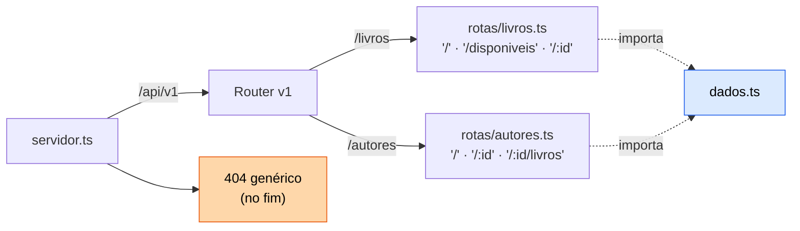

# Exercício 04 — Biblioteca em routers, com autores

⏱️ ~40 min · 🎯 Nível: iniciante

> [!NOTE]
> 📚 Continua o projeto: você vai **refatorar** o que fez no exercício 03 e
> adicionar um segundo recurso.

<!-- @import "[TOC]" {cmd="toc" depthFrom=2 depthTo=2 orderedList=false} -->

## Objetivo

Quebrar o servidor de um arquivo em routers por recurso, montar sob `/api/v1` e
desenhar as URLs do relacionamento livro↔autor.

## O que construir

Reorganize `src/playground/biblioteca/` assim:

```
biblioteca/
├── servidor.ts        # só cria o app, monta os routers e sobe a porta
├── dados.ts           # os arrays em memória + os types (por ora, o "banco")
└── rotas/
    ├── livros.ts
    └── autores.ts
```

1. **`dados.ts`** exporta `livros`, `autores` e os types. `Livro` ganha
   `autorId: number` no lugar do campo `autor` de texto.
   `Autor = { id, nome, nacionalidade }`. Comece com 2 autores e 3 livros.

2. **`rotas/livros.ts`** — o CRUD do exercício 03, com caminhos relativos
   (`'/'`, `'/:id'`), mais:
   - `GET /livros/disponiveis` — só os disponíveis. **Tem que funcionar**, o que
     exige atenção com a ordem em relação a `/:id`.
   - `router.param('id', ...)` resolvendo o 404 uma única vez, guardando o livro
     em `res.locals`.

3. **`rotas/autores.ts`**:
   - `GET /autores`, `GET /autores/:id` (404 se não existir)
   - `POST /autores` → `201`
   - `GET /autores/:id/livros` — os livros daquele autor
   - `DELETE /autores/:id` → `409` se o autor ainda tiver livros (não deixe
     livro órfão)

4. **`servidor.ts`** monta tudo sob `/api/v1`, tem `GET /api/v1` listando os
   recursos, e um 404 genérico **no fim**.

5. `POST /livros` passa a exigir `autorId` de um autor que **existe** → senão
   `400`.



> [!WARNING]
> `/livros/disponiveis` precisa ser declarada **antes** de `/livros/:id`. Fora
> dessa ordem você recebe 404 numa rota que existe.

## Critérios de aceite

- [ ] `GET /api/v1` lista os recursos
- [ ] `GET /api/v1/livros` → `200`
- [ ] `GET /api/v1/livros/disponiveis` devolve a lista filtrada, **não** um 404
- [ ] `GET /api/v1/livros/999` → `404` (vindo do `router.param`)
- [ ] `GET /api/v1/autores/1/livros` → só os livros do autor 1
- [ ] `POST /api/v1/livros` com `autorId: 99` → `400`
- [ ] `DELETE /api/v1/autores/1` com livros → `409`
- [ ] `DELETE` de um autor sem livros → `204`
- [ ] `GET /api/v1/inexistente` → `404` com `{ erro }`
- [ ] `GET /api/v2/livros` → `404` (nada montado nessa versão)
- [ ] Nenhum caminho dentro de `rotas/` começa com `/livros` ou `/autores`
- [ ] `npm run typecheck:play` passa

## Dicas

<details><summary>Dica 1 — a ordem que quebra tudo</summary>

Se `/:id` vier antes, `/livros/disponiveis` casa com ele: `req.params.id` recebe
a string `"disponiveis"`, `Number("disponiveis")` é `NaN`, nada é encontrado e
você recebe 404 — numa rota que existe e está correta.

Literal antes de parâmetro. Sempre.
</details>

<details><summary>Dica 2 — router.param e res.locals</summary>

```ts
router.param('id', (req, res, next, valor) => {
  const livro = livros.find((l) => l.id === Number(valor));
  if (!livro) return res.status(404).json({ erro: 'Livro não encontrado' });
  res.locals.livro = livro;
  next(); // esquecer isto congela a requisição
});
```

Nos handlers: `const livro = res.locals.livro as Livro;`. O cast é necessário
porque `res.locals` é `Record<string, any>` — o Express não tem como saber o que
você guardou lá.
</details>

<details><summary>Dica 3 — import entre arquivos ESM</summary>

Extensão obrigatória, e é `.ts` mesmo:

```ts
import { livros, type Livro } from '../dados.ts';
```

Quem converte para `.js` no build é o `rewriteRelativeImportExtensions` do
tsconfig. Sem a extensão, o Node dá `ERR_MODULE_NOT_FOUND` ao rodar direto.
</details>

<details><summary>Dica 4 — por que 409 ao deletar autor com livros</summary>

É a mesma ideia de uma **chave estrangeira** com `ON DELETE RESTRICT`, que você
vai escrever em SQL no módulo 09. Aqui a regra é sua, na mão; lá o banco passa a
garanti-la — e é bom já ter sentido o problema antes.
</details>

<details><summary>Dica 5 — importação circular</summary>

`livros.ts` importar `autores.ts` e vice-versa dá `undefined` em runtime, num
erro difícil de ler. É justamente por isso que os dados vivem em `dados.ts`: os
dois routers importam de lá, e nenhum importa o outro.

Dependência tem que apontar numa direção só — a ideia central do módulo 08.
</details>

## Desafio extra

Monte o **mesmo** `rotasLivros` também em `/api/v2/livros`, mas com um middleware
antes que adiciona o header `X-Api-Deprecated: v1` na v1. Você acabou de
descobrir para que serve middleware — o módulo 05 começa aí.

---

Terminou? Compare com [`solucao/`](./solucao/).
