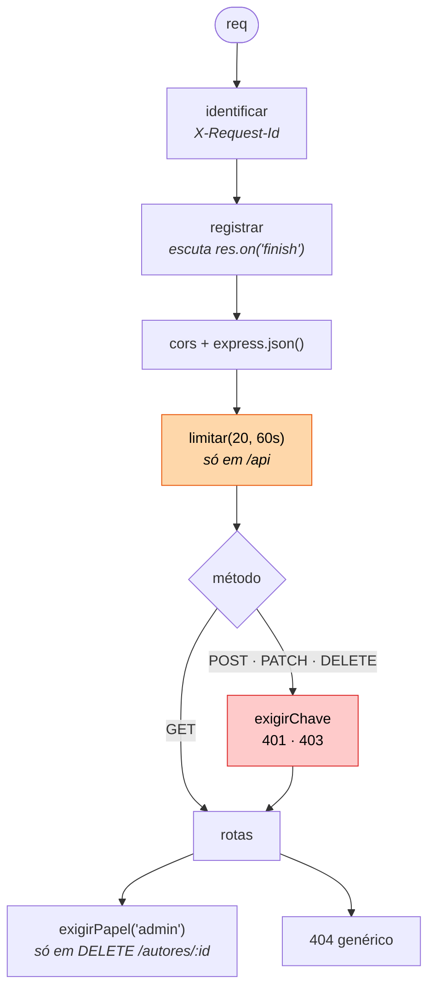

# Exercício 05 — Middlewares na biblioteca

⏱️ ~40 min · 🎯 Nível: iniciante

> [!NOTE]
> 📚 Continua o projeto. Você vai adicionar uma pasta `middlewares/` à
> `src/playground/biblioteca/`.

<!-- @import "[TOC]" {cmd="toc" depthFrom=2 depthTo=2 orderedList=false} -->

## Objetivo

Escrever seus próprios middlewares — log, tempo, chave de API, rate limit
simples — e provar que a ordem deles muda o comportamento.

## O que construir

```
biblioteca/
├── servidor.ts
├── dados.ts
├── middlewares/
│   ├── log.ts
│   ├── autenticar.ts
│   └── limitar.ts
└── rotas/
```

1. **`log.ts`** exporta `registrar` — imprime, ao final de cada requisição,
   `METODO /caminho STATUS em Xms`. O tempo tem que ser o real, medido da entrada
   até a resposta sair.

2. **`log.ts`** também exporta `identificar` — gera um id curto por requisição
   (`crypto.randomUUID().slice(0, 8)`), guarda em `res.locals.requestId`, devolve
   no header `X-Request-Id` e inclui no log.

3. **`autenticar.ts`**:
   - `exigirChave` — exige `X-Api-Key: biblioteca-123`. Ausente → `401`,
     errada → `403`.
   - `exigirPapel(papel)` — fábrica que compara com o header `X-Papel`.
     Diferente → `403`.

4. **`limitar.ts`** exporta `limitar(max, janelaMs)` — conta requisições por IP
   numa janela de tempo. Passou do limite → `429` com o header
   `Retry-After` em segundos. (No módulo 13 isso vira `express-rate-limit`.)

5. Aplique na `servidor.ts`, com a ordem certa:
   - `identificar` e `registrar` valem para **tudo**
   - `cors` e `express.json()` globais
   - `limitar(20, 60_000)` só em `/api`
   - `exigirChave` em **escritas** (POST/PATCH/DELETE), não em leituras
   - `exigirPapel('admin')` só em `DELETE /autores/:id`
   - um 404 genérico no fim

6. `GET /api/v1/livros` continua funcionando **sem** nenhum header.



## Critérios de aceite

- [ ] Toda resposta traz `X-Request-Id`, diferente em cada requisição
- [ ] O terminal mostra `GET /api/v1/livros 200 em 1.2ms [a1b2c3d4]`
- [ ] `GET /api/v1/livros` sem headers → `200`
- [ ] `POST /api/v1/livros` sem `X-Api-Key` → `401`
- [ ] `POST` com chave errada → `403`
- [ ] `POST` com chave certa e body válido → `201`
- [ ] `DELETE /api/v1/autores/2` com chave mas sem `X-Papel: admin` → `403`
- [ ] 21 requisições rápidas → a última dá `429` com `Retry-After`
- [ ] Depois da janela, volta a `200`
- [ ] Mover `express.json()` para **depois** dos routers quebra o `POST` — teste
      e entenda o erro antes de desfazer
- [ ] `npm run typecheck:play` passa

## Dicas

<details><summary>Dica 1 — medir o tempo até a resposta sair</summary>

Middleware roda na descida; a resposta sai depois. Escute o evento:

```ts
export function registrar(_req: Request, res: Response, next: NextFunction) {
  const inicio = performance.now();
  res.on('finish', () => {
    // aqui res.statusCode já é o final
  });
  next();
}
```

`res.on('close')` também existe e dispara mesmo se o cliente desistir no meio —
útil para detectar abandono.
</details>

<details><summary>Dica 2 — só nas escritas</summary>

Três formas, todas válidas:

```ts
// a) pendurar na rota
rotasLivros.post('/', exigirChave, handler);

// b) middleware global que decide pelo método
app.use('/api', (req, res, next) => {
  if (req.method === 'GET') return next();
  exigirChave(req, res, next);
});

// c) o Express aceita um array de métodos via app.all + checagem
```

A (a) é a mais explícita — quem lê a rota vê a proteção. A (b) não deixa você
esquecer numa rota nova.
</details>

<details><summary>Dica 3 — rate limit em memória</summary>

```ts
const contagem = new Map<string, { total: number; expiraEm: number }>();

export function limitar(max: number, janelaMs: number) {
  return (req: Request, res: Response, next: NextFunction) => {
    const ip = req.ip ?? 'desconhecido';
    const agora = Date.now();
    const atual = contagem.get(ip);

    if (!atual || atual.expiraEm < agora) {
      contagem.set(ip, { total: 1, expiraEm: agora + janelaMs });
      return next();
    }
    // ...incrementa; se passou de max, 429 + Retry-After
  };
}
```

Um `Map` em memória some no restart e não é compartilhado entre instâncias — por
isso o módulo 15 usa Redis. Para estudar, o Map basta.
</details>

<details><summary>Dica 4 — Retry-After</summary>

O header vai em **segundos**, inteiro:

```ts
res.set('Retry-After', String(Math.ceil((atual.expiraEm - agora) / 1000)));
res.status(429).json({ erro: 'Muitas requisições' });
```

Sem ele, o cliente educado não tem como saber quando tentar de novo — e o
cliente mal-educado vai martelar sua API em loop.
</details>

<details><summary>Dica 5 — quando a ordem quebra</summary>

Faça o teste do critério de aceite: mova `app.use(express.json())` para depois
dos `app.use('/api/v1', v1)`.

O `POST` passa a falhar porque `req.body` é `undefined` quando a rota roda — o
parser está na fila, mas **atrás** de quem já respondeu. Isso não gera warning
nenhum: é só um 400 (ou um 500) que não faz sentido nenhum.
</details>

## Desafio extra

Escreva `apenasEmDesenvolvimento(middleware)` — um wrapper que só aplica o
middleware recebido quando `process.env.NODE_ENV !== 'production'`. Use para
ligar um middleware que adiciona 300 ms de latência artificial, simulando rede
ruim. É assim que se descobre que o front não tem estado de loading.

---

Terminou? Compare com [`solucao/`](./solucao/).
