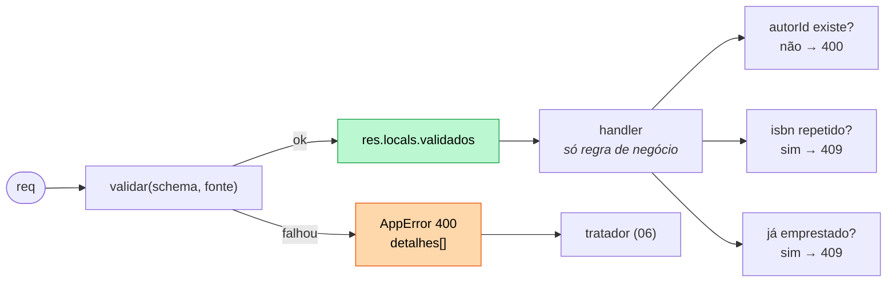

# Exercício 07 — Zod na biblioteca

⏱️ ~45 min · 🎯 Nível: intermediário

> **Nota:**
> 📚 Continua o projeto. Ao terminar, sua API não tem mais nenhuma linha de
> `typeof x !== 'string'`.

## Objetivo

Substituir a validação manual por schemas Zod, com o tipo `Livro` derivado do
schema em vez de escrito à mão.

## O que construir

Adicione a `src/playground/biblioteca/`:

```
schemas/
├── livro.ts       # criarLivroSchema, atualizarLivroSchema, listarLivrosSchema
├── autor.ts       # criarAutorSchema, atualizarAutorSchema
└── comuns.ts      # idSchema, paginacaoSchema
middlewares/
└── validar.ts     # o middleware genérico + o leitor tipado
```

1. **`middlewares/validar.ts`** — `validar(schema, fonte)` que valida
   `body`/`query`/`params`, lança `AppError` 400 com
   `detalhes: [{ campo, mensagem, codigo }]`, e guarda o resultado em
   `res.locals`. Mais um leitor tipado para os handlers usarem sem `as`.

2. **`schemas/livro.ts`**:
   - `titulo`: string, trim, 1–200 caracteres
   - `autorId`: inteiro positivo
   - `ano`: inteiro entre 1450 e o ano atual
   - `isbn`: opcional, exatamente 13 dígitos (`/^\d{13}$/`)
   - `generos`: array de 1 a 3 valores de
     `['ficcao','fantasia','tecnico','biografia']`, default `['ficcao']`
   - `.strict()`
   - `atualizarLivroSchema` — todos opcionais, **sem** defaults vazando
   - `listarLivrosSchema` — `autorId?`, `disponivel?` (`'true'|'false'` → boolean),
     `ordenar?` (`'ano'|'titulo'`), `pagina` (default 1), `porPagina` (default 10,
     máx 50)

3. **`schemas/autor.ts`** — `nome` (2–100, trim), `nacionalidade` (2–60),
   `nascimento` opcional (`z.coerce.date()`, não pode ser no futuro).

4. **Derive o tipo dos dados do schema:**

   ```ts
   export type Livro = z.infer<typeof criarLivroSchema> & {
     id: number;
     disponivel: boolean;
   };
   ```

   Apague o `type Livro` escrito à mão.

5. **Refatore as rotas** para usar `validar(...)`. Cada handler perde a validação
   e fica com só a regra de negócio.

6. **Mantenha como regra de negócio** (não tente pôr no schema):
   - `autorId` tem que existir → `400`
   - `isbn` não pode repetir → `409`
   - emprestar livro já emprestado → `409`

7. `GET /livros` passa a devolver
   `{ dados, pagina, porPagina, total }` sempre.



> **Importante:**
> As três regras de negócio da direita **não** cabem no schema: elas precisam
> consultar os dados. Schema responde "está bem formado?"; o handler responde "é
> permitido agora?".

## Critérios de aceite

- [ ] `grep -rn "typeof" src/playground/biblioteca/rotas` não retorna nada
- [ ] `POST /livros` com `{"titulo":"ab","autorId":"x","ano":1200}` → `400` com
      **3** entradas em `detalhes`
- [ ] `POST` com campo `titluo` → `400` com `unrecognized_keys`
- [ ] `POST` com `isbn: "123"` → `400`; com 13 dígitos → `201`
- [ ] `POST` com o mesmo `isbn` de novo → `409`
- [ ] `POST` sem `generos` → criado com `["ficcao"]`
- [ ] `POST` com 4 gêneros → `400`
- [ ] `PATCH /livros/1` com só `{"ano": 1955}` **não** altera `generos`
- [ ] `PATCH` com `{"xpto":1}` → `400`
- [ ] `GET /livros?pagina=2&porPagina=1` → `{ dados, pagina: 2, ... }`
- [ ] `GET /livros?porPagina=999` → `400`
- [ ] `GET /livros?disponivel=false` devolve os **indisponíveis**
- [ ] `GET /livros/abc` → `400` (não `404`)
- [ ] `POST /autores` com `nascimento` no futuro → `400`
- [ ] `npm run typecheck:play` passa

## Dicas

<details><summary>Dica 1 — o erro que o Express 5 dá</summary>

Não faça `req.query = resultado.data`:

```
TypeError: Cannot set property query of #<IncomingMessage> which has only a getter
```

O Express 5 tornou `req.query` um getter com parse lazy. Guarde em `res.locals`:

```ts
res.locals.validados = { ...res.locals.validados, [fonte]: resultado.data };
```

</details>

<details><summary>Dica 2 — ler o validado com tipo, sem `as`</summary>

```ts
export function validados<T>(res: Response, _schema: ZodType<T>, fonte = 'body'): T {
  const dado = (res.locals.validados as Record<string, unknown>)?.[fonte];
  if (dado === undefined) throw new Error(`faltou validar('${fonte}')`);
  return dado as T;
}
```

O schema entra de novo só para o TypeScript inferir o retorno — em runtime ele não
é usado. Uso: `const { id } = validados(res, idSchema, 'params');`
</details>

<details><summary>Dica 3 — PATCH sem herdar defaults</summary>

`criarLivroSchema.partial()` **não** resolve: `.partial()` torna opcional, mas o
`.default(['ficcao'])` continua valendo. Um `PATCH {"ano":1955}` sairia com
`generos: ['ficcao']` e apagaria os gêneros salvos.

Guarde os campos crus e monte os dois schemas a partir deles:

```ts
const campos = { titulo: z.string().trim().min(1).max(200), generos: z.array(...).min(1).max(3) };

export const criarLivroSchema = z.object({ ...campos, generos: campos.generos.default(['ficcao']) }).strict();
export const atualizarLivroSchema = z.object(campos).partial().strict();
```

</details>

<details><summary>Dica 4 — booleano de query</summary>

`z.coerce.boolean()` é uma armadilha: `Boolean("false") === true`. Mapeie:

```ts
disponivel: z.enum(['true', 'false']).transform((v) => v === 'true').optional(),
```

</details>

<details><summary>Dica 5 — data no passado</summary>

```ts
nascimento: z.coerce.date().max(new Date(), 'nascimento não pode ser no futuro').optional(),
```

`z.coerce.date()` aceita string ISO e timestamp. `new Date()` é avaliado quando o
módulo carrega — para um servidor de longa duração, `.refine((d) => d <= new
Date())` é mais correto, porque roda a cada validação.
</details>

<details><summary>Dica 6 — o que continua fora do schema</summary>

`autorId` existir e `isbn` não repetir precisam consultar os dados. Isso é regra
de negócio: fica no handler, e o status é o que a semântica pedir (400 para
referência inválida, 409 para duplicidade).

Não use `.refine()` assíncrono acessando os dados — o schema deixa de ser
testável isolado (módulo 12) e reutilizável fora do HTTP.
</details>

## Desafio extra

Escreva `schemas/index.ts` exportando tudo, e um script
`src/playground/biblioteca/validar-seed.ts` que roda `criarLivroSchema.parse()`
sobre um array de livros de exemplo — provando que o **mesmo** schema serve fora
do Express. É exatamente o que o módulo 10 faz com seed do Prisma.

---

Terminou? Compare com [`solucao/`](./solucao/).
