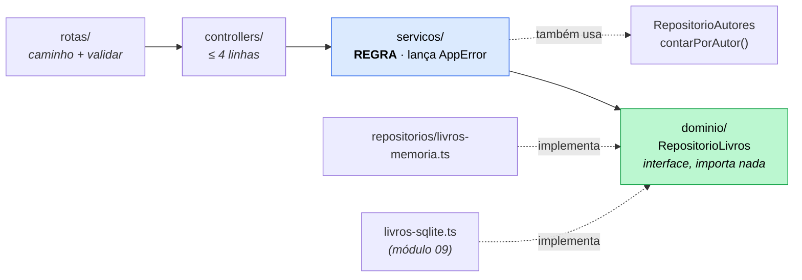

# Exercício 08 — Biblioteca em camadas

⏱️ ~45 min · 🎯 Nível: intermediário

> [!NOTE]
> 📚 Refatoração grande, sem nenhuma rota nova. No fim, a API responde
> exatamente igual — e é isso que prova que a refatoração deu certo.

<!-- @import "[TOC]" {cmd="toc" depthFrom=2 depthTo=2 orderedList=false} -->

## Objetivo

Separar a biblioteca em domínio → repositório → service → controller → rota, com
o repositório atrás de uma interface.

## O que construir

```
biblioteca/
├── servidor.ts          # composition root: monta tudo
├── dominio/
│   ├── livro.ts         # Livro, NovoLivro, RepositorioLivros (interface)
│   └── autor.ts
├── repositorios/
│   ├── livros-memoria.ts
│   └── autores-memoria.ts
├── servicos/
│   ├── livros.ts
│   └── autores.ts
├── controllers/
├── rotas/
├── schemas/             # continua igual (módulo 07)
├── middlewares/
└── erros/
```

1. **`dominio/livro.ts`** — os tipos e a interface `RepositorioLivros`, com
   métodos `Promise`, sem importar nada. Inclua `contarPorAutor(autorId)`, que o
   service de autores vai precisar.

2. **`repositorios/*-memoria.ts`** — fábricas que recebem os dados iniciais e
   devolvem a interface. **Nenhuma regra de negócio.** Devolvem cópias.

3. **`servicos/livros.ts`** — recebe `RepositorioLivros` **e**
   `RepositorioAutores` e concentra as regras:
   - `autorId` tem que existir → `400`
   - `isbn` único → `409`
   - emprestar livro já emprestado → `409`
   - devolver livro que não está emprestado → `409`
   - **regra nova:** livro emprestado não pode ser removido → `409`

4. **`servicos/autores.ts`** — usa `contarPorAutor` para o `409` ao deletar autor
   com livros.

5. **`controllers/`** — cada método com no máximo 4 linhas: ler, chamar o service,
   responder. Sem `try/catch`.

6. **`rotas/`** — fábricas `criarRotasLivros(servico)` que montam validação +
   controller.

7. **`servidor.ts`** — monta na ordem repositório → service → controller → rota.



> [!IMPORTANT]
> Um service pode depender de **vários repositórios**. O que ele não deve fazer é
> depender de outro service — aí a mesma regra ganha dois pontos de entrada.

## Critérios de aceite

- [ ] `grep -rn "from 'express'" src/playground/biblioteca/servicos` → **nada**
- [ ] `grep -rn "^import" src/playground/biblioteca/dominio` → **nada**
- [ ] `grep -rnE "\b(req|res)\." src/playground/biblioteca/servicos` → **nada**
      (o `\b` evita casar com `repoAutores.`)
- [ ] Toda a bateria de testes do exercício 07 continua passando igual
- [ ] `DELETE` de livro emprestado → `409`
- [ ] `DELETE /autores/1` com livros → `409`
- [ ] Nenhum controller passa de 6 linhas de corpo
- [ ] Trocar a linha do repositório em `servidor.ts` por outra implementação **não**
      exige mudar service, controller ou rota
- [ ] `npm run typecheck:play` passa

## Dicas

<details><summary>Dica 1 — a interface primeiro</summary>

Escreva `dominio/livro.ts` antes de qualquer implementação. Se você escrever o
repositório primeiro, a interface vai acabar descrevendo o array — e no módulo 09
o SQLite não vai caber nela.

Pergunta que ajuda: "este método faz sentido para SQL, para Prisma **e** para
array?" `buscarPorId` sim. `filtrarComArrayFilter` não.
</details>

<details><summary>Dica 2 — Promise mesmo no que é síncrono</summary>

```ts
async buscarPorId(id: number): Promise<Livro | null> {
  return livros.find((l) => l.id === id) ?? null;
}
```

Parece bobo hoje. É o que faz o módulo 09 não mudar a assinatura de nada.
</details>

<details><summary>Dica 3 — service com dois repositórios</summary>

```ts
export function criarServicoLivros(
  repoLivros: RepositorioLivros,
  repoAutores: RepositorioAutores,
) { ... }
```

Verificar se o autor existe é regra de negócio do livro, e ela precisa consultar
autores. Um service pode depender de vários repositórios — o que ele **não** deve
fazer é depender de outro service (aí vira dois pontos de entrada para a mesma
regra e o risco de dependência circular).
</details>

<details><summary>Dica 4 — o spread que apaga</summary>

```ts
const atualizado = { ...atual, ...dados }; // ❌ o TS vai recusar
```

Se `dados` tem `{ isbn: undefined }`, o spread apaga o ISBN salvo. O
`exactOptionalPropertyTypes` do tsconfig recusa isso — e faz bem. Copie só o que
está definido, campo por campo, ou escreva um helper.
</details>

<details><summary>Dica 5 — controller de 4 linhas</summary>

```ts
async emprestar(_req: Request, res: Response) {
  const { id } = validados(res, idSchema, 'params');
  res.json(await servico.emprestar(id));
}
```

Sem `try/catch`: o service lança `AppError`, o Express 5 dá await no handler e o
tratador central responde. Se o seu controller tem `if`, mova o `if` para o
service.
</details>

<details><summary>Dica 6 — provar que a troca é barata</summary>

O último critério de aceite é o mais importante. Para testá-lo de verdade, escreva
uma segunda implementação boba — um `livros-vazio.ts` que devolve lista vazia em
tudo — e troque a linha no `servidor.ts`. Se você precisou tocar em qualquer outro
arquivo, a dependência está apontando para o lado errado.
</details>

## Desafio extra

Escreva `repositorios/livros-com-log.ts` — um repositório que recebe **outro**
repositório e delega tudo, imprimindo cada chamada antes. É o padrão **decorator**,
e ele funciona só porque tudo depende da interface. Depois pense: como isso se
compara a pôr o log dentro do repositório de memória?

---

Terminou? Compare com [`solucao/`](./solucao/).
