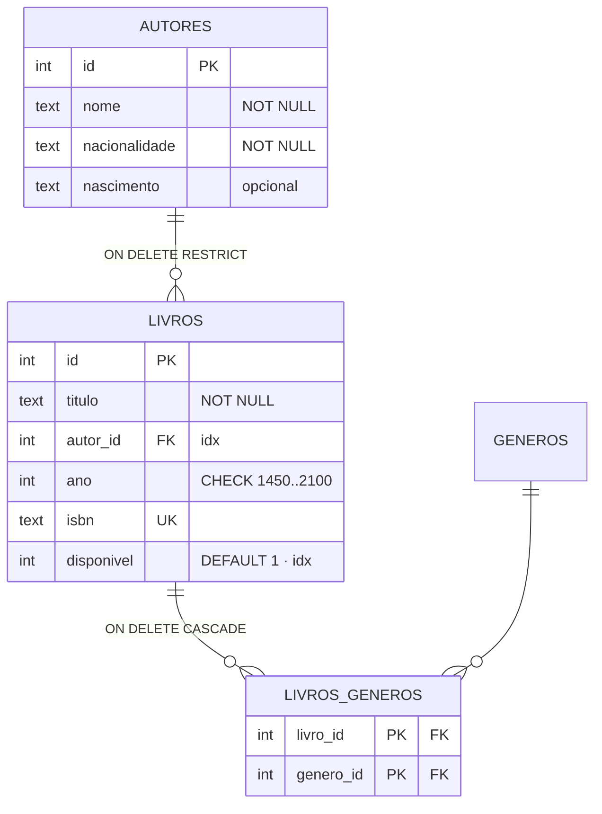

# Exercício 09 — Biblioteca sobre SQLite

⏱️ ~45 min · 🎯 Nível: intermediário

> [!IMPORTANT]
> 📚 O teste do módulo 08: você vai trocar o banco **sem tocar** em service,
> controller ou rota.

<!-- @import "[TOC]" {cmd="toc" depthFrom=2 depthTo=2 orderedList=false} -->

## Objetivo

Implementar `RepositorioLivros` e `RepositorioAutores` sobre `node:sqlite`, com
migrations, chaves estrangeiras e a tabela de junção do N-N de gêneros.

## O que construir

```
biblioteca/
├── db/
│   ├── conexao.ts       # abrirBanco() + PRAGMAs + migrations
│   ├── migrations.ts    # o SQL versionado
│   └── seed.ts          # dados iniciais idempotentes
└── repositorios/
    ├── livros-sqlite.ts
    └── autores-sqlite.ts
```

### 1. Migrations

- `001_inicial` — tabelas `autores` e `livros`:
  - `autores`: `id`, `nome NOT NULL`, `nacionalidade NOT NULL`, `nascimento TEXT`
  - `livros`: `id`, `titulo NOT NULL`, `autor_id NOT NULL`, `ano` com
    `CHECK (ano BETWEEN 1450 AND 2100)`, `isbn UNIQUE`,
    `disponivel INTEGER NOT NULL DEFAULT 1`
  - FK `autor_id → autores(id) ON DELETE RESTRICT`
- `002_generos` — `generos` + `livros_generos` com chave primária composta e
  `ON DELETE CASCADE` para `livro_id`
- `003_indices` — índice em `livros(autor_id)` e em `livros(disponivel)`

A tabela `_migrations` registra o que já rodou. Rodar duas vezes não pode falhar.



### 2. Repositórios

- Implementam **exatamente** as interfaces de `dominio/` do exercício 08.
- Convertem `snake_case` → `camelCase` e `0/1` → `boolean`.
- `listar` monta o `WHERE` dinamicamente e devolve `total` com um `COUNT(*)`
  separado — o total é do conjunto filtrado, não da página.
- `criar` de livro insere o livro **e** as linhas de `livros_generos` numa
  **transação**.
- `buscarPorId` traz os gêneros com `JOIN` (o `GROUP_CONCAT` ajuda).

### 3. Composition root

`servidor.ts` muda **duas linhas**: as que criam os repositórios.

> [!CAUTION]
> `PRAGMA foreign_keys = ON` é **por conexão**. Sem ele o SQLite aceita
> `autor_id = 999` alegremente e você descobre meses depois, com o banco cheio de
> órfãos.

## Critérios de aceite

- [ ] `git diff` em `servicos/`, `controllers/`, `rotas/` e `dominio/` → **vazio**
- [ ] Rodar o servidor duas vezes não duplica o seed nem falha nas migrations
- [ ] Toda a bateria do exercício 08 passa igual
- [ ] Ctrl+C, subir de novo → os dados continuam lá
- [ ] `POST` com `isbn` repetido → `409` (e o banco também recusaria)
- [ ] `DELETE /autores/1` com livros → `409`
- [ ] Um `INSERT` direto no banco com `autor_id` inexistente **falha**
      (prove que o `PRAGMA foreign_keys` está ligado)
- [ ] `GET /livros?autorId=1&pagina=1&porPagina=2` → `total` é o total filtrado,
      não `2`
- [ ] Criar livro com 2 gêneros e buscá-lo devolve os 2
- [ ] `EXPLAIN QUERY PLAN SELECT * FROM livros WHERE autor_id = 1` mostra
      `SEARCH ... USING INDEX`
- [ ] `data/*.sqlite` está no `.gitignore`
- [ ] `npm run typecheck:play` passa

## Dicas

<details><summary>Dica 1 — o PRAGMA que todo mundo esquece</summary>

```ts
db.exec('PRAGMA foreign_keys = ON');
```

É **por conexão**, não por banco. Sem ele o SQLite aceita `autor_id = 999`
alegremente e você descobre meses depois, com o banco cheio de órfãos.

Teste que prova: tente inserir um livro com `autor_id` inexistente direto pelo
`db.prepare(...).run(...)`. Se não der erro, o PRAGMA não está ligado.
</details>

<details><summary>Dica 2 — total paginado</summary>

`total` precisa ser do conjunto **filtrado inteiro**, não da página:

```ts
const { total } = db
  .prepare(`SELECT COUNT(*) AS total FROM livros ${where}`)
  .get(...valores);
const dados = db
  .prepare(`SELECT * FROM livros ${where} LIMIT ? OFFSET ?`)
  .all(...valores, porPagina, (pagina - 1) * porPagina);
```

Repare que os `valores` do `WHERE` são reusados nas duas queries, e os de `LIMIT`
/ `OFFSET` vêm depois — a ordem dos `?` é posicional.
</details>

<details><summary>Dica 3 — SQL dinâmico seguro</summary>

```ts
const condicoes: string[] = [];
const valores: (string | number)[] = [];

if (filtro.autorId !== undefined) {
  condicoes.push('autor_id = ?'); // pedaço = literal SEU
  valores.push(filtro.autorId); // valor = parâmetro
}
const where = condicoes.length ? `WHERE ${condicoes.join(' AND ')}` : '';
```

Os pedaços do SQL são strings escritas por você; só os valores passam por `?`.
Assim o SQL é dinâmico e continua imune a injeção.
</details>

<details><summary>Dica 4 — inserir livro + gêneros atomicamente</summary>

```ts
db.exec('BEGIN');
try {
  const { lastInsertRowid } = stmtInserirLivro.run(titulo, autorId, ano, isbn ?? null);
  const id = Number(lastInsertRowid);
  for (const genero of generos) stmtLigarGenero.run(id, genero);
  db.exec('COMMIT');
} catch (erro) {
  db.exec('ROLLBACK');
  throw erro;
}
```

Sem a transação, um gênero inválido deixaria o livro criado pela metade — sem os
gêneros, mas existindo. Estado que sua API nunca deveria produzir.
</details>

<details><summary>Dica 5 — gêneros num SELECT só</summary>

```sql
SELECT l.*, GROUP_CONCAT(g.nome) AS generos
  FROM livros l
  LEFT JOIN livros_generos lg ON lg.livro_id = l.id
  LEFT JOIN generos g         ON g.id = lg.genero_id
 WHERE l.id = ?
 GROUP BY l.id
```

`generos` vem como `'fantasia,ficcao'` ou `null`. Converta:
`linha.generos ? linha.generos.split(',') : []`.

`LEFT JOIN` é essencial: com `INNER`, um livro sem gênero desapareceria do
resultado — e `buscarPorId` devolveria `null` para um livro que existe.
</details>

<details><summary>Dica 6 — seed idempotente</summary>

```ts
const { total } = db.prepare('SELECT COUNT(*) AS total FROM autores').get();
if (total > 0) return; // já tem dados, não faz nada
```

Alternativa mais robusta: `INSERT OR IGNORE` com id fixo. Assim rodar o seed
depois de adicionar um autor novo não é problema.
</details>

## Desafio extra

Adicione a tabela `emprestimos` (`id`, `livro_id`, `quem`, `pego_em`,
`devolvido_em`) e faça `emprestar`/`devolver` operarem nela **dentro de uma
transação**, junto com o `UPDATE` de `disponivel`.

Depois use `AND disponivel = 1` no próprio `UPDATE` e cheque `changes === 0` em
vez de fazer um `SELECT` antes. Explique para si mesmo por que isso elimina a
condição de corrida que o `SELECT` deixava aberta.

---

Terminou? Compare com [`solucao/`](./solucao/).
