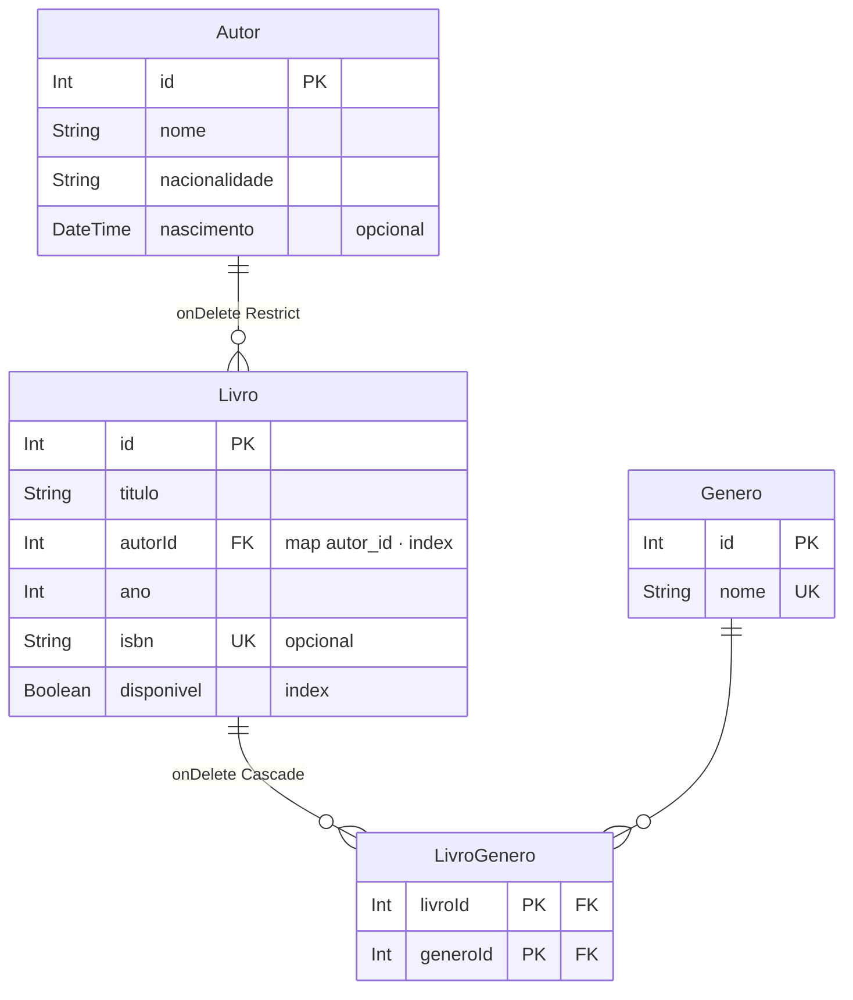

# Exercício 10 — Biblioteca com Prisma

⏱️ ~45 min · 🎯 Nível: intermediário

> **Importante:**
> 📚 Terceira troca de banco. Se o módulo 08 foi bem feito, `servicos/`,
> `controllers/`, `rotas/` e `dominio/` continuam intocados.

## Objetivo

Modelar a biblioteca em `schema.prisma`, gerar as migrations e reimplementar os
dois repositórios — sem N+1.

## O que construir

```
prisma/
├── schema.prisma            # já existe: ACRESCENTE os modelos da biblioteca
└── seed.ts
biblioteca/
├── db/prisma.ts             # a instância do client (singleton + adapter)
└── repositorios/
    ├── livros-prisma.ts
    └── autores-prisma.ts
```

### 1. Schema

Modele `Autor`, `Livro`, `Genero` e a junção `LivroGenero`, equivalentes às
tabelas do exercício 09:

- `@@map` para as tabelas ficarem em `snake_case`
- `@map("autor_id")` na coluna
- `isbn String? @unique`
- `onDelete: Restrict` na relação livro→autor
- `onDelete: Cascade` em `LivroGenero.livro`
- `@@id([livroId, generoId])` na junção
- `@@index` em `autorId` e `disponivel`



Depois: `npx prisma migrate dev --name biblioteca`

### 2. Client

`db/prisma.ts` exporta **uma** instância, com o adapter
`PrismaBetterSqlite3` e `log: ['query']` controlado por variável de ambiente.

### 3. Repositórios

Implementam as mesmas interfaces de `dominio/`. Exigências:

- `listar` traz os gêneros com `include` — **uma** chamada, sem laço
- `listar` devolve `total` do conjunto filtrado, com `prisma.livro.count()` na
  **mesma** `$transaction` do `findMany`
- `criar` insere o livro e as ligações de gênero com **nested create**
- `atualizar` de gêneros substitui o conjunto (`deleteMany` + `create`) dentro de
  uma **transação interativa**
- `buscarPorId` devolve `null` (não lança) quando não existe
- `remover` devolve `false` (não lança) quando não existe

### 4. Composition root

`servidor.ts` muda **duas linhas**.

> **Cuidado:**
> Dentro de `$transaction(async (tx) => ...)` use **`tx`**, nunca `prisma`. Com
> `prisma` você sai da transação e o rollback não desfaz nada — silenciosamente.

## Critérios de aceite

- [ ] `git diff` em `servicos/`, `controllers/`, `rotas/`, `dominio/` → **vazio**
- [ ] Toda a bateria do exercício 09 passa igual
- [ ] `PRISMA_LOG=1` + `GET /livros` → o número de queries **não** cresce com a
      quantidade de livros retornados
- [ ] `GET /livros?autorId=1&porPagina=1` → `total` é o total filtrado
- [ ] `POST` com 2 gêneros → criado com os 2, e o log mostra a transação
- [ ] `PATCH` mudando `generos` substitui o conjunto, não acumula
- [ ] `POST` com `isbn` repetido → `409`
- [ ] `DELETE /autores/1` com livros → `409`
- [ ] `npm run db:reset` recria tudo e roda o seed
- [ ] `npx prisma studio` mostra os dados
- [ ] `npm run typecheck:play` passa

## Dicas

<details><summary>Dica 1 — N-N explícito vs implícito</summary>

O Prisma sabe fazer N-N **implícito**: `generos Genero[]` dos dois lados, e ele
cria a tabela sozinho. Mais curto, e você não consegue acrescentar coluna nela
depois.

Escolha o **explícito** (com o modelo `LivroGenero`) por dois motivos: a
correspondência com a tabela que você criou à mão no exercício 09 fica visível, e
amanhã dá para adicionar `principal Boolean` na junção.

O custo é a navegação mais chata: `livro.generos[0].genero.nome` em vez de
`livro.generos[0].nome`.
</details>

<details><summary>Dica 2 — include de dois níveis</summary>

```ts
const livros = await prisma.livro.findMany({
  include: { generos: { include: { genero: true } } },
});
const nomes = livros[0]!.generos.map((lg) => lg.genero.nome);
```

Uma chamada, dois níveis. O laço com `await` dentro para buscar gêneros de cada
livro é o N+1 que o critério de aceite testa.
</details>

<details><summary>Dica 3 — total + página numa transação</summary>

```ts
const [total, dados] = await prisma.$transaction([
  prisma.livro.count({ where }),
  prisma.livro.findMany({ where, include, take, skip }),
]);
```

Duas queries, mas na mesma transação — então o `total` corresponde exatamente ao
conjunto de onde a página saiu. Fora da transação, um `INSERT` concorrente entre as
duas queries daria um total que não bate com os dados.
</details>

<details><summary>Dica 4 — substituir gêneros</summary>

```ts
await prisma.$transaction(async (tx) => {
  await tx.livroGenero.deleteMany({ where: { livroId: id } });
  await tx.livro.update({
    where: { id },
    data: {
      generos: { create: generos.map((nome) => ({ genero: { connect: { nome } } })) },
    },
  });
});
```

`connect` liga a um registro existente; `create` cria um novo. Para gêneros, que
são catálogo fixo, é `connect`.

E use `tx`, nunca `prisma`, dentro da transação — com `prisma` você sai dela e o
rollback não desfaz nada.
</details>

<details><summary>Dica 5 — o atrito com exactOptionalPropertyTypes</summary>

```ts
data: {
  titulo: dados.titulo;
} // ❌ não compila
```

Os tipos gerados declaram `titulo?: string` (sem `| undefined`), e a flag do
tsconfig recusa chave presente valendo `undefined` — que é o idioma do Prisma.
Use spread condicional:

```ts
data: {
  ...(dados.titulo !== undefined ? { titulo: dados.titulo } : {}),
}
```

</details>

<details><summary>Dica 6 — delete e update lançam</summary>

`prisma.livro.delete({ where: { id: 999 } })` **lança** `P2025`. Sua interface
promete `Promise<boolean>`:

```ts
try {
  await prisma.livro.delete({ where: { id } });
  return true;
} catch {
  return false;
}
```

Traduzir erro de banco para o vocabulário do domínio é o trabalho desta camada.
Um `catch` amplo é aceitável aqui, mas se quiser precisão, cheque
`erro.code === 'P2025'`.
</details>

<details><summary>Dica 7 — regenerar o client</summary>

Depois de qualquer mudança no schema: `npm run db:generate`. O `migrate dev` já
faz isso, mas se você aplicou de outra forma, o TypeScript vai reclamar de um
campo que já existe no banco — e o erro não diz que o problema é o client velho.
</details>

## Desafio extra

Faça um `GET /relatorios/por-autor` que devolva
`[{ autor, totalLivros, emprestados, anoMaisAntigo }]`.

Escreva de **duas** formas: com `groupBy`/`_count` do Prisma e com `$queryRaw`.
Compare o SQL gerado (`PRISMA_LOG=1`), a legibilidade e a tipagem. Decida qual você
manteria — e escreva o porquê num comentário.

---

Terminou? Compare com [`solucao/`](./solucao/).
