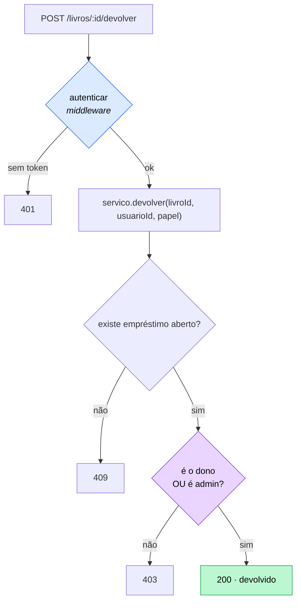

# Exercício 11 — Usuários, login e empréstimos com dono

⏱️ ~50 min · 🎯 Nível: intermediário

> **Nota:**
> 📚 A biblioteca ganha gente. Empréstimo passa a ter um responsável, e cada
> usuário só vê e devolve o que é dele.

## Objetivo

Registro, login com Argon2, access + refresh token, RBAC e autorização por **dono
do recurso** — que é a parte que quase todo tutorial esquece.

## O que construir

```
biblioteca/
├── dominio/usuario.ts        # Usuario, NovoUsuario, RepositorioUsuarios
├── dominio/emprestimo.ts     # Emprestimo, RepositorioEmprestimos
├── repositorios/             # as implementações (memória, SQLite ou Prisma)
├── servicos/
│   ├── autenticacao.ts       # registrar, login, refresh, logout
│   └── emprestimos.ts        # pegar, devolver, listar (com regra de dono)
├── auth/
│   ├── senhas.ts             # hash + verify + comparação em tempo constante
│   └── tokens.ts             # gerar/verificar access e refresh
├── middlewares/autenticar.ts # autenticar + exigirPapel
└── rotas/auth.ts
```

### 1. Domínio

```ts
type Usuario = {
  id: number;
  email: string;
  senhaHash: string;
  papel: 'leitor' | 'admin';
};
type Emprestimo = {
  id: number;
  livroId: number;
  usuarioId: number;
  pegoEm: Date;
  devolvidoEm?: Date | undefined;
};
```

`RepositorioUsuarios` precisa de `buscarPorEmail`.
`RepositorioEmprestimos` precisa de `buscarAbertoPorLivro(livroId)` e
`listarPorUsuario(usuarioId)`.

### 2. Auth

- `senhas.ts` — `hashSenha` com **argon2id** e `conferirSenha` que devolve
  `false` (não lança) para hash malformado.
- `tokens.ts` — access de 15 min com `{ sub, papel }`; refresh de 7 dias com
  `{ sub, jti }`. `issuer` e `audience` nos dois.
- `JWT_SECRET` vem do `.env` e o processo **não sobe** sem ele.

> **Atenção:**
> O fallback `?? 'segredo-de-dev'` é pior que um crash: você faz deploy com o
> segredo de exemplo e descobre quando alguém forja um token de admin.

### 3. Rotas de auth

| Rota                   | Faz                                                  |
| ---------------------- | ---------------------------------------------------- |
| `POST /auth/registrar` | `201` com `{ id, email, papel }`. Nunca `senhaHash`. |
| `POST /auth/login`     | access no corpo, refresh em cookie `httpOnly`        |
| `POST /auth/refresh`   | rotaciona: invalida o `jti` antigo, emite outro      |
| `POST /auth/logout`    | apaga o `jti`, limpa o cookie, `204`                 |
| `GET /auth/eu`         | dados do usuário logado                              |

### 4. Empréstimos com regra de dono

| Rota                         | Regra                                        |
| ---------------------------- | -------------------------------------------- |
| `POST /livros/:id/emprestar` | cria empréstimo com `usuarioId` do **token** |
| `POST /livros/:id/devolver`  | só o **dono** do empréstimo, ou um **admin** |
| `GET /emprestimos/meus`      | só os do usuário logado                      |
| `GET /emprestimos`           | **admin**: todos                             |



> **Cuidado:**
> O `usuarioId` vem **do token**, nunca do body. Aceitá-lo do body deixaria
> qualquer um pegar livro no nome de outro. Vale igual para `papel` e `criadoPor`.

> **Importante:**
> Repare no diagrama: **papel** é decidido no middleware (não precisa dos dados);
> **dono** é decidido no service (precisa buscar o recurso). Essa separação é o
> conteúdo do módulo.

### 5. Proteção das rotas existentes

- `GET /livros`, `GET /autores` — públicas
- `POST`/`PATCH`/`DELETE` de livros e autores — **admin**
- Remova a `X-Api-Key` dos módulos 05–10: ela era o placeholder disto.

## Critérios de aceite

- [ ] `POST /auth/registrar` → `201`, e a resposta **não** contém `senhaHash`
- [ ] Registrar o mesmo e-mail → `409`
- [ ] Senha com 7 caracteres → `400`
- [ ] Login com senha errada e login com e-mail inexistente → **a mesma**
      mensagem, ambos `401`
- [ ] Login devolve `accessToken` e grava cookie `refreshToken` com `HttpOnly`
- [ ] `GET /auth/eu` sem token → `401`; com token → `200`
- [ ] `Authorization: <token>` sem `Bearer ` → `401`
- [ ] Token com o payload alterado → `401`
- [ ] `POST /livros` como leitor → `403`; como admin → `201`
- [ ] `POST /livros/1/emprestar` grava o `usuarioId` do token
- [ ] Usuário B tentando devolver o empréstimo de A → `403`
- [ ] Admin devolvendo o empréstimo de A → `200`
- [ ] `GET /emprestimos/meus` como B não mostra os de A
- [ ] `GET /emprestimos` como leitor → `403`
- [ ] `POST /auth/refresh` → access novo; o refresh anterior deixa de funcionar
- [ ] Depois do logout, `POST /auth/refresh` → `401`
- [ ] `grep -rn "senhaHash" src/playground/biblioteca/controllers` → **nada**
- [ ] Sem `JWT_SECRET` no ambiente, o servidor **não sobe**
- [ ] `npm run typecheck:play` passa

## Dicas

<details><summary>Dica 1 — falhar ao subir sem segredo</summary>

```ts
const SEGREDO = process.env.JWT_SECRET;
if (!SEGREDO || SEGREDO.length < 32) {
  throw new Error('JWT_SECRET ausente ou curto (mínimo 32 caracteres)');
}
```

O fallback `?? 'segredo-de-dev'` é pior que um crash: você faz deploy com o
segredo de exemplo e descobre quando alguém forja um token de admin. Gere o seu:

```bash
node -e "console.log(require('node:crypto').randomBytes(32).toString('hex'))"
```

</details>

<details><summary>Dica 2 — o usuarioId vem do token</summary>

```ts
// ❌ NUNCA
const { usuarioId } = req.body; // qualquer um pega livro no nome de outro

// ✅
const { sub } = usuarioAutenticado(res);
await servico.emprestar(livroId, Number(sub));
```

Regra geral: **nada que identifica o autor da ação vem do cliente.** Vale para
`usuarioId`, `papel`, `criadoPor`.
</details>

<details><summary>Dica 3 — dono OU admin</summary>

Isso não cabe num middleware, porque precisa **buscar o recurso** para saber quem
é o dono. Logo, é regra de negócio — vai para o service:

```ts
async devolver(livroId: number, usuarioId: number, papel: Papel) {
  const emprestimo = await repoEmprestimos.buscarAbertoPorLivro(livroId);
  if (!emprestimo) throw conflito('Livro não está emprestado');

  if (emprestimo.usuarioId !== usuarioId && papel !== 'admin') {
    throw semPermissao('Só quem pegou o livro (ou um admin) pode devolvê-lo');
  }
  // ...
}
```

O middleware faz autorização por PAPEL (não precisa dos dados); o service faz
autorização por DONO (precisa). Confundir os dois leva a middleware consultando
banco e regra espalhada.
</details>

<details><summary>Dica 4 — emprestar em transação</summary>

Marcar `livro.disponivel = false` e criar o `emprestimo` é uma operação lógica em
duas tabelas. Sem transação, uma falha no meio deixa o livro indisponível sem
empréstimo registrado — e ninguém consegue devolvê-lo.

Se você está no SQLite (exercício 09): `BEGIN`/`COMMIT`. No Prisma (10):
`prisma.$transaction(async (tx) => ...)`, usando `tx`.
</details>

<details><summary>Dica 5 — não vazar o hash</summary>

Monte a resposta campo por campo:

```ts
const paraResposta = (u: Usuario) => ({ id: u.id, email: u.email, papel: u.papel });
```

Melhor que `delete usuario.senhaHash`: se um campo sensível for adicionado ao tipo
amanhã (`tokenDeRecuperacao`, `cpf`), ele não vaza por omissão. O `omit` do Prisma
7 resolve isso no nível da query, o que é ainda melhor.
</details>

<details><summary>Dica 6 — testar cookie com curl</summary>

```bash
curl -c cookies.txt -X POST localhost:PORTA/auth/login -H 'Content-Type: application/json' \
  -d '{"email":"a@x.com","senha":"senha12345"}'

curl -b cookies.txt -c cookies.txt -X POST localhost:PORTA/auth/refresh
```

`-c` grava, `-b` envia. Para conferir que o cookie é `HttpOnly`, olhe o header:
`curl -D - ... | grep -i set-cookie`.
</details>

<details><summary>Dica 7 — o que o logout NÃO faz</summary>

O **access** token continua válido até expirar (15 min), mesmo depois do logout. É
a natureza do JWT sem estado.

Se o produto exige logout instantâneo, é preciso uma lista de revogação consultada
a cada requisição — e aí você abriu mão do "stateless" que motivou usar JWT. Vale
escrever isso num comentário: é o tipo de limitação que precisa ser decisão, não
descoberta.
</details>

## Desafio extra

Adicione `POST /auth/trocar-senha` que exige a senha **atual** no body, mesmo com
o usuário já autenticado — e **revoga todos os refresh tokens** daquele usuário.

Depois responda: por que pedir a senha atual, se o token já prova quem é? (Dica:
pense em quem senta no computador destravado de outra pessoa.)

---

Terminou? Compare com [`solucao/`](./solucao/).
