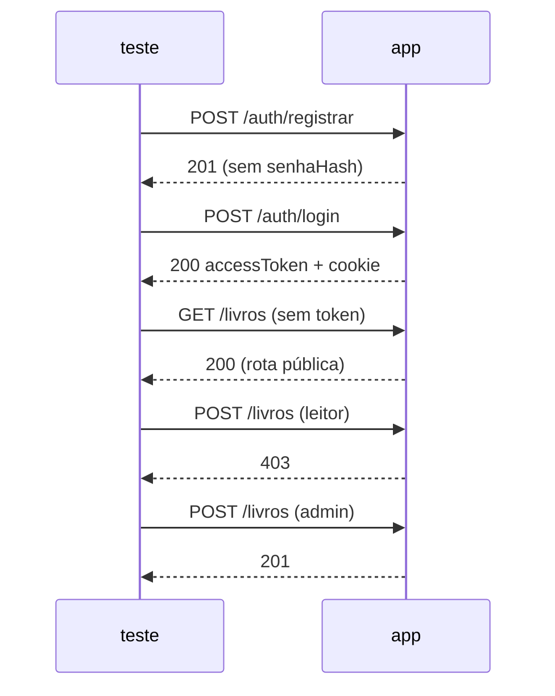

# Exercício 12 — Testando a biblioteca inteira

⏱️ ~45 min · 🎯 Nível: intermediário

> [!IMPORTANT]
> 📚 Nenhuma feature nova. Você vai provar que tudo que construiu do módulo 03
> ao 11 faz o que promete — e a primeira coisa a fazer é uma refatoração
> estrutural: extrair `criarApp()`.

<!-- @import "[TOC]" {cmd="toc" depthFrom=2 depthTo=2 orderedList=false} -->

## Objetivo

Refatorar o servidor para `criarApp()` e escrever uma suíte que cobre os três
níveis da pirâmide — incluindo o fluxo de autenticação do módulo 11.

## O que construir

```
biblioteca/
├── app.ts                    # ← NOVO: criarApp(deps) devolve o app, sem listen
├── servidor.ts               # ← ENCOLHE: só monta as dependências e chama listen
└── testes/
    ├── fixtures.ts           # fábricas de dados e de app pronto
    ├── servico-livros.test.ts    # unitário
    ├── rotas-livros.test.ts      # integração HTTP
    ├── auth.test.ts              # o fluxo de autenticação inteiro
    ├── autorizacao.test.ts       # papel e dono
    └── seguranca.test.ts         # o que NÃO pode aparecer na resposta
```

### 1. A refatoração: `criarApp()`

Hoje o seu `servidor.ts` monta tudo e chama `listen`. Separe:

```ts
// app.ts
export function criarApp(deps: { repoLivros: RepositorioLivros /* ... */ }) {
  const app = express();
  // ...middlewares, rotas, tratador...
  return app; // NENHUM listen aqui
}
```

> [!WARNING]
> Se `servidor.ts` continuar chamando `listen` no topo, importá-lo num teste
> sobe um servidor de verdade: `EADDRINUSE` entre arquivos e processo de teste
> que não encerra.

As dependências entram por parâmetro. É o composition root do módulo 08
finalmente pagando: o mesmo `criarApp` roda com repositório em memória (teste
rápido), com SQLite `:memory:` (integração) e com o banco real (produção).

### 2. Unitário — o service, sem HTTP e sem banco

Cubra as regras que você escreveu, não os getters:

- livro emprestado não pode ser removido (**409**)
- autor com livros não pode ser removido (**409**)
- ISBN duplicado (**409**)
- `autorId` inexistente na criação (**400**, não 404)
- id inexistente (**404**)

### 3. Integração HTTP — Supertest

```ts
const resposta = await request(app).post('/api/v1/livros').send({ ... });
expect(resposta.status).toBe(201);
```

Cubra o que só existe dentro do Express: status, `Location`, formato do corpo de
erro, validação do Zod, e o 404 de rota inexistente.

### 4. Auth — o fluxo inteiro



> [!TIP]
> Extraia um helper `async function logar(app, email, senha): Promise<string>`
> que devolve o access token. Sem ele, cada teste repete 4 linhas de setup e a
> asserção some no meio.

### 5. Autorização por dono

O teste que prova o conteúdo do módulo 11: o usuário **B** não devolve o
empréstimo de **A** (403), mas um **admin** devolve (200).

### 6. Segurança — teste de ausência

A resposta de erro 500 **não** pode conter stack, caminho de arquivo nem a
mensagem interna. E nenhuma resposta, em rota nenhuma, pode conter `senhaHash`.

## Critérios de aceite

- [ ] `criarApp()` existe e **não** chama `listen`
- [ ] `servidor.ts` é o único arquivo com `listen`
- [ ] `npm test` roda a suíte inteira sem subir porta fixa
- [ ] Rodar `npm test` duas vezes seguidas dá o mesmo resultado
- [ ] Cada teste monta o próprio app (`beforeEach`, não `beforeAll`)
- [ ] Unitário: 409 para remover livro emprestado
- [ ] Unitário: 400 para `autorId` inexistente
- [ ] Integração: `POST /livros` devolve 201 **e** header `Location`
- [ ] Integração: corpo de erro tem `erro` e `status`
- [ ] Integração: `POST` sem `Content-Type: application/json` → 400
- [ ] Auth: registrar devolve 201 e a resposta **não** contém `senhaHash`
- [ ] Auth: login devolve `accessToken` e grava cookie `HttpOnly`
- [ ] Auth: senha errada e e-mail inexistente dão a **mesma** mensagem
- [ ] Autorização: leitor em `POST /livros` → 403; admin → 201
- [ ] Autorização: B devolvendo o empréstimo de A → 403; admin → 200
- [ ] Segurança: o corpo do 500 não contém `at `, `.ts` nem `node_modules`
- [ ] Nenhum teste usa `vi.mock` de módulo
- [ ] `npm run typecheck:ex` passa

## Dicas

<details><summary>Dica 1 — como saber se o isolamento está certo</summary>

Rode a suíte duas vezes seguidas e depois um arquivo sozinho:

```bash
npm test && npm test
npx vitest run caminho/rotas-livros.test.ts
```

Resultado diferente entre as três execuções = estado vazando. Os suspeitos, nessa
ordem: `beforeAll` no lugar de `beforeEach`, fixture como `const` em vez de
função, e módulo com estado no topo (`const livros = []` fora de uma fábrica).
</details>

<details><summary>Dica 2 — o `await` que falta</summary>

```ts
// ❌ PASSA MESMO QUANDO FALHA
expect(servico.remover(1)).rejects.toThrow();

// ✅
await expect(servico.remover(1)).rejects.toThrow();
```

Sem o `await`, a asserção vira uma promise que ninguém espera e o `it` termina
antes de ela resolver. É o bug mais comum em teste assíncrono, e é silencioso —
o pior tipo. Para confirmar que um teste seu funciona, **quebre o código de
propósito e veja-o falhar**.
</details>

<details><summary>Dica 3 — checar o status do erro, não só o tipo</summary>

```ts
const erro = (await servico.remover(1).catch((e: unknown) => e)) as AppError;
expect(erro.status).toBe(409);
```

`rejects.toThrow(AppError)` passaria igual se o service lançasse um 500 — e a
diferença entre 409 e 500 é a diferença entre "o cliente errou" e "eu errei".
</details>

<details><summary>Dica 4 — helper de login</summary>

```ts
async function logar(app: App, email: string, senha: string) {
  const r = await request(app).post('/auth/login').send({ email, senha });
  return r.body.accessToken as string;
}

// e nos testes:
const admin = await logar(app, 'admin@x.com', 'senha12345');
await request(app)
  .post('/api/v1/livros')
  .set('Authorization', `Bearer ${admin}`)
  .send(livro);
```

Lembre que o primeiro usuário registrado vira admin — a ordem do `beforeEach`
importa.
</details>

<details><summary>Dica 5 — testar o cookie HttpOnly</summary>

```ts
const r = await request(app).post('/auth/login').send({ email, senha });
const cookies = r.headers['set-cookie'] as unknown as string[];
expect(cookies.join(';')).toContain('HttpOnly');

// reenviar o cookie numa requisição seguinte:
await request(app).post('/auth/refresh').set('Cookie', cookies);
```

</details>

<details><summary>Dica 6 — teste de ausência</summary>

```ts
const corpo = JSON.stringify(resposta.body);
expect(corpo).not.toContain('at ');
expect(corpo).not.toContain('.ts');
```

Serialize o corpo **inteiro**. `expect(body.stack).toBeUndefined()` deixaria
passar um `detalhes: { stack }` ou um campo `debug` novo — e o ponto do teste é
justamente pegar o campo que ninguém previu.

E silencie o log, senão a saída fica cheia de stack vermelha:

```ts
vi.spyOn(console, 'error').mockImplementation(() => {});
```

</details>

<details><summary>Dica 7 — o que NÃO testar</summary>

Não teste que o Express roteia, que o Zod valida `z.string()`, nem que o
`argon2.hash` gera hash. Bibliotecas têm os próprios testes; replicá-los custa
manutenção e não pega nada.

Teste o que **você** decidiu: seus status codes, suas regras, seu formato de
erro, sua política de autorização.
</details>

## Desafio extra

Rode `npm run test:cov`, abra `coverage/index.html` e ache uma linha vermelha que
represente risco real (um `catch` inteiro sem cobertura, uma regra de autorização
não exercitada). Escreva o teste para ela.

Depois responda: por que subir de 78% para 90% pode não valer nada, e cobrir
aquele `catch` específico vale?

---

Terminou? Compare com [`solucao/`](./solucao/).
