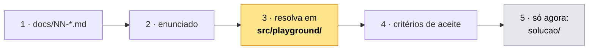
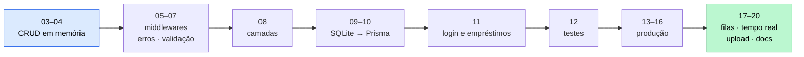

# 🏋️ Exercícios

Um exercício por módulo. É a parte que fixa o conteúdo.

## Como funciona

> **Dica:**
> Travou? Cada enunciado tem dicas progressivas escondidas em blocos `
`
> — abra **uma de cada vez**. Elas estão ordenadas do empurrãozinho ao quase
> código pronto.

## Regras

| Regra                          | Por quê                                          |
| ------------------------------ | ------------------------------------------------ |
| Tente antes de olhar a solução | Ler a resposta pronta não ensina. Erre primeiro. |
| Resolva no `playground/`       | A pasta do exercício é material de referência.   |
| Não pule exercícios            | Cada um usa o que o anterior construiu.          |
| Não existe uma resposta certa  | A solução é _uma_ forma. Diferente ≠ errado.     |

## O projeto contínuo

A partir do módulo 03, os exercícios param de ser soltos e viram **uma API de
biblioteca** que cresce a cada módulo:

| Módulos | O que você constrói                               |
| ------- | ------------------------------------------------- |
| 03–04   | CRUD de livros com dados em memória               |
| 05–07   | Middlewares, tratamento de erros e validação      |
| 08      | Refatoração em camadas                            |
| 09–10   | Persistência em SQLite, depois Prisma             |
| 11      | Usuários, login e empréstimos protegidos          |
| 12      | Suíte de testes                                   |
| 13–16   | Segurança, logs, cache e deploy                   |
| 17–20   | Filas, tempo real, upload de capas e documentação |

No fim você não tem 20 exercícios avulsos — tem uma API completa, feita por você.

> **Importante:**
> Mantenha tudo em `src/playground/biblioteca/`. Cada exercício continua o
> anterior — se você espalhar em pastas soltas, o módulo seguinte não encaixa.
