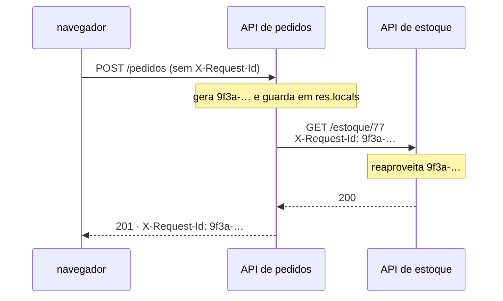

# Middleware — id-de-requisicao

📦 módulo 05 · 🧩 grupo 01

Dá a cada requisição um identificador, aceita o que já vier do cliente e devolve
o valor em `X-Request-Id`.

## O problema

Dez pessoas usam a API ao mesmo tempo. O log fica assim:

```
buscando cliente 88
buscando cliente 12
cliente 88 sem endereço de cobrança
calculando frete
erro ao calcular frete
```

De qual das dez requisições é o erro do frete? Do cliente 88 ou do 12? A linha
anterior parece responder, mas não responde — ela é da outra requisição, que só
por acaso chegou antes. Duas coisas rodando ao mesmo tempo escrevem no mesmo
arquivo, e o log deixa de ser uma história para virar um amontoado.

Vale o mesmo do outro lado do balcão: um cliente escreve "deu erro no
pagamento". Sem um identificador que ele possa citar, alguém vai ter que
procurar por horário aproximado num arquivo com dez mil linhas por minuto.

O que resolve é uma chave: um valor por requisição, presente em toda linha que
ela produzir, e devolvido para quem chamou. É a coisa que precisa acontecer em
toda rota sem pertencer a nenhuma — o caso do
[módulo 05](../../../docs/05-middlewares.md).

## Como funciona

O middleware roda no topo da pilha e faz três coisas, nesta ordem:

1. Lê o cabeçalho `X-Request-Id` da requisição.
2. Se veio um valor **e** ele passa no formato aceito, usa esse; senão, gera um
   com `randomUUID()` do `node:crypto`.
3. Guarda o valor em `res.locals` para o resto da pilha e devolve no cabeçalho
   de resposta.

O passo 1 é o que faz o rastro atravessar serviços. Quando a API A chama a API B,
ela repassa o próprio id; as duas escrevem log com a mesma chave, e uma busca por
aquele valor traz a história inteira, dos dois lados.



`randomUUID()` vem do `node:crypto` e devolve um UUID v4 — 122 bits aleatórios de
fonte criptográfica. Não é para ser secreto; é para nunca colidir, nem entre dois
processos que não se conhecem.

## O código

O arquivo completo está em [`middleware.ts`](./middleware.ts).

```ts
const CABECALHO = 'X-Request-Id';
export const CHAVE_ID = 'idDaRequisicao';

// O formato aceito de um id que vem de fora. As três restrições resolvem coisas
// diferentes: sem `\n` e `\r`, um id não consegue fabricar linhas inteiras de
// log; sem espaço e sem aspas, ele não quebra a linha JSON de quem loga; e o
// teto de 128 impede que um cabeçalho de 8 KB seja copiado para dentro de toda
// linha de log da requisição. 128 cabe um UUID (36) com folga para os formatos
// mais longos que outros serviços usam.
const FORMATO_ACEITO = /^[A-Za-z0-9._-]{1,128}$/;

export function idDeRequisicao(req: Request, res: Response, next: NextFunction) {
  const recebido = req.header(CABECALHO);

  // Se o valor não passa no formato, ele é **descartado** e um novo é gerado —
  // nunca sanitizado. Remover os caracteres ruins e seguir usando o resto
  // devolveria ao cliente um id diferente do que ele mandou, e o rastro se
  // perderia do mesmo jeito, só que sem ninguém perceber.
  const id = recebido && FORMATO_ACEITO.test(recebido) ? recebido : randomUUID();

  res.locals[CHAVE_ID] = id;
  res.setHeader(CABECALHO, id);

  next();
}
```

Aqui `res.setHeader` é chamado direto, sem a acrobacia com `writeHead` que a
pasta [`tempo-de-resposta`](../tempo-de-resposta/README.md) precisa fazer: neste
ponto nada foi enviado ainda, e o valor já é conhecido. A diferença entre as duas
pastas é só essa — **quando** o dado fica pronto.

O acessor que acompanha o middleware existe por causa da tipagem:

```ts
export function lerIdDaRequisicao(res: Response): string {
  const valor: unknown = res.locals[CHAVE_ID];
  return typeof valor === 'string' ? valor : 'sem-id';
}
```

## Como usar

```ts
app.use(tempoDeResposta);
app.use(idDeRequisicao); // antes de qualquer coisa que vá citar o id
app.use(log);
// ... rotas
```

Ele vem **antes de tudo que registra ou responde**. Um middleware abaixo dele
pode ler o id; um acima não, e a leitura silenciosa devolve `undefined` — não dá
erro, só produz log sem id, que é o defeito difícil de notar porque só aparece
quando alguém precisa do log.

Na rota, o valor sai pelo acessor:

```ts
app.get('/eco', (_req, res) => {
  res.json({ id: lerIdDaRequisicao(res) });
});
```

## As decisões e o porquê

### Onde guardar: `res.locals` e não `req.idDaRequisicao`

`res.locals` é um objeto vazio que o Express cria por requisição e descarta com
ela. Não precisa de nada para funcionar.

A alternativa é um campo próprio em `req`, que lê muito melhor
(`req.idDaRequisicao`) e é o que a maioria dos projetos faz. Ela custa **tipagem**:
em TypeScript, `req.idDaRequisicao` não compila sem uma declaração que estenda o
tipo `Request` do Express. A forma mais divulgada usa `declare global { namespace
Express { ... } }`, e `namespace` está proibido neste repositório pelo
`erasableSyntaxOnly` — o Node só apaga tipos, não transforma código.

O custo do caminho escolhido é o outro lado: `res.locals` é tipado como
`Record<string, any>`, então `res.locals.idDaRequisicao` é `any`. Um erro de
digitação (`res.locals.idRequisicao`) compila, roda e devolve `undefined`. É
justamente por isso que existe o `lerIdDaRequisicao`: ele concentra o `any` num
lugar só e devolve `string` para todo o resto.

### Aceitar o id do cliente

Gerar sempre um id novo seria mais simples e mais seguro, e quebraria o rastro
entre serviços: cada salto na cadeia ganharia uma chave diferente, e ninguém
conseguiria ligar o erro do estoque ao pedido que o causou.

O custo de aceitar é que o valor vem de fora, e o middleware precisa tratá-lo
como qualquer outra entrada de usuário — a seção seguinte.

### Descartar em vez de sanitizar

Quando o valor recebido não passa no formato, ele é jogado fora inteiro e um novo
é gerado. A alternativa — remover os caracteres inválidos e usar o resto —
custaria o pior dos dois mundos: o cliente ficaria com um id diferente do que
mandou (`abc 123` vira `abc123`), acharia que o rastro está costurado, e ele não
estaria. Falhar de volta ao id gerado pelo menos é honesto: o cabeçalho de
resposta mostra na hora que o valor enviado não foi aceito.

### 128 caracteres

Um UUID tem 36. Outros formatos comuns são maiores — o `traceparent` do
OpenTelemetry tem 55, e alguns serviços usam identificadores de 64. 128 aceita
todos com folga e ainda assim mantém a linha de log num tamanho previsível.

Sem teto, um cabeçalho de 8 KB (o limite padrão do Node) seria copiado para
dentro de **toda** linha de log daquela requisição.

## Onde é fácil errar

| Sintoma                                                       | Causa                                                                                                                                          |
| ------------------------------------------------------------- | ------------------------------------------------------------------------------------------------------------------------------------------------ |
| Linha de log com aspas soltas, ou um id de 8 KB repetido em todas as linhas | **O falso amigo:** usar `req.header('X-Request-Id')` cru, sem validar. É entrada de usuário como qualquer outra                     |
| Log sai com `"id": "sem-id"` (ou `undefined`)                 | O middleware está registrado depois de quem lê o id — ou a chave foi digitada diferente na leitura, e `res.locals` não reclama                  |
| Todos os serviços da cadeia com ids diferentes                | O cliente HTTP interno não repassa `X-Request-Id`. Aceitar o cabeçalho aqui não basta: quem chama precisa enviá-lo                              |
| `req.idDaRequisicao` não compila                              | O tipo `Request` do Express não tem esse campo. É a decisão de tipagem acima                                                                    |
| Dois pedidos do mesmo usuário com o mesmo id                  | O cliente está repetindo um id fixo. O id identifica a **requisição**, não a sessão nem o usuário                                               |

Sobre o falso amigo, com precisão — porque a versão folclórica dele é exagerada:
o parser HTTP do Node **já** rejeita cabeçalho com quebra de linha. Uma tentativa
de dobrar a linha volta como `400 Bad Request` antes de qualquer middleware
rodar. O que a validação aqui protege é o resto: espaço, aspas e tamanho, que
passam pelo parser sem problema e estragam a linha de log; e o id que chega por
outro caminho que não o cabeçalho HTTP — uma mensagem de fila, um campo do corpo,
um argumento de linha de comando —, onde não há parser nenhum filtrando antes.

## O que ele não faz

- **Não identifica o usuário.** O id é da requisição, e some com ela. Saber quem
  está falando é autenticação, do [módulo 11](../../../docs/11-autenticacao.md) e
  do grupo 03 deste catálogo.
- **Não propaga sozinho.** Ele aceita e devolve o id; enviar o valor quando
  **esta** API chama outra é trabalho do código que faz a chamada.
- **Não é `trace_id`.** Um rastro distribuído tem também id de span, relação de
  pai e filho e contexto propagado num formato padronizado (`traceparent`, do W3C).
  Isso é o [módulo 14](../../../docs/14-observabilidade.md).
- **Não escreve log.** Ele só resolve o valor; quem o usa é o
  [`log`](../log/README.md).

## Testado assim

Com a demo no ar (`node middlewares/01-requisicao-e-resposta/servidor.ts`).

**Sem cabeçalho, ele gera — e o mesmo valor sai no cabeçalho e no corpo:**

```bash
curl.exe -s -i http://localhost:6101/eco
```

```http
HTTP/1.1 200 OK
X-Request-Id: 80648e40-d72b-4eec-bf6e-a85a665e97d3
Content-Type: application/json; charset=utf-8
X-Tempo-ms: 0.29

{"id":"80648e40-d72b-4eec-bf6e-a85a665e97d3"}
```

**Com um id válido do cliente, ele reaproveita:**

```bash
curl.exe -s -i -H "X-Request-Id: pedido-do-checkout-9f3a" http://localhost:6101/eco
```

```http
HTTP/1.1 200 OK
X-Request-Id: pedido-do-checkout-9f3a
Content-Type: application/json; charset=utf-8
X-Tempo-ms: 0.16

{"id":"pedido-do-checkout-9f3a"}
```

E o valor do cliente é o que aparece na linha de log do servidor:

```
{"hora":"2026-08-21T01:34:55.289Z","id":"pedido-do-checkout-9f3a","metodo":"GET","rota":"/eco","caminho":"/eco","status":200,"duracaoMs":0.34}
```

**Com um id que tem espaço e aspas, ele descarta e gera outro:**

```bash
curl.exe -s -i -H "X-Request-Id: abc 123\" INJETADO" http://localhost:6101/eco
```

```http
HTTP/1.1 200 OK
X-Request-Id: 22e8b5f1-f436-42ef-9838-816ae7b289cd
Content-Type: application/json; charset=utf-8
X-Tempo-ms: 0.20

{"id":"22e8b5f1-f436-42ef-9838-816ae7b289cd"}
```

**Com 200 caracteres, mesma coisa; com 128, passa.** O teto é exatamente onde diz
que é:

```bash
LONGO=$(printf 'a%.0s' {1..200})
curl.exe -s -o /dev/null -w "%header{X-Request-Id}\n" -H "X-Request-Id: $LONGO" http://localhost:6101/eco
# b08b0ee1-7893-47fc-9bf5-791debca1112     ← descartado, gerou novo

CENTO=$(printf 'b%.0s' {1..128})
curl.exe -s -o /dev/null -w "%header{X-Request-Id}\n" -H "X-Request-Id: $CENTO" http://localhost:6101/eco
# bbbbbbbb…bbbb  (128 letras)              ← aceito
```

**E a quebra de linha nem chega aqui** — o parser do Node responde antes:

```
GET /eco HTTP/1.1
Host: localhost
X-Request-Id: abc
 INJETADO
```

```http
HTTP/1.1 400 Bad Request
Connection: close
```
