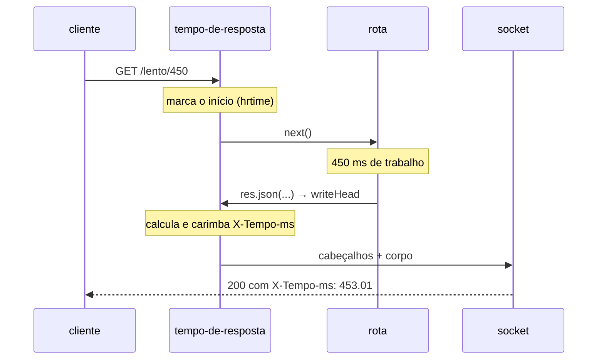

# Middleware — tempo-de-resposta

📦 módulo 05 · 🧩 grupo 01

Carimba `X-Tempo-ms` em toda resposta com o tempo que o servidor levou para
produzi-la.

## O problema

Alguém abre um chamado: "o cadastro está lento". Lento quanto? Lento sempre ou
lento às vezes? E lento por causa do servidor, da rede ou do navegador?

Sem número, a conversa vira opinião. Com número, ela vira "o `POST /pedidos`
responde em 40 ms na maioria das vezes e em 3200 ms quando o cliente tem mais de
mil itens" — e aí já se sabe onde olhar.

Medir dentro de cada handler não resolve: são duas linhas por rota, elas somem no
primeiro `return` antecipado, ninguém lembra de colocá-las na rota nova, e a
medida não cobre o que roda **antes** do handler. O tempo de uma requisição não
pertence a nenhuma rota em particular — é exatamente o caso que o
[módulo 05](../../../docs/05-middlewares.md) descreve.

## Como funciona

O middleware marca o instante em que a requisição entrou e precisa escrever o
resultado num cabeçalho da resposta. O incômodo é que os dois momentos são
incompatíveis: quando a duração finalmente se sabe, a resposta já está saindo.

Um cabeçalho HTTP vem **antes** do corpo. Assim que o primeiro byte da resposta é
escrito no socket, os cabeçalhos já foram embora e não existe volta. Então há uma
janela, e ela fecha em `writeHead` — a função que o Node chama uma única vez por
resposta, imediatamente antes de mandar a linha de status e os cabeçalhos.

O middleware substitui essa função por outra que calcula a duração, carimba o
cabeçalho e delega para a original. Como `res.end`, `res.json` e `res.send`
disparam `writeHead` por dentro (o `_implicitHeader`), não é preciso nenhuma
disciplina nas rotas: qualquer jeito de responder passa por ali.



## O código

O arquivo completo está em [`middleware.ts`](./middleware.ts). Ele exporta duas
funções: `tempoDeResposta`, que é a que se usa, e `tempoDeRespostaQuebrado`, que
existe só para a demo poder mostrar a armadilha acontecendo.

```ts
export function tempoDeResposta(_req: Request, res: Response, next: NextFunction) {
  // `process.hrtime.bigint()` lê um relógio monotônico: ele conta nanossegundos
  // desde um ponto arbitrário e só anda para frente. `Date.now()` lê o relógio de
  // parede, que o NTP e o ajuste de horário empurram para trás algumas vezes por
  // dia — uma requisição atravessada por um desses ajustes devolveria
  // `X-Tempo-ms: -412.00`, e o número negativo só aparece em produção, nunca no
  // teste local. Bigint porque nanossegundo não cabe com precisão em `number`.
  const inicio = process.hrtime.bigint();

  // `bind(res)` guarda a função original **antes** de trocá-la. Sem o bind, o
  // `res.writeHead` de dentro da nova função apontaria para ela mesma e a
  // primeira resposta entraria em recursão infinita até estourar a pilha.
  const escreverCabecalhos = res.writeHead.bind(res);

  res.writeHead = function (...argumentos: Parameters<typeof escreverCabecalhos>) {
    const duracaoMs = Number(process.hrtime.bigint() - inicio) / 1e6;
    res.setHeader('X-Tempo-ms', duracaoMs.toFixed(2));
    return escreverCabecalhos(...argumentos);
  } as typeof res.writeHead;

  next();
}
```

O `as typeof res.writeHead` no fim é dívida de tipagem, não gosto: `writeHead`
tem três assinaturas sobrepostas no Node e uma função escrita com rest args não
casa com as três ao mesmo tempo. A alternativa seria repetir as três sobrecargas
à mão, ganhando vinte linhas de tipo para checar um repasse que não olha os
argumentos.

## Como usar

```ts
app.use(tempoDeResposta); // antes de tudo
app.use(idDeRequisicao);
app.use(log);
// ... rotas
```

**Primeiro da pilha**, e a posição é o número. Ele só mede o que roda **depois**
dele: montado no fim, o `X-Tempo-ms` deixa de contar o parse do corpo, a
autenticação e o rate limit, que costumam ser justamente onde a lentidão mora. O
cabeçalho continua saindo e continua parecendo correto — ele só passa a mentir
para menos.

Na demo há uma exceção explícita para a rota `/quebrado`, porque o middleware
certo carimbaria o cabeçalho e esconderia a falha que aquela rota existe para
mostrar.

## As decisões e o porquê

### `process.hrtime.bigint()` e não `Date.now()`

`Date.now()` lê o relógio de parede, que não é monotônico — **monotônico** é o
relógio que só anda para frente, sem relação com a data do sistema. O NTP corrige
a hora da máquina para trás rotineiramente, o usuário muda o fuso, o container
sincroniza ao subir. Uma requisição atravessada por um desses ajustes devolve
duração negativa.

Custo da escolha descartada: `Date.now()` é mais curto de escrever e o defeito
**nunca aparece** em teste local. Ele aparece em produção, em algumas requisições
por dia, e o gráfico de latência ganha valores negativos que ninguém consegue
explicar.

`performance.now()` também é monotônico e funcionaria. A diferença é resolução:
ele devolve `number` em milissegundos com casas decimais, e `hrtime.bigint()`
devolve nanossegundo inteiro. Para medir um handler de 0,2 ms, a segunda opção
não arredonda.

### Envolver `writeHead` e não escutar `finish`

É o assunto da seção seguinte, e é o motivo de esta pasta existir.

Custo da escolha feita: mexer numa função do objeto `res` é intrusivo. Se dois
middlewares diferentes envolverem `writeHead`, os dois funcionam (cada um chama o
anterior), mas a ordem em que carimbam passa a depender da ordem de registro. E
qualquer biblioteca que substitua `res` inteiro por outro objeto perde o carimbo.

### `X-` no nome do cabeçalho

O prefixo `X-` para cabeçalhos não padronizados está formalmente
[desaconselhado desde a RFC 6648](https://www.rfc-editor.org/rfc/rfc6648), mas
continua sendo o que todo mundo lê como "cabeçalho de aplicação". Aqui ele fica
por legibilidade: `X-Tempo-ms` num `curl -i` se identifica sozinho no meio de
`ETag` e `Content-Length`.

Custo: um dia, se `Tempo-ms` virar padrão de verdade, o nome muda e quem consome
quebra. Cabeçalho de diagnóstico é justamente o tipo de coisa em que esse risco é
barato.

### O número vai no cabeçalho, não no corpo

O corpo é o dado que o cliente pediu; a duração é metadado sobre a entrega dele.
Colocar `{ "dados": ..., "duracaoMs": 12 }` obriga toda rota a montar um envelope
e faz o `204 No Content`, que não tem corpo nenhum, ficar sem lugar para o
número.

## Onde é fácil errar

| Sintoma                                                          | Causa                                                                                                                                                     |
| ---------------------------------------------------------------- | --------------------------------------------------------------------------------------------------------------------------------------------------------- |
| `ERR_HTTP_HEADERS_SENT` e o processo cai                         | **O falso amigo:** carimbar dentro de `res.on('finish')`. Em `finish` a resposta inteira já foi para o socket — `finish` serve para logar, não para carimbar |
| Resposta sem `X-Tempo-ms`, e nenhum erro visível                 | O mesmo caso acima, com a exceção engolida por um `try` — o cliente recebe 200 e ninguém percebe que a medição sumiu                                        |
| `X-Tempo-ms` sempre perto de zero, mesmo em rota reconhecidamente lenta | O middleware está registrado depois das rotas: ele mede só o que vem abaixo dele                                                                     |
| `RangeError: Maximum call stack size exceeded` na primeira resposta | `res.writeHead` guardado sem `.bind(res)`, ou guardado depois da substituição: a nova função chama a si mesma                                            |
| Duração negativa em produção                                     | `Date.now()` no lugar do relógio monotônico                                                                                                                |

O falso amigo merece o detalhe, porque ele é convincente: `res.on('finish', ...)`
é o lugar certo para saber a duração — é literalmente o instante em que a
requisição terminou. O erro é achar que "saber" e "escrever no cabeçalho" cabem
no mesmo momento. Não cabem: `res.setHeader` confere `res.headersSent` e lança.
E como a exceção acontece dentro de um listener de evento, ela não tem `next()`
para onde ir — vira `uncaughtException` e derruba o processo inteiro.

Este repositório já pagou por essa: a versão que funciona está em
`minis-apis/01-encurtador/servidor.ts`, com o registro do problema no comentário.

## O que ele não faz

- **Não mede o que o usuário esperou.** O número é o tempo do servidor. A
  resolução de DNS, o handshake TLS, a fila do navegador e a viagem de volta ficam
  todos de fora. Uma resposta de `X-Tempo-ms: 12.00` pode ter levado 900 ms para
  chegar na tela de quem está numa conexão ruim.
- **Não guarda nada.** Cada resposta carrega seu número e ele some. Transformar
  isso em histórico, percentil e alerta é métrica, assunto do
  [módulo 14](../../../docs/14-observabilidade.md).
- **Não mede rota por rota separadamente.** Para saber que `/pedidos` é o lento,
  alguém precisa agregar — o middleware de [`log`](../log/README.md) é o primeiro
  passo disso.
- **Não age.** Ele mede e deixa passar. Desistir de uma resposta lenta é o
  middleware `timeout`, do grupo 04.

## Testado assim

Com a demo no ar (`node middlewares/01-requisicao-e-resposta/servidor.ts`).

**A versão certa carimba, e o número acompanha a lentidão real:**

```bash
curl.exe -s -i http://localhost:6101/lento/450
```

```http
HTTP/1.1 200 OK
X-Powered-By: Express
X-Request-Id: 59641b43-46cc-4537-8a60-504a11482f2c
Content-Type: application/json; charset=utf-8
Content-Length: 58
ETag: W/"3a-eKZw/4Mh60CSW0ncVg+YPAJUEo8"
X-Tempo-ms: 453.01
Date: Fri, 21 Aug 2026 01:34:44 GMT

{"dormiu":450,"id":"59641b43-46cc-4537-8a60-504a11482f2c"}
```

453,01 ms para um `sleep` de 450: os 3 ms de sobra são a pilha e o
`setTimeout`, que acorda um pouco depois do prazo. Numa rota rápida o mesmo
cabeçalho sai como `X-Tempo-ms: 0.29`.

**A versão errada não carimba nada:**

```bash
curl.exe -s -i http://localhost:6101/quebrado
```

```http
HTTP/1.1 200 OK
X-Powered-By: Express
X-Request-Id: 4c58958d-98f6-4708-a7a3-f101b72adc05
Content-Type: application/json; charset=utf-8
Content-Length: 81
ETag: W/"51-gGwgG9AXc0xfPCL2ByGxQLpBybE"
Date: Fri, 21 Aug 2026 01:34:55 GMT

{"aviso":"confira: esta resposta não tem X-Tempo-ms, e o terminal diz por quê"}
```

Sem `X-Tempo-ms`. O cliente recebeu 200 e não tem como saber que houve falha — o
erro ficou no terminal do servidor:

```
[quebrado] setHeader dentro de finish falhou: ERR_HTTP_HEADERS_SENT
```

**E sem o `try` que a demo usa para sobreviver, é o processo que cai.** Rodando o
mesmo `setHeader` em `finish` sem proteção nenhuma:

```
node:_http_outgoing:642
    throw new ERR_HTTP_HEADERS_SENT('set');
    ^

Error [ERR_HTTP_HEADERS_SENT]: Cannot set headers after they are sent to the client
    at ServerResponse.setHeader (node:_http_outgoing:642:11)
    at ServerResponse.<anonymous> (file:///.../[eval1]:5:32)
    at ServerResponse.emit (node:events:520:35)
    at onFinish (node:_http_outgoing:1026:10)
```

O processo sai com código 1. A requisição que disparou isso foi respondida
normalmente — quem cai é o servidor, depois, levando junto todas as outras
conexões abertas.
