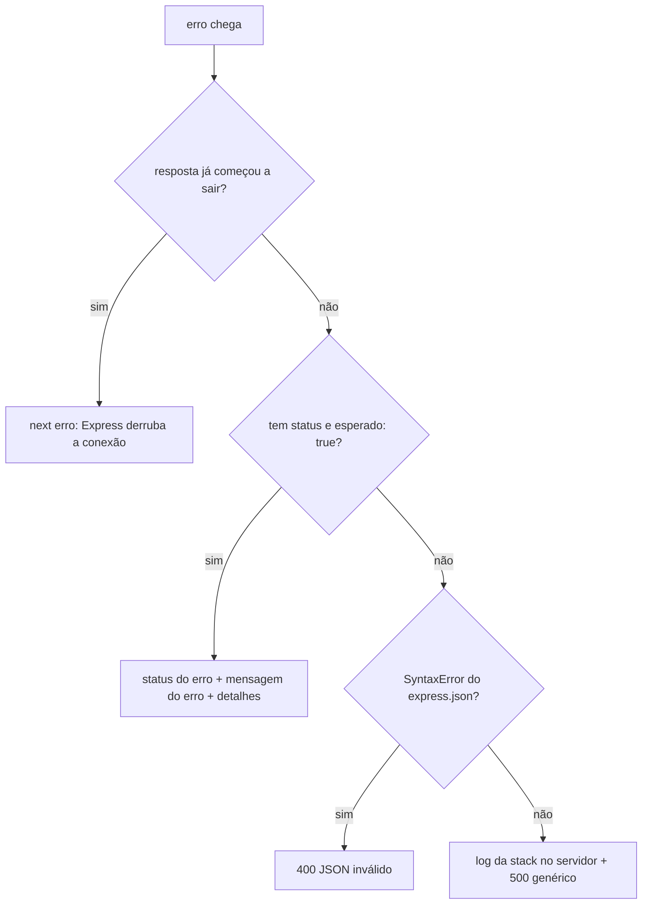

# Middleware — tratador-de-erros

📦 módulo 06 · 🧩 grupo 02

O último middleware da pilha: transforma qualquer erro — o que você lançou de
propósito e o que ninguém previu — numa resposta JSON de formato único.

## O problema

Sem um tratador, cada rota decide sozinha o que responder quando algo dá errado.
Três consequências, e a terceira é a cara:

- **O formato diverge.** Uma rota devolve `{erro}`, outra `{message}`, outra
  `{error:{msg}}`. Quem consome escreve um `if` por endpoint, e o `if` que
  faltar não estoura: ele apenas não encontra a mensagem, e o usuário vê uma
  tela em branco.
- **O status diverge.** O mesmo "não existe" sai 404 numa rota e 400 noutra,
  porque foram escritas por pessoas diferentes.
- **O que ninguém previu vaza.** O erro que você não imaginou não passa por
  nenhum dos seus `if`s, então cai no tratador padrão do Express — que responde
  **HTML com a stack trace inteira dentro**, para quem quer que tenha provocado o
  erro. A stack entrega o caminho absoluto dos arquivos, os nomes das funções, as
  bibliotecas em uso e a versão delas, e com frequência o valor que causou a
  falha (que pode ser a senha que o usuário acabou de digitar).

O terceiro é o motivo de existir um tratador central: os dois primeiros são
inconveniência, o terceiro é vazamento.

## Como funciona

Ele é o **middleware de erro** do [módulo 05](../../../docs/05-middlewares.md#middleware-de-erro-4-argumentos):
o Express o reconhece pela quantidade de argumentos declarados e só o chama
quando alguém lançou ou passou algo para `next(erro)`. Requisição que dá certo
não passa por aqui.

Recebendo o erro, ele decide entre quatro caminhos:



A pergunta do losango do meio é o coração do arquivo: **erro esperado** é o que
você criou de propósito e já sabe o status e a mensagem que o cliente pode ler.
Todo o resto é bug, e bug não tem mensagem apresentável — vira 500 com uma frase
fixa e a stack só no log.

## O código

```ts
import type { NextFunction, Request, Response } from 'express';

/**
 * O erro que você criou de propósito: já sabe o status e a mensagem que o
 * cliente pode ler. Quem lança não conhece `res` — por isso um service dá para
 * reusar fora do HTTP (módulo 08).
 */
export class AppError extends Error {
  readonly status: number;
  readonly esperado = true;
  readonly detalhes: unknown;

  constructor(mensagem: string, status = 400, detalhes?: unknown) {
    super(mensagem);
    this.name = 'AppError';
    this.status = status;
    this.detalhes = detalhes;
  }
}

// As fábricas nomeadas não existem para digitar menos: existem para o status de
// cada situação ser decidido em UM lugar. Sem elas, metade do código responde
// 404 e a outra metade 400 para o mesmo caso, e a API fica sem contrato.
export const naoEncontrado = (recurso: string, id: string | number) =>
  new AppError(`${recurso} ${id} não encontrado`, 404);

export const conflito = (mensagem: string) => new AppError(mensagem, 409);

/**
 * O que conta como erro esperado. É uma checagem ESTRUTURAL de propósito: o
 * `instanceof AppError` só é `true` para a classe exatamente desta cópia, e num
 * projeto real há mais de uma (a cópia de outra pasta, duas versões do mesmo
 * pacote em `node_modules`, o processo filho). Quando o `instanceof` dá `false`
 * por um motivo desses, um 404 legítimo sai como 500 e nada quebra — é o tipo
 * de bug que só aparece em produção.
 */
function ehEsperado(erro: unknown): erro is { status: number; message: string; detalhes?: unknown } {
  if (typeof erro !== 'object' || erro === null) return false;
  const candidato = erro as { status?: unknown; esperado?: unknown; message?: unknown };
  return (
    candidato.esperado === true &&
    typeof candidato.status === 'number' &&
    typeof candidato.message === 'string'
  );
}

/**
 * ┌─────────────────────────────────────────────────────────────────────────┐
 * │ QUATRO ARGUMENTOS. O Express reconhece o tratador de erro contando os    │
 * │ parâmetros que a função DECLARA — a aridade. Três, é middleware comum;   │
 * │ quatro, é tratador.                                                     │
 * │                                                                         │
 * │ Apagar o `_next` porque "não está sendo usado" — e o editor vai sugerir  │
 * │ isso — transforma esta função num middleware comum. Ela continua na      │
 * │ pilha, o projeto continua compilando, os testes de rota feliz continuam  │
 * │ passando, e o tratamento de erro do projeto inteiro fica DESLIGADO em    │
 * │ silêncio: o erro passa a cair no tratador padrão do Express, que         │
 * │ responde HTML com a stack trace dentro para quem provocar o erro.       │
 * │                                                                         │
 * │ Não existe aviso. A única defesa é o teste do módulo 12 que provoca um   │
 * │ erro e confere o formato da resposta.                                   │
 * └─────────────────────────────────────────────────────────────────────────┘
 */
export function tratadorDeErros(
  erro: unknown,
  _req: Request,
  res: Response,
  _next: NextFunction,
) {
  // Erro depois que a resposta começou a sair: os cabeçalhos já foram enviados,
  // `res.status()` não muda mais nada e um segundo `res.json()` lança
  // ERR_HTTP_HEADERS_SENT em cima do erro original. O único desfecho honesto é
  // devolver ao Express, que derruba a conexão — o cliente recebe uma resposta
  // truncada, que é a verdade do que aconteceu.
  if (res.headersSent) return _next(erro);

  if (ehEsperado(erro)) {
    return res.status(erro.status).json({
      erro: erro.message,
      status: erro.status,
      // `?? undefined`: chave sem valor some do JSON em vez de virar
      // `"detalhes": null`, que o cliente teria de tratar como caso extra.
      detalhes: erro.detalhes ?? undefined,
    });
  }

  // O `express.json()` lança este `SyntaxError` quando o corpo não é JSON
  // válido. É culpa do cliente, não do servidor: sem este ramo, quem manda uma
  // vírgula sobrando recebe 500 e vai abrir chamado achando que a API caiu.
  if (erro instanceof SyntaxError && 'body' in erro) {
    return res.status(400).json({ erro: 'JSON inválido no corpo da requisição', status: 400 });
  }

  // Daqui para baixo é bug: ninguém previu, então ninguém sabe o que a mensagem
  // contém. A stack vai INTEIRA para o log do servidor — caminho de arquivo,
  // nome de função, número de linha — e NUNCA para o corpo da resposta: ela
  // entrega a quem lê o layout do projeto, as bibliotecas e a versão delas, e
  // com frequência o valor que causou a falha (que pode ser a senha do
  // usuário). O cliente recebe uma frase genérica.
  console.error('[erro não tratado]', erro);

  return res.status(500).json({ erro: 'Erro interno do servidor', status: 500 });
}
```

## Como usar

**Sempre por último**, depois de todas as rotas e depois do
[`nao-encontrado`](../nao-encontrado/README.md):

```ts
app.use(express.json());
app.use('/chamados', rotas);
app.use(rotaNaoEncontrada); // 404 de rota inexistente
app.use(tratadorDeErros); // sempre o último
```

Inverter as duas últimas linhas parece inofensivo e não é. O `rotaNaoEncontrada`
chama `next(erro)`, e o `next` procura o **próximo** middleware de erro na
pilha — se o tratador ficou para trás, não há próximo, e o erro cai no tratador
padrão do Express. Rodado nas duas ordens, com a mesma requisição a uma rota
inexistente:

```
# app.use(rotaNaoEncontrada) ANTES do tratador — o certo
HTTP/1.1 404 Not Found
{"erro":"Rota GET /relatorios não existe","status":404}

# app.use(tratadorDeErros) antes do 404 — o errado
HTTP/1.1 404 Not Found
Content-Security-Policy: default-src 'none'
<!DOCTYPE html>
...
<pre>ErroDeRotaInexistente: Rota GET /relatorios não existe<br> &nbsp; at rotaNaoEncontrada
(file:///C:/Users/otavi/.../nao-encontrado/middleware.ts:32:8)<br> &nbsp; at Layer.handleRequest ...
```

O status continua 404 nos dois — é por isso que a inversão passa despercebida em
qualquer teste que só confira o status. O que muda é o `Content-Type`, e o
caminho do seu disco dentro do corpo.

Nas rotas, você não chama o tratador: você **lança**.

```ts
if (!chamado) throw naoEncontrado('Chamado', id);
```

Quem lança não precisa conhecer `res` — é o que permite reusar a mesma função
num service ([módulo 08](../../../docs/08-arquitetura-em-camadas.md)) ou num
worker, onde requisição nenhuma existe.

## As decisões e o porquê

### A checagem é estrutural, não `instanceof`

**Descartado:** `if (erro instanceof AppError)`, que é a forma canônica e a que o
[módulo 06](../../../docs/06-tratamento-de-erros.md) usa. Custo: `instanceof`
compara a identidade da classe, não o formato. Duas cópias da mesma classe — a
deste catálogo e a que você já tinha, ou duas versões do mesmo pacote resolvidas
em `node_modules` diferentes — produzem `false`. E o `false` aqui não quebra
nada: ele silenciosamente rebaixa um 404 legítimo a 500 genérico, e você fica
procurando o bug no service.

**O custo da escolha estrutural**, que é real: qualquer erro que por acaso tenha
`esperado: true` e um `status` numérico é aceito como esperado, e a mensagem dele
vai inteira para o cliente. Se você recebe erros de bibliotecas de terceiros que
usam essas duas propriedades, prefira o `instanceof`.

### `esperado: true`, e não "tem `status` numérico"

**Descartado:** aceitar como esperado qualquer erro com `status`. Custo: várias
bibliotecas põem `status` ou `statusCode` nos erros delas — clientes HTTP, por
exemplo. Um `fetch` interno que devolve 401 viraria um 401 na **sua** resposta,
com a mensagem da outra API dentro, e o cliente acharia que o token dele expirou.
A flag `esperado` é uma declaração de intenção que só o seu código escreve.

### Mensagem genérica no 500

**Descartado:** mandar `erro.message` no corpo do 500 "só para ajudar o suporte".
Custo: a mensagem de um erro imprevisto contém o que quer que a biblioteca tenha
posto nela — caminho de arquivo, trecho de query SQL, o valor que causou a falha.
E ela vaza sem barulho: a API continua respondendo 500, nada quebra, e ninguém
lembra de tirar depois da investigação. Quem defende essa decisão ao longo do
tempo é o teste do [módulo 12](../../../docs/12-testes.md) que confere o corpo do
500.

Se o suporte precisa correlacionar o relato com a linha de log, o que entra na
resposta é um **id de requisição**, não a mensagem — é o
[`id-de-requisicao` do grupo 01](../../01-requisicao-e-resposta/README.md).

### `console.error` e não um logger

**Descartado:** `pino` aqui dentro. Custo: uma dependência na pasta que deveria
ser copiável para qualquer projeto. Em produção troque por uma linha estruturada
com o id da requisição ([módulo 14](../../../docs/14-observabilidade.md)); o que
não pode mudar é **a stack ir para o log e não para o corpo**.

### `res.headersSent` → `next(erro)`

Erro que acontece depois do primeiro byte da resposta não tem conserto: os
cabeçalhos já saíram. Responder de novo lança `ERR_HTTP_HEADERS_SENT` em cima do
erro original, e o de verdade some do log.

**Descartado:** `return` puro, sem chamar o `next`. Custo: a conexão fica aberta
até o timeout do cliente, com a resposta pela metade. Devolvendo ao Express, ele
derruba a conexão — o cliente descobre na hora que a resposta é inválida.

## Onde é fácil errar

| Sintoma                                                                                   | Causa                                                                                                                                                       |
| ----------------------------------------------------------------------------------------- | ------------------------------------------------------------------------------------------------------------------------------------------------------------- |
| **Falso amigo:** o tratador está registrado, nada dá erro visível, e mesmo assim sai HTML | O quarto parâmetro foi apagado por "não estar sendo usado". Com três, o Express trata a função como middleware **comum**, e ela nunca recebe erro nenhum      |
| Erro `AppError` de outro arquivo virando 500                                              | Comparação por `instanceof` com uma classe que não é a mesma instância de classe                                                                             |
| Erro de terceiro virando resposta com a mensagem dele                                      | Checagem que aceita qualquer erro com `status`, sem exigir a flag `esperado`                                                                                 |
| `ERR_HTTP_HEADERS_SENT` no log, encobrindo o erro real                                     | Falta a guarda `res.headersSent` no topo                                                                                                                     |
| JSON malformado respondendo 500                                                            | Falta o ramo do `SyntaxError` do `express.json()`                                                                                                            |
| O tratador nunca roda                                                                      | Ele foi registrado antes de alguma rota, ou antes do middleware de 404                                                                                       |

O primeiro é o mais importante desta pasta porque **não tem sintoma até doer**.
Rodado de propósito, um tratador declarado com três parâmetros e uma rota que
lança `AppError('Chamado 99 não encontrado', 404)`:

```
HTTP/1.1 404 Not Found
Content-Security-Policy: default-src 'none'
X-Content-Type-Options: nosniff

<!DOCTYPE html>
<html lang="en">
...
<pre>AppError: Chamado 99 não encontrado<br> &nbsp; at file:///C:/Users/otavi/OneDrive/Documentos/
Backend/Backend-express/middlewares/02-validacao-e-erros/_probe-ordem.ts:25:9<br> &nbsp; at
Layer.handleRequest (C:\Users\otavi\...\node_modules\router\lib\layer.js:152:17)<br> ...
```

O status saiu **404**, certinho — o tratador padrão do Express respeita o
`err.status`. Um teste que confira só o status passa. O que mudou foi tudo o
resto: virou HTML, e o corpo tem o caminho absoluto do projeto e a árvore de
chamadas inteira.

## O que ele não faz

- **Não impede o processo de cair.** Erro em `setTimeout`, em `.on('error')` ou
  numa promise sem `catch` fora da requisição não passa por aqui — vira
  `uncaughtException`/`unhandledRejection`. A pasta
  [`assincrono`](../assincrono/README.md) mostra a ponte, e o
  [módulo 06](../../../docs/06-tratamento-de-erros.md#a-rede-de-segurança-do-processo)
  cobre a rede de segurança do processo.
- **Não põe `requestId` na resposta.** Ele não tem de onde tirar; quem produz é o
  `id-de-requisicao` do grupo 01.
- **Não avisa ninguém.** Um 500 aqui vira uma linha no `stdout`. Alerta e
  agregação são do [módulo 14](../../../docs/14-observabilidade.md).
- **Não traduz erro de banco.** Uma violação de unicidade do SQLite chega como
  erro cru e vira 500; converter para 409 é trabalho do service
  ([módulo 09](../../../docs/09-sqlite-e-sql.md)).

## Testado assim

Servidor: `node middlewares/02-validacao-e-erros/servidor.ts` (porta 6102).

```bash
# erro esperado: AppError lançado pela rota, com o status que ele carrega
curl.exe -s -i http://localhost:6102/chamados/99 | head -1
curl.exe -s http://localhost:6102/chamados/99
```

```
HTTP/1.1 404 Not Found
{"erro":"Chamado 99 não encontrado","status":404}
```

```bash
# erro esperado COM detalhes: vindos do middleware `validar`
curl.exe -s -X POST http://localhost:6102/chamados \
  -H "Content-Type: application/json" -d '{"titulo":"abc","contrato":"xx"}'
```

```
HTTP/1.1 422 Unprocessable Entity
{"erro":"Dados inválidos","status":422,"detalhes":[
  {"campo":"titulo","mensagem":"`titulo` precisa de 5+ caracteres","codigo":"too_small"},
  {"campo":"contrato","mensagem":"`contrato` segue o formato AAA-0000","codigo":"invalid_format"}]}
```

```bash
# erro inesperado: um TypeError de verdade (chamada de método em null)
curl.exe -s -i http://localhost:6102/falha-inesperada | head -1
curl.exe -s http://localhost:6102/falha-inesperada
```

```
HTTP/1.1 500 Internal Server Error
{"erro":"Erro interno do servidor","status":500}
```

Nada de stack no corpo. Ela ficou no terminal do servidor, inteira:

```
[erro não tratado] TypeError: Cannot read properties of null (reading 'salvar')
    at file:///C:/Users/otavi/OneDrive/Documentos/Backend/Backend-express/middlewares/
       02-validacao-e-erros/servidor.ts:86:8
    at Layer.handleRequest (C:\Users\otavi\...\node_modules\router\lib\layer.js:152:17)
    at Route.dispatch (C:\Users\otavi\...\node_modules\router\lib\route.js:117:3)
    ...
```

Compare as duas: o corpo tem seis palavras, o log tem o caminho do projeto no
disco, o número da linha e a versão do roteador. É a diferença que a decisão
"a stack nunca sai na resposta" compra.

```bash
# JSON malformado (vírgula sobrando): 400, não 500
curl.exe -s -X POST http://localhost:6102/chamados \
  -H "Content-Type: application/json" -d '{"titulo":"quebrado",}'
```

```
HTTP/1.1 400 Bad Request
{"erro":"JSON inválido no corpo da requisição","status":400}
```

> **Atenção — aspas no Windows:** os `curl` com JSON acima usam aspas simples e
> só funcionam no **Git Bash**, no Linux e no macOS. No `cmd.exe` e no PowerShell
> as aspas simples não são removidas e o corpo chega como `'{"a":1}'`; nesses
> dois, escreva `-d "{\"a\":1}"`.
