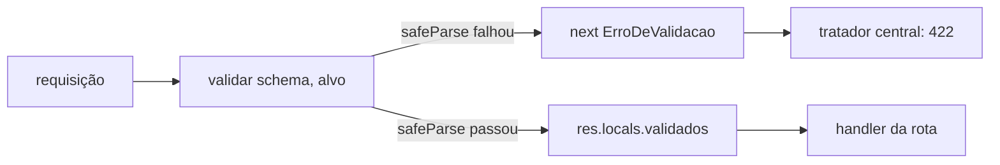

# Middleware — validar

📦 módulo 07 · 🧩 grupo 02

Valida `body`, `params` ou `query` contra um schema [Zod](../../../docs/07-validacao-zod.md)
e responde **422** com a lista dos campos que falharam.

## O problema

Toda rota que recebe dado precisa conferir o dado antes de usá-lo. Escrito na
rota, isso vira sempre a mesma sequência de `if`s — e é onde as três coisas
abaixo acontecem, todas as vezes:

- **A regra diverge.** A rota de criação exige `titulo` com 5 caracteres, a de
  edição com 3, porque foram escritas em semanas diferentes. Ninguém percebe,
  porque não há um lugar onde as duas se encontrem.
- **A resposta diverge.** Uma devolve `{ erro: "titulo curto" }`, outra
  `{ erros: ["titulo"] }`, outra um 500 porque o `if` esqueceu um caso. Quem
  consome precisa de um tratamento por rota.
- **O dado inválido passa.** `req.body.quantidade` é `"3"` e não `3`, o `if`
  checou só `!= null`, e o número vira string dentro do banco.

E existe uma quarta, que é a que dói mais tarde: com a validação dentro da rota,
o handler recebe `unknown` e cada acesso precisa de `as`. O tipo do dado só
existe na cabeça de quem escreveu.

## Como funciona

O middleware é uma **fábrica** ([módulo 05](../../../docs/05-middlewares.md#middleware-com-argumento-fábrica)):
`validar(schema, alvo)` não é o middleware, é a função que devolve um. É isso
que permite um arquivo só atender `body`, `params` e `query` — o alvo é
argumento, não uma cópia do código.

Dentro da requisição ele:

1. **lê** `req.body`, `req.params` ou `req.query`, conforme o alvo;
2. roda `schema.safeParse(entrada)`;
3. se falhou, **não responde**: chama `next(new ErroDeValidacao(...))` e deixa o
   [tratador central](../tratador-de-erros/README.md) formatar a resposta;
4. se passou, **escreve** o dado já convertido em `res.locals.validados[alvo]` e
   segue.

O passo 4 é o que devolve o tipo: `validados(res, schema, 'params')` lê de volta
com o tipo inferido do schema, sem `as` no handler.



## O código

```ts
import type { NextFunction, Request, Response } from 'express';
import type { ZodError, ZodType } from 'zod';

type Alvo = 'body' | 'params' | 'query';

export type ProblemaDeCampo = {
  campo: string;
  mensagem: string;
  codigo: string;
};

/**
 * 422 e não 400: o 400 diz "não entendi o que você mandou" (JSON quebrado, por
 * exemplo) e o 422 diz "entendi, está bem formado, e não passa nas regras". Um
 * cliente que só vê 400 não sabe se deve corrigir o campo ou o serializador.
 */
export class ErroDeValidacao extends Error {
  readonly status = 422;
  /**
   * A marca que separa erro que você criou de propósito de bug de programação.
   * O tratador central usa esta flag, e não `instanceof`, porque cada pasta
   * deste catálogo define a própria classe — `instanceof` entre duas cópias da
   * mesma classe é `false`, e o 422 viraria 500 sem ninguém notar.
   */
  readonly esperado = true;
  readonly detalhes: ProblemaDeCampo[];

  constructor(detalhes: ProblemaDeCampo[]) {
    super('Dados inválidos');
    this.name = 'ErroDeValidacao';
    this.detalhes = detalhes;
  }
}

export function validar(schema: ZodType, alvo: Alvo = 'body') {
  return (req: Request, res: Response, next: NextFunction) => {
    // `?? {}` só no body: sem `Content-Type: application/json` o Express 5 deixa
    // `req.body` como `undefined`, e um `z.object()` recebendo `undefined`
    // responde "expected object, received undefined" — sem dizer qual campo
    // falta. Com `{}` o cliente recebe a lista dos obrigatórios.
    const entrada = alvo === 'body' ? (req.body ?? {}) : req[alvo];

    // `safeParse` e não `parse`: o `parse` lança `ZodError` cru, e o `ZodError`
    // que chega ao tratador central sem tradução vira 500 ou uma resposta em
    // inglês com o formato interno do Zod dentro.
    const resultado = schema.safeParse(entrada);

    if (!resultado.success) {
      next(new ErroDeValidacao(traduzir(resultado.error)));
      return;
    }

    // O dado validado vai para `res.locals`, nunca de volta para `req[alvo]`:
    // no Express 5 `req.query` é getter, e `req.query = ...` lança "Cannot set
    // property query of #<IncomingMessage> which has only a getter". Guardar
    // aqui funciona para os três alvos e preserva o original para auditoria.
    const guardados = (res.locals.validados ?? {}) as Record<string, unknown>;
    guardados[alvo] = resultado.data;
    res.locals.validados = guardados;

    next();
  };
}

/**
 * Lê o dado já validado com o tipo certo, sem `as`. O schema volta como
 * parâmetro só para o TypeScript inferir o retorno; em tempo de execução ele
 * não é usado, porque a validação já aconteceu no middleware.
 */
export function validados<T>(res: Response, _schema: ZodType<T>, alvo: Alvo = 'body'): T {
  const guardados = res.locals.validados as Record<string, unknown> | undefined;
  const dado = guardados?.[alvo];

  // Cair aqui significa que a rota esqueceu o `validar(schema, alvo)`. Falhar
  // alto é melhor que devolver `undefined` e virar um bug duas camadas adiante.
  if (dado === undefined) {
    throw new Error(`validados(): faltou validar(schema, '${alvo}') nesta rota`);
  }

  return dado as T;
}

/** Traduz o erro do Zod para a lista `{ campo, mensagem, codigo }`. */
function traduzir(erro: ZodError): ProblemaDeCampo[] {
  return erro.issues.map((problema) => {
    // O falso amigo do `.strict()`: a chave desconhecida é reprovada no OBJETO,
    // não num campo dele. O `path` do problema vem VAZIO — `[]` — e o
    // `path.join('.') || '(raiz)'` que funciona para todo o resto responderia
    // `campo: "(raiz)"`, escondendo justamente o nome que o cliente precisa
    // corrigir. As chaves recusadas estão em `problema.keys`.
    if (problema.code === 'unrecognized_keys') {
      return {
        campo: problema.keys.join(', '),
        mensagem: 'campo desconhecido: esta rota não aceita este campo',
        codigo: problema.code,
      };
    }

    return {
      campo: problema.path.join('.') || '(raiz)',
      mensagem: problema.message,
      codigo: problema.code,
    };
  });
}
```

## Como usar

Ele é middleware **de rota**, não global — o schema muda por rota:

```ts
app.post('/chamados', validar(criarChamadoSchema), (_req, res) => {
  const dados = validados(res, criarChamadoSchema); // já tipado
  res.status(201).json(criar(dados));
});

app.get('/chamados/:id', validar(idSchema, 'params'), (_req, res) => {
  const { id } = validados(res, idSchema, 'params'); // id: number, não string
  res.json(buscar(id));
});
```

Duas posições decidem o comportamento:

- **Depois de `express.json()`.** Antes dele `req.body` é `undefined`, e todo
  POST responde 422 com "campo obrigatório" para os campos que o cliente mandou.
- **Antes do handler, na mesma rota.** Colocá-lo depois não faz nada: o handler
  já rodou com o dado cru.

E o `validar(schema)` sem `validados(res, schema)` no handler é meia solução: a
validação acontece, mas o handler continua lendo `req.body` sem tipo — inclusive
sem os `.default()` e os `.trim()` que o schema aplicou.

> **Atenção — aspas no Windows:** os `curl` deste README usam **aspas simples**
> em volta do JSON, que é o que funciona no **Git Bash**, no Linux e no macOS. O
> `cmd.exe` e o PowerShell **não** removem aspas simples: o corpo chega
> literalmente como `'{"a":1}'` e você recebe um erro que parece do servidor, mas
> é do shell. Nesses dois, escape as aspas duplas: `-d "{\"a\":1}"`.

## As decisões e o porquê

### 422 e não 400

O 400 já é o status do corpo que o servidor não conseguiu nem interpretar — é o
que o `express.json()` provoca com JSON malformado. Usar 400 para os dois junta
"seu JSON está quebrado" e "seu JSON está certo, mas `titulo` é curto" no mesmo
código, e o cliente não consegue decidir se mostra a mensagem no formulário ou
se reporta uma falha de integração.

**Descartado:** 400 para tudo. Custo: um `if` no cliente que precisa olhar o
corpo da resposta para descobrir de qual dos dois casos se trata — e o corpo é
justamente a parte que muda entre versões da API.

### Um middleware, três alvos

**Descartado:** `validarBody`, `validarParams` e `validarQuery`. Custo: três
lugares para aplicar a próxima correção — e a esquecida vira um bug que só
aparece nas rotas daquele alvo. O tratamento de `unrecognized_keys` abaixo é
exatamente esse tipo de correção: escrita uma vez aqui, valeria para um dos três
lá.

### `res.locals` e não `req.body = validado`

**Descartado:** devolver o dado ao próprio `req[alvo]`, que é o que quase todo
tutorial faz. Custo: funciona para `body`, **quebra** para `query` — no Express 5
`req.query` virou getter com parse tardio, e a atribuição lança
`TypeError: Cannot set property query of #<IncomingMessage> which has only a getter`.
Um mesmo middleware que funciona em dois alvos e explode no terceiro é pior que
um que não funciona em nenhum.

Efeito colateral bom: o dado original continua em `req`, que é o que uma trilha
de auditoria precisa registrar ([módulo 14](../../../docs/14-observabilidade.md)).

### O erro sai por `next(erro)`, não por `res.status(422)`

**Descartado:** responder aqui mesmo. Custo: o formato do erro de validação
passaria a ser decidido neste arquivo, e o de todos os outros erros no tratador
central — duas fontes de verdade para a mesma coisa. Quando alguém acrescentar
`requestId` na resposta de erro, vai acrescentar num lugar só e não vai perceber.

### `codigo` na lista de detalhes

O `campo` e a `mensagem` são para humano. O `codigo` (`too_small`,
`invalid_format`, `unrecognized_keys`) é para o cliente que quer reagir sem
depender do texto — texto muda quando alguém melhora a redação, código não.

**Custo:** o código é vocabulário do Zod vazando no seu contrato HTTP. Trocar o
Zod por outra biblioteca muda os valores. É um preço pequeno, e declarado.

## Onde é fácil errar

| Sintoma                                                                                 | Causa                                                                                                                                                                                |
| --------------------------------------------------------------------------------------- | -------------------------------------------------------------------------------------------------------------------------------------------------------------------------------------- |
| **Falso amigo:** campo desconhecido responde `campo: "(raiz)"`                          | `unrecognized_keys` reprova a chave no **objeto**, não num campo: `path` vem `[]`. O nome recusado está em `problema.keys` — sem esse ramo, o cliente não descobre qual campo apagar |
| **Falso amigo:** um `.refine()` depois de um `.regex()` derruba a rota com 500          | As checagens do Zod **não param na primeira que falha**. O `.refine()` recebe a string já reprovada, e qualquer acesso ao que o formato garantiria lança `TypeError` de dentro do `safeParse` |
| `expected object, received undefined` num POST que mandou tudo                          | Faltou `Content-Type: application/json`; sem ele o Express 5 deixa `req.body` como `undefined`. O `?? {}` transforma isso na lista de campos obrigatórios                            |
| `Cannot set property query of #<IncomingMessage>`                                       | Alguém trocou `res.locals` por `req.query = resultado.data`                                                                                                                          |
| `?limite=20` com `limite: z.number()` responde "expected number, received string"       | Query é **sempre texto**. Sem `z.coerce`, todo valor de query reprova                                                                                                                |
| `?ativo=false` filtra os ativos                                                         | `z.coerce.boolean()` faz `Boolean("false") === true`. Use `z.enum(['true','false']).transform(...)`                                                                                  |
| `validados(): faltou validar(schema, 'params')`                                         | A rota chamou o leitor sem ter posto o `validar` na frente                                                                                                                           |

O segundo caso merece a demonstração, porque ele passa despercebido: as duas
checagens rodam sempre, e você só descobre com uma entrada malformada.

```ts
const cupom = z
  .string()
  .regex(/^[A-Z]{3}-\d{4}$/, 'formato AAA-0000')
  // ❌ assume que o regex acima já garantiu o formato. Não garantiu.
  .refine((v) => v.split('-')[1]!.startsWith('0') === false, 'série 0xxx esgotada');

z.object({ cupom }).strict().safeParse({ cupom: 'xx' });
```

```
safeParse LANÇOU: TypeError - Cannot read properties of undefined (reading 'startsWith')
```

O `safeParse` não protege contra isso: ele captura o erro **de validação**, não
o erro **dentro** da sua função de validação. A correção é escrever o `.refine()`
como se ele fosse receber qualquer coisa — porque vai:

```ts
.refine((valor) => valor.split('-')[0] !== 'TST', '`contrato` de teste não abre chamado');
```

## O que ele não faz

- **Não valida regra de negócio.** "Este contrato existe", "este e-mail já tem
  conta" e "você é dono deste chamado" dependem de consultar dados, e a resposta
  delas é 404, 409 ou 403 — não 422. Isso vive no service
  ([módulo 08](../../../docs/08-arquitetura-em-camadas.md)).
- **Não sanitiza HTML.** Uma string válida pode ser `<script>`. Escapar na saída
  é assunto do [módulo 13](../../../docs/13-seguranca.md).
- **Não valida o corpo da resposta.** O contrato de saída também pode ter schema;
  aqui só a entrada é conferida.
- **Não traduz as mensagens padrão do Zod.** Campo sem `error:` próprio responde
  em inglês (`Invalid input: expected string, received undefined`). Ou você
  escreve a mensagem em cada campo, ou registra um mapa de mensagens global do
  Zod.

## Testado assim

Servidor: `node middlewares/02-validacao-e-erros/servidor.ts` (porta 6102).

```bash
# corpo válido: repare no `prioridade` que veio do .default() do schema
curl.exe -s -X POST http://localhost:6102/chamados \
  -H "Content-Type: application/json" \
  -d '{"titulo":"Servidor de arquivos lento","contrato":"ACM-1042"}'
```

```
HTTP/1.1 201 Created
{"id":3,"titulo":"Servidor de arquivos lento","prioridade":"media","contrato":"ACM-1042"}
```

```bash
# três campos errados de uma vez — e o .refine() rodou sobre o "xx" sem lançar
curl.exe -s -X POST http://localhost:6102/chamados \
  -H "Content-Type: application/json" \
  -d '{"titulo":"abc","contrato":"xx","prioridade":"urgente"}'
```

```
HTTP/1.1 422 Unprocessable Entity
{"erro":"Dados inválidos","status":422,"detalhes":[
  {"campo":"titulo","mensagem":"`titulo` precisa de 5+ caracteres","codigo":"too_small"},
  {"campo":"prioridade","mensagem":"`prioridade` deve ser baixa, media ou alta","codigo":"invalid_value"},
  {"campo":"contrato","mensagem":"`contrato` segue o formato AAA-0000","codigo":"invalid_format"}]}
```

```bash
# campo desconhecido: o `campo` traz os nomes, não "(raiz)"
curl.exe -s -X POST http://localhost:6102/chamados \
  -H "Content-Type: application/json" \
  -d '{"titulo":"Impressora travada","contrato":"ACM-1042","urgente":true,"setor":"TI"}'
```

```
{"erro":"Dados inválidos","status":422,"detalhes":[
  {"campo":"urgente, setor","mensagem":"campo desconhecido: esta rota não aceita este campo","codigo":"unrecognized_keys"}]}
```

```bash
# o .refine() reprovando de verdade, com o formato correto
curl.exe -s -X POST http://localhost:6102/chamados \
  -H "Content-Type: application/json" \
  -d '{"titulo":"Chamado de teste","contrato":"TST-0001"}'
```

```
{"erro":"Dados inválidos","status":422,"detalhes":[
  {"campo":"contrato","mensagem":"`contrato` de teste não abre chamado","codigo":"custom"}]}
```

```bash
# query: "1" e "2" viraram números por causa do z.coerce
curl.exe -s "http://localhost:6102/chamados?pagina=1&limite=2"
curl.exe -s "http://localhost:6102/chamados?limite=999"
curl.exe -s "http://localhost:6102/chamados?ordem=asc"
```

```
{"pagina":1,"limite":2,"itens":[{"id":1,...},{"id":2,...}]}
{"erro":"Dados inválidos","status":422,"detalhes":[{"campo":"limite","mensagem":"`limite` máximo é 50","codigo":"too_big"}]}
{"erro":"Dados inválidos","status":422,"detalhes":[{"campo":"ordem","mensagem":"campo desconhecido: esta rota não aceita este campo","codigo":"unrecognized_keys"}]}
```

```bash
# params: id textual reprovado antes de virar consulta
curl.exe -s http://localhost:6102/chamados/abc
```

```
HTTP/1.1 422 Unprocessable Entity
{"erro":"Dados inválidos","status":422,"detalhes":[{"campo":"id","mensagem":"`id` deve ser um número","codigo":"invalid_type"}]}
```

```bash
# sem Content-Type: o `?? {}` transforma o body undefined na lista de obrigatórios
curl.exe -s -X POST http://localhost:6102/chamados
```

```
{"erro":"Dados inválidos","status":422,"detalhes":[
  {"campo":"titulo","mensagem":"Invalid input: expected string, received undefined","codigo":"invalid_type"},
  {"campo":"contrato","mensagem":"Invalid input: expected string, received undefined","codigo":"invalid_type"}]}
```

Repare no inglês das duas últimas mensagens: são os campos do schema da demo que
não declararam `error:` próprio. É a limitação listada em
[O que ele não faz](#o-que-ele-não-faz), aparecendo na prática.
