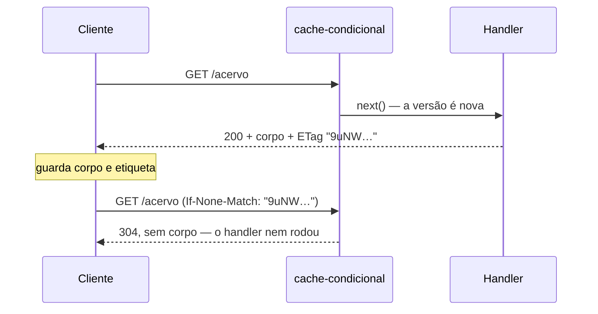

# Middleware — cache-condicional

📦 módulo 15 (cache, ainda não escrito) · 🧩 grupo 04

Manda uma etiqueta junto da resposta e, quando o cliente devolve a mesma
etiqueta, responde `304 Not Modified` sem corpo — e sem rodar o handler.

## O problema

A tela inicial do acervo lista o que a biblioteca tem. Ela é aberta o dia
inteiro, por gente diferente, e recarregada a cada F5. O acervo muda três ou
quatro vezes por hora, quando alguém empresta ou devolve um livro.

Ou seja: quase toda requisição devolve **exatamente os mesmos bytes** que a
anterior. O servidor consulta o banco, monta o JSON, serializa e manda pela
rede — para o cliente concluir que nada mudou.

Sem uma forma de o cliente perguntar "mudou desde a última vez?", só existem
duas saídas ruins. Ou ele pede tudo sempre, e você paga banco, CPU e banda por
uma resposta idêntica. Ou ele guarda a cópia por um tempo fixo e mostra dado
velho, sem ter como saber se envelheceu de fato.

## Como funciona

O HTTP resolve isso com um par de cabeçalhos. Na primeira resposta o servidor
manda uma **etiqueta** (`ETag`) que identifica aquela versão do conteúdo. O
cliente guarda a resposta com a etiqueta ao lado. Na próxima vez, ele repete o
pedido com `If-None-Match: <etiqueta>` — "só me manda se não for esta versão".

O servidor compara. Se a etiqueta ainda vale, responde `304 Not Modified`, que é
um status sem corpo nenhum: só a linha de status e alguns cabeçalhos. Se mudou,
responde `200` com o conteúdo novo e a etiqueta nova.



O que se economiza é o **corpo**, não a viagem: a requisição sai do cliente e
chega no servidor nas duas vezes. Por isso o `Cache-Control` entra junto — ele é
quem decide se o cliente precisa perguntar. Com `max-age=30`, os próximos 30
segundos são respondidos pela cópia local sem sair da máquina; passados os 30, a
pergunta volta, e aí o `304` faz o trabalho dele.

A peça que este middleware acrescenta é **de onde vem a etiqueta**. Ela é
calculada a partir de um dado barato que você já tem em mãos antes de montar
qualquer coisa — o `atualizadoEm` do acervo, no exemplo. É isso que permite
responder `304` **antes** do `next()`, sem consultar o banco.

## O código

```ts
import { createHash } from 'node:crypto';
import type { NextFunction, Request, Response } from 'express';

export type Versao = (req: Request) => string | number | undefined;

export type OpcoesCache = {
  segundos?: number;
  compartilhavel?: boolean;
};

export function cacheCondicional(obterVersao: Versao, opcoes: OpcoesCache = {}) {
  const { segundos = 30, compartilhavel = false } = opcoes;

  return (req: Request, res: Response, next: NextFunction) => {
    const versao = obterVersao(req);
    if (versao === undefined) return next();

    const etiqueta = etiquetaDe(versao);
    res.setHeader('ETag', etiqueta);
    // Etiqueta sem política de cache resolve metade: o `ETag` diz COMO
    // perguntar "mudou?", o `Cache-Control` diz QUANDO perguntar.
    res.setHeader(
      'Cache-Control',
      `${compartilhavel ? 'public' : 'private'}, max-age=${segundos}, must-revalidate`,
    );

    if (combina(req.headers['if-none-match'], etiqueta)) {
      // `.end()` e não `.json()`: um 304 não pode ter corpo, e o corpo é
      // justamente o que se economiza.
      return res.status(304).end();
    }

    // O `next()` é o caso caro: o handler roda e monta a resposta inteira.
    next();
  };
}

function etiquetaDe(versao: string | number): string {
  return `"${createHash('sha1').update(String(versao)).digest('base64url')}"`;
}

function combina(cabecalho: string | undefined, etiqueta: string): boolean {
  if (!cabecalho) return false;
  return cabecalho
    .split(',')
    .map((valor) => valor.trim())
    .some((valor) => valor === '*' || semPrefixo(valor) === semPrefixo(etiqueta));
}

const semPrefixo = (valor: string) => valor.replace(/^W\//, '');
```

O arquivo completo, com todos os comentários, está em
[`middleware.ts`](./middleware.ts).

Repare no `undefined` do tipo `Versao`. Ele não é descuido de tipagem: é a saída
de emergência para a requisição que você não sabe versionar. Nesse caso o
middleware sai de cena e a resposta segue normal, sem etiqueta. Emitir uma
etiqueta errada é **pior** do que não emitir nenhuma — o cliente passaria a
guardar conteúdo velho achando que está em dia, e ninguém descobre isso olhando
o servidor.

## Como usar

Ele é **por rota**, não global. A função de versão sabe versionar aquele
recurso; não existe uma versão que sirva para o acervo, para o relatório e para
o perfil do leitor ao mesmo tempo.

```ts
app.get(
  '/acervo',
  cacheCondicional(() => acervo.atualizadoEm),
  (_req, res) => res.json(resumo()),
);
```

Dentro da rota, ele vem **antes do handler** — que é o ponto inteiro. Se você
inverter e tentar carimbar a etiqueta depois, o handler já rodou e você
economizou só a banda.

E ele vem **depois** da autenticação, quando houver. Uma etiqueta calculada
antes de saber quem está pedindo pode devolver `304` para uma requisição que
deveria ter levado `401`.

Só faz sentido em `GET` e `HEAD`. Num `POST` ou `DELETE` o cliente não está
pedindo uma representação, está mandando mudar o estado — não há o que
revalidar.

## As decisões e o porquê

### A versão vem de fora, por função

A alternativa era o middleware descobrir a versão sozinho, lendo um campo com
nome fixo (`atualizadoEm`) do que a rota fosse devolver. Custaria as duas coisas
que importam: só funcionaria em recursos que tivessem esse campo exato, e a
descoberta aconteceria **depois** do handler — de volta ao problema original.

Recebendo uma função, a versão pode ser qualquer coisa barata: um contador em
memória, um `MAX(atualizado_em)` que o banco resolve por índice, o número da
migração. E a assinatura recebe o `req`, então dá para versionar por parâmetro
(`/livros/:id` versiona por livro).

### `sha1` sobre a versão, e não a versão crua

A etiqueta viaja num cabeçalho, então não pode conter `"` nem quebra de linha —
e uma data crua entrega de graça o instante em que o dado mudou, para qualquer
um que olhe a resposta. O hash normaliza os dois problemas de uma vez.

O custo declarado: um `sha1` por requisição. Ele roda sobre ~30 bytes de versão,
não sobre o corpo — é a diferença entre microssegundos e uma passada pela
resposta inteira. E `sha1` aqui não é escolha de segurança: ninguém está
assinando nada, a etiqueta só precisa ser estável e curta.

### Etiqueta forte (sem `W/`)

Sem o prefixo `W/`, a etiqueta promete **bytes idênticos**. Isso é verdade
enquanto a mesma versão sempre gerar o mesmo corpo — e é o que permite que
cliente e proxy usem a etiqueta para coisas exigentes, como pedir um pedaço do
conteúdo com `Range`.

A alternativa fraca (`W/"..."`) promete só "equivalente o bastante". Se a sua
resposta carrega algo como `geradoEm: Date.now()`, a promessa forte é mentira e
você **precisa** da fraca. O custo de errar para o lado forte é um cliente
juntando pedaços de duas versões diferentes do mesmo arquivo.

### `max-age=30, must-revalidate`

Trinta segundos porque o acervo muda quando alguém empresta um livro: meio
minuto de defasagem numa listagem ninguém percebe, e isso já mata a enxurrada de
requisições de uma página que recarrega sozinha.

`max-age=0` era a alternativa conservadora: toda requisição volta ao servidor e
você economiza só o corpo. É o certo para saldo, estoque e qualquer número que o
usuário vá usar para decidir algo — ali, 30 segundos de atraso viram um erro do
usuário, não um detalhe de desempenho.

`must-revalidate` fecha a brecha do outro lado: sem ele, um cache pode continuar
servindo a cópia vencida quando o servidor está fora do ar. Silenciosamente.

### `private` por padrão

`public` autoriza CDN e proxy da empresa a guardar a resposta e entregá-la a
outra pessoa. Numa API com login, isso é vazamento de dado, não ganho de
desempenho — e o modo de falha é o pior possível, porque só aparece em produção,
com dois usuários simultâneos, e não reproduz na sua máquina.

## Onde é fácil errar

| Sintoma                                                          | Causa                                                                                                                                            |
| ---------------------------------------------------------------- | ------------------------------------------------------------------------------------------------------------------------------------------------ |
| **`ETag` já aparece sem você fazer nada**                        | **O falso amigo.** O Express gera uma no `res.send` por padrão — veja abaixo por que ela não resolve o seu problema                               |
| `304` chega com corpo e o cliente ignora o conteúdo              | Respondeu com `res.json()` em vez de `res.end()`. O `304` não pode ter corpo; mandar um custa mais caro que o `200`                              |
| A resposta nunca volta `304` no navegador, mas volta no `curl`   | O cliente devolveu uma lista de etiquetas ou um `W/` que o servidor comparou com `===` no cabeçalho inteiro                                       |
| O cliente mostra dado velho depois de uma escrita                | A versão não mudou junto com o dado. Quem escreve tem que atualizar o campo que a função de versão lê — senão a etiqueta antiga continua batendo |
| Dado de um usuário aparece para outro                            | `public` num recurso que depende de quem pediu, ou etiqueta calculada antes da autenticação                                                      |
| Cliente pede em dois formatos e recebe o errado                  | Falta `Vary`. A etiqueta identifica a versão do dado, não a do formato                                                                            |

### O falso amigo: o `ETag` que o Express já manda

Esta rota não usa middleware nenhum:

```ts
app.get('/acervo-caro', (_req, res) => {
  execucoes.acervoCaro += 1;
  res.json(resumo());
});
```

E ela **já** responde com etiqueta:

```bash
$ curl.exe -i -s http://localhost:6104/acervo-caro
HTTP/1.1 200 OK
Content-Type: application/json; charset=utf-8
Content-Length: 70
ETag: W/"46-q27zjqdcbet/CSrRAP+AhOwp5nA"
```

Parece que o trabalho está feito. E até funciona: mandando essa etiqueta de
volta, o Express responde `304`.

Duas coisas nessa string dizem o que ela custa. O `W/` na frente é a marca da
etiqueta **fraca**. E o `46` antes do traço é o tamanho do corpo em hexadecimal
— `0x46` = 70, exatamente o `Content-Length` da resposta. A etiqueta é calculada
sobre o corpo **já montado**, porque é o único momento em que o Express tem o
corpo na mão.

Ou seja: para descobrir que nada mudou, o handler rodou, o banco foi consultado,
o JSON foi serializado. **Todo o trabalho aconteceu.** O que se economizou foi a
banda de saída, e mais nada.

O placar de `GET /execucoes` mostra isso sem margem para dúvida. Depois de uma
requisição normal e uma com `If-None-Match` em **cada** rota:

```bash
$ curl.exe -s http://localhost:6104/execucoes
{"acervo":1,"acervoCaro":2}
```

`acervoCaro: 2` — o handler rodou nas duas, inclusive na que virou `304`.
`acervo: 1` — o middleware respondeu `304` a partir do `atualizadoEm` e o
handler nem foi chamado.

Quando a resposta é barata de montar, o ETag automático do Express está de bom
tamanho e não há motivo para trocá-lo. A troca compensa quando montar a resposta
é o caro: consulta pesada, agregação, chamada a outro serviço.

> **Atenção:** se você setar o `ETag` manualmente, o Express respeita o seu e
> não gera o dele — a checagem dele é `!res.get('ETag')`. As duas etiquetas
> nunca convivem na mesma resposta.

## O que ele não faz

- **Não guarda nada.** Quem guarda é o cliente; o servidor só emite e confere
  etiqueta. Cache **do lado do servidor** — memória, Redis, resposta pronta
  guardada — é outro assunto, e é o módulo 15.
- **Não trata `If-Modified-Since`.** É o par antigo, baseado em data e com
  precisão de um segundo; o `If-None-Match` é o mecanismo atual e cobre o caso.
- **Não manda `Vary`.** Se a mesma URL responde diferente conforme um cabeçalho
  (`Accept`, `Accept-Language`, `Authorization`), o cache precisa saber disso, e
  quem diz é o `Vary`. Nas rotas em JSON puro deste catálogo não há variação.
- **Não invalida nada.** A responsabilidade de mexer na versão quando o dado
  muda é de quem escreve. Se o `atualizadoEm` não subir, a etiqueta continua
  batendo e o cliente continua com o dado velho.
- **Não protege o servidor de carga.** Contra excesso de requisições, o
  middleware é `limitar`, no grupo 03.

## Testado assim

Servidor em pé com `node middlewares/04-desempenho-e-convencao/servidor.ts`.

**A primeira resposta traz a etiqueta e a política:**

```bash
$ curl.exe -i -s http://localhost:6104/acervo
HTTP/1.1 200 OK
X-Powered-By: Express
ETag: "9uNWNIjwT-2pIYo3zfubPREJbsc"
Cache-Control: private, max-age=30, must-revalidate
Content-Type: application/json; charset=utf-8
Content-Length: 70

{"atualizadoEm":"2026-08-20T09:00:00.000Z","total":25,"emprestados":0}
```

Sem `W/` e sem o tamanho do corpo no começo — a etiqueta veio do `atualizadoEm`.

**A segunda, com a etiqueta de volta, é um `304` sem corpo:**

```bash
$ curl.exe -i -s -H 'If-None-Match: "9uNWNIjwT-2pIYo3zfubPREJbsc"' \
    http://localhost:6104/acervo
HTTP/1.1 304 Not Modified
X-Powered-By: Express
ETag: "9uNWNIjwT-2pIYo3zfubPREJbsc"
Cache-Control: private, max-age=30, must-revalidate

```

Não há linha em branco a mais depois dos cabeçalhos: a resposta acaba ali.

**Uma lista de etiquetas também casa:**

```bash
$ curl.exe -s -o /dev/null -w '%{http_code}\n' \
    -H 'If-None-Match: "aaa", "kKSimyBGhXgYv7T5KRuu6Z5q5E0"' \
    http://localhost:6104/acervo
304
```

**Escrever muda a versão e a etiqueta antiga para de valer:**

```bash
$ curl.exe -i -s -X POST http://localhost:6104/livros/3/emprestimo
HTTP/1.1 200 OK
{"id":3,"emprestado":true}

$ curl.exe -i -s -H 'If-None-Match: "9uNWNIjwT-2pIYo3zfubPREJbsc"' \
    http://localhost:6104/acervo
HTTP/1.1 200 OK
ETag: "kKSimyBGhXgYv7T5KRuu6Z5q5E0"
Cache-Control: private, max-age=30, must-revalidate
Content-Length: 70

{"atualizadoEm":"2026-08-21T01:37:02.945Z","total":25,"emprestados":1}
```

**O falso amigo, com o ETag automático do Express:**

```bash
$ curl.exe -i -s http://localhost:6104/acervo-caro
HTTP/1.1 200 OK
Content-Type: application/json; charset=utf-8
Content-Length: 70
ETag: W/"46-q27zjqdcbet/CSrRAP+AhOwp5nA"

{"atualizadoEm":"2026-08-20T09:00:00.000Z","total":25,"emprestados":0}

$ curl.exe -i -s -H 'If-None-Match: W/"46-q27zjqdcbet/CSrRAP+AhOwp5nA"' \
    http://localhost:6104/acervo-caro
HTTP/1.1 304 Not Modified
ETag: W/"46-q27zjqdcbet/CSrRAP+AhOwp5nA"

$ curl.exe -s http://localhost:6104/execucoes
{"acervo":1,"acervoCaro":2}
```

O `304` sai nas duas rotas. O contador é que separa: `acervoCaro` rodou o
handler duas vezes para chegar nele.
