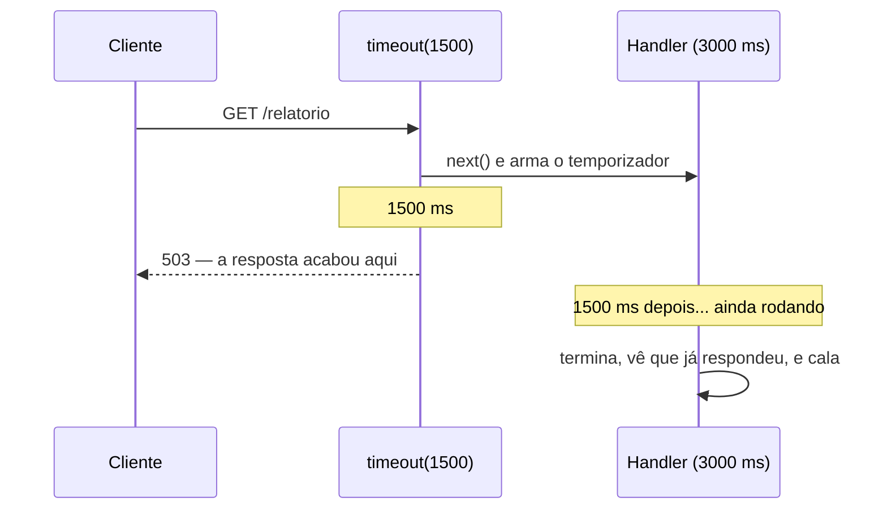

# Middleware — timeout

📦 módulo 05 · 🧩 grupo 04

Depois de um tempo limite, para de esperar o handler e responde `503` ao
cliente. O handler continua rodando.

## O problema

Uma consulta do relatório do acervo passou a demorar. Não travou — ela termina,
só que em oito segundos em vez de duzentos milissegundos, porque uma tabela
cresceu e um índice sumiu.

Do lado de quem chamou, isso é indistinguível de "o servidor caiu". O navegador
fica com a barra girando. O aplicativo de celular não tem tela para "ainda
carregando, aguarde" — ele tem tela de carregamento e tela de erro. O usuário
recarrega a página, o que dispara **outra** requisição de oito segundos, e agora
são duas.

E o pior caso não é a lentidão: é o handler que **nunca** termina. Um `fetch`
para um serviço que parou de responder sem fechar a conexão deixa a requisição
pendurada até o sistema operacional desistir — minutos. A conexão fica aberta
esse tempo todo, ocupando um slot que outra pessoa precisava.

Sem um teto, o tempo de resposta da sua API é decidido pela pior coisa que
acontecer nela.

## Como funciona

O middleware arma um `setTimeout` no começo da requisição. Se a resposta sair
antes do prazo, o temporizador é cancelado e nada acontece. Se o prazo estourar
primeiro, ele responde `503` e encerra a resposta.

E aqui está a coisa que a maioria dos exemplos não diz:

> **Atenção:** você **não mata o handler**. Não existe em Node uma forma de
> cancelar uma função que já começou a rodar. Ele continua executando, continua
> segurando a conexão de banco que pegou, continua chegando ao fim — só que
> ninguém mais está ouvindo o que ele tem a dizer.



O middleware protege **o cliente** da espera. Ele não protege o servidor da
carga — a carga é exatamente a mesma, com ou sem ele. Quem protege o servidor é
não deixar a operação lenta existir: índice, fila, limite de concorrência,
`AbortSignal` na chamada externa que aceite um.

Duas coisas ficam mais claras quando esse fato é levado a sério. A primeira é
que o handler vai chegar no `res.json` dele, numa resposta que já acabou — daí a
função `jaRespondida`. A segunda é que empilhar timeouts curtos numa API que
ficou lenta não conserta nada: só troca a espera longa por um monte de `503`.

## O código

```ts
import type { NextFunction, Request, Response } from 'express';

export function timeout(ms = 5000) {
  return (_req: Request, res: Response, next: NextFunction) => {
    const temporizador = setTimeout(() => {
      // Corrida real: o handler pode ter respondido no milissegundo anterior ao
      // disparo, antes de o `clearTimeout` rodar.
      if (res.headersSent) return;

      // Sem `Retry-After`, todo cliente que leva 503 tenta de novo na hora, e a
      // rota que já estava lenta recebe o dobro de pedidos.
      res.setHeader('Retry-After', String(Math.ceil(ms / 1000)));
      res.status(503).json({
        erro: 'A resposta demorou mais do que o limite e foi abandonada',
        limiteMs: ms,
      });
    }, ms);

    // `close` e não `finish`: o `finish` só dispara quando a resposta é enviada
    // com sucesso. Se o cliente desconectar no meio, o `finish` nunca vem e o
    // temporizador sobrevive.
    res.on('close', () => clearTimeout(temporizador));

    next();
  };
}

export function jaRespondida(res: Response): boolean {
  return res.headersSent;
}
```

O arquivo completo, com todos os comentários, está em
[`middleware.ts`](./middleware.ts).

A `jaRespondida` é uma linha e podia estar solta em cada rota. Ela está aqui, com
nome, porque é o nome que faz quem lê o handler perguntar "por que isto está
aqui?" — e a resposta é este arquivo. Um `if (res.headersSent) return;` no meio
de uma rota parece resíduo de depuração e alguém apaga.

## Como usar

**Primeiro da pilha**, global:

```ts
app.use(timeout(5000));
```

Um teto que cobre metade dos middlewares não é um teto. Se ele entrar depois da
autenticação, uma consulta lenta de token fica de fora justamente do limite que
deveria protegê-la.

Por rota, quando um caminho tem outro perfil de tempo:

```ts
app.get('/relatorio-anual', timeout(30_000), gerarRelatorioAnual);
```

Nesse caso os dois rodam, e **vale o mais curto** — o global já armou o
temporizador dele antes. Se o teto de rota for maior que o global, ele não tem
efeito nenhum; para valer, o global precisa ficar de fora daquele caminho.

E toda rota que pode ultrapassar o teto termina com a guarda:

```ts
app.get('/relatorio', async (_req, res) => {
  const dados = await consultaLenta();
  if (jaRespondida(res)) return;
  res.json(dados);
});
```

## As decisões e o porquê

### `503`, e não `504`

`504 Gateway Timeout` diz uma coisa específica: **eu sou um intermediário e quem
não respondeu foi o servidor lá atrás.** É o status do Nginx, do balanceador, do
gateway de API. Aqui não há ninguém atrás — o lento é o nosso próprio handler.
Mandar `504` faria a pessoa que está depurando procurar um serviço a montante
que não existe.

`503 Service Unavailable` diz "este serviço não conseguiu atender agora, tente
de novo". É o que aconteceu, e é o que os clientes já sabem interpretar: cliente
HTTP repete em `503`, balanceador tira do rodízio a instância que só devolve
`503`, o alerta de `5xx` dispara (docs/01-fundamentos-http.md).

O que se perde: `503` não distingue "demorei demais" de "estou sobrecarregado"
nem de "estou em manutenção". Por isso o corpo carrega `limiteMs` — a
informação que o status não tem cabe no JSON, que é a interface com a pessoa.

Se um dia este middleware for parar num serviço que de fato chama outro e
desiste de esperar **por causa dele**, aí `504` passa a ser o certo.

### `Retry-After` junto

Um `503` sem `Retry-After` é um convite para o cliente tentar de novo
imediatamente. A rota que já estava lenta passa a receber o dobro de pedidos, e
a lentidão vira indisponibilidade — o efeito tem nome, é a avalanche de
retentativas.

O valor é o próprio teto em segundos: se esperar aquele tanto não bastou,
insistir no instante seguinte também não vai bastar. A alternativa seria um
número fixo grande (30, 60), mais seguro para o servidor e pior para o usuário,
que fica olhando uma tela de erro por um minuto quando o problema durou dois
segundos.

### `res.on('close')`, e não `res.on('finish')`

`finish` dispara quando a resposta foi enviada com sucesso. `close` dispara
quando a resposta acabou, **de qualquer jeito** — inclusive quando o cliente
fechou a aba no meio do carregamento.

Com `finish`, o caso do cliente que desiste deixa o temporizador vivo. Ele
segura o event loop pelo tempo restante e depois dispara sobre uma resposta que
não existe mais. Um por requisição abandonada, em toda a aplicação.

### A checagem `res.headersSent` **dentro** do temporizador

Parece redundante — se a resposta saiu, o `clearTimeout` já rodou. Mas as duas
coisas acontecem no mesmo event loop e existe a janela em que o handler acabou
de responder e o `close` ainda não foi processado. Sem essa linha, o timeout
tentaria escrever cabeçalho numa resposta já enviada e produziria exatamente o
`ERR_HTTP_HEADERS_SENT` que a `jaRespondida` existe para evitar do outro lado.

## Onde é fácil errar

| Sintoma                                                        | Causa                                                                                                                                                    |
| -------------------------------------------------------------- | ---------------------------------------------------------------------------------------------------------------------------------------------------------- |
| **A carga do servidor não caiu depois de instalar o timeout**  | **O falso amigo.** O handler não foi cancelado — ele continua rodando, e o banco continua trabalhando. Só a espera do cliente terminou                    |
| `ERR_HTTP_HEADERS_SENT` no log depois de todo `503`            | Falta o `if (jaRespondida(res)) return;` no handler lento                                                                                                 |
| Timeouts disparando em requisições que responderam rápido      | `res.on('finish')` no lugar do `close`, ou nenhum `clearTimeout` — o temporizador sobreviveu à resposta                                                    |
| O teto por rota é ignorado                                     | Um `timeout` global mais curto já estava armado. Vale o menor                                                                                              |
| Todo mundo repete o pedido no mesmo instante e a API cai       | `503` sem `Retry-After`                                                                                                                                    |
| O cliente recebe a página de erro do Nginx, não o seu JSON     | O teto do servidor está acima do teto do proxy na frente. O seu tem que ser o menor para a sua mensagem chegar                                             |
| Upload grande passou a falhar                                  | O teto conta desde o início da requisição, e um upload legítimo pode passar dele. Rotas de upload precisam do próprio teto, fora do global                 |

## O que ele não faz

- **Não cancela o handler.** É o ponto da pasta. Para cancelar de verdade, a
  operação precisa aceitar cancelamento: `AbortSignal` num `fetch`, `statement
  timeout` no banco. O middleware não tem como impor isso a código que já rodou.
- **Não libera recursos.** A conexão de banco, o arquivo aberto, a memória do
  resultado parcial — tudo continua preso até o handler terminar sozinho.
- **Não protege contra excesso de requisições.** Isso é `limitar`, no grupo 03.
- **Não cobre o tempo de leitura do corpo** que o Node gasta antes de o Express
  chamar o middleware, nem o tempo que a resposta leva na rede depois.
- **Não avisa ninguém.** Um `503` por timeout é sintoma de problema, e deveria
  virar métrica. Observabilidade é o módulo 14
  ([docs/14-observabilidade.md](../../../docs/14-observabilidade.md)).

## Testado assim

Demo em pé com `timeout(1500)` global e dois handlers de 3000 ms.

**A rota lenta estoura o teto — a resposta vem em 1,5 s, não em 3 s:**

```bash
$ curl.exe -i -s -w '\n[tempo total: %{time_total}s]\n' \
    http://localhost:6104/relatorio
HTTP/1.1 503 Service Unavailable
X-Powered-By: Express
Retry-After: 2
Content-Type: application/json; charset=utf-8
Content-Length: 83

{"erro":"A resposta demorou mais do que o limite e foi abandonada","limiteMs":1500}
[tempo total: 1.507681s]
```

**Um segundo e meio depois, o handler termina — e vê que não tem para quem
falar.** Do log do servidor:

```
[relatorio] terminou depois do timeout; nada a enviar
```

**A mesma rota sem a guarda entrega o mesmo `503` ao cliente:**

```bash
$ curl.exe -i -s -w '\n[tempo total: %{time_total}s]\n' \
    http://localhost:6104/relatorio-sem-guarda
HTTP/1.1 503 Service Unavailable
Retry-After: 2
Content-Length: 83

{"erro":"A resposta demorou mais do que o limite e foi abandonada","limiteMs":1500}
[tempo total: 1.514458s]
```

**A diferença aparece só no servidor**, 1,5 s depois:

```
[erro] Cannot set headers after they are sent to the client
Error [ERR_HTTP_HEADERS_SENT]: Cannot set headers after they are sent to the client
    at ServerResponse.setHeader (node:_http_outgoing:642:11)
    at ServerResponse.header (.../express/lib/response.js:686:10)
    at ServerResponse.send (.../express/lib/response.js:163:12)
    at ServerResponse.json (.../express/lib/response.js:252:15)
    at .../04-desempenho-e-convencao/servidor.ts:91:7
```

É este o custo real de esquecer a guarda: o cliente não vê nada de errado, e o
seu log ganha um `5xx` fantasma por requisição lenta. Quem estiver de plantão
vai investigar um erro que descreve o comportamento esperado.

**E o servidor continua de pé depois disso:**

```bash
$ curl.exe -s -o /dev/null -w '%{http_code}\n' http://localhost:6104/execucoes
200
```

O `ERR_HTTP_HEADERS_SENT` chega ao tratador de erro do `servidor.ts`, que vê
`res.headersSent` e devolve ao Express em vez de tentar responder de novo — o
processo não cai.
