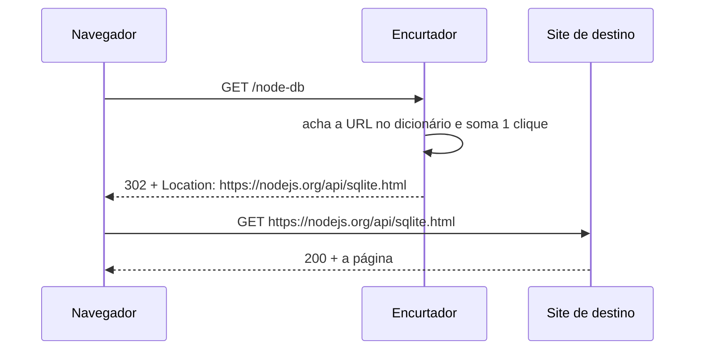

# Mini API — Encurtador de links

📦 Módulos 03–05 · 🔌 porta 6001 · 💾 memória

## O problema

Um link de rastreamento de campanha tem 180 caracteres e três parâmetros de
`utm_`. Ele não cabe no rodapé de um flyer, não sobrevive a um cliente de e-mail
que quebra a linha no meio, e ninguém consegue ditá-lo por telefone. Além disso,
depois de imprimir o flyer, você não tem como saber quantas pessoas clicaram.

O encurtador resolve as duas coisas com o mesmo movimento: entrega um endereço
de 30 caracteres que dá no mesmo lugar, e — porque toda visita passa por ele
antes de chegar ao destino — sabe quantas foram. Para isso ele precisa guardar
duas informações por link: para onde o código aponta, e quantas vezes foi usado.

## Como funciona

### Encurtar não comprime nada

O nome engana. Nenhum algoritmo espreme aqueles 180 caracteres em 6 — isso seria
matematicamente impossível para uma URL arbitrária. A URL longa continua inteira,
guardada no servidor do encurtador. O que se cria é uma **chave** curta que
aponta para ela.

Um encurtador é, no fundo, um dicionário com um servidor na frente:

```text
Hemsks  →  https://developer.mozilla.org/pt-BR/docs/Web/HTTP/Status/302
node-db →  https://nodejs.org/api/sqlite.html
```

Tudo o mais — contagem de cliques, estatística, apagar link — é acessório em
cima dessa tabela de duas colunas.

### O que o navegador faz quando alguém abre o link curto

Aqui está a parte que quase todo mundo assume sem nunca ter visto: **são duas
requisições, não uma.** O encurtador nunca busca a página de destino nem a
repassa; ele responde "não é aqui, é ali" e sai do caminho.



Duas peças fazem esse desenho funcionar:

- O **status 302** é a resposta que significa "o que você quer está em outro
  endereço, temporariamente". Ela não traz a página — traz uma instrução.
- O cabeçalho **`Location`** é o campo dessa resposta onde vai o endereço de
  destino. Um cabeçalho é um par nome-valor que acompanha a resposta ao lado do
  conteúdo; `Location` é o que o navegador lê para saber para onde ir.

O navegador então **refaz a requisição sozinho**, no endereço que veio no
`Location`, sem perguntar nada a ninguém. É por isso que a barra de endereços
muda: quem terminou atendendo foi o site de destino.

O `302` diz **temporário**, e essa palavra decide o comportamento. Existe também
o `301`, que diz **permanente** — e o navegador que recebe um `301` guarda a
associação em cache: da segunda visita em diante ele vai direto ao destino sem
falar com o encurtador. O redirecionamento continua funcionando, mas o
encurtador deixa de ver as visitas, e a contagem congela no número da primeira.

### De onde sai a contagem de cliques

Como toda visita obrigatoriamente passa pelo encurtador antes de chegar ao
destino, contar é somar 1 nessa passagem. Não há rastreador, cookie nem script
na página: o número existe como efeito colateral do desvio.

E vale saber o que ele **não** mede:

- A mesma pessoa abrindo o link duas vezes conta dois. É contagem de
  **passagens**, não de pessoas.
- Um robô de pré-visualização — o que gera aquele cartãozinho quando você cola
  um link no WhatsApp — também conta.
- Nada garante que a pessoa chegou a ver a página: o navegador pode ser fechado
  entre a primeira e a segunda requisição, e o encurtador já contou.
- O site de destino não sabe de nada disso. Ele recebe uma visita comum e nunca
  fica sabendo que houve um encurtador no meio, nem quantos cliques houve.

### Como o código curto é gerado

O código é sorteado: 6 caracteres tirados de um alfabeto de 57 símbolos —
letras minúsculas, maiúsculas e dígitos, **menos** os que se confundem quando
alguém lê o link em voz alta ou copia de um cartaz (`0` e `O`, `1` e `l` e `I`,
os dois lados de cada par).

Seis caracteres dão 57⁶ = **34.296.447.249** combinações, ou 34 bilhões. Esse
número não é para caber muitos links — é para que um sorteio novo quase nunca
caia num código já usado. Duas URLs sorteando o mesmo código é uma **colisão**,
e ela é o único jeito de o encurtador "perder" um link: o segundo sobrescreveria
o primeiro, e quem tivesse o cartaz impresso passaria a cair no lugar errado. A
defesa é barata: sorteou algo que já existe, sorteia de novo.

O caminho aparentemente mais simples — numerar os links em ordem, `/1`, `/2`,
`/3` — é pior por um motivo que não tem nada a ver com espaço: qualquer pessoa
digitando números em sequência lê os links de todo mundo, um a um. E como o
número cresce sozinho, ele ainda entrega quantos links a plataforma tem e quando
cada um foi criado.

### O limite honesto do modelo

Quem tem o código tem o link. Não há senha, não há dono, não há como o
encurtador saber se quem clicou devia clicar. Link curto **não é** link secreto:
se ele vazar num print, num histórico de navegação ou no log de um proxy, o
destino vazou junto.

O código sorteado torna o link difícil de **adivinhar**, e é só isso que ele faz.
Conteúdo que precisa de controle de acesso precisa de autenticação no destino —
o encurtador não tem como oferecer isso.

## Rodar

```bash
node minis-apis/01-encurtador/servidor.ts
```

No terminal aparece:

```text
Encurtador em http://localhost:6001  ·  POST http://localhost:6001/links para criar
```

Não há passo de instalação, banco ou variável de ambiente: os links vivem num
`Map` em memória. Encerrar o processo apaga tudo.

## Como ela foi construída

### 1. O dicionário e o criar/listar

O ponto de partida foi a tabela de duas colunas da seção anterior, escrita como
um `Map`, mais um `POST` que insere e um `GET` que lista. Nesta altura a API já
guardava links — só não redirecionava ninguém.

```ts
export const links = new Map<string, Link>();
```

O `Map` entrou no lugar de `{}` por causa de quem escolhe a chave: ela vem do
cliente. Um objeto literal já nasce com `constructor` e `toString` herdados, e
`{}['toString']` devolve uma função — um pedido com `codigo: "toString"` acharia
que o código já está em uso. `Map` só tem as chaves que você põe.

### 2. O redirecionamento e o contador

A rota `/:codigo` é a API inteira do ponto de vista de quem clica: acha a URL,
soma um clique, responde o desvio.

```ts
link.cliques += 1;
res.redirect(302, link.url);
```

O `302` explícito é o comentário mais importante do arquivo. O padrão do método
já é 302, mas escrever o número deixa a decisão visível no lugar em que ela é
tomada — trocar por `301` "para ficar mais correto" é o erro que congela o
contador, e ele não aparece em teste nenhum: na primeira visita os dois se
comportam igual.

### 3. A ordem das rotas, descoberta quebrando

Com `/:codigo` no arquivo, `GET /links` parou de listar e passou a responder um
`404`. O motivo é que `/:codigo` casa com **qualquer** segmento único, e `links`
é um segmento único: o pedido virava "me dê o link de código `links`".

A correção não é configuração nem prioridade — é posição. As rotas são testadas
de cima para baixo, e a primeira que casa atende:

```ts
app.get('/links', ...); // literal primeiro
app.get('/links/:codigo', ...);
app.get('/:codigo', ...); // o curinga sempre por último
```

### 4. A validação, escrita à mão

O `POST` aceita `url` e um `codigo` opcional, e cada campo virou uma sequência
de `if`. É de propósito, e o custo está à vista no arquivo:

```ts
if (typeof url !== 'string' || url.trim() === '') {
  return res.status(400).json({ erro: 'O campo `url` é obrigatório e deve ser texto' });
}
const alvo = url.trim();
if (!alvo.startsWith('http://') && !alvo.startsWith('https://')) {
  return res
    .status(400)
    .json({ erro: 'O campo `url` precisa começar com http:// ou https://' });
}
```

São dois campos e já são quatro `if`, quatro mensagens escritas na mão e um
`trim()` repetido — e o `codigo`, por ser opcional, ainda precisa de um bloco
`else` inteiro só para não confundir "não mandou" com "mandou errado". Cada
campo novo multiplica isso, as mensagens divergem entre rotas, e nada disso
aparece nos tipos: `req.body` é `any`, então o TypeScript não ajuda em nada até
o primeiro `if` estreitar o tipo à mão.

É essa dor que a próxima mini API troca por um schema (módulo 07). Ver o
problema inteiro aqui é o que faz a solução de lá parecer óbvia.

### 5. Os três middlewares

Por último entraram as coisas que valem para toda requisição: `cors()` para que
qualquer página possa consultar a API, `morgan('dev')` para ver os pedidos no
terminal, e um cronômetro próprio que carimba `X-Tempo-ms` na resposta.

O cronômetro deu trabalho num ponto que o módulo 05 não cobre. O exemplo do
módulo mede tempo em `res.on('finish')`, e ali só dá para **logar**: quando o
evento dispara, os cabeçalhos já foram enviados e `setHeader` estoura
`ERR_HTTP_HEADERS_SENT`. O último instante em que ainda dá para carimbar é
`writeHead`, chamado uma única vez logo antes de a resposta começar a sair:

```ts
const escreverCabecalhos = res.writeHead.bind(res);
res.writeHead = function (...argumentos: Parameters<typeof escreverCabecalhos>) {
  res.setHeader('X-Tempo-ms', (performance.now() - inicio).toFixed(2));
  return escreverCabecalhos(...argumentos);
} as typeof res.writeHead;
```

## Endpoints

| Método   | Rota             | O que faz                                             | Status        |
| -------- | ---------------- | ----------------------------------------------------- | ------------- |
| `POST`   | `/links`         | Cria: `{ url, codigo? }` → `{ codigo, curto, url }`   | `201·400·409` |
| `GET`    | `/links`         | Lista todos os links com a contagem de cliques        | `200`         |
| `GET`    | `/links/:codigo` | Estatística de um link: URL, cliques, data de criação | `200·404`     |
| `DELETE` | `/links/:codigo` | Apaga o link                                          | `204·404`     |
| `GET`    | `/:codigo`       | Redireciona para a URL original e soma um clique      | `302·404`     |

Toda resposta traz o cabeçalho `X-Tempo-ms` com o tempo de processamento.

## As decisões e o porquê

### 302 e não 301

`301` (permanente) é o que muita gente escolhe achando que "permanente" descreve
o link, que de fato não muda. Mas a palavra fala com o **cache do navegador**:
com `301`, a segunda visita não chega ao servidor. O custo é duplo — o contador
congela em 1, e apagar o link não tem efeito nenhum sobre quem já clicou, porque
o navegador dele nunca mais pergunta. E o cache do navegador não se limpa do
lado do servidor: o estrago dura até o usuário limpar o dele.

O que se paga pelo `302`: cada clique custa uma ida ao servidor, para sempre. É
exatamente o que se quer aqui, já que a contagem é metade do produto.

### Código sorteado de 6 caracteres, e não id sequencial

O sequencial é mais simples, mais curto no começo (`/7`) e nunca colide. O que
ele custa é a enumeração: com `/1`, `/2`, `/3` qualquer um lê os links de todos
os usuários digitando números, e ainda descobre o volume e o ritmo de criação da
plataforma. O sorteio troca essa exposição por um problema pequeno e resolvível
— a colisão, tratada com um novo sorteio.

### `randomInt` do `node:crypto`, e não `Math.random()`

`Math.random()` é mais curto e está sempre à mão, mas seu gerador é previsível a
partir das saídas anteriores: quem criasse alguns links conseguiria calcular os
códigos sorteados para outras pessoas — e o código sorteado é a única coisa que
separa um link do resto do mundo. `randomInt` custa uma linha de import e é
imperceptivelmente mais lento. Para 6 caracteres por link, não há trade-off real.

### Código repetido é 409, não 400

`400` diz "seu pedido está malformado" e manda o cliente procurar um erro de
digitação. Mas o pedido está impecável: o problema é o **estado** do servidor
neste instante, e o mesmo `POST` passa a funcionar assim que aquele link for
apagado. `409 Conflict` é o status que diz isso. A distinção volta com força na
mini API 2, onde "evento lotado" e "e-mail já inscrito" caem no mesmo caso.

### A URL é validada por prefixo, não por existência

O encurtador confere se a URL começa com `http://` ou `https://` e para por aí.
Poderia tentar buscar o endereço para ver se responde — e aí cada criação de
link ficaria refém da rede, demoraria segundos, e um site que estivesse fora do
ar naquele minuto seria recusado para sempre. O prefixo é o mínimo que impede o
erro real: sem ele o destino é lido como caminho relativo, e o clique volta para
o próprio encurtador em vez de sair dele.

### Validação com `if`, e não com biblioteca

Escolha didática, e a única do arquivo que não recomendo copiar. Ela existe para
que o problema fique visível antes da solução — ver o passo 4 de "Como ela foi
construída".

## Onde é fácil errar

| Sintoma                                                                          | Causa                                                                                                                                  |
| -------------------------------------------------------------------------------- | -------------------------------------------------------------------------------------------------------------------------------------- |
| `GET /links` responde `404 {"erro":"Nenhum link com o código \"links\""}`        | `/:codigo` foi registrada antes de `/links`. O curinga casa com `links` e a rota literal nunca é alcançada. Curinga sempre por último. |
| A contagem de cliques congela em 1 e ninguém acha o bug                          | Trocaram `302` por `301`. O navegador cacheou o desvio e não fala mais com a API. **Falso amigo:** "permanente" parece mais correto.   |
| `ERR_HTTP_HEADERS_SENT` ao carimbar `X-Tempo-ms`                                 | `setHeader` dentro de `res.on('finish')`. Nesse ponto os cabeçalhos já saíram — o lugar é `writeHead`.                                 |
| `POST` responde ``400 {"erro":"O campo `url` é obrigatório..."}`` mesmo mandando | Faltou `-H "Content-Type: application/json"`. Sem esse cabeçalho o corpo não é lido, `req.body` fica `undefined` e a validação recusa. |
| `POST` com JSON quebrado devolve `400` em **HTML**, não em JSON                  | É o tratador de erro padrão do framework. Um tratador central que responde JSON é o módulo 06 — esta mini API não tem.                 |
| Um link criado com `codigo: "links"` nunca redireciona                           | `GET /links` é a rota da listagem e está registrada antes. Encurtador de verdade reserva as palavras que usa como caminho.             |
| Todos os links somem depois de reiniciar                                         | Armazenamento é um `Map` em memória. Persistir é a mini API 3 (módulo 09).                                                             |

> **Atenção — aspas no Windows:** os `curl` abaixo usam **aspas simples** em volta
> do JSON, que é o que funciona no **Git Bash**, no Linux e no macOS. O `cmd.exe`
> e o PowerShell **não** removem aspas simples: o corpo chega literalmente como
> `'{"url":"..."}'`, o parser de JSON falha e você recebe um `400` que parece bug
> do servidor, mas é do shell. Nesses dois, escape as aspas duplas:
> `curl -X POST localhost:6001/links -H "Content-Type: application/json" -d "{\"url\":\"https://nodejs.org/\"}"`.
> No PowerShell, `curl` ainda é apelido de `Invoke-WebRequest` — use `curl.exe`.

## Testando

Os comandos abaixo foram rodados nesta ordem, com o servidor recém-iniciado.

Criar um link deixando o encurtador sortear o código:

```bash
curl -s -X POST http://localhost:6001/links \
  -H "Content-Type: application/json" \
  -d '{"url":"https://developer.mozilla.org/pt-BR/docs/Web/HTTP/Status/302"}'
# {"codigo":"wARJjw","curto":"http://localhost:6001/wARJjw","url":"https://developer.mozilla.org/pt-BR/docs/Web/HTTP/Status/302"}
```

Criar escolhendo o código:

```bash
curl -s -X POST http://localhost:6001/links \
  -H "Content-Type: application/json" \
  -d '{"url":"https://nodejs.org/api/sqlite.html","codigo":"node-db"}'
# {"codigo":"node-db","curto":"http://localhost:6001/node-db","url":"https://nodejs.org/api/sqlite.html"}
```

Repetir o código — 409, porque o pedido está certo e o estado é que não deixa:

```bash
curl -s -X POST http://localhost:6001/links \
  -H "Content-Type: application/json" \
  -d '{"url":"https://expressjs.com/","codigo":"node-db"}'
# {"erro":"O código \"node-db\" já está em uso"}   (HTTP 409)
```

URL sem `http://` — 400, e a mensagem diz qual campo:

```bash
curl -s -X POST http://localhost:6001/links \
  -H "Content-Type: application/json" \
  -d '{"url":"developer.mozilla.org"}'
# {"erro":"O campo `url` precisa começar com http:// ou https://"}   (HTTP 400)
```

O redirecionamento, sem seguir (`-i` mostra os cabeçalhos; sem `-L` o `curl`
para no `302` em vez de refazer a requisição como o navegador faria):

```bash
curl -s -i http://localhost:6001/node-db | head -5
# HTTP/1.1 302 Found
# X-Powered-By: Express
# Access-Control-Allow-Origin: *
# Location: https://nodejs.org/api/sqlite.html
# Vary: Accept
```

A estatística depois de dois cliques (o comando acima foi rodado duas vezes):

```bash
curl -s http://localhost:6001/links/node-db
# {"codigo":"node-db","curto":"http://localhost:6001/node-db","url":"https://nodejs.org/api/sqlite.html","cliques":2,"criadoEm":"2026-08-18T23:36:17.742Z"}
```

A listagem — e a prova de que a ordem das rotas está certa, porque `links` não
foi lido como código:

```bash
curl -s http://localhost:6001/links
# [{"codigo":"wARJjw","curto":"http://localhost:6001/wARJjw","url":"https://developer.mozilla.org/pt-BR/docs/Web/HTTP/Status/302","cliques":0,"criadoEm":"2026-08-18T23:36:17.702Z"},
#  {"codigo":"node-db","curto":"http://localhost:6001/node-db","url":"https://nodejs.org/api/sqlite.html","cliques":2,"criadoEm":"2026-08-18T23:36:17.742Z"}]
```

Apagar (204, sem corpo) e apagar de novo (404):

```bash
curl -s -o /dev/null -w "%{http_code}\n" -X DELETE http://localhost:6001/links/node-db
# 204

curl -s -X DELETE -w "\n%{http_code}\n" http://localhost:6001/links/node-db
# {"erro":"Nenhum link com o código \"node-db\""}
# 404
```

## O que ficou de fora

| O que falta                             | Por quê                                                                                         | Onde entra |
| --------------------------------------- | ----------------------------------------------------------------------------------------------- | ---------- |
| Tratador de erro central                | JSON quebrado hoje devolve `400` em HTML, e cada rota monta o próprio `{ erro }`                | módulo 06  |
| Schema de validação no lugar dos `if`   | É a dor que esta mini API existe para mostrar                                                   | módulo 07  |
| Separação em camadas                    | Com duas responsabilidades e um `Map`, camada aqui seria cerimônia sem ganho                    | módulo 08  |
| Persistência                            | O `Map` morre com o processo; um encurtador de verdade não pode perder o link impresso no flyer | módulo 09  |
| Dono do link e login                    | Hoje qualquer um apaga o link de qualquer um — não há a quem perguntar "quem é você"            | módulo 11  |
| Testes automatizados                    | A validação foi conferida com `curl` na mão, o que não protege contra regressão                 | módulo 12  |
| Limite de criação e bloqueio de destino | Sem isso, o encurtador serve para mascarar link malicioso e aceita criação em massa             | módulo 13  |
| Cliques por dia, origem, referenciador  | Só existe o total acumulado; separar por período exige guardar cada passagem, não só o contador | módulo 09  |

## Para estudar

- [03 — Express básico](../../docs/03-express-basico.md): rota, `req.params`,
  `req.body`, status e o `404` de rota inexistente.
- [04 — Roteamento](../../docs/04-roteamento.md): a ordem em que as rotas são
  testadas, que é o que faz `/:codigo` ter de ficar por último.
- [05 — Middlewares](../../docs/05-middlewares.md): a pilha, `next()`, e por que
  `res.on('finish')` serve para logar mas não para carimbar cabeçalho.
- [01 — Fundamentos de HTTP](../../docs/01-fundamentos-http.md): a família `3xx`,
  o cabeçalho `Location` e as opções de `curl` usadas aqui.
