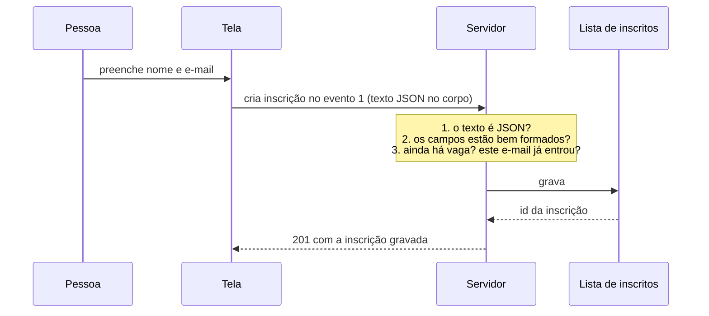

# Mini API — Inscrições em evento

📦 Módulos 03–07 · 🔌 porta 6002 · 💾 memória

## O problema

Um evento tem data, local e um número de cadeiras. Quem organiza precisa abrir a
inscrição para qualquer pessoa e, ao mesmo tempo, não deixar entrar mais gente do
que cabe na sala — e ainda impedir que a mesma pessoa ocupe duas cadeiras porque
clicou duas vezes no botão.

Para isso o servidor precisa saber três coisas: quem está se inscrevendo (nome e
e-mail), em qual evento, e quantas vagas ainda restam **naquele instante**. É a
API de formulário: todo o dado vem preenchido por alguém do outro lado, e nada
que chega já vem conferido.

## Como funciona

### O que o servidor recebe não é um formulário

Uma pessoa vê campos numa tela, digita o nome e o e-mail e clica em "inscrever".
O que sai dali para a rede não são os campos: é **um texto** que diz ser JSON,
enviado no corpo de uma requisição de criação, com um cabeçalho anunciando o
formato. O servidor recebe esse texto, tenta interpretá-lo e, se conseguir, fica
com um objeto na memória.

Nada nesse caminho garante o conteúdo. O texto pode não ser JSON válido, pode ser
JSON válido sem os campos esperados, ou ter os campos com o tipo errado
(`"nome": 42`), ou trazer campos a mais que ninguém pediu. Não existe uma tela do
outro lado — existe um texto, e a tela é apenas o jeito mais comum de produzi-lo.



### Por que validar no servidor mesmo com validação na tela

A checagem do navegador (o campo obrigatório, o aviso vermelho embaixo do input)
existe para quem digitou errado sem querer. Ela é conveniência, não barreira — e
a demonstração cabe em uma linha:

```bash
curl.exe -X POST http://localhost:6002/eventos/1/inscricoes \
  -H "Content-Type: application/json" -d '{"nome":"A","email":"carlos@"}'
```

Esse comando não abriu tela nenhuma. Ele montou o texto na mão e mandou. Toda
regra que só existir na tela é opcional para quem manda a requisição direto — e
mandar requisição direto é o normal: aplicativo de celular, integração de outro
sistema, script de importação, ou alguém curioso com o terminal aberto.

> **Atenção:** a tela continua valendo a pena. Ela dá o erro na hora, sem esperar
> a rede. O ponto não é remover a validação do cliente, é saber que a do servidor
> é a única que impede o dado ruim de ser gravado.

### Vaga limitada é um contador contra um teto

"Restam 3 vagas" é uma subtração: o teto do evento menos quantas inscrições já
existem. O número em si é trivial; o difícil é **quando** ele é conferido.

A tela mostrou "restam 3 vagas" quando carregou. Se a pessoa demorar cinco
minutos preenchendo, esse número já é uma fotografia velha — outras cinco podem
ter se inscrito nesse intervalo. Se a decisão de aceitar fosse tomada com o
número que a tela viu, o evento estouraria a lotação e ninguém saberia explicar
como.

Por isso a conferência acontece no servidor, no momento da gravação, uma
verificação antes de a inscrição entrar na lista. O que a tela mostra é
informação para a pessoa decidir se vale a pena preencher; quem decide se cabe é
sempre a última checagem antes de gravar.

### Duas famílias de recusa

Uma inscrição pode ser recusada por dois motivos completamente diferentes, e
tratá-los como a mesma coisa é o erro mais caro desta API.

| A recusa            | Exemplo                             | Depende do quê?        | O que resolve                     |
| ------------------- | ----------------------------------- | ---------------------- | --------------------------------- |
| **Formato** — `422` | `"carlos@"` não é e-mail            | só do texto que chegou | corrigir o campo e reenviar       |
| **Estado** — `409`  | e-mail já inscrito, vagas esgotadas | do que já está gravado | esperar, cancelar, escolher outro |

O e-mail malformado é um problema fechado: dá para responder olhando apenas para
o que chegou, sem consultar nada, e a resposta é a mesma hoje, amanhã e em outro
evento. Reenviar igual dá o mesmo erro.

"Esse e-mail já se inscreveu" e "acabaram as vagas" são o oposto. O dado está
perfeito — o mundo é que não aceita **agora**. A mesma requisição, reenviada
depois de alguém cancelar, passa. Não há nada de errado com o texto, e nenhuma
correção no formulário resolve.

Daí sai a diferença de status: `422` diz "arrume o dado", `409` diz "o dado está
certo, o estado é que impede". Quem lê a resposta precisa saber se mostra um erro
embaixo do campo ou uma mensagem de "evento lotado" na tela inteira — e é a mesma
distinção em toda API que grava alguma coisa, muito além de inscrição em evento.

### Por que a lista de inscritos vem em pedaços

Um evento com 5 mil inscritos numa resposta só custa caro três vezes: o servidor
monta uma resposta grande na memória, a rede transporta tudo, e quem recebe
espera o pacote inteiro para mostrar as primeiras vinte linhas — que é o que cabe
na tela de qualquer forma.

Paginar é deixar o cliente pedir um pedaço: em que página ele está e quantos
itens quer. Junto com o pedaço vai o **total**, senão não há como saber se aquilo
acabou — sem o total, descobrir o fim exige pedir a página seguinte e ver que
voltou vazia, uma requisição inteira gasta para não receber nada.

## Rodar

```bash
node minis-apis/02-inscricoes/servidor.ts
```

No terminal:

```text
Inscrições em http://localhost:6002/eventos
GET /eventos 200 0.466 ms - 392
POST /eventos/1/inscricoes 201 9.563 ms - 143
```

A primeira linha é do próprio servidor; as seguintes são o log de requisição, uma
por chamada, com o status e o tempo. Os dados são três eventos fixos e quatro
inscrições, recriados a cada execução — o processo morre, tudo se perde.

## Como ela foi construída

### 1. As rotas com os dados em memória

Dois arrays, `eventos` e `inscricoes`, e as cinco rotas em cima deles. A primeira
decisão apareceu logo: onde fica o número de vagas restantes?

O caminho natural seria um campo `vagasRestantes` no evento, subtraído a cada
inscrição. Ele foi descartado por criar duas verdades sobre o mesmo fato — o
contador e a lista. Restante é conta, e conta se faz na hora:

```ts
export const vagasRestantes = (evento: Evento) =>
  evento.vagas - inscricoesDoEvento(evento.id).length;
```

Como efeito colateral, o cancelamento devolve a vaga sem nenhuma linha escrita
para isso: sai uma inscrição da lista, a subtração muda sozinha.

### 2. Cada rota começou a repetir a mesma validação

`if (typeof nome !== 'string')`, `if (!nome.trim())`, `if (!email.includes('@'))`
— quinze linhas por rota, e a listagem repetindo a mesma coisa para a query. A
regra de formato saiu dos handlers e virou schema, e a checagem virou um
middleware só, parametrizado pelo alvo:

```ts
export function validar(schema: ZodType, alvo: Alvo = 'body') { ... }

rotas.post(
  '/eventos/:id/inscricoes',
  validar(idSchema, 'params'),
  validar(criarInscricaoSchema),
  handler,
);
```

Três funções separadas (`validarBody`, `validarParams`, `validarQuery`) fariam o
mesmo hoje e custariam depois: toda correção teria que ser aplicada nas três, e a
que ficasse para trás viraria o bug que só acontece numa rota.

### 3. O `?limite=20` que chegou como texto

Com a listagem paginada veio o falso amigo. Tudo que vem no endereço é texto:
`?limite=20` entrega `"20"`, e `/eventos/3` entrega `"3"`. A comparação
`evento.id === req.params.id` é `3 === "3"`, ou seja `false` — a API responde
`404` para um evento que existe, sem erro e sem log. A conversão entrou no
schema:

```ts
export const idSchema = z.object({
  id: z.coerce.number({ error: '`id` deve ser um número' }).int().positive(),
});
```

O `.int()` depois da conversão não é enfeite: `/eventos/abc` vira `NaN` e
`/eventos/3.5` vira `3.5`. Converter sem checar o resultado só troca um problema
por outro.

### 4. Cada rota inventava um formato de erro

Uma respondia `{ erro }`, outra `{ mensagem }`, e quem consumia precisava de um
`if` por endpoint. Todo erro passou a ser lançado como um objeto com status, e um
único tratador no fim da cadeia decide o formato da resposta:

```ts
if (vagasRestantes(evento) <= 0) {
  throw conflito(`O evento "${evento.nome}" está lotado`);
}
```

O tratador também separa erro esperado de bug. O que foi lançado de propósito tem
a mensagem enviada ao cliente; qualquer outra exceção vira `500` com texto
genérico, e o detalhe fica no log do servidor — mensagem de bug costuma descrever
estrutura interna, e isso não sai daqui.

### 5. O campo que ninguém pediu

Faltava uma decisão: o que fazer com `{"nome": ..., "email": ..., "vagas": 999}`.
Descartar em silêncio é o padrão da maioria das APIs e esconde dois casos — o
cliente que acha que aquele campo funciona, e quem está sondando o que o servidor
aceita. O schema do corpo passou a recusar:

```ts
const criarInscricaoSchema = z.object({ ... }).strict();
```

## Endpoints

| Método   | Rota                      | O que faz                                   | Status                        |
| -------- | ------------------------- | ------------------------------------------- | ----------------------------- |
| `GET`    | `/eventos`                | lista os eventos com `vagasRestantes`       | `200`                         |
| `GET`    | `/eventos/:id`            | um evento                                   | `200` `404` `422`             |
| `POST`   | `/eventos/:id/inscricoes` | inscreve alguém no evento                   | `201` `400` `404` `409` `422` |
| `GET`    | `/eventos/:id/inscricoes` | lista inscritos — `?pagina=&limite=&busca=` | `200` `404` `422`             |
| `DELETE` | `/inscricoes/:id`         | cancela a inscrição e devolve a vaga        | `204` `404` `422`             |

O `201` traz o cabeçalho `Location` — o campo da resposta que aponta para o
endereço do recurso recém-criado (`/inscricoes/5`), para o cliente guardar e usar
no cancelamento sem montar a URL na mão.

## As decisões e o porquê

### `422` para formato, e não `400`

`400` também seria aceitável, e muita API usa só ele. A escolha do `422` aqui é
para separar dois casos que o cliente trata de forma diferente: `400` ficou
reservado para "não deu nem para entender o que você mandou" (JSON quebrado), e
`422` para "entendi perfeitamente, e estes campos estão errados". O custo é ter
que documentar a distinção — sem documentação, dois status parecidos confundem
mais do que ajudam.

### Vagas restantes calculadas, não guardadas

A alternativa — um contador no evento — é mais rápida de ler e falha de um jeito
específico: uma exceção no meio do cancelamento, ou um caminho novo que esquece
de incrementar, e o contador diz 3 enquanto a lista tem 5 nomes. Aí não há como
saber qual dos dois está certo. O custo de calcular é varrer a lista a cada
consulta, aceitável em memória; com banco, essa conta vira um `COUNT` feito pelo
próprio banco (módulo 09).

### Campo desconhecido recusado, não ignorado

O custo é real: um cliente que mandava um campo extra inofensivo passa a receber
`422`, e isso quebra integração existente. A escolha aqui foi essa mesmo, porque
um formulário é entrada de terceiro e silêncio esconde tanto o erro de digitação
quanto a sondagem. Numa API pública com muitos clientes antigos, a decisão oposta
se defende — desde que o campo ignorado apareça no log.

### O dado validado vai para `res.locals`, não de volta para `req`

A tentação é sobrescrever `req.query` com o valor já convertido. No Express 5
isso lança `TypeError: Cannot set property query of #<IncomingMessage> which has
only a getter`, porque `req.query` virou getter. `req.body` ainda aceita
atribuição — depender dessa inconsistência é escrever código que quebra em uma
rota e não na outra. Guardar em `res.locals` funciona para os três alvos e deixa
o dado original intacto.

### `limite` padrão 20, teto 100

20 é o que cabe numa tela sem rolagem e mantém a resposta em poucos kilobytes. O
teto de 100 existe porque, sem ele, `?limite=999999` devolve a lista inteira e a
paginação passa a proteger apenas quem já se comportava. A alternativa — não ter
teto e confiar no cliente — só funciona quando todos os clientes são seus.

### E-mail normalizado para minúsculas na validação

A checagem de inscrição repetida compara texto exato. Sem normalizar,
`Ana@exemplo.com` e `ana@exemplo.com` são duas pessoas diferentes para a API e a
mesma pessoa na sala. A normalização acontece na borda, dentro do schema, para
que nada depois dela precise lembrar de fazer isso.

## Onde é fácil errar

| Sintoma                                                            | Causa                                                                                                    |
| ------------------------------------------------------------------ | -------------------------------------------------------------------------------------------------------- |
| `404` para um evento que existe                                    | comparar `req.params.id` (texto) com `id` numérico: `"3" === 3` é `false`. Faltou `z.coerce.number()`    |
| `422` com "`nome` deve ser um texto" mesmo mandando o nome         | requisição sem `Content-Type: application/json`: o corpo não é interpretado e chega vazio                |
| `TypeError: Cannot set property query ... which has only a getter` | atribuir a `req.query` no Express 5 — o dado validado vai para `res.locals`                              |
| Página 2 chega vazia mesmo tendo resultados                        | filtrar depois de fatiar. A busca tem que ser aplicada antes da paginação                                |
| Campo extra do cliente some sem aviso                              | schema sem `.strict()` — o padrão do Zod é descartar em silêncio                                         |
| E-mail repetido devolvendo `422`                                   | confundir formato com estado. E-mail repetido é `409`: nenhuma correção no campo resolve                 |
| `curl` recusando o JSON no PowerShell                              | lá `curl` é apelido de `Invoke-WebRequest`, e aspas simples não funcionam. Use o Git Bash com `curl.exe` |
| `500` numa rota que valida certo                                   | faltou o `validar(schema, alvo)` na cadeia e `validados()` falhou alto — é proposital, evita `undefined` |

O falso amigo principal é o `z.coerce.number()`: sem ele o código **funciona** —
nada explode, nenhum erro aparece — e responde `404` para dados que existem. Erro
silencioso é mais caro que exceção.

## Testando

Todos os comandos abaixo foram executados contra o servidor na porta 6002, com a
resposta real ao lado.

> **Atenção:** `curl -d '{"json":1}'` com aspas simples não funciona em `cmd.exe`
> nem no PowerShell — e nesses dois `curl` é apelido de `Invoke-WebRequest`, que
> nem entende essas opções. Use o Git Bash com `curl.exe`, como está abaixo, ou
> aspas duplas escapadas (`\"`).

Lista com as vagas restantes (o evento 3 já nasce lotado no dado inicial):

```bash
curl.exe -s http://localhost:6002/eventos
```

```json
{
  "dados": [
    {
      "id": 1,
      "nome": "Workshop de Node.js na prática",
      "data": "2026-09-12",
      "local": "Auditório A",
      "vagas": 40,
      "vagasRestantes": 38
    },
    {
      "id": 2,
      "nome": "Oficina de TypeScript para quem já sabe JavaScript",
      "data": "2026-09-19",
      "local": "Sala 12",
      "vagas": 25,
      "vagasRestantes": 25
    },
    {
      "id": 3,
      "nome": "Mesa-redonda: carreira em backend",
      "data": "2026-09-26",
      "local": "Sala 3",
      "vagas": 2,
      "vagasRestantes": 0
    }
  ]
}
```

Inscrição aceita — `201`, e repare no e-mail: entrou com maiúsculas e foi gravado
em minúsculas.

```bash
curl.exe -s -X POST http://localhost:6002/eventos/1/inscricoes \
  -H "Content-Type: application/json" \
  -d '{"nome":"Eduarda Lima","email":"Eduarda.Lima@Exemplo.com","telefone":"11 97777-2020"}'
```

```json
{
  "id": 5,
  "eventoId": 1,
  "nome": "Eduarda Lima",
  "email": "eduarda.lima@exemplo.com",
  "telefone": "11 97777-2020",
  "criadaEm": "2026-08-18T23:41:15.227Z"
}
```

O mesmo e-mail de novo, agora em minúsculas — `409`, estado, não formato:

```bash
curl.exe -s -X POST http://localhost:6002/eventos/1/inscricoes \
  -H "Content-Type: application/json" \
  -d '{"nome":"Eduarda L.","email":"eduarda.lima@exemplo.com"}'
```

```json
{
  "erro": "O e-mail eduarda.lima@exemplo.com já está inscrito neste evento",
  "status": 409
}
```

Evento sem vaga — `409` também, e o dado enviado estava perfeito:

```bash
curl.exe -s -X POST http://localhost:6002/eventos/3/inscricoes \
  -H "Content-Type: application/json" \
  -d '{"nome":"Fabio Souza","email":"fabio@exemplo.com"}'
```

```json
{ "erro": "O evento \"Mesa-redonda: carreira em backend\" está lotado", "status": 409 }
```

Formato errado — `422` com **os dois** problemas de uma vez, não só o primeiro:

```bash
curl.exe -s -X POST http://localhost:6002/eventos/1/inscricoes \
  -H "Content-Type: application/json" -d '{"nome":"A","email":"carlos@"}'
```

```json
{
  "erro": "Dados inválidos",
  "status": 422,
  "detalhes": [
    {
      "campo": "nome",
      "mensagem": "`nome` precisa de ao menos 3 caracteres",
      "codigo": "too_small"
    },
    {
      "campo": "email",
      "mensagem": "`email` precisa ser um e-mail válido",
      "codigo": "invalid_format"
    }
  ]
}
```

Campo que a rota não conhece — recusado, com o nome do campo:

```bash
curl.exe -s -X POST http://localhost:6002/eventos/1/inscricoes \
  -H "Content-Type: application/json" \
  -d '{"nome":"Gabriel Rocha","email":"gabriel@exemplo.com","vagas":999}'
```

```json
{
  "erro": "Dados inválidos",
  "status": 422,
  "detalhes": [
    {
      "campo": "vagas",
      "mensagem": "campo desconhecido: esta rota não aceita este campo",
      "codigo": "unrecognized_keys"
    }
  ]
}
```

Listagem paginada, busca e o teto do `limite`:

```bash
curl.exe -s "http://localhost:6002/eventos/1/inscricoes?pagina=1&limite=2"
curl.exe -s "http://localhost:6002/eventos/1/inscricoes?busca=tavares"
curl.exe -s "http://localhost:6002/eventos/1/inscricoes?limite=999"
```

```text
{"dados":[{"id":1,"eventoId":1,"nome":"Ana Ribeiro","email":"ana.ribeiro@exemplo.com","criadaEm":"2026-08-01T09:00:00.000Z"},{"id":2,"eventoId":1,"nome":"Bruno Tavares","email":"bruno.tavares@exemplo.com","telefone":"11 98888-1010","criadaEm":"2026-08-02T14:30:00.000Z"}],"pagina":1,"limite":2,"total":3,"totalPaginas":2}

{"dados":[{"id":2,"eventoId":1,"nome":"Bruno Tavares","email":"bruno.tavares@exemplo.com","telefone":"11 98888-1010","criadaEm":"2026-08-02T14:30:00.000Z"}],"pagina":1,"limite":20,"total":1,"totalPaginas":1}

{"erro":"Dados inválidos","status":422,"detalhes":[{"campo":"limite","mensagem":"`limite` máximo é 100","codigo":"too_big"}]}
```

Cancelamento — `204` sem corpo, e a vaga volta sozinha ao evento:

```bash
curl.exe -s -w "[%{http_code}]" -X DELETE http://localhost:6002/inscricoes/3
curl.exe -s http://localhost:6002/eventos/3
```

```text
[204]

{"id":3,"nome":"Mesa-redonda: carreira em backend","data":"2026-09-26","local":"Sala 3","vagas":2,"vagasRestantes":1}
```

Os quatro últimos, para fechar o formato único de erro — evento inexistente, id
que não é número, rota que não existe e JSON quebrado:

```bash
curl.exe -s http://localhost:6002/eventos/99
curl.exe -s http://localhost:6002/eventos/abc
curl.exe -s http://localhost:6002/inscricoes
curl.exe -s -X POST http://localhost:6002/eventos/1/inscricoes \
  -H "Content-Type: application/json" -d '{"nome":"Gabriel",}'
```

```text
{"erro":"Evento 99 não existe","status":404}

{"erro":"Dados inválidos","status":422,"detalhes":[{"campo":"id","mensagem":"`id` deve ser um número","codigo":"invalid_type"}]}

{"erro":"Rota não encontrada: GET /inscricoes","status":404}

{"erro":"JSON inválido no corpo","status":400}
```

## O que ficou de fora

| O que falta                                     | Por quê                                                                                                                     | Onde entra                      |
| ----------------------------------------------- | --------------------------------------------------------------------------------------------------------------------------- | ------------------------------- |
| Persistência                                    | tudo morre com o processo; aqui o foco era o formulário, não o armazenamento                                                | módulo 09 (SQLite), 10 (Prisma) |
| Garantia real contra inscrição duplicada        | a checagem funciona porque nada aqui é assíncrono entre conferir e gravar; com banco, quem garante é uma restrição `UNIQUE` | módulo 09                       |
| Login de quem organiza                          | qualquer um cancela a inscrição de qualquer um                                                                              | módulo 11                       |
| Camadas (`rotas → serviço → repositório`)       | com cinco rotas e dois arrays, a separação seria cerimônia sem ganho                                                        | módulo 08                       |
| Testes automatizados                            | os `curl` acima foram rodados à mão, um a um                                                                                | módulo 12                       |
| Limite de requisições e cabeçalhos de segurança | um formulário aberto na internet é alvo óbvio de robô                                                                       | módulo 13                       |
| Criar e editar eventos                          | os três eventos são fixos; o assunto da mini API é a inscrição                                                              | —                               |

## Para estudar

- [03 — Express básico](../../docs/03-express-basico.md): rota, `req`, `res`, status
- [04 — Roteamento](../../docs/04-roteamento.md): `Router`, parâmetro de rota, ordem
- [05 — Middlewares](../../docs/05-middlewares.md): a cadeia, `cors`, `morgan`, `express.json()`
- [06 — Tratamento de erros](../../docs/06-tratamento-de-erros.md): `AppError` e o tratador central
- [07 — Validação com Zod](../../docs/07-validacao-zod.md): schema, `coerce`, `.strict()`, validação × regra de negócio
