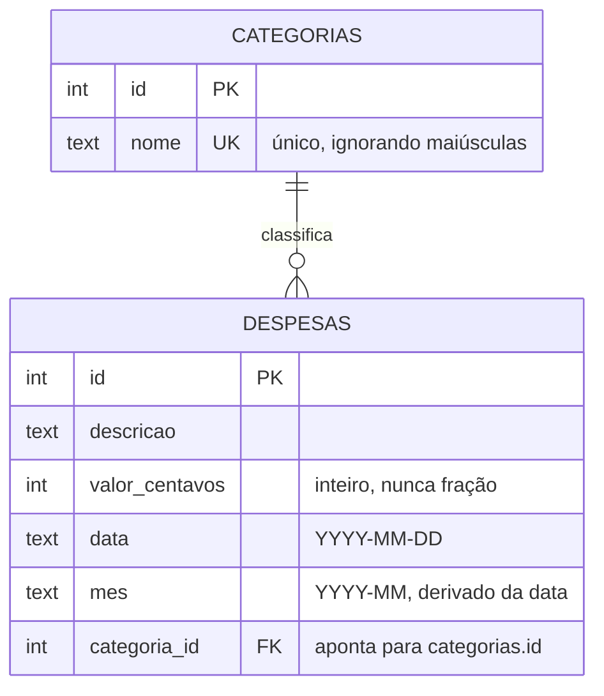

# Mini API — Controle de despesas

📦 Módulos 03–09 · 🔌 porta 6003 · 💾 SQLite

## O problema

No fim do mês a pergunta é sempre a mesma: **para onde foi o dinheiro?** Quem
tenta responder olhando o extrato do banco recebe uma lista de lojas, não uma
resposta — "R$ 248,90 no supermercado" e "R$ 42,50 na cantina" são a mesma
pergunta respondida duas vezes pela metade.

O que resolve é lançar cada gasto numa **categoria** e, no fim do mês, somar por
categoria. A API precisa então de duas coisas: um lugar para guardar os
lançamentos que não esqueça nada, e uma forma de responder "quanto gastei em
agosto, por categoria" sem que ninguém precise abrir uma planilha.

---

## Como funciona

Esta seção descreve o mecanismo. Não tem nome de biblioteca aqui de propósito:
guardar e somar dinheiro é um problema que existe antes de qualquer ferramenta,
e quem entende o mecanismo escolhe a ferramenta depois.

### Por que os dados não podem morar na memória do programa

Um programa guarda seus dados na memória enquanto está rodando. Quando ele é
reiniciado — deploy, queda de luz, atualização do sistema — essa memória é
zerada. Para uma API de eventos que dura uma tarde isso é aceitável; para um
controle de gastos é fatal, porque o valor da coisa está **justamente** no que
foi lançado meses atrás.

Daí a necessidade de um **banco de dados**: um programa separado, cuja função é
escrever os dados em disco de um jeito que sobreviva ao reinício e que permita
perguntar por eles depois. Persistir aqui não é sofisticação, é requisito — é a
primeira coisa que a API precisa antes de fazer qualquer outra.

### Como dinheiro é guardado de verdade: centavos inteiros

A tentação é guardar `12.34`. Números com casas decimais no computador são
**ponto flutuante**: uma representação aproximada, porque o computador soma em
base 2 e frações como 0,1 não têm representação exata em base 2, do mesmo jeito
que 1/3 não tem representação exata em base 10.

A conta que mostra o problema roda em qualquer linguagem:

```bash
node -e "console.log(0.1 + 0.2)"
0.30000000000000004
```

Uma diferença de 0,00000000000000004 parece irrelevante — e é, num lançamento.
O problema é que ela **se acumula**: um extrato com centenas de lançamentos
acumula centenas de resíduos, e o total do mês fecha um centavo abaixo (ou
acima) da soma que a pessoa faz na calculadora. Todo mês. Sem que ninguém
consiga apontar qual linha está errada, porque nenhuma está.

A solução é não usar fração nenhuma: **o valor é guardado como número inteiro de
centavos**. R$ 12,34 vira `1234`. Somar inteiros é exato — 10 + 20 dá 30, sempre
—, e a única divisão por 100 acontece no último instante, quando o número vai
ser mostrado. O usuário continua digitando reais; a conversão acontece na
entrada e na saída, em um lugar só.

### Uma categoria, muitas despesas: a relação 1-N

Em palavras, antes de qualquer tabela: **uma categoria tem muitas despesas, e
cada despesa pertence a exatamente uma categoria**. Isso se chama relação
**1-N** (um para muitos).

O jeito ingênuo de modelar isso é escrever o nome da categoria dentro de cada
despesa. Funciona até alguém digitar "Alimentacao", "alimentação" e "Alimentaçao"
— e o relatório passa a ter três categorias que são a mesma coisa, com o total
dividido entre elas.

O jeito que funciona é ter as categorias numa lista própria, cada uma com um
número que a identifica, e guardar em cada despesa **apenas esse número**. Esse
número guardado do lado "muitos" é a **chave estrangeira**: um campo que só
aceita valores que existem do outro lado. O nome "Alimentação" passa a estar
escrito num lugar só — corrigir um erro de digitação corrige o relatório inteiro
—, e uma despesa apontando para uma categoria inexistente é recusada na hora da
gravação, em vez de virar uma linha órfã que some silenciosamente do relatório.



### Por que a soma é feita pelo banco, e não pelo programa

"Quanto gastei em agosto, por categoria" é, em essência, duas operações:
**agrupar** as linhas que têm a mesma categoria e **somar** o valor dentro de
cada grupo. É exatamente isso que a linguagem de consulta do banco chama de
`GROUP BY` (agrupa as linhas por um campo) e `SUM` (soma um campo dentro de cada
grupo).

Nada impede fazer isso do lado do programa: pedir todas as despesas de agosto e
somar num laço. A resposta é a mesma. O custo é que não é: com 50 lançamentos as
duas versões parecem iguais, e com 50 mil a versão do programa transporta 50 mil
linhas pela rede para descartar todas depois de somar — paga transporte de dado
que vai ser jogado fora.

Pedir a soma ao banco inverte isso: o trabalho acontece do lado do dado, e o que
viaja são as três ou quatro linhas do resultado. O princípio, em frase comum:
**quem tem os dados deve fazer a conta; a resposta viaja, os dados não.**

### O que é um índice

Sem ajuda, para achar as despesas de agosto o banco lê a tabela inteira e
verifica linha a linha — é procurar um assunto num livro sem sumário, folheando
tudo. Um **índice** é uma estrutura extra que o banco mantém ao lado da tabela,
ordenada por um campo, e que aponta direto para as linhas que têm cada valor. É
o sumário do livro.

O custo é o mesmo do sumário: ele ocupa espaço, e **toda alteração no livro
obriga a atualizar o sumário** — ou seja, cada gravação fica um pouco mais
lenta. Por isso não se indexa tudo: indexa-se o campo pelo qual você realmente
procura. Aqui esse campo é o mês, porque toda consulta pesada desta API começa
por ele.

### O que é uma migration, e por que ela mora no código

O banco começa vazio: não existem tabelas, colunas nem índices até alguém
criá-los. Se esse passo for feito à mão, uma vez, na máquina de quem escreveu a
API, ele não existe em lugar nenhum — e um clone novo do projeto, ou o servidor
onde a API vai rodar, começam com um banco que não serve para nada.

Uma **migration** é esse passo escrito em arquivo, versionado junto do código
que depende dele. Ela roda sozinha quando a API sobe e é **idempotente**: rodar
duas vezes tem o mesmo efeito de rodar uma, porque o que já foi aplicado fica
registrado. É o que faz `git clone` + rodar chegar sempre ao mesmo banco, sem
ninguém digitar comando nenhum.

---

## Rodar

```bash
node minis-apis/03-despesas/servidor.ts
```

Primeira execução — o banco não existe, e a API o cria e popula:

```text
Abrindo banco...
  migration aplicada: 001_categorias_e_despesas
  seed inserido (5 categorias)
Despesas em http://localhost:6003
Rotas: /categorias  /despesas  /relatorios/mensal?mes=YYYY-MM
```

Segunda execução em diante — a migration já está registrada e as categorias já
existem, então nada é recriado e os lançamentos continuam lá:

```text
Abrindo banco...
  seed não rodou: já existem 6 categorias
Despesas em http://localhost:6003
Rotas: /categorias  /despesas  /relatorios/mensal?mes=YYYY-MM
```

O arquivo do banco fica em `data/minis-03-despesas.sqlite`, que o `.gitignore`
já ignora. Apagar esse arquivo é o "reset de fábrica" desta API.

> **Atenção:** o Node imprime um `ExperimentalWarning` sobre SQLite na subida. É
> esperado — o módulo `node:sqlite` ainda está marcado como experimental no Node
> 24, e a API dele pode mudar entre versões maiores.

---

## Como ela foi construída

### 1. O banco antes de tudo: tabelas, chave estrangeira e seed

A primeira decisão foi o formato das duas tabelas, e ela já resolve dois
problemas de uma vez: `valor_centavos INTEGER` tira a fração de circulação, e
`REFERENCES categorias(id)` declara a chave estrangeira.

```sql
CREATE TABLE despesas (
  id             INTEGER PRIMARY KEY,
  descricao      TEXT    NOT NULL,
  valor_centavos INTEGER NOT NULL CHECK (valor_centavos > 0),
  data           TEXT    NOT NULL,
  mes            TEXT    NOT NULL,
  categoria_id   INTEGER NOT NULL REFERENCES categorias(id)
);
```

Declarar a chave estrangeira, porém, **não basta**: o SQLite só a verifica se a
conexão pedir. `PRAGMA` é um comando de configuração do SQLite, e este é por
**conexão**, não uma propriedade gravada no arquivo do banco:

```ts
db.exec('PRAGMA foreign_keys = ON');
```

A diferença entre ter e não ter a linha, medida no banco desta API:

```text
COM PRAGMA: FOREIGN KEY constraint failed
SEM PRAGMA: inseriu id 9
```

Sem o PRAGMA a linha órfã entra sem um pio, e o estrago só aparece meses depois
— num relatório que perde lançamentos, porque a despesa órfã não encontra
categoria para casar.

O `seed` (dado inicial) vem junto: sem nenhuma categoria não existe despesa
possível, e a API subiria inutilizável.

### 2. O relatório, que é o motivo de tudo isto existir

Escrito em SQL, o relatório é a pergunta do começo do README traduzida quase
palavra por palavra:

```sql
SELECT c.id   AS categoriaId,
       c.nome AS categoriaNome,
       SUM(d.valor_centavos) AS totalCentavos,
       COUNT(*)              AS lancamentos
  FROM despesas d
  JOIN categorias c ON c.id = d.categoria_id
 WHERE d.mes = ?
 GROUP BY c.id, c.nome
 ORDER BY totalCentavos DESC
```

O `JOIN` é o que permite ao resultado trazer o **nome** da categoria, que mora
na outra tabela — foi para isso que a despesa guardou só o número. E o `WHERE`
filtra as linhas **antes** do agrupamento, então o `SUM` só vê o mês pedido.

### 3. O índice, depois de saber qual é a consulta quente

Índice se cria para uma consulta que existe, não por precaução. Com o relatório
escrito, ficou claro qual é o filtro que aparece em toda consulta pesada:

```sql
CREATE INDEX idx_despesas_mes ON despesas(mes);
```

O banco confirma que usa o índice — `EXPLAIN QUERY PLAN` mostra o plano que ele
escolheu para uma consulta:

```text
EXPLAIN QUERY PLAN SELECT * FROM despesas WHERE mes = ?
SEARCH despesas USING INDEX idx_despesas_mes (mes=?)
```

`SEARCH ... USING INDEX` é o sumário em uso. Sem o índice a linha seria
`SCAN despesas`, que é o folhear do livro inteiro.

### 4. As camadas, para o SQL não vazar

Com o SQL funcionando, ele foi empurrado todo para um arquivo só:

```text
rotas.ts  →  servico.ts  →  repositorio.ts  →  SQLite
   HTTP        regras          o SQL
```

`repositorio.ts` é o único arquivo que escreve SQL. `servico.ts` recebe o
repositório como argumento e conhece apenas o contrato descrito em
`dominio.ts` — ele não sabe se do outro lado tem SQLite, Postgres ou um array.
`rotas.ts` não sabe nem que existe um repositório.

O ganho não é estético: as regras ("categoria inexistente é 404", "nome repetido
é 409") ficam num arquivo que pode ser lido e testado sem subir servidor nem
banco, e trocar o banco é reescrever um arquivo.

### 5. A borda do dinheiro

O último passo foi decidir onde reais viram centavos. A resposta é: nas duas
pontas de `rotas.ts`, e em nenhum outro lugar.

```ts
const reaisParaCentavos = (reais: number): number => Math.round(reais * 100);
const centavosParaReais = (centavos: number): number => centavos / 100;
```

O `Math.round` não é decoração: `12.34 * 100` dá `1233.9999999999998` em ponto
flutuante, e cortar a parte decimal em vez de arredondar perderia um centavo por
lançamento. Da conversão para dentro, todo número do sistema é inteiro — e o
nome do campo (`valorCentavos`) diz a unidade, para ninguém somar reais com
centavos por engano.

---

## Endpoints

| Método   | Rota                 | O que faz                                          | Status        |
| -------- | -------------------- | -------------------------------------------------- | ------------- |
| `GET`    | `/categorias`        | lista as categorias em ordem alfabética            | 200           |
| `POST`   | `/categorias`        | cria uma categoria — `{ nome }`                    | 201, 409, 422 |
| `GET`    | `/despesas`          | `?mes=2026-08&categoria=3&pagina=1&limite=20`      | 200, 422      |
| `POST`   | `/despesas`          | lança — `{ descricao, valor, data, categoriaId }`  | 201, 404, 422 |
| `GET`    | `/despesas/:id`      | uma despesa, já com o nome da categoria            | 200, 404, 422 |
| `DELETE` | `/despesas/:id`      | apaga                                              | 204, 404, 422 |
| `GET`    | `/relatorios/mensal` | `?mes=2026-08` → total por categoria e total geral | 200, 422      |

`valor` entra e sai **em reais** (`248.9`); o banco só vê centavos (`24890`).
Qualquer rota inexistente responde 404 no mesmo formato de erro das demais.

---

## As decisões e o porquê

### Dinheiro em `INTEGER` de centavos

**Alternativa descartada:** `REAL` (ponto flutuante), que é o tipo natural para
`12.34`. Custaria o centavo perdido descrito lá em cima — invisível por
lançamento, presente em todo fechamento de mês, e impossível de rastrear porque
nenhuma linha isolada está errada.

**Alternativa descartada:** guardar como texto (`"12.34"`), o que preserva o
valor exato. Custaria a soma: texto não soma no banco, e o relatório voltaria a
ser um laço no programa — perdendo justamente o que esta mini API existe para
mostrar.

### Uma coluna `mes` redundante

`mes` pode ser calculado a partir de `data` a qualquer momento, então guardá-lo é
redundância assumida.

**Alternativa descartada:** filtrar com `WHERE substr(data, 1, 7) = ?`. Funciona
e não gasta coluna, mas aplicar uma função à coluna impede o banco de usar um
índice comum sobre `data` — a consulta mais frequente da API voltaria a varrer a
tabela. Existe índice sobre expressão, mas aí toda consulta precisa repetir a
expressão exatamente igual para o índice valer, o que é fácil de errar.

O custo da coluna é o de toda redundância: dois campos que precisam concordar. A
proteção é derivá-la num lugar só (`servico.ts`, na criação), nunca aceitá-la do
cliente.

### Um índice só

**Alternativa descartada:** indexar também `categoria_id`, já que existe o filtro
`?categoria=3`. Ficou de fora porque índice não é grátis — espaço e escrita mais
lenta — e esse filtro nunca aparece sozinho: ele vem sempre junto do mês, que já
tem índice e já reduziu a busca a algumas dezenas de linhas. Indexar por
precaução é como comprar sumário para um livro de duas páginas.

### 422 para formato, 404 para categoria, 409 para nome repetido

Três recusas, três significados diferentes:

| Situação                                   | Status | Por quê                                                                |
| ------------------------------------------ | ------ | ---------------------------------------------------------------------- |
| `valor: "muito"`, campo faltando, sobrando | 422    | o servidor entendeu a requisição e recusa pelo **conteúdo** dos campos |
| `categoriaId: 99`                          | 404    | o campo é um inteiro válido; o **recurso apontado** é que não existe   |
| categoria "Educacao" cadastrada duas vezes | 409    | o corpo está perfeito; o **estado atual** dos dados é que não aceita   |

**Alternativa descartada:** 400 para tudo. Custaria ao cliente a capacidade de
reagir sem ler a mensagem — o 400 fica reservado para "não consegui nem ler o
corpo" (JSON quebrado), e é o que ele significa nesta API.

### O relatório usa `JOIN` interno

Categoria sem gasto no mês **não aparece** no relatório.

**Alternativa descartada:** `categorias LEFT JOIN despesas`, que traria toda
categoria, com zero quando não houve gasto. Ficou de fora porque um relatório de
gastos com linhas de R$ 0,00 é ruído, e porque o `LEFT JOIN` tem uma armadilha
que custa caro (veja a tabela abaixo). Se um dia a tela precisar das categorias
zeradas, ela já tem `GET /categorias` para cruzar.

### Migration com tabela de registro

**Alternativa descartada:** `CREATE TABLE IF NOT EXISTS` e pronto, sem registro
nenhum. Resolve a primeira migration e só ela: a segunda — a que altera uma
tabela que já existe e tem dados — não pode rodar duas vezes, e `IF NOT EXISTS`
não tem como saber se ela já rodou. A tabela `_migrations` guarda o nome do que
já foi aplicado, e é assim que ferramentas como o Prisma (módulo 10) funcionam
por dentro.

### Seed só quando a tabela está vazia

**Alternativa descartada:** `INSERT OR IGNORE` linha a linha, que também é
idempotente e é uma linha mais curto. A diferença aparece no dia em que alguém
apaga a categoria "Lazer" de propósito: o `OR IGNORE` a ressuscita no próximo
boot, e a pessoa apaga de novo, para sempre.

---

## Onde é fácil errar

| Sintoma                                                                               | Causa                                                                                                                                                                                                             |
| ------------------------------------------------------------------------------------- | ----------------------------------------------------------------------------------------------------------------------------------------------------------------------------------------------------------------- |
| Banco aceita `categoria_id: 999`, e o relatório passa a "perder" lançamentos          | faltou `PRAGMA foreign_keys = ON` **nesta conexão**. Ele não fica gravado no arquivo do banco: toda conexão nova precisa repetir a linha                                                                          |
| `{"erro":"Dados inválidos", ... "Unrecognized key: \"cor\""}` num corpo que parece ok | o schema recusa campo desconhecido. Se fosse ignorado em silêncio, quem digitou `nomes` em vez de `nome` receberia "campo obrigatório" sem entender                                                               |
| `{"campo":"valor","mensagem":"\`valor\` só aceita duas casas decimais"}`              | mandou `12.345`. Arredondar sem avisar seria pior: o extrato mostraria um valor que o usuário jura não ter lançado                                                                                                |
| `{"erro":"Categoria 99 não existe","status":404}` ao criar despesa                    | `categoriaId` aponta para categoria que não existe. Formato certo, recurso ausente — 404, não 422                                                                                                                 |
| Relatório do mês inteiro sai vazio depois de "só filtrar" a listagem                  | `?mes=2026-8` não casa com o formato `YYYY-MM` e vira 422; mês tem dois dígitos sempre                                                                                                                            |
| **Falso amigo:** `LEFT JOIN` que não trouxe as linhas sem par                         | o filtro foi para o `WHERE` (`WHERE d.mes = ?`). Lá ele descarta as linhas nulas que o `LEFT` acabou de criar, e o `LEFT JOIN` vira `INNER` em silêncio. Num `LEFT JOIN`, filtro da tabela da direita vai no `ON` |
| **Falso amigo:** somar `0.1 + 0.2` e comparar com `0.3` dá falso                      | ponto flutuante. Some centavos inteiros e divida por 100 **uma vez**, na saída                                                                                                                                    |
| **Falso amigo:** `?limite=20` comparado com número sem converter                      | query string é sempre texto; `"20"` não é `20`. Quem converte aqui é `z.coerce.number()`, no schema                                                                                                               |

---

## Testando

Todos os `curl` abaixo foram rodados contra um banco criado do zero, e a
resposta ao lado é a que voltou.

> **Atenção:** `curl -d '{"json":1}'` com **aspas simples** não funciona em
> `cmd.exe` nem no PowerShell — o `curl` do PowerShell é apelido de
> `Invoke-WebRequest`, que nem entende `-d`. No Windows, rode estes comandos no
> Git Bash usando `curl.exe`.

**Lista as categorias criadas pelo seed:**

```bash
curl.exe -s http://localhost:6003/categorias
```

```json
[
  { "id": 1, "nome": "Alimentação" },
  { "id": 4, "nome": "Lazer" },
  { "id": 3, "nome": "Moradia" },
  { "id": 5, "nome": "Saúde" },
  { "id": 2, "nome": "Transporte" }
]
```

**Cria uma categoria e tenta criá-la de novo com outra caixa (409):**

```bash
curl.exe -s -X POST http://localhost:6003/categorias \
  -H "Content-Type: application/json" -d '{"nome":"Educacao"}'
# {"id":6,"nome":"Educacao"}                                    [201]

curl.exe -s -X POST http://localhost:6003/categorias \
  -H "Content-Type: application/json" -d '{"nome":"educacao"}'
# {"erro":"Já existe uma categoria chamada \"Educacao\"","status":409}   [409]
```

**Campo inválido e campo desconhecido, na mesma resposta (422):**

```bash
curl.exe -s -X POST http://localhost:6003/categorias \
  -H "Content-Type: application/json" -d '{"nome":"X","cor":"azul"}'
```

```json
{
  "erro": "Dados inválidos",
  "status": 422,
  "detalhes": [
    { "campo": "nome", "mensagem": "`nome` precisa de 2+ caracteres" },
    { "campo": "(raiz)", "mensagem": "Unrecognized key: \"cor\"" }
  ]
}
```

**Lança uma despesa (201):**

```bash
curl.exe -s -X POST http://localhost:6003/despesas \
  -H "Content-Type: application/json" \
  -d '{"descricao":"Feira do mes","valor":248.9,"data":"2026-08-03","categoriaId":1}'
```

```json
{
  "id": 1,
  "descricao": "Feira do mes",
  "valor": 248.9,
  "data": "2026-08-03",
  "mes": "2026-08",
  "categoriaId": 1
}
```

`mes` não foi enviado: ele é derivado de `data` no servidor.

**Categoria que não existe (404) e valor com três casas (422):**

```bash
curl.exe -s -X POST http://localhost:6003/despesas \
  -H "Content-Type: application/json" \
  -d '{"descricao":"Cafe","valor":12.34,"data":"2026-08-20","categoriaId":99}'
# {"erro":"Categoria 99 não existe","status":404}                        [404]

curl.exe -s -X POST http://localhost:6003/despesas \
  -H "Content-Type: application/json" \
  -d '{"descricao":"Cafe","valor":12.345,"data":"2026-08-20","categoriaId":1}'
# {"erro":"Dados inválidos","status":422,
#  "detalhes":[{"campo":"valor","mensagem":"`valor` só aceita duas casas decimais"}]}   [422]
```

**Lista filtrando e paginando:**

```bash
curl.exe -s "http://localhost:6003/despesas?mes=2026-08&categoria=1&pagina=1&limite=1"
```

```json
{
  "pagina": 1,
  "limite": 1,
  "total": 2,
  "itens": [
    {
      "id": 2,
      "descricao": "Almoco de sexta",
      "valor": 42.5,
      "data": "2026-08-07",
      "mes": "2026-08",
      "categoriaId": 1
    }
  ]
}
```

`total` é a contagem sem paginação — é por ele que o cliente sabe que existe uma
página 2.

**Uma despesa com o nome da categoria (`JOIN`), e uma que não existe:**

```bash
curl.exe -s http://localhost:6003/despesas/4
# {"id":4,"descricao":"Aluguel","valor":1850,"data":"2026-08-10",
#  "mes":"2026-08","categoriaId":3,"categoria":"Moradia"}                [200]

curl.exe -s http://localhost:6003/despesas/999
# {"erro":"Despesa 999 não existe","status":404}                         [404]
```

**Apaga (204) e tenta apagar de novo (404):**

```bash
curl.exe -s -i -X DELETE http://localhost:6003/despesas/5 | head -1
# HTTP/1.1 204 No Content

curl.exe -s -X DELETE http://localhost:6003/despesas/5
# {"erro":"Despesa 5 não existe","status":404}                           [404]
```

**O relatório mensal — o ponto alto:**

```bash
curl.exe -s "http://localhost:6003/relatorios/mensal?mes=2026-08"
```

```json
{
  "mes": "2026-08",
  "totalGeral": 2221.4,
  "categorias": [
    { "categoriaId": 3, "categoria": "Moradia", "total": 1850, "lancamentos": 1 },
    { "categoriaId": 1, "categoria": "Alimentação", "total": 291.4, "lancamentos": 2 },
    { "categoriaId": 2, "categoria": "Transporte", "total": 80, "lancamentos": 1 }
  ]
}
```

`291.4` são os dois lançamentos de Alimentação (`248.90 + 42.50`) somados **em
centavos** dentro do banco: `24890 + 4250 = 29140`, dividido por 100 uma única
vez, na saída.

**A prova dos centavos**, com os dois números do começo do README lançados como
despesa (R$ 0,10 e R$ 0,20):

```bash
curl.exe -s "http://localhost:6003/relatorios/mensal?mes=2026-09"
# {"mes":"2026-09","totalGeral":0.3,
#  "categorias":[{"categoriaId":1,"categoria":"Alimentação","total":0.3,"lancamentos":2}]}

node -e "console.log(0.1 + 0.2)"
# 0.30000000000000004
```

**Mês ausente e mês malformado (422):**

```bash
curl.exe -s http://localhost:6003/relatorios/mensal
# {"erro":"Dados inválidos","status":422,
#  "detalhes":[{"campo":"mes","mensagem":"`mes` é obrigatório, no formato YYYY-MM"}]}   [422]

curl.exe -s "http://localhost:6003/relatorios/mensal?mes=agosto"
# {"erro":"Dados inválidos","status":422,
#  "detalhes":[{"campo":"mes","mensagem":"`mes` deve estar no formato YYYY-MM"}]}       [422]
```

---

## O que ficou de fora

| O que não tem                        | Por quê                                                                                                                                           |
| ------------------------------------ | ------------------------------------------------------------------------------------------------------------------------------------------------- |
| Login e dono da despesa              | são as despesas "de alguém", não "de todo mundo" — autenticação é o módulo 11                                                                     |
| `PATCH /despesas/:id`                | não acrescenta nada ao ponto da mini API; a mecânica de UPDATE parcial está no módulo 09                                                          |
| `DELETE /categorias/:id`             | apagar categoria com despesas exige decidir o que fazer com elas (`ON DELETE`), assunto de modelagem do módulo 09                                 |
| Testes automatizados                 | módulo 12 — o serviço já está pronto para isso, porque recebe o repositório em vez de importá-lo                                                  |
| Transações nas escritas              | toda escrita aqui é uma linha só, e o SQLite já a executa atomicamente. Transação aparece quando duas gravações precisam valer juntas (módulo 09) |
| Migration que altera tabela          | só existe a inicial; a segunda migration é o caso que justifica a tabela `_migrations`, explicado acima                                           |
| Relatório por período livre, gráfico | o `GROUP BY` por mês é o que ensina o conceito; o resto é variação da mesma consulta                                                              |

---

## Para estudar

| Módulo                                                                 | O que desta API vem dele                                            |
| ---------------------------------------------------------------------- | ------------------------------------------------------------------- |
| [03 — Express básico](../../docs/03-express-basico.md)                 | app, `express.json()`, rota e status                                |
| [04 — Roteamento](../../docs/04-roteamento.md)                         | `Router`, parâmetro de rota, query string                           |
| [05 — Middlewares](../../docs/05-middlewares.md)                       | `cors`, `morgan` e a ordem da pilha                                 |
| [06 — Tratamento de erros](../../docs/06-tratamento-de-erros.md)       | `AppError` e o tratador central de 4 parâmetros                     |
| [07 — Validação com Zod](../../docs/07-validacao-zod.md)               | schemas, `.strict()`, `z.coerce` e formato × regra de negócio       |
| [08 — Arquitetura em camadas](../../docs/08-arquitetura-em-camadas.md) | rotas → serviço → repositório e injeção de dependência              |
| [09 — SQLite e SQL](../../docs/09-sqlite-e-sql.md)                     | migrations, `?`, `JOIN`, `GROUP BY`, índices e `EXPLAIN QUERY PLAN` |
