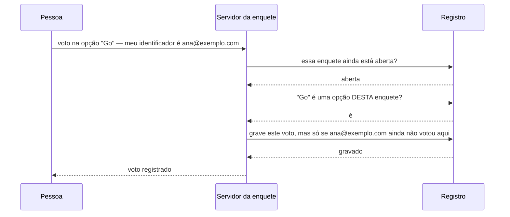

# Mini API — Enquetes com apuração

📦 Módulos 03–09, **sem o 07** · 🔌 porta 6004 · 💾 SQLite

## O problema

Alguém precisa decidir uma coisa com um grupo: o dia da retrospectiva, o lugar
da confraternização, a linguagem do próximo projeto. Perguntar no chat funciona
até a quinta resposta — aí ninguém sabe mais quem já respondeu, duas pessoas
escreveram a mesma opção com palavras diferentes, e quem chegou depois lê as
respostas anteriores antes de opinar.

Uma enquete resolve isso fixando três coisas: a pergunta é uma só, as opções são
um conjunto fechado, e cada pessoa entra na conta uma vez. O que a API precisa
saber, então, é menos do que parece: qual é a pergunta, quais são as opções,
quem já votou em quê, e se a votação ainda está aberta.

## Como funciona

### Uma enquete é uma lista de escolhas registradas

O mecanismo não tem nada de servidor. É uma folha de papel com a pergunta no
topo, as opções listadas embaixo, e — a parte que as pessoas esquecem — **uma
segunda folha, com uma linha por voto**: quem votou, em que opção, quando.

A tentação é não ter a segunda folha. Basta um numerozinho ao lado de cada
opção, e a cada voto você aumenta o número em um. Funciona, ocupa menos espaço,
e perde três coisas de uma vez:

- **Ninguém consegue votar uma vez só.** O contador não guarda quem votou, então
  não há como saber se esta pessoa já apareceu.
- **Ninguém consegue mudar de ideia.** Para tirar um voto de "Go" e pôr em
  "Python" é preciso saber que aquele voto era do Bruno — e o contador não sabe.
- **A conta não é conferível.** Se o número parece errado, não existe nada para
  recontar. Com a folha de votos, recontar é contar as linhas de novo.

Guardar um voto por linha é mais dado gravado em troca de poder responder
perguntas que o contador não responde. Daqui para frente, **contar é uma
consequência**, não um campo mantido à mão.

### Um voto por pessoa exige saber quem é a pessoa

"Cada um vota uma vez" só significa alguma coisa se houver um **identificador**:
um texto que represente a pessoa e que seja o mesmo nas duas tentativas. Aqui é
o e-mail; poderia ser a matrícula, o CPF, o apelido no chat.

Duas armadilhas aparecem nesse instante, e as duas são sobre o mesmo assunto —
identificadores que _parecem_ diferentes:

- `Ana@Exemplo.com` e `ana@exemplo.com` são a mesma pessoa e textos diferentes.
  Se o registro não normalizar antes de comparar, ela vota duas vezes trocando
  uma letra de caixa.
- Qualquer pessoa pode **escrever** um identificador. Esta API acredita em quem
  se apresenta: a identidade é declarada, não provada. É a diferença entre uma
  enquete e uma urna, e ela não é um detalhe de implementação — é o que a coisa
  é. Provar identidade é autenticação, e tem módulo próprio (o 11).

Note também o que se perdeu ao guardar quem votou em quê: **o voto não é
secreto.** Quem tem acesso ao registro sabe a escolha de cada pessoa. Voto
secreto de verdade é um mecanismo diferente — o registro guarda _que_ fulano
votou, sem guardar _em quê_ —, e ele custa exatamente a funcionalidade de
"trocar meu voto", porque ninguém mais sabe qual voto era seu.

### A votação tem um fim, e o fim serve para alguma coisa

Enquanto a enquete está aberta, o resultado é uma fotografia que muda. Encerrar
é dizer "a partir daqui a fotografia é final": nenhum voto novo entra, nenhum
voto antigo sai. Sem esse momento, todo resultado anunciado pode ser
desmentido cinco minutos depois — e um resultado que ainda muda depois de
anunciado não é um resultado, é um placar parcial.

Encerrar também é **irreversível de propósito**. Reabrir uma votação depois de
ver o placar é a forma mais simples de fraudar uma decisão: quem ficou em
segundo lugar chama mais gente e a enquete "continua". Uma vez fechada, fechada.

### Apurar é contar e transformar em fração

A apuração responde uma pergunta só: quantas linhas da folha de votos apontam
para cada opção. Três detalhes decidem se a resposta é honesta:

- **Opção com zero voto tem que aparecer.** Ela some se a contagem partir da
  folha de votos, porque não há linha nenhuma para ela. Partir da lista de
  opções e contar quantos votos cada uma atraiu — inclusive nenhum — é o que faz
  "Python: 0" aparecer no lugar de Python sumir do resultado.
- **Percentual não fecha em 100.** Três votos em três opções dão 33,3% cada, e
  33,3 × 3 = 99,9. Não é bug de arredondamento a corrigir: é o que acontece ao
  escrever um terço em decimal. Forçar o fechamento exigiria mentir em uma das
  linhas.
- **Empate é comum, não é exceção.** Com poucos votos, duas opções na frente é o
  caso normal. Uma apuração que devolve "a vencedora" sempre — a primeira da
  lista, digamos — anuncia uma vitória que não aconteceu.

### O caminho de um voto, de ponta a ponta



A última troca é a que carrega o desenho inteiro. A pergunta "essa pessoa já
votou?" **não é feita antes** e respondida em separado: ela vai junto com a
ordem de gravar, e quem decide é o registro, no momento da escrita. O motivo
aparece quando duas requisições da mesma pessoa chegam ao mesmo tempo: se a
pergunta fosse feita antes, as duas ouviriam "ainda não votou" e as duas
gravariam.

## Rodar

```bash
node minis-apis/04-enquetes/servidor.ts
```

Sem instalação e sem variável de ambiente. Na primeira execução o banco é criado
e populado:

```
Abrindo banco...
  migration aplicada: 001_enquetes_opcoes_votos
  seed inserido (2 enquetes)
Enquetes em http://localhost:6004
Rotas: /enquetes  /enquetes/:id/votos  /enquetes/:id/resultado
```

O arquivo fica em `data/minis-04-enquetes.sqlite`. Apagá-lo e subir de novo
devolve o estado inicial: duas enquetes, uma aberta e uma encerrada.

> **Atenção:** `node:sqlite` ainda é marcado como experimental pelo Node, então
> aparece um `ExperimentalWarning` no terminal. É esperado — a API é estável o
> bastante para estudo, e não há dependência a instalar em troca.

## Como ela foi construída

### 1. As três tabelas, e a decisão que veio antes delas

Antes de qualquer rota: onde o voto mora. A escolha de guardar **uma linha por
voto** (em vez de um contador em cada opção) é o que dá forma ao resto — sem
ela, não haveria como impedir o voto repetido nem como retirar um voto.

```sql
CREATE TABLE votos (
  id         INTEGER PRIMARY KEY,
  enquete_id INTEGER NOT NULL REFERENCES enquetes(id) ON DELETE CASCADE,
  opcao_id   INTEGER NOT NULL REFERENCES opcoes(id)   ON DELETE CASCADE,
  eleitor    TEXT    NOT NULL,
  votado_em  TEXT    NOT NULL DEFAULT (...)
);
CREATE UNIQUE INDEX idx_votos_um_por_eleitor ON votos(enquete_id, eleitor);
```

`REFERENCES` é a **chave estrangeira**: a coluna aponta para a linha de outra
tabela, e o banco recusa um valor que não exista lá. `ON DELETE CASCADE` diz o
que fazer quando a linha apontada morre — aqui, morrer junto, para não sobrar
voto pendurado numa enquete apagada.

O **índice único** é a regra "um voto por pessoa por enquete" escrita como
restrição do banco: duas linhas com o mesmo par `(enquete_id, eleitor)` não
entram. E é por causa dele que `enquete_id` existe na tabela de votos, mesmo
sendo derivável a partir de `opcao_id` — uma restrição só pode falar de colunas
que estão na mesma linha.

### 2. As camadas, para o SQL não vazar

Três arquivos, cada um com uma responsabilidade (módulo 08): `rotas.ts` lê a
requisição e escolhe o status, `servico.ts` decide o que pode acontecer, e
`repositorio.ts` é o **único** que escreve SQL. O serviço conversa com um tipo
declarado em `dominio.ts`, não com o SQLite:

```ts
const voto = await repositorio.registrarVoto(enqueteId, opcaoId, eleitor);
if (voto) return voto;
// null significa: o índice único recusou
```

Repare no que o repositório devolve. Ele não lança "409 Conflict" — status HTTP
é vocabulário da borda, e o repositório não deveria conhecer HTTP. Ele relata o
fato (`null` = a restrição recusou) e quem traduz isso para um status é o
serviço. Trocar SQLite por Postgres muda um arquivo.

### 3. A validação, escrita à mão

Aqui está a diferença desta mini API para a [`03-despesas`](../03-despesas/): não
há Zod. Escrever o validador na mão mostra o que uma biblioteca de schema
realmente faz — e o primeiro problema que ela resolve não é conferir tipo, é
**juntar os erros**.

```ts
// ❌ Um erro por requisição: o usuário corrige, reenvia e leva a mesma recusa
if (typeof body.pergunta !== 'string') throw erro('pergunta inválida');
if (!Array.isArray(body.opcoes)) throw erro('opcoes inválido');
```

Um `if` que devolve na primeira falha esconde a segunda. Quem mandou o formulário
com três campos errados descobre um, corrige, e é recusado de novo — três
viagens para um problema só. Por isso as checagens **anotam e seguem**, e só no
fim o acumulado é lançado:

```ts
const coletor = new Coletor();
const pergunta = coletor.texto(objeto.pergunta, 'pergunta', { min: 5, max: 200 });
const opcoes = coletor.listaDeTextos(objeto.opcoes, 'opcoes', {
  min: 2,
  max: 8,
  itemMax: 80,
});
coletor.fechar(); // lança 422 com a lista inteira, se houver
```

O custo aparece na assinatura de cada função: `lerNovaEnquete` declara à mão que
devolve `{ pergunta, opcoes }`. É a terceira coisa que a biblioteca faria — o
tipo TypeScript sair do próprio schema — e é a que não dá para ter sem ela. O
módulo 07 é essa terceira parte.

### 4. Quem está votando não é campo do formulário

O voto precisa de duas informações de naturezas diferentes: **o que** foi
escolhido e **quem** escolheu. A primeira é conteúdo do pedido; a segunda é
contexto de quem pede. Elas entram por lugares diferentes:

```ts
router.use('/enquetes/:id/votos', identificarEleitor); // lê o cabeçalho X-Eleitor
```

Um **cabeçalho** é um campo de metadados da requisição, ao lado do corpo e
separado dele. Colocar a identidade ali deixa o corpo (`{ "opcaoId": 8 }`) igual
para todo mundo, e concentra "quem é essa pessoa" num middleware (módulo 05) —
exatamente o ponto onde um token de autenticação entraria no módulo 11, sem
tocar em rota, serviço ou banco.

### 5. A apuração, feita pelo banco

```sql
SELECT o.id, o.texto, COUNT(v.id) AS votos
  FROM opcoes o
  LEFT JOIN votos v ON v.opcao_id = o.id
 WHERE o.enquete_id = ?
 GROUP BY o.id, o.texto
 ORDER BY votos DESC
```

`GROUP BY` junta as linhas que compartilham a mesma opção num grupo só, e
`COUNT` devolve um número por grupo. `LEFT JOIN` significa "traga todas as
opções, mesmo as que não casarem com voto nenhum" — é o que faz a opção com zero
aparecer no resultado.

A soma acontece ao lado do dado: o que viaja de volta são três linhas, não os
três mil votos que as originaram. Percentual e empate são calculados em
JavaScript depois, sobre essas três linhas — o que era caro já foi feito.

## Endpoints

| Método   | Rota                         | O que faz                                            | Status             |
| -------- | ---------------------------- | ---------------------------------------------------- | ------------------ |
| `GET`    | `/enquetes`                  | lista; `?estado=abertas\|encerradas&pagina=&limite=` | 200, 422           |
| `POST`   | `/enquetes`                  | cria com 2 a 8 opções                                | 201, 400, 422      |
| `GET`    | `/enquetes/:id`              | a cédula: pergunta e opções, sem os números          | 200, 404, 422      |
| `DELETE` | `/enquetes/:id`              | apaga a enquete, as opções e os votos                | 204, 404           |
| `POST`   | `/enquetes/:id/encerramento` | encerra a votação, uma vez só                        | 200, 404, 409      |
| `POST`   | `/enquetes/:id/votos`        | vota; exige `X-Eleitor` e `{ "opcaoId": N }`         | 201, 404, 409, 422 |
| `DELETE` | `/enquetes/:id/votos`        | retira o voto de quem está no `X-Eleitor`            | 204, 404, 409      |
| `GET`    | `/enquetes/:id/resultado`    | apuração com percentual, vencedora e empate          | 200, 404           |

As três recusas, e o que separa uma da outra:

| Status | Significa                                       | Exemplo aqui                        |
| ------ | ----------------------------------------------- | ----------------------------------- |
| `422`  | entendi o pedido e o **conteúdo** é inválido    | `opcoes` com um item só             |
| `404`  | o recurso apontado **não existe**               | opção de outra enquete              |
| `409`  | o pedido está perfeito, o **estado** é que nega | enquete encerrada; eleitor já votou |

## As decisões e o porquê

### Voto é linha; contador foi descartado

A alternativa era uma coluna `votos` em `opcoes`, somando 1 a cada voto. Custaria
uma escrita em vez de uma inserção e economizaria a tabela inteira — e pagaria
com as três funcionalidades que a mini API tem: unicidade por pessoa, retirada de
voto e recontagem. Um contador também sofre de **atualização perdida**: dois
votos simultâneos leem 7, somam 1, e gravam 8 os dois. Linha somada é linha
somada.

### A unicidade é do índice; a checagem no serviço foi descartada

O caminho natural seria `SELECT` para ver se o eleitor já votou e, se não,
`INSERT`. Entre as duas frases cabe uma requisição inteira: dois cliques rápidos
passam os dois pelo `SELECT` e gravam dois votos. O índice único não tem essa
janela porque decide na escrita. O código então **tenta inserir e trata a
recusa**:

```ts
if ((erro as { errcode?: number }).errcode === ERRO_UNIQUE) return null;
throw erro; // qualquer outro erro é bug nosso e vira 500
```

O custo é depender de um código numérico do SQLite (`2067`) e de um `catch`
estreito — um `catch` que devolvesse `null` para qualquer erro transformaria
"coluna inexistente" em "você já votou", e o bug ficaria invisível.

### `X-Eleitor` no cabeçalho; campo no corpo foi descartado

`{ "opcaoId": 8, "eleitor": "ana@..." }` funcionaria e é uma linha mais curta. O
que se perde é a fronteira: identidade viraria conteúdo editável do formulário,
espalhada por dois handlers, e no dia da autenticação de verdade os dois
handlers mudariam. No cabeçalho, ela é resolvida uma vez, por um middleware, e a
troca por um token é a troca desse middleware.

O `DELETE` do voto vai junto na decisão: a rota é `/enquetes/:id/votos`, sem o
eleitor na URL. Um `/votos/ana@exemplo.com` deixaria qualquer pessoa apagar o
voto alheio, e ainda escreveria o e-mail no log de todo proxy no caminho.

### `POST /encerramento`; `PATCH` com `{ "encerrada": true }` foi descartado

O `PATCH` genérico é mais "REST bonito" e abre uma porta que não fecha: quem pode
escrever `true` pode escrever `false` e reabrir a votação. Encerrar não é editar
um campo, é uma ação com regra própria — uma vez só, sem volta —, e ela ganha uma
rota que só sabe fazer isso.

### Validação à mão; Zod foi descartado (de propósito)

A [`02-inscricoes`](../02-inscricoes/) e a [`03-despesas`](../03-despesas/) usam
Zod, e num projeto de verdade é o que se faz. Aqui a biblioteca sai para que o
mecanismo apareça: o coletor de erros, o valor de descarte, a checagem de campo
desconhecido, a conversão de query string. São ~90 linhas para fazer o que um
schema faz em 10 — e sem o tipo TypeScript de brinde. Essa comparação é o
conteúdo da decisão.

### Filtro por `?estado=`; rota `/enquetes/abertas` foi descartada

`/enquetes/abertas` casaria com `/enquetes/:id`, e como o `:id` daqui é numérico
a resposta seria um 422 dizendo que "abertas" não é inteiro. Ordem de registro
resolveria (módulo 04), ao custo de uma palavra reservada para sempre: no dia em
que um identificador puder ser texto, `abertas` já não pode ser um deles.

### Duas subconsultas na listagem; dois `LEFT JOIN` foram descartados

Trazer o total de opções e o total de votos de uma vez com dois `JOIN` parece
mais rápido — e produz o **produto** das duas listas: 3 opções × 4 votos = 12
linhas, e `COUNT` passa a contar 12. A subconsulta responde uma pergunta por vez
e cada resposta continua certa.

### O resultado parcial é público

Mostrar o placar de uma enquete aberta influencia quem ainda não votou — o efeito
manada é real e conhecido. Esconder até o encerramento seria mais correto e
tiraria da mini API o endpoint mais interessante para exercitar. O meio-termo é
declarar: o resultado traz `"parcial": true` enquanto a votação está aberta, e o
cliente sabe que aquele número ainda muda.

## Onde é fácil errar

| Sintoma                                                   | Causa                                                                                                                               |
| --------------------------------------------------------- | ----------------------------------------------------------------------------------------------------------------------------------- |
| Opção que ninguém votou aparece com **1 voto**            | `COUNT(*)` no `LEFT JOIN` conta a linha que o próprio join criou, com as colunas de voto nulas. `COUNT(v.id)` ignora nulo e dá 0.   |
| Opção que ninguém votou **some** do resultado             | `JOIN` interno em vez de `LEFT JOIN`: sem linha em `votos`, não há par para casar.                                                  |
| Apaguei a enquete e os votos continuam no banco           | `PRAGMA foreign_keys = ON` esquecido. Ele é **por conexão**; sem ele o `ON DELETE CASCADE` não dispara.                             |
| `?limite=` vazio devolve lista vazia, sem erro            | `Number('')` é **`0`**, não `NaN`. Falso amigo: a checagem "é número?" passa, e o `LIMIT 0` devolve nada.                           |
| `?pagina=1&pagina=2` responde "não é inteiro"             | Chave repetida na query vira **array**, não texto. `Number(['1','2'])` é `NaN`, e a mensagem sai errada se o array não for tratado. |
| A mesma pessoa votou duas vezes                           | Identificador não normalizado: `Ana@X.com` e `ana@x.com` são textos diferentes, e o índice único compara texto.                     |
| Dois cliques rápidos gravaram dois votos                  | `SELECT` antes do `INSERT`. A garantia tem que estar na escrita — índice único —, não numa pergunta feita antes.                    |
| O voto foi gravado com o eleitor **vazio**                | `router.use(...)` do middleware registrado **depois** das rotas de voto: middleware só vale para o que vem abaixo dele.             |
| Corpo `["A"]` passou pela checagem de "é objeto?"         | `typeof [] === 'object'` em JavaScript. Sem `Array.isArray`, um array entra como corpo válido de campo nenhum.                      |
| Encerrar duas vezes ao mesmo tempo sobrescreveu o horário | `SELECT` para ver se está aberta e `UPDATE` depois. O `WHERE ... AND encerrada_em IS NULL` põe a regra dentro do próprio `UPDATE`.  |
| Data volta como `Invalid Date` no cliente                 | `datetime('now')` devolve `2026-08-19 00:34:09`, com espaço e sem fuso — não é ISO-8601. Daí o `strftime` com `T` e `Z`.            |

## Testando

> **Atenção:** `curl -d '{"json":1}'` com aspas simples não funciona no
> PowerShell nem no `cmd.exe` — as aspas simples não delimitam string ali. Use o
> Git Bash (com `curl.exe`), ou o aviso do módulo 01 para adaptar. As saídas
> abaixo foram capturadas em Git Bash, com o banco recém-criado, na ordem em que
> aparecem.

**1. As enquetes abertas** (a encerrada do seed fica de fora)

```bash
curl.exe -s "http://localhost:6004/enquetes?estado=abertas"
```

```json
{
  "pagina": 1,
  "limite": 20,
  "total": 1,
  "itens": [
    {
      "id": 1,
      "pergunta": "Qual dia da semana para a retrospectiva do time?",
      "estado": "aberta",
      "criadaEm": "2026-08-19T00:33:52Z",
      "encerradaEm": null,
      "totalOpcoes": 3,
      "totalVotos": 3
    }
  ]
}
```

**2. Criar uma enquete** → `201`

```bash
curl.exe -s -X POST http://localhost:6004/enquetes \
  -H 'Content-Type: application/json' \
  -d '{"pergunta":"Qual linguagem no proximo projeto interno?","opcoes":["TypeScript","Go","Python"]}'
```

```json
{
  "id": 3,
  "pergunta": "Qual linguagem no proximo projeto interno?",
  "estado": "aberta",
  "criadaEm": "2026-08-19T00:34:09Z",
  "encerradaEm": null,
  "opcoes": [
    { "id": 7, "texto": "TypeScript" },
    { "id": 8, "texto": "Go" },
    { "id": 9, "texto": "Python" }
  ]
}
```

**3. Votar** → `201`

```bash
curl.exe -s -X POST http://localhost:6004/enquetes/3/votos \
  -H 'Content-Type: application/json' -H 'X-Eleitor: ana@exemplo.com' \
  -d '{"opcaoId":7}'
```

```json
{
  "id": 8,
  "opcaoId": 7,
  "eleitor": "ana@exemplo.com",
  "votadoEm": "2026-08-19T00:34:09Z"
}
```

**4. A mesma pessoa, com outra caixa no e-mail** → `409`

```bash
curl.exe -s -X POST http://localhost:6004/enquetes/3/votos \
  -H 'Content-Type: application/json' -H 'X-Eleitor: ANA@Exemplo.com' \
  -d '{"opcaoId":8}'
```

```json
{ "erro": "ana@exemplo.com já votou nesta enquete (opção 7)", "status": 409 }
```

**5. Votar numa opção que é de outra enquete** → `404`

A opção `1` existe — pertence à enquete `1`. Para a URL `/enquetes/3`, ela não
existe.

```bash
curl.exe -s -X POST http://localhost:6004/enquetes/3/votos \
  -H 'Content-Type: application/json' -H 'X-Eleitor: bruno@exemplo.com' \
  -d '{"opcaoId":1}'
```

```json
{ "erro": "A opção 1 não existe na enquete 3", "status": 404 }
```

**6. Votar sem o cabeçalho** → `422`

```bash
curl.exe -s -X POST http://localhost:6004/enquetes/1/votos \
  -H 'Content-Type: application/json' -d '{"opcaoId":2}'
```

```json
{
  "erro": "Dados inválidos",
  "status": 422,
  "detalhes": [
    { "campo": "X-Eleitor", "mensagem": "`X-Eleitor` é obrigatório e precisa ser texto" }
  ]
}
```

**7. Três erros numa resposta só** → `422`

Pergunta curta, uma opção só, e um campo que a API não conhece — os três voltam
juntos, que é o ponto do coletor.

```bash
curl.exe -s -X POST http://localhost:6004/enquetes \
  -H 'Content-Type: application/json' \
  -d '{"pergunta":"oi","opcoes":["A"],"vagas":999}'
```

```json
{
  "erro": "Dados inválidos",
  "status": 422,
  "detalhes": [
    { "campo": "vagas", "mensagem": "campo desconhecido `vagas`" },
    { "campo": "pergunta", "mensagem": "`pergunta` precisa de 5+ caracteres" },
    { "campo": "opcoes", "mensagem": "`opcoes` precisa ter de 2 a 8 itens" }
  ]
}
```

**8. O falso amigo do `Number('')`** → `422`

```bash
curl.exe -s "http://localhost:6004/enquetes?limite="
```

```json
{
  "erro": "Dados inválidos",
  "status": 422,
  "detalhes": [{ "campo": "limite", "mensagem": "`limite` veio vazio" }]
}
```

**9. Resultado com empate** (dois votos, duas opções na frente) → `200`

```bash
curl.exe -s http://localhost:6004/enquetes/3/resultado
```

```json
{
  "id": 3,
  "estado": "aberta",
  "parcial": true,
  "totalVotos": 2,
  "opcoes": [
    { "id": 7, "texto": "TypeScript", "votos": 1, "percentual": 50 },
    { "id": 8, "texto": "Go", "votos": 1, "percentual": 50 },
    { "id": 9, "texto": "Python", "votos": 0, "percentual": 0 }
  ],
  "vencedora": null,
  "empate": ["TypeScript", "Go"]
}
```

`"vencedora": null` com `empate` preenchido, e a opção de zero voto presente com
`0` — os dois pontos da apuração, visíveis na mesma resposta.

**10. Encerrar e tentar votar depois** → `200`, depois `409`

```bash
curl.exe -s -X POST http://localhost:6004/enquetes/3/encerramento
curl.exe -s -X POST http://localhost:6004/enquetes/3/votos \
  -H 'Content-Type: application/json' -H 'X-Eleitor: diego@exemplo.com' \
  -d '{"opcaoId":9}'
```

```json
{ "id": 3, "estado": "encerrada", "encerradaEm": "2026-08-19T00:34:22Z" }
```

```json
{ "erro": "A enquete 3 foi encerrada em 2026-08-19T00:34:22Z", "status": 409 }
```

Retirar um voto depois do encerramento leva a mesma recusa: `409`, com "a enquete
3 foi encerrada e não muda mais".

**11. O resultado final** — com o terceiro voto que entrou antes de fechar, o
empate se desfaz e o percentual passa a somar 100,0:

```json
{
  "parcial": false,
  "totalVotos": 3,
  "opcoes": [
    { "texto": "TypeScript", "votos": 2, "percentual": 66.7 },
    { "texto": "Go", "votos": 1, "percentual": 33.3 },
    { "texto": "Python", "votos": 0, "percentual": 0 }
  ],
  "vencedora": "TypeScript",
  "empate": []
}
```

## O que ficou de fora

| O que falta                         | Por quê                                                                                                                   | Onde se resolve |
| ----------------------------------- | ------------------------------------------------------------------------------------------------------------------------- | --------------- |
| Identidade **provada**              | `X-Eleitor` é declarado: qualquer um manda outro nome e vota de novo. É enquete, não urna.                                | módulo 11       |
| Dono da enquete                     | Qualquer pessoa encerra ou apaga qualquer enquete. Sem login não há dono para comparar.                                   | módulo 11       |
| Validação com schema                | O validador à mão existe para mostrar o mecanismo; ele não infere tipo e cresce mal.                                      | módulo 07       |
| Testes automatizados                | Cada caminho aqui foi conferido com `curl` na mão — o que não protege contra a próxima alteração.                         | módulo 12       |
| Limite de requisições               | Nada impede mil votos por segundo com mil identificadores inventados.                                                     | módulo 13       |
| Log estruturado                     | `morgan('dev')` é bonito no terminal e inútil para investigar um caso específico depois.                                  | módulo 14       |
| ORM                                 | O SQL aqui é escrito e mantido à mão, de propósito.                                                                       | módulo 10       |
| Voto secreto                        | O registro guarda quem votou em quê. Anonimizar exige um desenho diferente — e custa a retirada de voto.                  | —               |
| Múltipla escolha e prazo automático | "Escolha até 3" e "fecha sozinha na sexta" são variações do mesmo mecanismo; nenhuma acrescenta conceito novo à mini API. | —               |

## Para estudar

| Módulo                                                                 | O que desta API vem de lá                                           |
| ---------------------------------------------------------------------- | ------------------------------------------------------------------- |
| [03 — Express básico](../../docs/03-express-basico.md)                 | `app`, `express.json()`, `listen`                                   |
| [04 — Roteamento](../../docs/04-roteamento.md)                         | `Router`, parâmetro de rota, sub-recurso, por que `?estado=`        |
| [05 — Middlewares](../../docs/05-middlewares.md)                       | `cors`, `morgan` e o `identificarEleitor` com escopo de rota        |
| [06 — Tratamento de erros](../../docs/06-tratamento-de-erros.md)       | `AppError`, tratador central, 422 × 404 × 409                       |
| [08 — Arquitetura em camadas](../../docs/08-arquitetura-em-camadas.md) | rotas → serviço → repositório, e o contrato no meio                 |
| [09 — SQLite e SQL](../../docs/09-sqlite-e-sql.md)                     | migration, chave estrangeira, índice único, `LEFT JOIN`, `GROUP BY` |
| [07 — Validação com Zod](../../docs/07-validacao-zod.md)               | o que `validacao.ts` faz à mão — leia depois, para comparar         |
