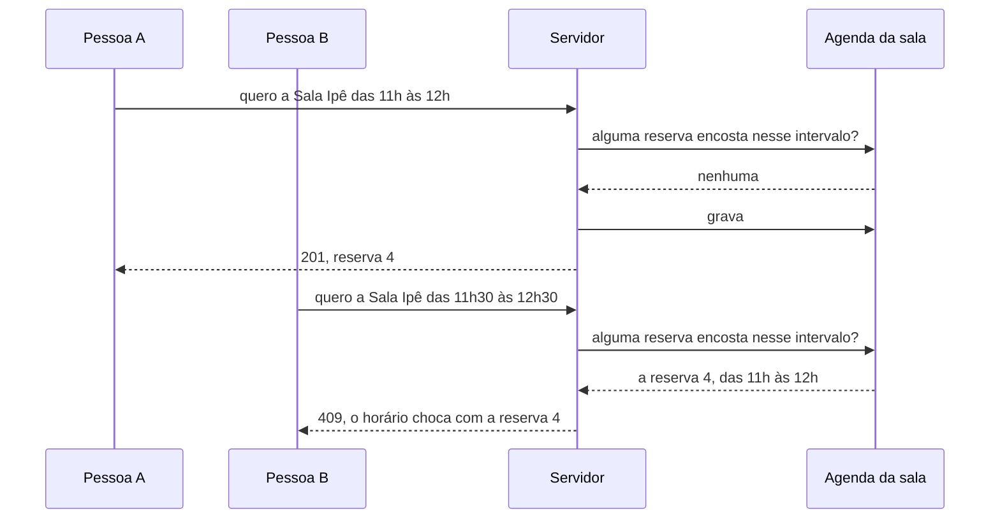

# Mini API — Reserva de salas

📦 Módulos 03–07 · 🔌 porta 6005 · 💾 memória

## O problema

Um prédio tem três salas de reunião e muita gente querendo usá-las. Quem precisa
de uma sala quer duas coisas: saber quando ela está livre e garantir um pedaço
do dia para si — e a segunda parte é onde o problema aparece, porque duas pessoas
podem pedir o mesmo pedaço no mesmo minuto e as duas acharem que conseguiram.

Para resolver isso o sistema precisa saber quem pegou a sala, de quando até
quando, e responder uma pergunta antes de gravar qualquer coisa: este pedaço de
tempo já pertence a alguém? É uma API de agenda, e agenda é sobre intervalos, não
sobre horários soltos.

## Como funciona

### Uma agenda não guarda "ocupado", guarda intervalos

A intuição errada é imaginar a sala com um interruptor: livre ou ocupada. Se
fosse isso, o sistema teria um campo por sala e por horário — e alguém teria que
decidir qual é a menor fatia de tempo que existe, virar o interruptor de cada
fatia quando a reunião é marcada e desvirar quando é cancelada.

O que existe de verdade é mais simples: uma lista de reservas, cada uma com um
começo e um fim. **Livre não é um dado, é o que sobra.** Não há nenhum registro
dizendo que a Sala Ipê está livre às 14h; há três reservas, e nenhuma delas cobre
as 14h.

Isso muda a pergunta que o sistema responde. Não é "está livre?" — é **"este
intervalo encosta em algum outro?"**. E essa pergunta tem uma resposta exata,
que cabe em uma linha.

### A conta da sobreposição

Chamando o pedido de `[a, b)` e uma reserva existente de `[c, d)`, os dois se
sobrepõem quando:

```text
a < d   e   c < b
```

Em palavras: **cada um começa antes de o outro terminar**. Se o pedido começa
depois de a reserva existente acabar, não há choque; se a reserva existente
começa depois de o pedido acabar, também não. Qualquer outra situação é choque.

O caminho que quase todo mundo tenta primeiro é enumerar os casos — "começa antes
e termina no meio", "engole a reserva inteira", "cabe dentro dela", "começa no
meio e termina depois" — escrevendo um `if` para cada um. Funciona até esquecer
um, e o esquecido costuma ser o do intervalo que engole o outro, porque ele é o
único em que nenhuma das duas pontas do pedido está dentro da reserva existente.
As duas comparações acima cobrem os quatro de uma vez.

Com uma reserva existente das 10h às 11h (`c = 10h`, `d = 11h`):

| O pedido                      | `[a, b)`    | `a < d` | `c < b` | Choca? |
| ----------------------------- | ----------- | ------- | ------- | ------ |
| começa antes, termina dentro  | 09:00–10:30 | sim     | sim     | sim    |
| engole a existente            | 09:00–12:00 | sim     | sim     | sim    |
| cabe dentro dela              | 10:15–10:45 | sim     | sim     | sim    |
| começa dentro, termina depois | 10:30–12:00 | sim     | sim     | sim    |
| termina quando a outra começa | 09:00–10:00 | sim     | **não** | não    |
| começa quando a outra termina | 11:00–12:00 | **não** | sim     | não    |

### Por que o fim fica de fora

As duas últimas linhas da tabela são a decisão mais importante da agenda, e ela
está inteira na escolha entre `<` e `<=`.

O intervalo é **semiaberto**: o começo faz parte dele, o fim não — é o que a
notação `[a, b)` quer dizer, com o colchete incluindo e o parêntese excluindo. A
reserva das 10h às 11h ocupa o instante das 10h e **não** ocupa o instante das
11h; ela vai até imediatamente antes disso.

Com o fim dentro da conta, a reserva das 10h às 11h e a das 11h às 12h se
chocariam, porque as duas conteriam o instante das 11h. Toda reserva bloquearia o
instante seguinte, duas reuniões nunca poderiam se encostar, e a agenda de um dia
cheio ficaria cheia de buracos de um minuto que ninguém pediu.

Tomada ao contrário, essa decisão é a que mais produz "eu vi a sala livre e o
sistema recusou": a pessoa olha a agenda, encontra o fim de uma reunião às 11h,
pede das 11h em diante — e leva um erro que não sabe explicar.

### Quem decide é quem grava

A tela que mostrou a sala livre respondeu à pergunta quando carregou. Se a pessoa
levar cinco minutos preenchendo o título, aquele desenho já é uma fotografia
velha: outra pessoa pode ter reservado o mesmo horário nesse intervalo.

Por isso a conferência acontece no servidor, imediatamente antes de gravar — não
na tela, e não numa consulta feita antes. A tela serve para a pessoa decidir se
vale a pena pedir; **a última checagem antes da gravação é a única que vale.**



### "14:00" não é um instante

Um horário sem lugar não identifica momento nenhum. Quando alguém em São Paulo
escreve "14:00" e alguém em Lisboa escreve "14:00", os dois estão falando de
momentos separados por quatro horas — e nenhum dos dois digitou errado.

Uma agenda que aceita a forma solta tem que adivinhar de qual relógio cada pedido
veio, e ela sempre adivinha a mesma coisa: o relógio do servidor. O dia em que o
servidor mudar de lugar, as reservas mudam de horário sem ninguém tocar em nada.

Por isso esta API só aceita a data-hora completa no formato **ISO 8601** — o
padrão internacional para escrever data e hora — **com o deslocamento em relação
ao UTC**, que é a referência mundial de tempo a partir da qual os fusos são
contados:

```text
2026-08-19T14:00:00-03:00
             │        └── três horas atrás do UTC: é o relógio de Brasília
             └── o T separa a data da hora
```

Escrito assim, o pedido é um instante, e um instante é o mesmo para todo mundo.
`2026-08-19T14:00:00-03:00` e `2026-08-19T17:00:00Z` (o `Z` marca o próprio UTC)
são o **mesmo momento** escrito de dois jeitos, e a agenda trata os dois como
iguais — comparar horários é comparar instantes, nunca textos parecidos.

Há um lugar em que o relógio de parede volta a importar: o prédio abre às 07h e
fecha às 22h, e "22h" aqui é o relógio de quem está no prédio. Por isso o fuso do
prédio é um dado do sistema, e não a hora local de quem pediu nem a do servidor.
O mesmo vale para o dia: perguntar "o que tem na agenda do dia 19?" só vira uma
pergunta respondível depois de dizer onde — a meia-noite do prédio acontece três
horas depois da meia-noite em UTC.

### Duas famílias de recusa, e a pergunta que separa as duas

Um pedido pode ser recusado por dois motivos diferentes, e o critério que os
separa é uma pergunta só:

> **Dá para recusar olhando só o pedido e as regras fixas da casa, sem consultar
> nada do que já está gravado?**

"Das 15h às 14h", "cinco horas seguidas", "23h30 com o prédio fechado" — todas
respondem **sim**. Nenhuma depende de quem reservou o quê: a resposta é a mesma
hoje, amanhã, em qualquer sala, e reenviar o mesmo pedido dá o mesmo erro. É um
problema de **formato**, e o pedido tem que ser corrigido.

"Esse horário já é de outra pessoa" responde **não**. O pedido está impecável, e o
que nega é o **estado** da agenda: o mesmo pedido, reenviado depois de alguém
cancelar, passa. Nada no formulário resolve — o que resolve é escolher outro
horário, outra sala, ou esperar.

Daí saem os dois status: `422` para formato, `409` para estado. Quem recebe
precisa dessa diferença para saber o que mostrar — um erro embaixo do campo, ou
uma lista de horários alternativos.

### O limite honesto: duas pessoas pedindo ao mesmo tempo

Nesta API, duas reservas simultâneas não se atropelam. O motivo é modesto: é um
processo só, e entre conferir a agenda e gravar a reserva não acontece mais nada
— não há espaço para outro pedido entrar no meio.

Essa garantia é de graça aqui e some assim que os dados saem da memória. Com um
banco e dois processos atendendo, os dois podem perguntar "está livre?" ao mesmo
tempo, receber "sim" os dois, e gravar os dois. Aí a solução não é um `if` melhor:
é pedir ao banco que a checagem e a gravação sejam um passo só, que é o assunto
de **transação**, no módulo 09.

## Rodar

```bash
node minis-apis/05-reservas/servidor.ts
```

No terminal:

```text
Reservas em http://localhost:6005/salas
GET /salas 200 1.714 ms - 160
GET /salas/1/reservas?data=2026-08-19 200 8.962 ms - 470
POST /salas/1/reservas 201 8.818 ms - 192
POST /salas/1/reservas 409 0.812 ms - 112
```

A primeira linha é do próprio servidor; as seguintes são o log de requisição, uma
por chamada, com o status e o tempo. Os dados são três salas e três reservas
fixas, recriadas a cada execução — o processo morre, tudo se perde.

## Como ela foi construída

### 1. As rotas, e a pergunta que mudou

Dois arrays, `salas` e `reservas`, e as seis rotas em cima deles. A primeira
versão tentou responder "a sala está livre às 14h?", e essa pergunta não tem onde
morar: não existe campo "livre", e inventar um significaria decidir a menor fatia
de tempo do sistema e manter uma linha por fatia.

A pergunta virou "este intervalo encosta em algum outro?", e a resposta virou uma
função de quatro números:

```ts
export const sobrepoe = (aInicio: number, aFim: number, bInicio: number, bFim: number) =>
  aInicio < bFim && bInicio < aFim;
```

O `<` em vez de `<=` é a decisão do intervalo semiaberto, e ela aparece no dado
inicial: as reservas 1 e 2 da Sala Ipê se encostam de propósito, uma terminando
às 10h e a outra começando às 10h. Se a comparação estiver errada, o servidor sobe
com uma agenda que ele próprio consideraria inválida.

### 2. O horário que chegou como "14:00"

A primeira tentativa recebia `"2026-08-19T14:00"` e chamava `new Date(...)` em
cima. Funcionava na máquina de quem escreveu e mudava de comportamento em
qualquer outra, porque quem preenchia o fuso que faltava era o relógio do
processo.

O formato passou a exigir o deslocamento, e o instante passou a ser **gravado em
UTC**:

```ts
inicio: new Date(inicioMs).toISOString(), // 2026-08-19T17:00:00.000Z
```

Com isso, `14:00-03:00` e `17:00Z` viram o mesmo texto, comparar reservas é
comparar instantes, e a agenda pode ser ordenada sem converter nada a cada
leitura.

### 3. As regras que não cabem num campo

Com o formato resolvido, sobraram as regras da casa: `fim` depois de `inicio`,
duração entre 15 minutos e 4 horas, tudo dentro do expediente. Nenhuma delas é
uma regra sobre um campo — todas olham para o **par**, e um validador de `fim`
sozinho não tem com o que comparar. Elas foram para uma checagem sobre o objeto
inteiro:

```ts
.superRefine((reserva, ctx) => {
  const problemas = problemasDoIntervalo(Date.parse(reserva.inicio), Date.parse(reserva.fim));
  for (const problema of problemas) {
    ctx.addIssue({ code: problema.codigo, path: [problema.campo], message: problema.mensagem });
  }
})
```

A sobreposição **não** entrou aí, e é a fronteira que vale a pena guardar: o
schema só enxerga o que chegou. Tudo que precisa consultar a agenda gravada ficou
na rota, e por isso responde `409` em vez de `422`.

### 4. O `PATCH` quebrou o schema

A remarcação parecia um caso de `criarReservaSchema.partial()` — tudo opcional. O
Zod 4 não deixou nem tentar:

```text
Error: .partial() cannot be used on object schemas containing refinements
```

O erro estoura ao carregar o módulo, então o servidor nem sobe. E ele está sendo
gentil: tirar a checagem do par para o `.partial()` funcionar trocaria o estouro
por silêncio. Um `PATCH` com `{ "fim": "..." }` sozinho passaria sem conferência
nenhuma, porque o `inicio` que daria sentido à comparação está gravado, e o
schema não enxerga o que está gravado.

Os campos passaram a ser escritos opcionais um a um, e a conferência do par foi
para a rota, **depois** da junção com a reserva existente:

```ts
const inicioMs = Date.parse(mudancas.inicio ?? reserva.inicio);
const fimMs = Date.parse(mudancas.fim ?? reserva.fim);

const problemas = problemasDoIntervalo(inicioMs, fimMs);
if (problemas.length > 0) throw dadosInvalidos(problemas);
```

### 5. A reserva que era o próprio conflito

Com a remarcação funcionando, encurtar uma reserva passou a responder `409`
apontando para ela mesma: a busca por choque encontrava a própria reserva que
estava sendo alterada. A busca ganhou um id a ignorar:

```ts
const choque = reservaQueChoca(reserva.salaId, inicioMs, fimMs, reserva.id);
```

Sem esse parâmetro nenhum horário seria remarcável — e a mensagem de erro
apontaria justamente para a reserva que a pessoa está editando, sem dar pista
nenhuma do motivo.

## Endpoints

| Método   | Rota                  | O que faz                                 | Status                        |
| -------- | --------------------- | ----------------------------------------- | ----------------------------- |
| `GET`    | `/salas`              | lista as três salas com a capacidade      | `200`                         |
| `GET`    | `/salas/:id/reservas` | agenda da sala — `?data=&pagina=&limite=` | `200` `404` `422`             |
| `POST`   | `/salas/:id/reservas` | reserva um intervalo                      | `201` `400` `404` `409` `422` |
| `GET`    | `/reservas/:id`       | uma reserva                               | `200` `404` `422`             |
| `PATCH`  | `/reservas/:id`       | remarca: `titulo`, `inicio` e/ou `fim`    | `200` `400` `404` `409` `422` |
| `DELETE` | `/reservas/:id`       | cancela e devolve o horário à agenda      | `204` `404` `422`             |

O `201` traz o cabeçalho `Location` — o campo da resposta que aponta para o
endereço do recurso recém-criado (`/reservas/4`), para o cliente guardar e usar na
remarcação sem montar a URL na mão.

## As decisões e o porquê

### Intervalo semiaberto, com o fim de fora

A alternativa é o intervalo fechado, em que o fim também é ocupado. Ele parece
mais seguro e custa caro todo dia: nenhuma reunião poderia começar no minuto em
que outra termina, e a agenda de um dia cheio viraria um mosaico de buracos que
ninguém pediu. Quem quisesse duas reuniões seguidas teria que inventar um
intervalo de um minuto entre elas — e explicar isso para quem usa.

O custo da escolha feita é ter que dizê-la em voz alta: reserva até as 11h
significa "até imediatamente antes das 11h", e quem não souber disso vai achar que
a sala está ocupada quando não está.

### `422` para formato, `409` para estado — e o critério, não a lista

Poderia ser `400` para tudo, e muita API faz isso. O custo é jogar no cliente a
tarefa de descobrir, lendo a mensagem, se o pedido precisa ser corrigido ou
apenas reenviado mais tarde.

O que esta mini API registra não é a lista de casos, é a pergunta que os separa —
"dá para decidir sem olhar o resto do mundo?". Com ela, um caso novo se classifica
sozinho: "sala em manutenção" é estado (`409`), "título com 500 caracteres" é
formato (`422`), e ninguém precisa memorizar tabela nenhuma.

### O instante é gravado em UTC, não como chegou

A alternativa é guardar o texto exatamente como o cliente mandou, preservando o
fuso de origem. Ela custa duas coisas. Toda comparação passaria a exigir conversão
a cada leitura; e ordenar a agenda por texto passaria a mentir —
`2026-08-19T08:00:00-06:00` (14:00Z) viria antes de `2026-08-19T09:00:00-03:00`
(12:00Z), ordem alfabética correta e agenda embaralhada.

O preço aceito é que a resposta volta em UTC mesmo para quem escreveu `-03:00`.
Converter para o fuso de quem lê é trabalho de quem exibe, e é o único lugar que
sabe onde a pessoa está.

### O fuso do prédio é uma constante do sistema

O expediente é uma frase sobre o relógio de quem está na sala, então alguém tem
que dizer qual relógio é esse. As duas alternativas descartadas: usar a hora local
do processo faria a mesma reserva ser aceita numa máquina e recusada em outra sem
mudança de código; usar o fuso que veio no pedido deixaria quem estivesse em outro
país reservando às 3h da manhã do prédio, achando que estava dentro do expediente.

O custo é que a constante ignora horário de verão. Enquanto o país não tem, o
número está certo; se voltar a ter, o campo deixa de ser um número e passa a ser o
nome de um fuso, com uma biblioteca de calendário atrás.

### `PATCH` com os campos escritos opcionais, não `.partial()`

`.partial()` é a resposta óbvia e, com uma checagem sobre o objeto, ela nem carrega
(ver **Onde é fácil errar**). O custo de escrever os três campos opcionais à mão é
repetir os nomes — um campo novo na reserva precisa ser acrescentado nos dois
schemas, e esquecer disso é um `PATCH` que silenciosamente não aceita o campo
novo. Em troca, a checagem do par acontece uma vez só, no lugar em que o par
existe inteiro.

### Corpo `strict`, query não

O corpo recusa campo desconhecido: `capacidade: 999` numa reserva é bug do cliente
ou sondagem, e o silêncio esconde os dois (mini 02).

A query segue a regra oposta, e de propósito. Link de agenda é colado em conversa
e volta com `?utm_source=whatsapp` grudado, sem o cliente ter escrito nada disso.
Recusar a agenda inteira por causa disso troca um problema que não existe por uma
tela quebrada. O custo é o de sempre: `?dta=2026-08-19`, com o nome errado, é
ignorado em silêncio e devolve a agenda toda.

### A capacidade é exibida, não conferida

`GET /salas` mostra quantas pessoas cabem em cada sala, e a reserva não pergunta
quantas pessoas vão. Conferir exigiria um campo a mais e uma decisão que a mini
API não precisa tomar — quem chega a mais é recusado na porta, não na agenda. A
capacidade está lá porque é o que faz alguém escolher entre a Sala Ipê e o
auditório.

## Onde é fácil errar

| Sintoma                                                                                 | Causa                                                                                                      |
| --------------------------------------------------------------------------------------- | ---------------------------------------------------------------------------------------------------------- |
| Reserva das 11h aceita com outra terminando às 11h                                      | não é bug: o intervalo é semiaberto e o fim fica de fora                                                   |
| Nenhuma reunião pode começar quando outra termina                                       | `<=` no lugar de `<` em `sobrepoe`. Um caractere que fecha o intervalo                                     |
| Sobreposição não detectada quando o pedido engole a reserva existente                   | validação escrita como lista de casos. As duas comparações cobrem os quatro                                |
| `409` ao remarcar, apontando para a própria reserva                                     | faltou o `ignorarId`: a reserva alterada continua na busca por choque                                      |
| Servidor não sobe: `.partial() cannot be used on object schemas containing refinements` | `criarReservaSchema.partial()` no `PATCH`. O Zod 4 recusa `partial` em objeto com checagem sobre o objeto  |
| `PATCH` com `{ "fim": ... }` aceito sem conferir a ordem                                | o par foi conferido no schema, que não enxerga o `inicio` gravado. A checagem tem que vir depois da junção |
| `PATCH` com `{}` respondendo `200` sem mudar nada                                       | tudo opcional aceita corpo vazio. É o que o `.refine` de "ao menos um campo" impede                        |
| `422` com "precisa ser uma data-hora ISO 8601 com fuso"                                 | mandou `2026-08-19T14:00:00` solto. Sem fuso não há instante                                               |
| Reserva das 23h à meia-noite aceita                                                     | checar só a hora do fim: zero minuto é menor que o horário de fechamento. Falta comparar o dia             |
| Agenda do dia 19 mostrando a madrugada do dia 20                                        | sinal trocado no deslocamento do fuso ao converter o dia em intervalo                                      |
| Agenda fora de ordem depois de uma remarcação                                           | ordenar por texto guardando o fuso de origem. Só funciona com o instante em UTC                            |
| `404` para uma sala que existe                                                          | comparar `req.params.id` (texto) com `id` numérico. Faltou `z.coerce.number()` (mini 02)                   |
| `curl` recusando o JSON no PowerShell                                                   | lá `curl` é apelido de `Invoke-WebRequest`, e aspas simples não funcionam. Use o Git Bash com `curl.exe`   |
| `500` numa rota que valida certo                                                        | faltou o `validar(schema, alvo)` na cadeia, e `validados()` falhou alto — é proposital, evita `undefined`  |

O falso amigo principal é a regra do par presa ao campo. `fim > inicio` parece
uma validação de `fim`, e não é: é uma afirmação sobre os dois juntos. Quem tenta
prendê-la ao campo escreve um validador que não tem acesso à outra metade — e no
`PATCH`, a outra metade nem está no pedido.

## Testando

Todos os comandos abaixo foram executados contra o servidor recém-iniciado na
porta 6005, na ordem em que aparecem, com a resposta real ao lado.

> **Atenção:** `curl -d '{"json":1}'` com aspas simples não funciona em `cmd.exe`
> nem no PowerShell — e nesses dois `curl` é apelido de `Invoke-WebRequest`, que
> nem entende essas opções. Use o Git Bash com `curl.exe`, como está abaixo, ou
> aspas duplas escapadas (`\"`).

As três salas:

```bash
curl.exe -s http://localhost:6005/salas
```

```json
{
  "dados": [
    { "id": 1, "nome": "Sala Ipê", "capacidade": 6 },
    { "id": 2, "nome": "Sala Jacarandá", "capacidade": 14 },
    { "id": 3, "nome": "Auditório Pau-Brasil", "capacidade": 60 }
  ]
}
```

A agenda do dia. As duas reservas se encostam — uma termina `13:00Z` e a outra
começa `13:00Z`, ou 10h e 11h no relógio do prédio — e convivem:

```bash
curl.exe -s "http://localhost:6005/salas/1/reservas?data=2026-08-19"
```

```json
{
  "sala": "Sala Ipê",
  "dados": [
    {
      "id": 1,
      "salaId": 1,
      "titulo": "Daily do time de produto",
      "responsavel": "Ana Ribeiro",
      "inicio": "2026-08-19T12:00:00.000Z",
      "fim": "2026-08-19T13:00:00.000Z",
      "criadaEm": "2026-08-10T10:00:00.000Z"
    },
    {
      "id": 2,
      "salaId": 1,
      "titulo": "Entrevista — vaga de suporte",
      "responsavel": "Bruno Tavares",
      "inicio": "2026-08-19T13:00:00.000Z",
      "fim": "2026-08-19T14:00:00.000Z",
      "criadaEm": "2026-08-11T09:30:00.000Z"
    }
  ],
  "pagina": 1,
  "limite": 20,
  "total": 2,
  "totalPaginas": 1
}
```

Reserva começando exatamente quando a anterior termina — `201`, e o `-03:00` do
pedido volta gravado em UTC:

```bash
curl.exe -s -i -X POST http://localhost:6005/salas/1/reservas \
  -H "Content-Type: application/json" \
  -d '{"titulo":"Retrospectiva do trimestre","responsavel":"Diego Prado","inicio":"2026-08-19T11:00:00-03:00","fim":"2026-08-19T12:00:00-03:00"}'
```

```text
HTTP/1.1 201 Created
Location: /reservas/4

{"id":4,"salaId":1,"titulo":"Retrospectiva do trimestre","responsavel":"Diego Prado","inicio":"2026-08-19T14:00:00.000Z","fim":"2026-08-19T15:00:00.000Z","criadaEm":"2026-08-19T23:34:16.568Z"}
```

Agora um pedido das 09h30 às 10h30, que cai em cima da primeira reserva — `409`,
com a reserva que estava no caminho:

```bash
curl.exe -s -X POST http://localhost:6005/salas/1/reservas \
  -H "Content-Type: application/json" \
  -d '{"titulo":"Alinhamento com o cliente","responsavel":"Elisa Moura","inicio":"2026-08-19T09:30:00-03:00","fim":"2026-08-19T10:30:00-03:00"}'
```

```json
{
  "erro": "O horário choca com a reserva 1, de 2026-08-19T12:00:00.000Z a 2026-08-19T13:00:00.000Z",
  "status": 409
}
```

Os quatro `422` de formato — par invertido, duração acima do teto, prédio fechado
e campo desconhecido. Nenhum deles precisou olhar a agenda:

```bash
curl.exe -s -X POST http://localhost:6005/salas/1/reservas \
  -H "Content-Type: application/json" \
  -d '{"titulo":"Ensaio da demo","responsavel":"Elisa Moura","inicio":"2026-08-19T15:00:00-03:00","fim":"2026-08-19T14:00:00-03:00"}'

curl.exe -s -X POST http://localhost:6005/salas/2/reservas \
  -H "Content-Type: application/json" \
  -d '{"titulo":"Maratona de planejamento","responsavel":"Elisa Moura","inicio":"2026-08-20T08:00:00-03:00","fim":"2026-08-20T18:00:00-03:00"}'

curl.exe -s -X POST http://localhost:6005/salas/2/reservas \
  -H "Content-Type: application/json" \
  -d '{"titulo":"Virada de ano fiscal","responsavel":"Elisa Moura","inicio":"2026-08-20T21:00:00-03:00","fim":"2026-08-21T00:00:00-03:00"}'

curl.exe -s -X POST http://localhost:6005/salas/1/reservas \
  -H "Content-Type: application/json" \
  -d '{"titulo":"Treino de vendas","responsavel":"Elisa Moura","inicio":"2026-08-20T16:00:00-03:00","fim":"2026-08-20T17:00:00-03:00","capacidade":999}'
```

```text
{"erro":"Dados inválidos","status":422,"detalhes":[{"campo":"fim","mensagem":"`fim` precisa ser depois de `inicio`","codigo":"custom"}]}

{"erro":"Dados inválidos","status":422,"detalhes":[{"campo":"fim","mensagem":"a reserva passa de 240 minutos","codigo":"custom"}]}

{"erro":"Dados inválidos","status":422,"detalhes":[{"campo":"fim","mensagem":"o prédio fecha às 22:00, no mesmo dia","codigo":"custom"}]}

{"erro":"Dados inválidos","status":422,"detalhes":[{"campo":"capacidade","mensagem":"campo desconhecido: esta rota não aceita este campo","codigo":"unrecognized_keys"}]}
```

A terceira delas é a que atravessa a meia-noite: `00:00` do dia seguinte é um
horário menor que `22:00`, e é a comparação de dia que a pega.

O horário sem fuso — recusado nos dois campos, com a forma esperada na mensagem:

```bash
curl.exe -s -X POST http://localhost:6005/salas/2/reservas \
  -H "Content-Type: application/json" \
  -d '{"titulo":"Bate-papo do time","responsavel":"Elisa Moura","inicio":"2026-08-20T14:00:00","fim":"2026-08-20T15:00:00"}'
```

```json
{
  "erro": "Dados inválidos",
  "status": 422,
  "detalhes": [
    {
      "campo": "inicio",
      "mensagem": "`inicio` precisa ser uma data-hora ISO 8601 com fuso, como 2026-08-19T14:00:00-03:00",
      "codigo": "invalid_format"
    },
    {
      "campo": "fim",
      "mensagem": "`fim` precisa ser uma data-hora ISO 8601 com fuso, como 2026-08-19T14:00:00-03:00",
      "codigo": "invalid_format"
    }
  ]
}
```

O `PATCH`, nas quatro situações que importam. Mandando **só** o `fim`, para as
10h, ele é comparado com o `inicio` que já está gravado (11h) e recusado — é o
caso que um `.partial()` deixaria passar:

```bash
curl.exe -s -X PATCH http://localhost:6005/reservas/4 \
  -H "Content-Type: application/json" -d '{"fim":"2026-08-19T10:00:00-03:00"}'

curl.exe -s -X PATCH http://localhost:6005/reservas/4 \
  -H "Content-Type: application/json" \
  -d '{"titulo":"Retrospectiva do trimestre (curta)","fim":"2026-08-19T11:30:00-03:00"}'

curl.exe -s -X PATCH http://localhost:6005/reservas/4 \
  -H "Content-Type: application/json" -d '{"inicio":"2026-08-19T10:30:00-03:00"}'

curl.exe -s -X PATCH http://localhost:6005/reservas/4 \
  -H "Content-Type: application/json" -d '{}'
```

```text
{"erro":"Dados inválidos","status":422,"detalhes":[{"campo":"fim","mensagem":"`fim` precisa ser depois de `inicio`","codigo":"custom"}]}

{"id":4,"salaId":1,"titulo":"Retrospectiva do trimestre (curta)","responsavel":"Diego Prado","inicio":"2026-08-19T14:00:00.000Z","fim":"2026-08-19T14:30:00.000Z","criadaEm":"2026-08-19T23:34:16.568Z"}

{"erro":"O horário choca com a reserva 2, de 2026-08-19T13:00:00.000Z a 2026-08-19T14:00:00.000Z","status":409}

{"erro":"Dados inválidos","status":422,"detalhes":[{"campo":"(raiz)","mensagem":"informe ao menos um campo: `titulo`, `inicio` ou `fim`","codigo":"custom"}]}
```

A segunda chamada é a prova do `ignorarId`: encurtar a reserva 4 de 12h para 11h30
mexe num intervalo que ela mesma ocupa, e mesmo assim passa. A terceira mostra o
`409` da remarcação — puxar o início para 10h30 invade a reserva 2.

A agenda paginada, com a reserva nova já no lugar certo da ordem:

```bash
curl.exe -s "http://localhost:6005/salas/1/reservas?data=2026-08-19&pagina=2&limite=1"
```

```json
{
  "sala": "Sala Ipê",
  "dados": [
    {
      "id": 2,
      "salaId": 1,
      "titulo": "Entrevista — vaga de suporte",
      "responsavel": "Bruno Tavares",
      "inicio": "2026-08-19T13:00:00.000Z",
      "fim": "2026-08-19T14:00:00.000Z",
      "criadaEm": "2026-08-11T09:30:00.000Z"
    }
  ],
  "pagina": 2,
  "limite": 1,
  "total": 3,
  "totalPaginas": 3
}
```

O cancelamento — `204` sem corpo — e o mesmo `DELETE` de novo:

```bash
curl.exe -s -w "[%{http_code}]" -X DELETE http://localhost:6005/reservas/4
curl.exe -s -X DELETE http://localhost:6005/reservas/4
```

```text
[204]

{"erro":"Reserva 4 não existe","status":404}
```

Os cinco últimos, para fechar o formato único de erro — sala inexistente, reserva
inexistente, id que não é número, rota que não existe e JSON quebrado:

```bash
curl.exe -s http://localhost:6005/salas/99/reservas
curl.exe -s http://localhost:6005/reservas/99
curl.exe -s http://localhost:6005/reservas/abc
curl.exe -s http://localhost:6005/reservas
curl.exe -s -X POST http://localhost:6005/salas/1/reservas \
  -H "Content-Type: application/json" -d '{"titulo":"Ensaio da demo",}'
```

```text
{"erro":"Sala 99 não existe","status":404}

{"erro":"Reserva 99 não existe","status":404}

{"erro":"Dados inválidos","status":422,"detalhes":[{"campo":"id","mensagem":"`id` deve ser um número","codigo":"invalid_type"}]}

{"erro":"Rota não encontrada: GET /reservas","status":404}

{"erro":"JSON inválido no corpo","status":400}
```

## O que ficou de fora

| O que falta                               | Por quê                                                                                                             | Onde entra                      |
| ----------------------------------------- | ------------------------------------------------------------------------------------------------------------------- | ------------------------------- |
| Persistência                              | a agenda morre com o processo; aqui o assunto era o intervalo, não o armazenamento                                  | módulo 09 (SQLite), 10 (Prisma) |
| Garantia real contra reserva simultânea   | funciona porque é um processo só e nada roda entre a checagem e a gravação; com banco, quem garante é uma transação | módulo 09                       |
| Login de quem reserva                     | `responsavel` é um texto que qualquer um escreve, e qualquer um cancela a reserva de qualquer um                    | módulo 11                       |
| Camadas (`rotas → serviço → repositório`) | com seis rotas e dois arrays, a separação seria cerimônia sem ganho                                                 | módulo 08                       |
| Testes automatizados                      | os `curl` acima foram rodados à mão, um a um                                                                        | módulo 12                       |
| Limite de requisições                     | uma agenda aberta na internet é alvo óbvio de robô                                                                  | módulo 13                       |
| Sugerir horários livres                   | "livre" é o complemento da lista de reservas, e calculá-lo é outro exercício                                        | —                               |
| Reserva que se repete toda semana         | recorrência multiplica cada regra desta mini API por "e nas próximas ocorrências também"                            | —                               |
| Horário de verão                          | o fuso do prédio é um número fixo; com horário de verão ele passa a depender da data                                | —                               |
| Conferir participantes × capacidade       | a sala informa quantos cabem, e a reserva não pergunta quantos vão                                                  | —                               |

## Para estudar

- [03 — Express básico](../../docs/03-express-basico.md): rota, `req`, `res`, status
- [04 — Roteamento](../../docs/04-roteamento.md): `Router`, parâmetro de rota, `PATCH`
- [05 — Middlewares](../../docs/05-middlewares.md): a cadeia, `cors`, `morgan`, `express.json()`
- [06 — Tratamento de erros](../../docs/06-tratamento-de-erros.md): `AppError` e o tratador central
- [07 — Validação com Zod](../../docs/07-validacao-zod.md): schema, `coerce`, `.strict()`, regra sobre o objeto
- [Mini API 02 — Inscrições](../02-inscricoes/README.md): o mesmo `validar(schema)`, e a origem da distinção `422` × `409`
